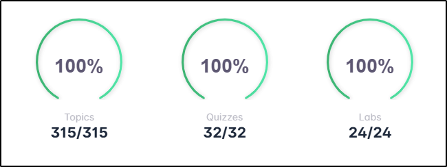
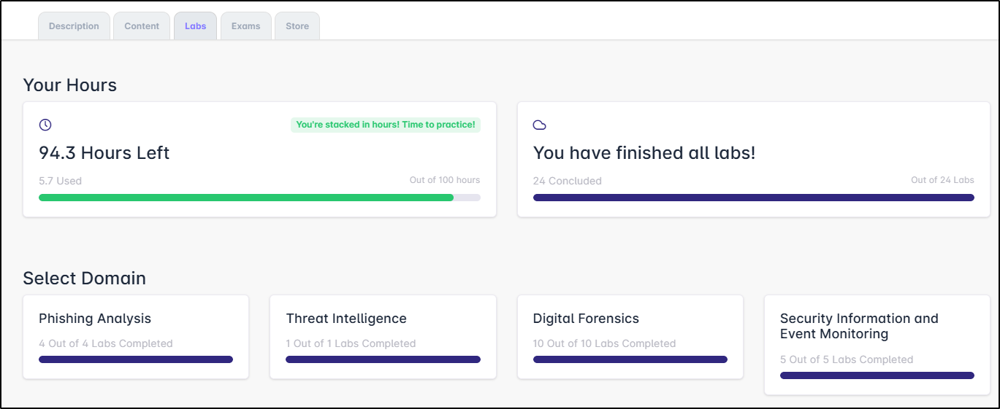
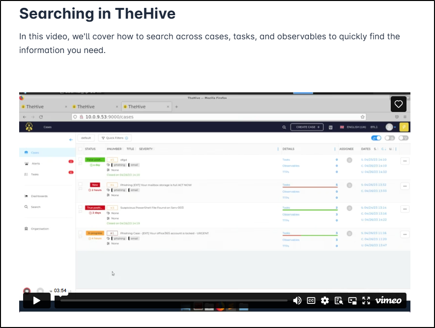
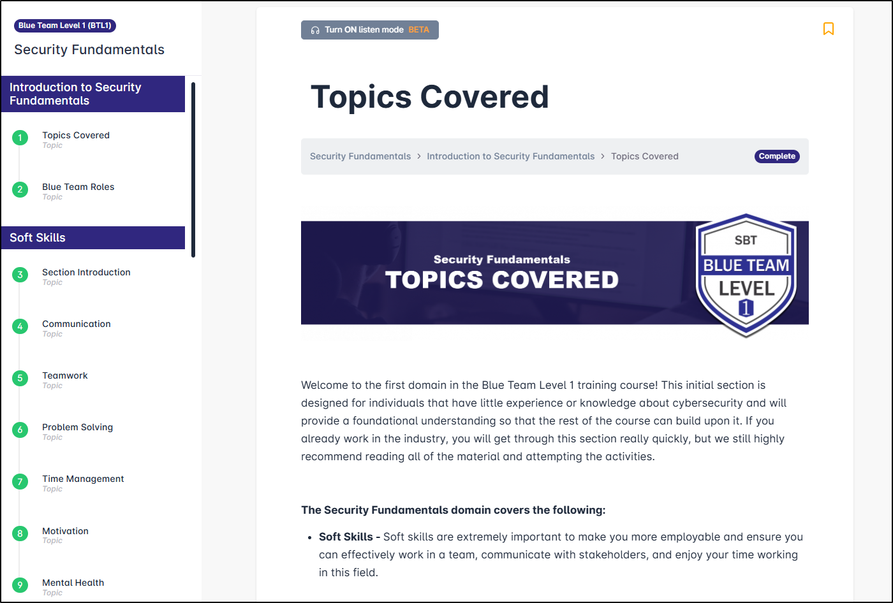
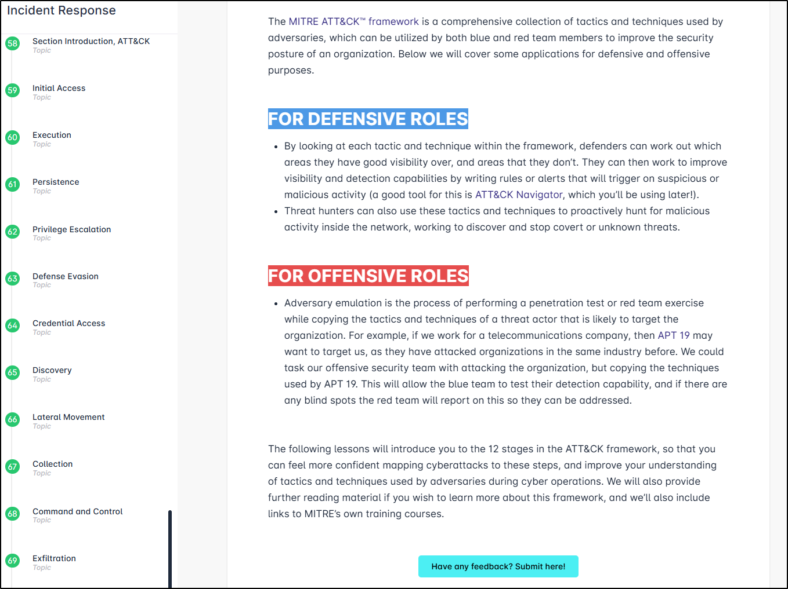
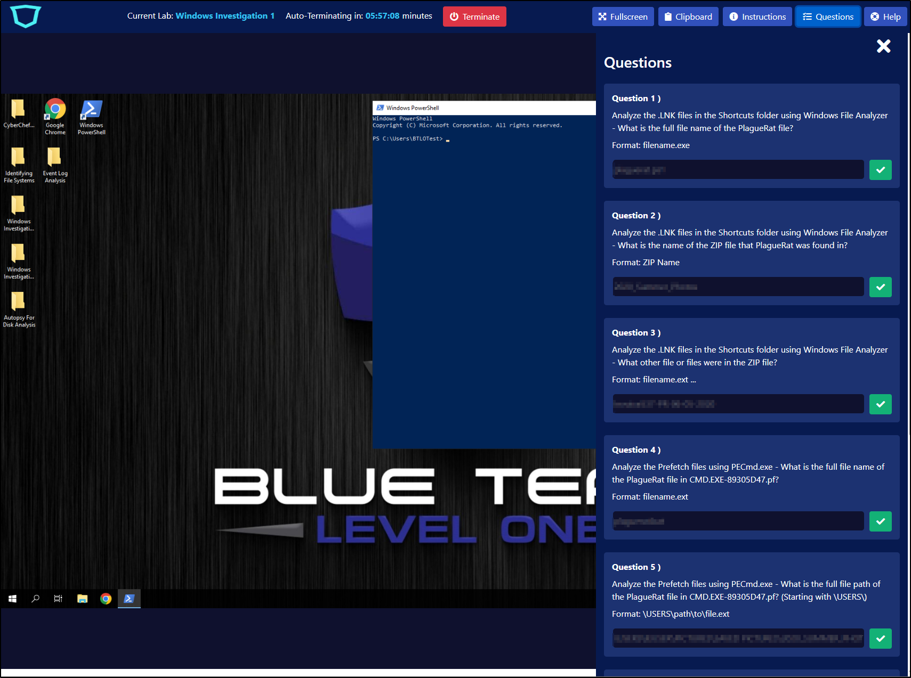
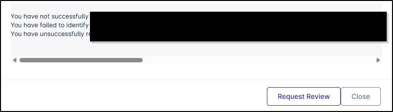
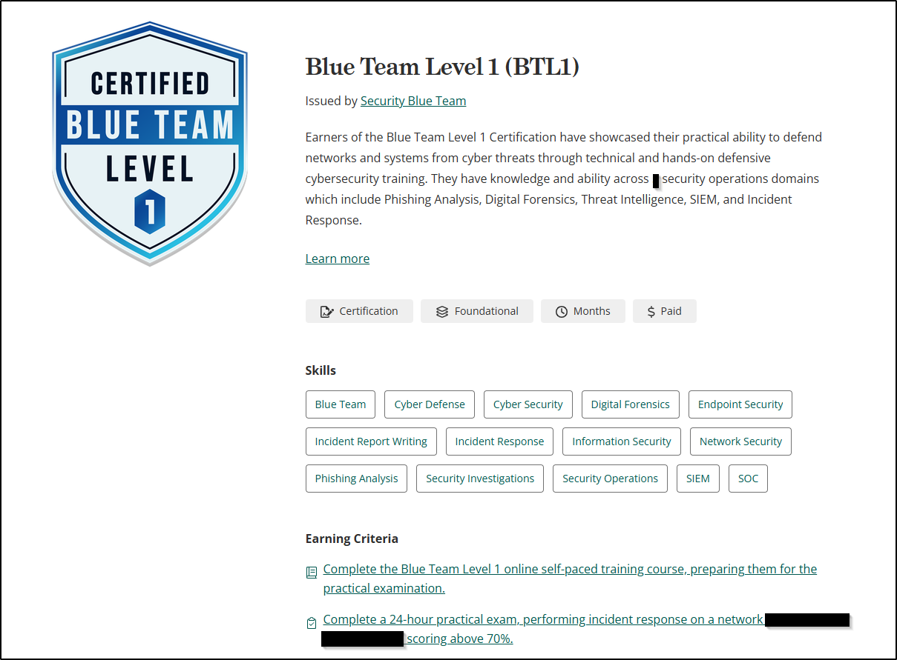

:warning: **Disclaimer** :warning:  
There are no answers to exam questions on this page! I will provide a high-level overview of the scenario encountered in the exam without specific details, so if that's what you came here for, this isn't the place for you.

## Background
It's probably useful to give a little background about myself and my experience to contextualise this blog/review - hopefully it might help anyone reading it and considering whether the BTL1 qualification would be suitable for them.

At the time of taking the course/exam, I am a Digital Forensics analyst for a company supplying cyber security services to the higher and further education industries in the UK. I have been working in the IT industry for 10+ years, and within the cyber security area for almost 3 years but dabbling in it for a lot longer. During my time in cyber, I have worked almost exclusively in defensive operations. I also have an MSc in Ethical Hacking and Cyber Security, which I graduated from around 6 months ago.  

With those things said, it should be obvious that I do already have a foundation of hands-on experience within cyber, and basic working knowledge of a number of offensive methodologies based on my own learning outside of the workplace. I should also add, particularly as my partaking of the BTL1 qualification was entirely funded by my workplace, the views expressed in this article are my own and not necessarilly representative of my employer.

## Course
### Overview
The course content is broken down into six domains:  

* Security Fundamentals  
* Phishing Analysis  
* Threat Intelligence  
* Digital Forensics  
* Security Information and Event Monitoring  
* Incident Response  

There are also two housekeeping-type modules - introduction and exam preparation.  

The training content for the domains is split between (largely written) training content and technical labs, with the exception of Security Fundamentals, which has no accompanying labs.

The labs are entirely incorporated into the training platform - there is no need (or ability from what I could see) to use any of your own equipment or even VPN. You are provided with 100 hours of lab time to complete the labs (24 in total) - should you use all of these hours, there is an option to purchase additional hours.

The platform suggests that the content takes approximately 30+ hours to complete and the exam, which is "open-book", is taken over a single 24-hour period of your choosing. Once you activate the course, you will have access to the content for 4 months and to the exam for 12 months - again, extensions can be purchased from the incorporated store.

Upon completion, the certification is valid for life and you will be entitled to claim a challenge coin and printed certificate alongside your digital certificate and badge if you choose.

### Platform
The platform itself is pretty good - everything is accessed from one central place, with tabs to separate the different types of content available to you. I really liked the dashboard at the top of the page, which showed my progress across the three different training components:  
  

The only thing I would say about the dashboard is that seeing "0/315" at the start of the course can feel a little overwhelming - 315 topics feels like a LOT of content to take in! In reality, that's the number of pages of content to read through so it's not as bad as it sounds at first glance, and you can see how your progress through individual domains in the Content tab if you find that number a bit discouraging. The Labs tab also has this domain-specific progress feature, and includes a breakdown of how many lab hours you still have remaining on your account.  
  

The Content tab in the main dashboard also has a search function and the ability to bookmark particular topics/filter the display to show only bookmarked content. Having the Exams tab built right there into the Dashboard is also really useful - there's no link to follow, no external provider.

### Course Content
Course completion is entirely controlled by you when navigating the content, so if you feel like you maybe don't need to read through everything you can simply mark a topic as "Complete" and move on. This is perhaps most applicable to the Security Fundamentals section, which is actually highlighted as potentially being a bit too "entry-level" for some learners. Personally I did read everything (across the whole course), not because I didn't know or understand the content, but because I wanted to be sure I was onboard with the mindset and tone of the course, and presumably the exam. There were places I made notes of command lines - this was largely due to being unfamiliar with the particular tools/exact command lines that were used, and served as a useful reference source during the exam.  

So let's talk actual content. I won't sugar coat this - there is a LOT of reading, so if you're more of a visual learner then this is not the course for you (and that's said with the content in mind, not necessarilly the exam). As far as concept complexity is concerned, this couse is marketed as a "fundamentals" course - expect that level: if you're an L2 SOC analyst (or an L1 analyst with a bunch of experience, or even a hobbyist that's been at this a while), you WILL find the content far too basic for your needs. With that said, the detail in the content that is there is really good - each domain has a glossary provided and external links for further research but I really didn't feel like there was anything in the topics covered that was left unexplained or that I couldn't understand. Explanations were clear and broken down into really digestible chunks. Where videos were provided (rare), they were short and embedded within the page (so no need for additional tabs/windows), clearly presented, and of good visual audio/visual quality.  
  

There are a couple of points I would make about the content itself, some good, some... not to my preference.  

First up, the Security Fundamentals content doesn't just cover the technical/theoretical aspects of cyber, but includes sections on "soft skills", personal wellbeing, and mental health, which I thought was commendable. Things like burn-out and fatigue are shockingly common in the defensive cyber industry and seeing it recognised and highlighted in a training course feels sadly rare. So there's a good point.  
  

On the less good side, there were some parts of the course that didn't feel like they'd been properly proofread. OK, small thing, I know, but it's a simple thing to do.  

In terms of the tools that were used to showcase certain technical things, I was left a little unclear as to why they were chosen, or why other (more common) tools had been ommitted. In some instances, like using TheHive to demo case management, I assume it was to do with licensing (that said, there was a LOT of detail specifically about TheHive, which I'm not convinced was useful). In others, it was less obvious - I had never heard of the email program used in the exam for instance (Thunderbird would have been an easy choice here) and whilst I appreciate Sublime Text is used by a not-unconsiderable number of people, Notepad++ or even basic Notepad is surely more common (on Windows at least) as a text editor. When it came to Digital Forensics, the Zimmerman and Sysinternals tool suites were skated over, and I don't recall any mention of Yara or Hayabusa, instead looking at a SANS script. Don't get me wrong, as far as teaching concepts was concerned, the content and the tools were great, I just felt a little like the author(s) had created the course using their own preferred set of tools without considering what would be most useful *for the fundamental-level learner*.  

Last point to make here - the final section on MITRE ATT&CK needs a HUGE overhaul. In my opinion, of course. Does MITRE ATT&CK have a place on a fundamental-level blue team course? Absolutely! Does that section need to deep-dive into 3-4 randomly chosen TTPs in each of the 12 MITRE domains? No. Especially after reading nearly 300 pages of content by that stage in the course. I really didn't appreciate reading through swathes of content that had been copy/pasted from an external site (MITRE) and framed as original content. That entire section could have been condensed into what the framework is, how it's useful (those are already covered) and a worked through example of 1, MAYBE 2, TTPs and then provide external links for further reading if required. Honestly, by the time I got to the end of that section, I was about ready to start throwing things - in a course where there has already been so much reading, adding more just for the sake of it felt very frustrating.  
  

OK. That feels like I said a lot of bad words about the content. On the whole I really did think that the content was of a good standard. It did take me all of the ~30 hours that BTL suggest to read through all the content and complete the labs. Personally I didn't learn much (if anything to be honest) from it. Was that because it was bad content? No: it's because the course isn't really aimed at someone with my experience. If I had been an L1 SOC analyst or a junior detection engineer or someone looking to move from IT into defensive cyber? It likely would have been a COMPLETELY different story. And just because the content isn't aimed at you, it doesn't mean you can't sit the exam and pick up another credential for the tool belt. So take this entire section as it's intended - as a way to work out whether this course/exam is right *for you*.

### Labs
These are where this course actually stands apart from quite a few of the older style "taught" courses I've done. Completely contained (perhaps not necessairilly a good thing, but definitely convenient and accessible), easy to interact with and, aside from some of them taking a little while to fully load, they were smooth and responsive. They each included all of the tools required to complete the task (as long as you stick to the tools that the lab/course wants you to use) and the supplemental files required for lab completion were easy to find and navigate around. The labs are marked as completed once all the linked questions have been answered correctly - there is no limit to the number of attempts you have at each question and you submit each answer separately, which is then marked instantly. There are also full walkthroughs for each lab included in the course content.

I have two niggles around the lab environment, both of them small in essence but ended up causing me quite a bit of frustration. One of them is the copy/paste functionality, which didn't always work consistently. Sometimes I was able to copy text from the lab machine into my native machine (and vice versa); other times not at all. Sometimes this extended to not even being able to copy text from the lab machine to the answer panel, which was infuriating. and talking about that answer panel, that's my other niggle. Please, PLEASE, BTL team: find a different way of doing this. Opening a panel to look at the questions is fine, but not when that panel obscures half the screen of the lab machine. This got doubly frustrating when the list of questions required scrolling - having to open a panel > scroll > close the panel > do some stuff > open the panel > scroll is not a good way of doing this in the slightest. Unfortunately that extends to the exam as well, which is a really good way of adding stress to someone already working under pressure that just isn't necessary.  
  

Wow, you can tell how frustrated I was by that tiny design issue! Genuinely though, apart from those niggles, this lab environment largely... just worked. It was a truly invaluable piece of the course content, and the only other thing I would maybe say is that, particularly for the digital forensics domain, it might be beneficial to have MORE of them. I barely used 5 hours of the 100 that I was allocated, but as with the content, this is largely because the difficulty level isn't aimed at someone with my experience. The ability to explore tools, whilst using data resembling an incident, without the stress of a looming deadline or the pressure a major incident brings is invaluable for learning how, when, and why tools are used - make sure you make full use of this function if you feel it benefits you, even in the smallest way.

### Exam
OK, this is likely the bit that anybody reading this blog is actually interested in. I will reiterate the disclaimer from the top of the page - **there are no questions or answers from the exam here**.

Once started, you have access to your exam for 24 hours. I completed it, with an 85% pass mark, in 3.5 hours, but after looking through some other reviews, I feel like this is definitely not the norm - the handful of reviews I read suggested that others are taking between 12-18 hours of the 24-hour window to finish, some of who aren't taking a lot of break time in that. 

In all honesty, I think I probably went into the exam with the wrong mindset: I was thinking it would be a replica of the labs from the course - use some tools, answer some questions. In reality, it's intended to be much more than that. You are provided a scenario and the expectation is that you will run an investigation from start to finish, with the information you gather allowing you to answer questions, either as you go or once you believe you have completed your investigation. It is useful to keep one eye on the list of questions, as some of them do help steer the investigation in a certain way, or at least alert you to certain pieces of information to zone in on. In my defence, I couldn't actually see anything in the exam prep material that highlighted the nature of the exam, but perhaps I should have realised it would be a little more involved than just answering some questions given the amount of time they allow for its completion. Looking back on it, I feel a bit regretful I didn't interpret the brief as intended because I think I would have gotten a lot more out of the experience if I had understood it properly, instead of just feeling enraged that I hadn't found the specific bit of information that was needed to answer a single question (of 20). So with all that said, here are my takeaways for the exam:  

* Make sure you understand the depth of this exam before you start it. You *can* simply work your way through the questions like a CTF, but you'll probably be the worse for it. This is an opportunity to actually run an investigation, not just follow along with some tools and scripts. That's not really something that happens to a junior or L1, so enjoy the experience.
* At the very least make notes on your findings. Better still, start a timeline (a spreadsheet is great for this) and add to it as you go. The likelihood is that you'll find the answers without looking specifically for them if you do this.
* If (when) you start to get tired or frustrated, it's time to take a break. In fact, it was probably time to take a break half an hour prior to that point!  You have 24 hours - there's no harm in taking 5 minutes, or 15, or an hour, or even turn everything off and get some actual sleep. Chances are you'll come back feeling better and maybe bring some ideas on how to progress your investigation back with you.
* Don't be cocky about how good you think you are/think this will be an easy CTF-type breadcrumb trail to follow. After I read through the scenario and assisting notes, I was sure it would be a simple case of finding the obvious clues and in reality the clues were not that obvious at all. It required more than just looking at the evidence - I also had to *understand* it and *interpret* it contextually. It took me 20 minutes to read through the notes - it took me another hour before I had the first answer that I was even a little bit confident about.
*  This one is tool specific - learn some basic Splunk commands, or at the very least find a good reference for them. I used the platform heavily in my exam, and I'm lucky enough that it's the platform I used for my SOC L1 analyst position but I can see how someone unfamiliar with the platform could get overwhelmed with this component very quickly.  

One thing that's really great about the exam is the instant result - as soon as you submit, you're given a pass/fail, a grade and told what you didn't get right. There's also the option to ask for a review if you feel strongly that your incorrectly marked answers should have been accepted. I'm particularly a fan of the middle of those points - I find it infuriating not knowing what questions I didn't get right, after all, how am I supposed to know what I need to brush up on if I don't know what I got wrong? The review feature is great too - it's very rare to encounter an exam environment that can accept that it might not be perfect!  
  

## Conclusion
The way that this course is structure is definitely interesting, and covers some topics and tools that you maybe wouldn't find in other courses. Those labs were, for me at least, absolutely the best thing about the course itself, and I do find myself wishing there had been more of them to break up what is otherwise a very reading-heavy course, which is not always great for technically-minded people (and definitely not a great match for quite a lot of neurodiverse peeps, which this industry is anecdotally heavily populated with). I don't think I would recommend it as anything more than a box-ticking exercise for people like myself who have a few years of experience under their belt (with the caveat of making sure that you understand the scope of the exam fully), but for someone who wants to break into the industry or is just starting out in a junior/L1 position? Provided you can cope with all the reading, I'd say go for it - the current price tag is £399, which is actually spectacularly good value given what you get access to. They even provide a template letter you can use to ask your workplace to sponsor the course! Considering the cost of other entry-level qualifications, it's a pretty good deal all told, even if you just use it for the labs and exam, without reading through all the content.  
  

I hope this has been helpful to someone - if you still have questions (aside from asking me about the exam questions or content!), feel free to reach out to me on LinkedIn (link in the footer).