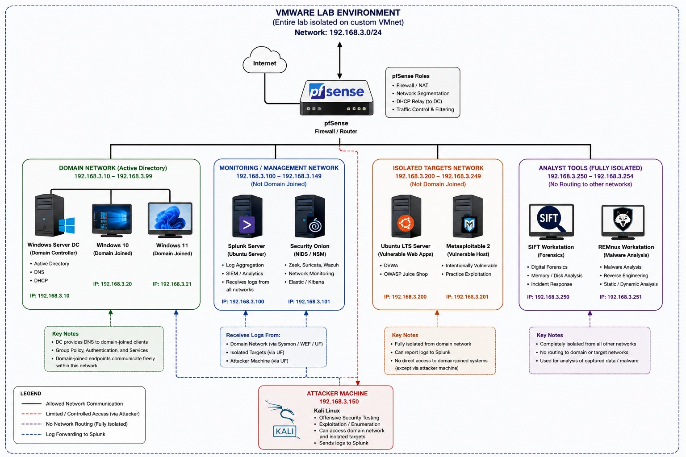
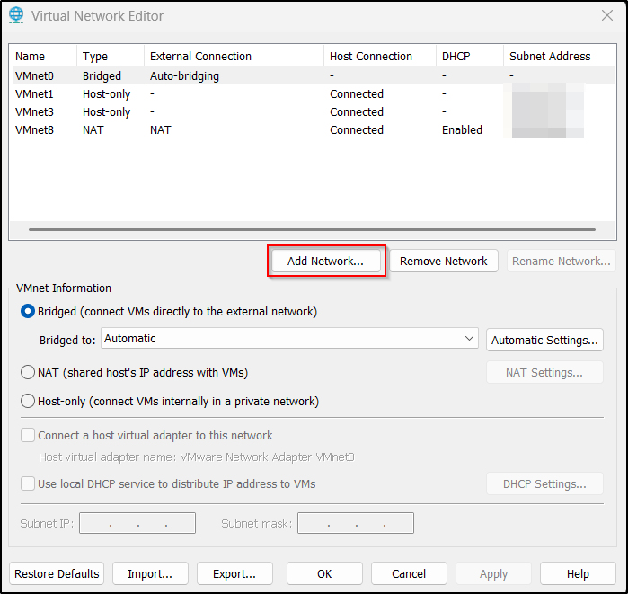
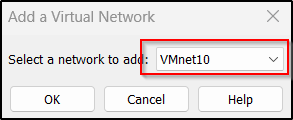
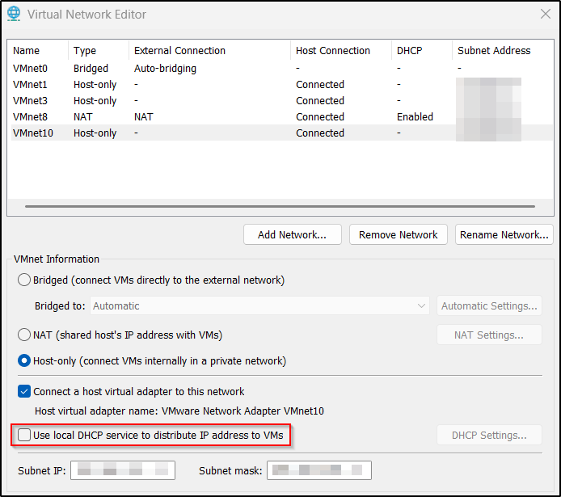

# Cybersecurity Lab
## Introduction
Shortly after I finished my MSc, I found myself searching for ways to continue my training without spending a fortune on platform subscriptions or training course fees. I decided instead to focus my efforts, for a little while anyways, into building a cybersecurity lab environment: one where I could run attacks from start to finish, whilst in a safe and isolated environment. I figured it would allow me to see how those attacks play out from an offensive point of view whilst also, if configured correctly, giving real-world examples of how those attacks would appear to defenders. I realised that if I did things right, I might even get to pick apart artifacts from a DFIR standpoint. My self-imposed brief, ambitious as it was, was to create an environment with the following features:  

* Attack simulation  
* Network monitoring  
* Host monitoring  
* Vulnerable targets  
* Identity infrastructure  
* Forensics  
* Malware analysis

I present the lab and supporting documentation here as a self-driven technical portfolio project. I actually had a lot of fun doing it (it certainly brought back memories of my days troubleshooting whilst on a Helpdesk!) and I hope that perhaps it might help or inspire others to do something similar if the desire takes them. The lab itself will evolve continuously, and I dare say at some point I may well tear it all down and start again with updated software.

## Disclaimer
:warning: This guide has been produced for informational purposes ONLY :warning:  
:warning: Never transfer known malicious files to production networks or personal systems :warning:  

## Lab machines
In order to achieve the goals I set myself, I first needed to work out what components I needed to include within the lab environment. The following table lists the systems I chose to implement, and the purpose they served within the isolated network:  

| System | Purpose |
| --- | --- |
| Windows Server 2022* | Active Directory (Domain Controller), DNS, DHCP, Certificate Services |
| Windows 10 Pro* | Domain joined "user" endpoint |
| Windows 11 Enterprise* | Domain joined "user" endpoint |
| Ubuntu Server | Splunk Indexer and Search Head (log collection) |
| Ubuntu LTS | Host for vulnerable web applications (Juice Shop and DVWA) |
| Metasploitable 2 | Attack target |
| Security Onion | Network monitoring and intrusion detection |
| pfSense | Network segmentation and firewalling |
| SIFT Workstation | Digital forensics |
| REMnux | Malware analysis |
| Kali Linux | Attack simulation and security testing |  
* All Windows systems are evaluation versions

## Network diagram

* Generated by ChatGPT

## Prerequisites
### Hardware
It should go without saying that hosting all those machines requires a fair amount of both RAM and hard drive space, particularly bearing in mind that most (if not all) of them will need to be running at the same time in order for the lab to fulfill its purpose. I have been able to run all the machines at once (using their bare minimum specifications) without issue on a PC with the following:  

* 64GB RAM  
* 2TB HDD  
* Intel i7 processor, with 4 cores (8 logical processors)

### Software
Individual software required for each system will be addressed in a dedicated page for each component. Aside from those specifics, the only software I used was VMware Workstation Pro which, thanks to Broadcom, is now entirely free and full featured. You can download a copy from the [Broadcom Support Portal](https://support.broadcom.com) (you will need to register first).

### Networking setup
In order for the lab to stay appropriately isolated, I created a custom virtual network within VMware Workstation Pro in the Virtual Network Editor (from the "Edit" menu). You need to click on the "Change Settings" button before you can make any changes to the networks in here, but from there the process is a simple one:  

1. Add network  
  
2. Select an available network (I have selected VMnet10 in the screenshot, but you can select any of the ones in the dropdown menu)  
  
3. Untick the box for using the local DHCP  
  
4. (optional) Choose the subnet if you want something other than the one automatically generated

## Guide
The links below provide further detailed guidance on each step of the setup.  

1. [Windows Server 2022 Domain Controller - DC01](cybersecurity_lab/dc01.md)  
2. [Windows 10 User Workstation - WS01](cybersecurity_lab/ws01.md)  
3. [Windows 11 User Workstation - WS02](cybersecurity_lab/ws02.md)  
4. [Kali Linux "Attacker" Workstation - Kali](cybersecurity_lab/kali.md)  
At this point, the lab is already fully functional for many of the goals I set, but further machines and configuration are required for defensive monitoring and digital forensic capabilities. These are set out in the documents below.  
5. [Ubuntu Server - Splunk](cybersecurity_lab/splunk.md)  
With Splunk installed, the lab now has defensive monitoring capabilities. I went a step further to create opportunities to use both offensive and defensive capabilities: I created a Linux machine to host deliberately vulnerable applications and a Metasploitable instance. The documentation for those machines is below.
6. [Ubuntu LTS - LX01](cybersecurity_lab/lx01.md)