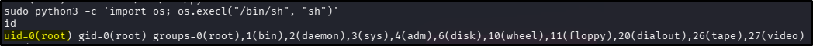

---
tags:
  - tryhackme
  - room
  - medium
  - offensive
  - web
  - vulnerability-exploitation
  - metasploit
  - privilege-escalation
---

# Corp Website

**Platform:** TryHackMe  
**Type:** Room  
**Difficulty:** Medium  
**Link:** [Corp Website](https://tryhackme.com/room/lafb2026e7)

## Description
"Valentine's Day is fast approaching, and 'Romance & Co' are gearing up for their busiest season.

Behind the scenes, however, things are going wrong. Security alerts suggest that "Romance & Co" has already been compromised. Logs are incomplete, developers defensive and Shareholders want answers now!

As a security analyst, your mission is to retrace the attacker's, uncover how the attackers exploited the vulnerabilities found on the "Romance & Co" web application and determine exactly how the breach occurred.

You can find the web application here: http://MACHINE_IP:3000"

## Initial Enumeration
Given the challenge description, I went straight in for website enumeration. I used my go-to `ffuf` command to enumerate the website:  
`ffuf -u http://TARGET_IP_ADDRESS/FUZZ -w /usr/share/wordlists/seclists/Discovery/Web-Content/DirBuster-2007_directory-list-2.3-medium.txt -ic -c`. Nothing that I didn't already know about here (having already visited the site in a web browser):  
  

There was no `robots.txt` file. Inspection of the source code for the discovered pages showed that they had been formatted badly - this was easily fixed with an online prettifier tool. Skimming through there didn't appear to be anything immediately obvious, maybe apart from an odd string at the top of the document:  
  

I tried to identify the encoding but no joy. At this point, I kept it as something useful for later (spoiler alert, it turned out to be a red herring).

As a final initial enumeration step, I ran an `nmap` service scan against the port to check versioning but the only thing that felt vaguely useful was the confirmation of the framework running on the target:  

## Foothol
With no immediately obvious ways to gain a foothold and no idea of any credentials I could possibly use, I took a look at some recent vulnerabilities for the only thing about the web application I could say for sure - it uses the next.js framework. It  didn't take a lot of research to uncover CVE-2025-55182, otherwise known as React2Shell and really the only reason this jumped out at me is because it was pretty big news in the industry when it broke. As I was digging through some of the articles about it, I also found mention that there was a Metasploit module available for it so I fired up `msfconsole` and did a search for it. Setting the relevant options as required and running its `check` module suggested the target was vulnerable:  
  

Running the exploit gave me a shell almost instantly:  
  

## Post-exploitation enumeration
Knowing the typical location for a user flag in THM boxes, I checked the contents of the logged-in user's home directory and got the user flag:  
  
??? success "What is the user flag?"
		THM{R34c7_2_5h311_3xpl017}

## Privilege escalation
One of the first things I do whenever I am looking at quick wins for privilege escalation is check if the user has any `sudo` privileges with `sudo -l` and I was in luck with this one:  
  

A quick search of [GTFOBins](https://gtfobins.org/gtfobins/python/) gave me almost the exact piece of code to run with a small tweak (`python` >> `python3`). I ran the code and `root` was achieved:  
  

As with the user flag, I know that root flags are often held in the `/root` directory. A quick check and the root flag was mine:  
  
??? success "What is the root flag?"
		THM{Pr1v_35c_47_175_f1n357}

**Tools Used**  
`	nmap` `msfconsole`

**Date completed:** 15/02/26  
**Date published:** 17/02/26