---
tags:
  - tryhackme
  - challenge
  - easy
  - offensive
  - linux
  - web
  - brute-forcing
  - steganography
  - osint
  - sudo-abuse
---

# Agent Sudo

**Platform:** TryHackMe  
**Type:** Challenge  
**Difficulty:** Easy  
**Link:** [Agent Sudo](https://tryhackme.com/room/agentsudoctf)

## Description
"You found a secret server located under the deep sea. Your task is to hack inside the server and reveal the truth."

## Enumerate
I generated a list of open ports for more comprehensive enumeration with the following:  
`ports=$(nmap -p- --min-rate=1000 TARGET_IP_ADDRESS | grep ^[0-9] | cut -d '/' -f 1 | tr '\n' ',' | sed s/,$//)`  
This revealed the following open ports:  

* 21
* 22
* 80
??? success "How many open ports?"
	3

I ran a full `nmap` scan to query the services for version information, as well as querying the target system for OS information with `nmap -p$ports -A -T4 TARGET_IP_ADDRESS`, which revealed the following:  
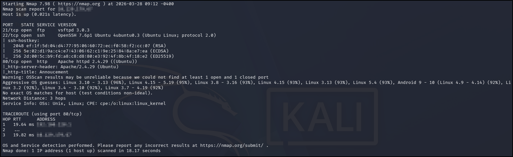  

I used my go-to `ffuf` command to enumerate the website:  
`ffuf -u http://TARGET_IP_ADDRESS/FUZZ -w /usr/share/wordlists/seclists/Discovery/Web-Content/DirBuster-2007_directory-list-2.3-medium.txt -ic -c`  
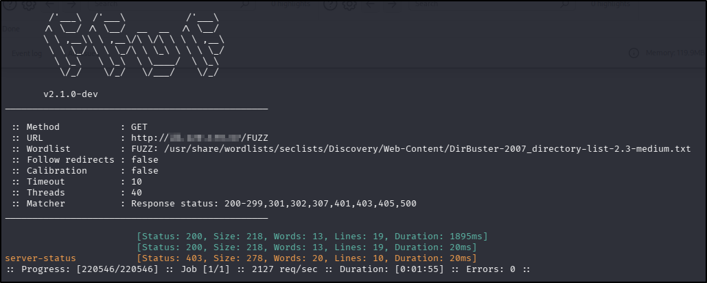  

Navigating to the web page in a browser provides an interesting piece of information about how to access the site:  
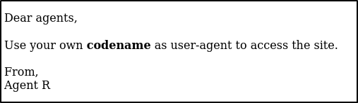  
??? success "How do you redirect yourself to a secret page?"
	user-agent

There were no `robots.txt` or `sitemap.xml` files, and nothing interesting in the source code.

Attempting to enumerate the `ftp` service was unsuccessful as I had no username to try and anonymous logins were not permitted (at least not without a valid password).

Using `searchsploit` to search for vulnerabilities returned two DoS vulnerabilities (one for the FTP and Apache versions, respectively) and a potential username enumeration for the SSH version. The last of these options could be implemented with Metasploit, but failed to run correctly.

With basic enumeration complete, I turned to that clue given on the web page. Given the way that the text on the page is signed off, it's reasonable to assume that the agent names are singular upper case letters. I could have gone through each letter in the alphabet manually, but figured it was easier, at least to test the theory, to use Burp to automate the process. I opened up Burp and redirected the traffic from my browser to capture the traffic, which I sent on to the Intruder tab. I deleted the user-agent string as it was, inserted an arbitrary character to act as a placeholder, set it as a position and then entered the letters A-Z in the payload configuration and ran the attack:  
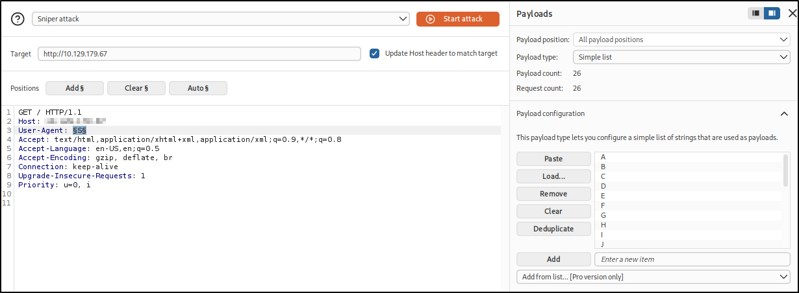  
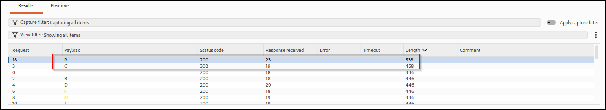  

The results I got back show two of the payloads returned different results than the results. Looking at the first, which was using a codename I definitely knew wasn't mine (because it had been disclosed on the web page), didn't reveal anything helpful:  
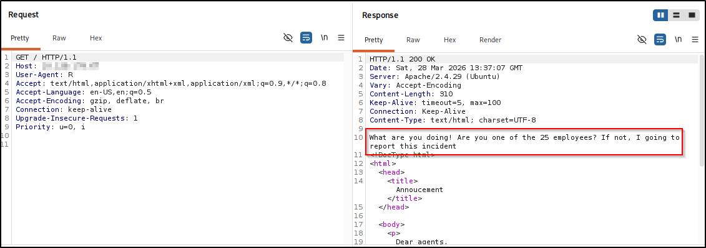  

The second of the two results, for agent "C", showed that there was also a redirect in place, though the results of the redirect were not shown (because Intruder doesn't follow redirects). It did show me where the redirect went to though:  
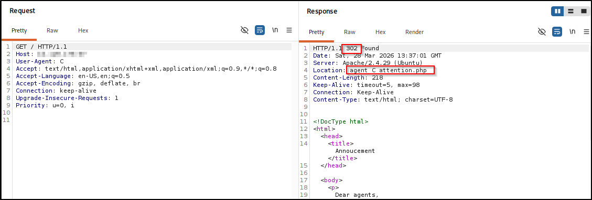  

Navigating directly to that page in a browser successfully revealed the "secret" contents of the message:  
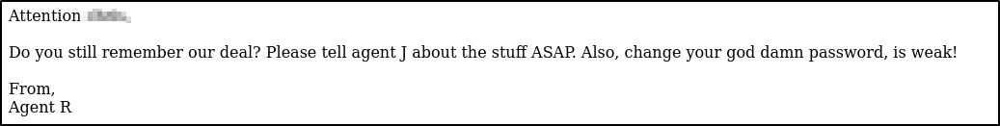  
??? success "What is the agent name?"
	chris

## Hash cracking and brute-force
With a potential username and a clue that their password was weak, and using the questions from the challenge to guide me, cracking the password for the "chris" user for the FTP service was trivial with `hydra`:
`hydra -l chris -P /usr/share/wordlists/rockyou.txt ftp://<targetIp>`  
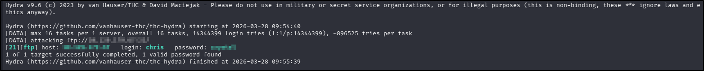  
??? success "FTP password"
	crystal

I used the newly discovered credentials to login to FTP with (I also tried to login to SSH with them wondering about password reuse, but this was unsuccessful) and was able to enumerate the contents of the FTP directory:  
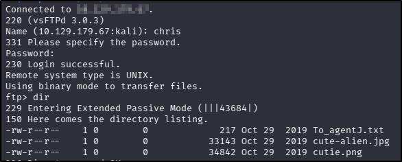  

I downloaded all of the files there (using the `get` command) and then exited the FTP session to inspect them. The `To_agentJ.txt` file gave me another lead:  
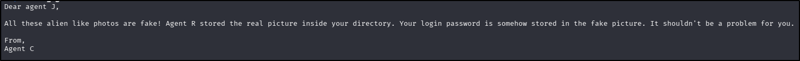  

Inspecting both image files with `exiftool` failed to reveal any useful meta-data, but using `binwalk` to see if either of them contained any other files showed something intereresting about the `cutie.png` file:  
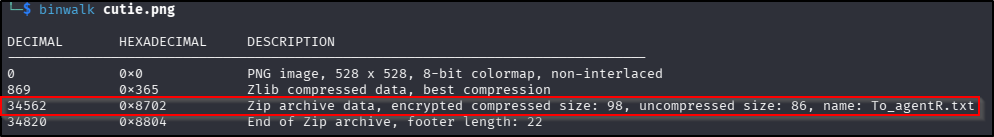  

Using `binwalk` to extract any compressed files (using the `-e` switch) revealed a zip file:  
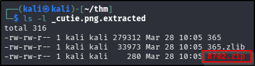  

Given the question I was working towards mentions a password-protected .zip file, I assumed this was the same, used `zip2john` to produce the password hash, and fed that to `john`, cracking the password in no time:  
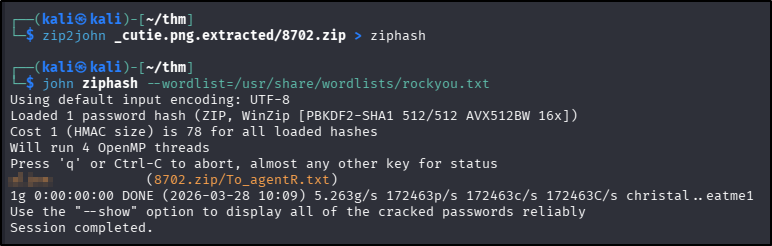  
??? success "Zip file password"
	alien

Equipped with the password for the .zip file, I unzipped it and read the contents of this new `To_agentJ.txt` file:  
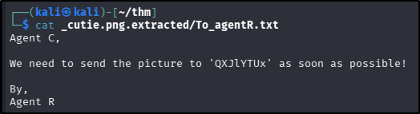  

Recognising the weird string as potentially base64-encoded, I fed it to a [decoder](https://www.base64decode.org/), which gave me a possible answer for the next question in the set, which mentions a steg password. Using that as a clue, I used `steghide` to attempt to extract any hidden data from the second image I had downloaded from the FTP site: `cute-alien.jpg`, which was successful:  
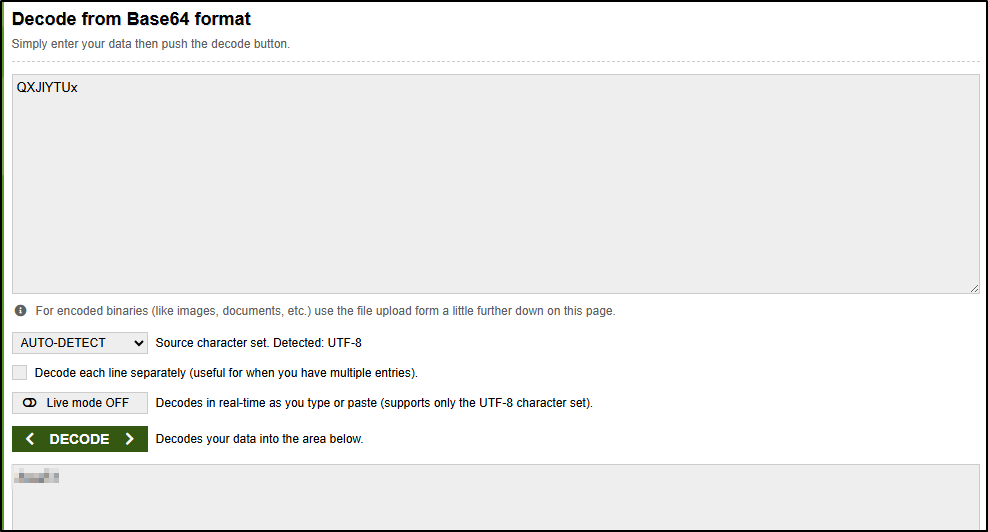  
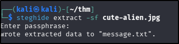  
??? success "steg password"
	Area51

Reading the contents of the newly extracted file gave me the answers for both the new username and password:  
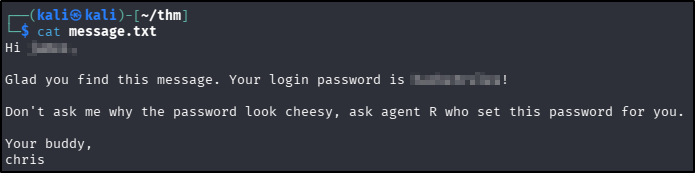  
??? success "Who is the other agent (full name)?"
	james
??? success "SSH password"
	hackerrules!

## Capture the user flag
With these new user credentials, finding and reading the user flag was trivial:  
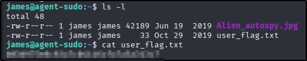  
??? success "What is the user flag?"
	b03d975e8c92a7c04146cfa7a5a313c7

Using `scp` to download the `Alien_autospy.jpg` file to my attacker machine, I uploaded the image to Yandex reverse image search to find the name of the incident referred to in the question (though to be fair, having been an avid X-Files fan since it originally aired, this was a gimme question for me!):  
  
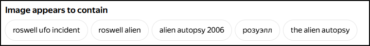  
??? success "What is the incident of the photo called?"
    Roswell alien autopsy

## Privilege escalation
The first thing I do whenever I get a foothold is to check sudo rights:  
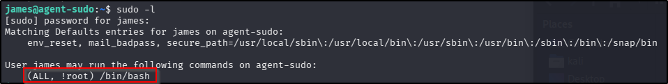  

The `sudo` output appeared to restrict running bash as `root`, which felt like an odd discovery so I Googled it and instantly found a result from ExploitDB:  
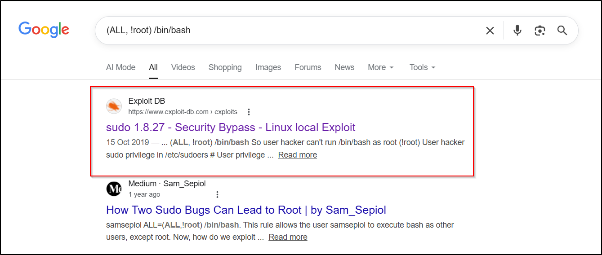  

Navigating to the [ExploitDB](https://www.exploit-db.com/exploits/47502) page explains the exploit and provides the code to abuse it. Effectively, this is a vulnerability in `sudo`: this particular version will take a user ID to escalate privileges to, but then fails to perform any validation against the corresponding username. This means that by specifying a negative UID (-1), `sudo` wraps the value and effectively executes the command as UID 0 (`root`) without performing proper permission checks.. The exploit is executed with the following line of code:  
`sudo -u#-1 /bin/bash`  

I ran the provided code from the ExploitDB article, which was successful. Finding and reading the root flag from this point was trivial:  
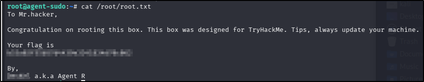  
??? success "What is the root flag?"
	b53a02f55b57d4439e3341834d70c062
??? success "Who is Agent R"
	DesKel

**Tools Used**  
`Burp` `hydra` `binwalk` `john` `steghide` `scp`

**Date completed:** 28/03/26  
**Date published:** 28/03/26