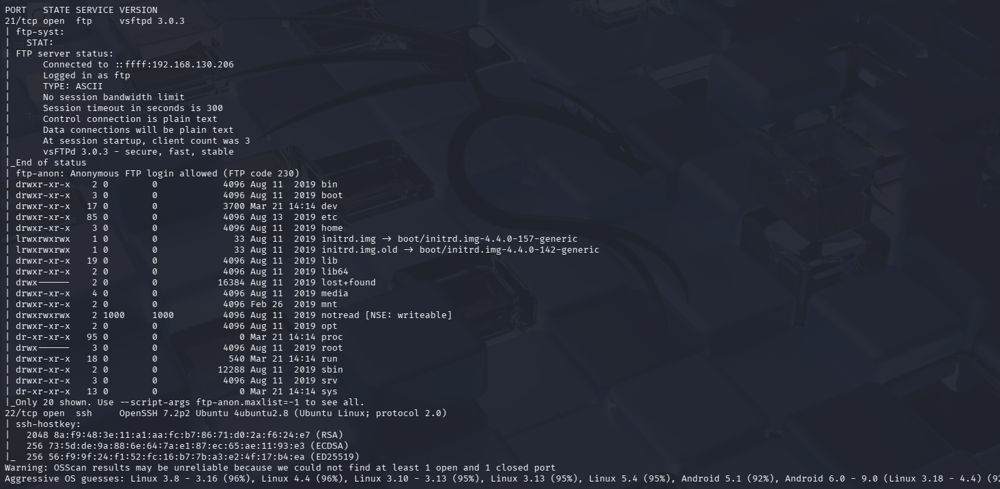
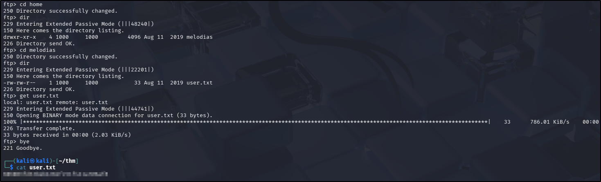
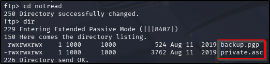
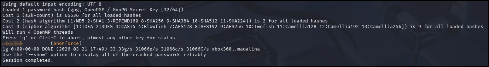
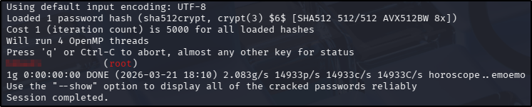
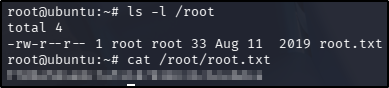

---
tags:
  - tryhackme
  - challenge
  - easy
  - offensive
  - linux
  - web
  - boot2root
  - brute-force
---

# Anonforce


**Platform:** TryHackMe  
**Type:** Challenge  
**Difficulty:** Easy  
**Link:** [Anonforce](https://tryhackme.com/room/bsidesgtanonforce)

## Description
"boot2root machine for FIT and bsides guatemala CTF"

## Initial Enumeration
I generated a list of open ports for more comprehensive enumeration with the following:  
`ports=$(nmap -p- --min-rate=1000 TARGET_IP_ADDRESS | grep ^[0-9] | cut -d '/' -f 1 | tr '\n' ',' | sed s/,$//)`  
This revealed the following open ports:  

* 21
* 22  

I ran a full `nmap` scan to query the services for version information, as well as querying the target system for OS information with `nmap -p$ports -A -T4 TARGET_IP_ADDRESS`, which revealed the following:  
  

Well now that looks very promising indeed - an FTP server with full access to the file system and anonymous login? And it appears that there is a writable directory too. Let's get to having a look around!

## Initial Foothold
I went straight for the user flag at this point - I thought I'd check the `/home` directory and recursively enumerate from there:  
  
??? success "user.txt"
	606083fd33beb1284fc51f411a706af8

## Privilege Escalation
With the user flag covered, I thought the best place to look next was the only writable directory (which also happened to be the only non-standard directory in the root). I found two promising looking files there:  
  

After retrieving them to my attacking machine, I checked their contents. The `backup.gpg` file was (unsurprisingly) unreadable in its current state. The `private.asc` on the other hand, that turned out to be a private pgp key. I attempted to import the private key so as to try to decrypt the `backup.gpg` file I'd found, but was prompted for a password. Time for a bit of password cracking! I used `gpg2john` and `john` to retrieve the password:  
```
gpg2john private.asc > hash
john hash --wordlist=/usr/share/wordlists/rockyou.txt
```
  

With this I was able to import the key and decrypt the `backup.gpg` file I found earlier:  
```
gpg --import private.asc
gpg -d backup.gpg
```

The decrypted file appeared to be a backup of the `/etc/shadow` file from the target server! Better still, there was a visible hash for the `root` user. Using the open FTP session I still had, I retrieved the `/etc/passwd` file from the target server, knowing that with these two files I might be able to crack the password for the `root` user. As a backup plan, there was also a readable hash for the `melodias` user, but given I was at the privilege escalation part of the challenge, `root` felt like the better choice at this point:  
```
echo '<root entry from /etc/passwd>' > passwd.txt
echo '<root entry from /etc/shadow>' > shadow.txt
unshadow passwd.txt shadow.txt > unshadow.txt
john unshadow.txt --wordlist=/usr/share/wordlists/rockyou.txt
```
  

Nice! With an apparent valid password, I can try to SSH to the target machine as the `root` user, which was successful. From there, finding and obtaining the root flag was trivial:  
  
??? success "root.txt"
	f706456440c7af4187810c31c6cebdce

**Tools Used**  
`nmap` `ftp` `gpg` `gpg2john` `john` `unshadow`

**Date completed:** 21/03/26  
**Date published:** 21/03/26