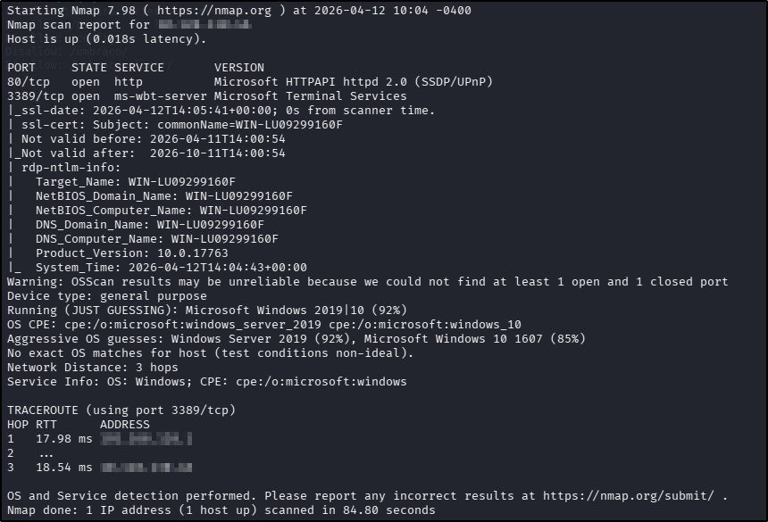
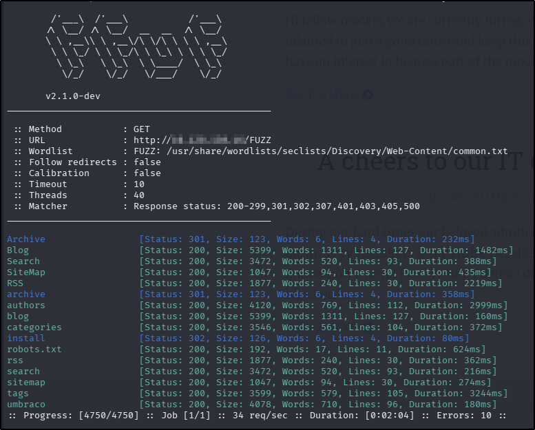
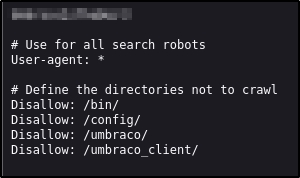
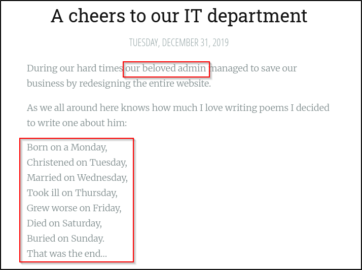
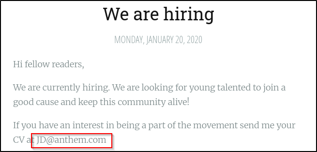
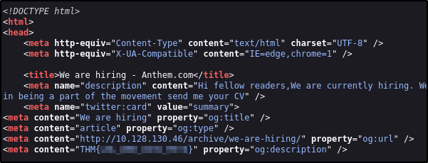
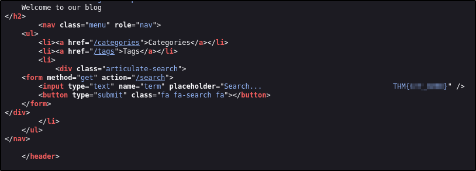
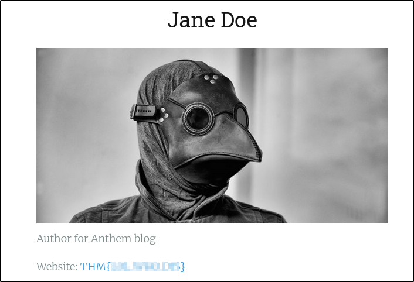
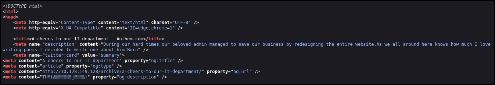
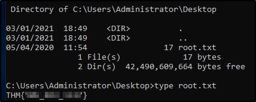

---
tags:
  - tryhackme
  - challenge
  - easy
  - offensive
  - windows
---

# Anthem

**Platform:** TryHackMe  
**Type:** Challenge  
**Difficulty:** Easy  
**Link:** [Anthem](https://tryhackme.com/room/anthem)  

## Description
"Exploit a Windows machine in this beginner level challenge."

## Task 1 - Website Analysis:
I generated a list of open ports for more comprehensive enumeration with the following:  
`ports=$(nmap -p- --min-rate=1000 TARGET_IP_ADDRESS | grep ^[0-9] | cut -d '/' -f 1 | tr '\n' ',' | sed s/,$//)`  
This revealed the following open ports:  

* 80
* 3389  

I ran a full `nmap` scan to query the services for version information, as well as querying the target system for OS information with `nmap -p$ports -A -Pn TARGET_IP_ADDRESS`, which revealed the following:  
  
??? success "What port is for the web server?"
	80
??? success "What port is for remote desktop service?"
	3389
I used my go-to `ffuf` command to enumerate the website (`ffuf -u http://TARGET_IP_ADDRESS/FUZZ -w /usr/share/wordlists/seclists/Discovery/Web-Content/DirBuster-2007_directory-list-2.3-medium.txt -ic -c`) as a quick directory discovery but it was running extremely slowly so I switched my wordlist to the `common.txt` list.
  
Whilst the scan was running, I opened the page in a web browser. The site appeared to be running a blog. There was no interesting source code and the `sitemap.xml` file didn't reveal anything new. The domain was revealed in the web page footer:  
  
??? success "What is the domain of the website?"
	anthem.com
There was a `robots.txt` but the three directories listed here that weren't disclosed in the `ffuf` scan did not render unique content in the web browser. The last, `/umbraco`, revealed a login page. There was an interesting-looking string at the top of the `robots.txt` file, not least because it didn't follow the conventions for entries in this file, but also because it had no spaces and had a mix of lower-case, upper-case, and numerical characters. In other words, it looked like a password:  

??? success "What is a possible password in one of the pages web crawlers check for?"
	UmbracoIsTheBest!
??? success "What CMS is the website using?"
	Umbraco
One of the two blog posts contained a poem, apparently written as an ode to the "admin", but I recognised it for what it was - the words to the nursery rhyme about a man called Solomon Grundy:  
  
??? success "What's the name of the Administrator"
	Solomon Grundy
The other blog post contained an email address for another staff member, providing a naming convention for email addresses at the company:  
  
??? success "Can we find find the email address of the administrator?"
	sg@anthem.com

## Task 2 - Spot the flags
Looking through the source code to pages other than the home page revealed what appeared to be a flag in the metadata on the "We Are Hiring" blog post:  
  
??? success "What is flag 1?"
	THM{L0L_WH0_US3S_M3T4}
Looking further through the source code revealed another flag hidden in the search functionality:  

??? success "What is flag 2?"
	THM{G!T_G00D}
Whilst continuing to look through the pages on the site, there was another flag on the bio page for the only author listed:  
  
??? success "What is flag 3?"
	THM{L0L_WH0_D15}
Checking the source code for the other pages on the site revealed another flag in the code for the Solomon Grundy post:  
  
??? success "What is flag 4?"
	THM{AN0TH3R_M3TA}

## Task 3 - Final Stage:
Given the information already gathered, I had a potential username ("sg") and a password (from the `robots.txt` files). I used these credentials with `xfreerdp3` to attempt access to the target machine (bearing in mind the only other port found open during the `nmap` scan was 3389, hosting RDP). This was successful and the user.txt flag was on the desktop upon login.
??? success "Gain initial access to the machine, what is the contents of user.txt?"
	THM{N00T_NO0T}
Noticing that file extensions had been turned off in the display options, I re-enabled it and made sure to also turn on hidden files as well before I started to explore the file system in search for the administrator password (as per the task question). There was a folder in the root directory that had previously been hidden, called "backup", a non-standard directory. Inspecting its contents revealed a file called "restore" but I was unable to open it. Upon inspecting the permissions for the file, it was clear that was a misconfiguration as there were no users with any permissions for the file. As there was no owner, and no other user permissions that would prevent adding permissions to the file, I added my "SG" user as the owner of the file (right-click > Properties > Security > Edit > Add). I was then able to open the file, which contained what looked like a password.
??? success "Can we spot the admin password?"
	ChangeMeBaby1MoreTime
From here, finding and reading the root flag was trivial:  

1. Open the Start Menu  
2. Type "cmd"  
3. Right-click > Run as administrator  
4. Enter the discovered password  
5. `cd C:\Users\Administrator\Desktop`  
6. `dir`  

??? success "Escalate your privileges to root, what is the contents of root.txt?"
	THM{Y0U_4R3_1337}
	
**Tools Used**  
`xfreerdp3`

**Date completed:** 12/04/26  
**Date published:** 12/06/26