---
tags:
  - tryhackme
  - challenge
  - easy
  - offensive
  - penetration-testing
  - linux
  - brute-force
  - password-cracking
---

# Basic Pentesting

**Platform:** TryHackMe  
**Type:** Challenge  
**Difficulty:** Easy  
**Link:** [Basic Pentesting](https://tryhackme.com/room/basicpentestingjt)

## Description
"This is a machine that allows you to practise web app hacking and privilege escalation"

## Initial Enumeration
I generated a list of open ports for more comprehensive enumeration with the following:  
`ports=$(nmap -p- --min-rate=1000 TARGET_IP_ADDRESS | grep ^[0-9] | cut -d '/' -f 1 | tr '\n' ',' | sed s/,$//)`  
This revealed the following open ports:  

* 22
* 80
* 139
* 445
* 8009
* 8080  

I ran a full `nmap` scan to query the services for version information, as well as querying the target system for OS information with `nmap -p$ports -A -T4 TARGET_IP_ADDRESS`, which revealed the following:  
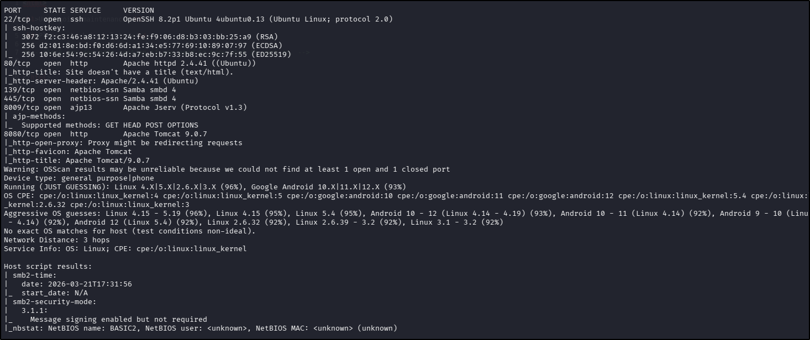  

Alright, so there's quite a lot to unpack there, and seeing as this is a penetration testing challenge, we should enumerate as much as possible instead of just chasing the flag. With that in mind, I got started, working my way down the list of ports that `nmap` had returned.

### Port 22 - SSH
With no known usernames or passwords to test, there's not much to be done as light-touch enumeration here. I did a quick check for vulnerabilities in the version with `searchsploit` but there were no results.  

### Port 80 - HTTP
I used my go-to `ffuf` command to enumerate the website:  
`ffuf -u http://TARGET_IP_ADDRESS/FUZZ -w /usr/share/wordlists/seclists/Discovery/Web-Content/DirBuster-2007_directory-list-2.3-medium.txt -ic -c`. Whilst I waited for that to run through, I enumerated the site visually in a browser.  
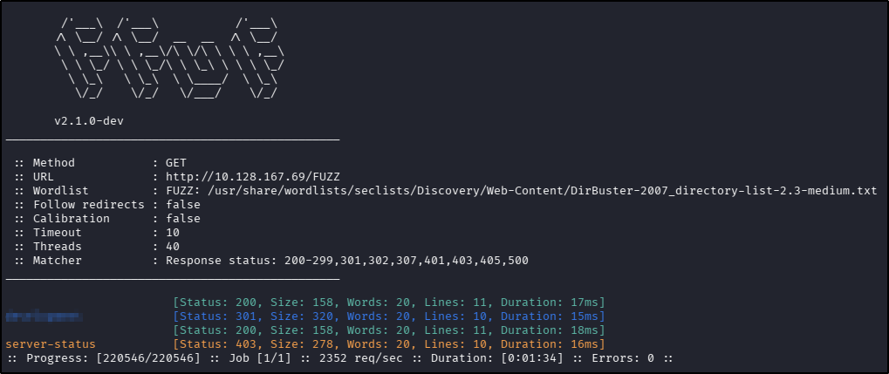  
There's the answer to the first task in the `ffuf` scan output - result!  
??? success "What is the name of the hidden directory on the web server(enter name without /)?"
	development

The visual enumeration revealed the following:  

* The home page showed a static web page with a "down for maintenance"-type message.  
* There were no `robots.txt` or `sitemap.xml` files.  
* The source code revealed a "hidden" comment about checking the "dev note section".
* Navigating to the page found in the `ffuf` scan revealed two notes that could be read, both of which contained some interesting bits of information about software (including versions), usernames, and password strength on the target machine.
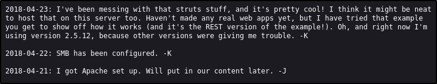  
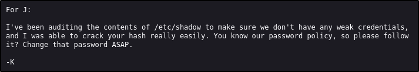

Searching for vulnerabilities with `searchsploit` returned no results.

### Ports 139/445 (SMB)
I used `smbclient` to enumerate any available shares on the target machine, suppressing the password prompt in the hope that there was no password required for access (`smbclient -N -L \\\\<ipAddress>`):  
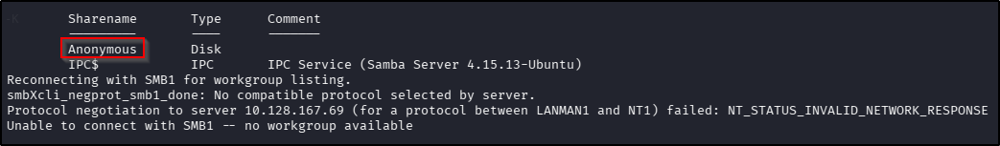  

The `IPC$` share didn't contain anything (unsurprising), but the `Anonymous` share held a potentially interesting file:  
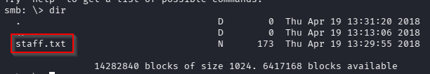  
After downloading the file in question (`get`), I got the next of the task answers:  
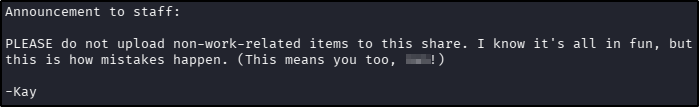  
??? success "What is the username?"
	jan

Searching for vulnerabilities with `searchsploit` returned no promising results.

### Port 8009 ("ajp13")
According to the `nmap` scan results, this is an Apache Jserv instance that accepts `GET` requests but both `ffuf` scanning and visual enumeration of it in a browser failed ("the connection was reset"). Searching for vulnerabilities with `searchsploit` returned no results.

### Port 8080 (HTTP)
I used my go-to `ffuf` command to enumerate the website:  
`ffuf -u http://TARGET_IP_ADDRESS/FUZZ -w /usr/share/wordlists/seclists/Discovery/Web-Content/DirBuster-2007_directory-list-2.3-medium.txt -ic -c`. Whilst I waited for that to run through, I enumerated the site visually in a browser.  
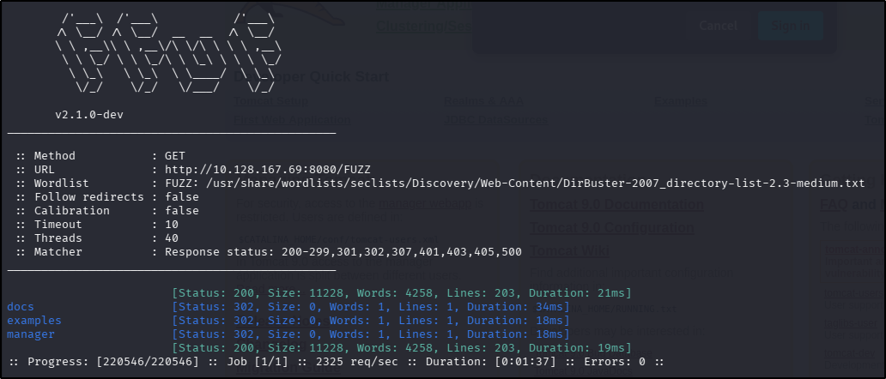  

The visual enumeration revealed the following:  

* The home page showed the default startup page for an Apache Tomcat instance.  
* There were no `robots.txt` or `sitemap.xml` files.

Searching for vulnerabilities with `searchsploit` returned no results.

## Foothold
Remember back at the beginning of the enumeration phase when I said I wasn't going to bother spending any time on SSH because I didn't have a username? Well, now that basic enumeration is complete, I have one after all. And looking at the next question wording, it appears that some sort of brute force is expected. Using the same methodical approach as I did with the enumeration, I tried SSH as the first service to brute (`hydra -l <username> -P /usr/share/wordlists/rockyou.txt ssh://<ipAddress>`) and retrieved the password:  
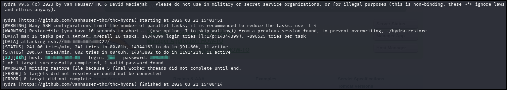  
??? success "What is the password?"
	armando
??? success "What service do you use to access the server(answer in abbreviation in all caps)?"
	SSH

## Privilege Escalation
With a functioning SSH username and password, we can use `scp` to transfer files to the target machine (`scp linpeas.sh <username>@<ipAddress>:<saveLocation>`). My initial attempts to do this failed - apparently the user I was using didn't even have write permissions to their own `/home` folder. Running a check on permissions for other locations I might be able to save the file to, `/tmp` came up as a good alternative. Once the script was uploaded, I went ahead and ran it.  
Once it was done, there didn't seem to be an awful lot of promising leads within it for privilege escalation. The one thing that did stand out was that I was able to read the SSH keys for another user on the target machine, which also provided the answer to the next task in the set:
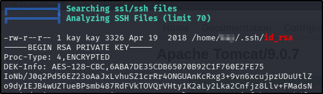  
??? success "What is the name of the other user you found(all lower case)?"
	kay

From here, I copied the contents of the private key file into a new file on my attacking machine and changed the permissions on it to ensure its compliance with the SSH protocol (`chmod 600 <keyName>`). Trying to use it to login to SSH resulted in a request for a passphrase key, which I didn't have. Not to worry, it might be crackable with `ssh2john` (`ssh2john <keyName> > key.hash`) and `john` (`john key.hash --wordlist=/usr/share/wordlists/rockyou.txt`):  
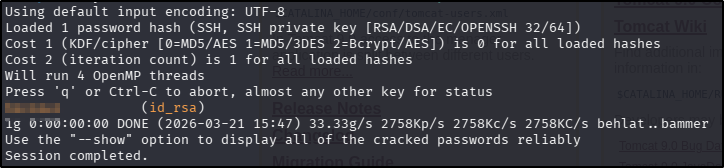  

With the passphrase, accessing SSH as the new user was a breeze, and from there finding the password for the final task was trivial:  
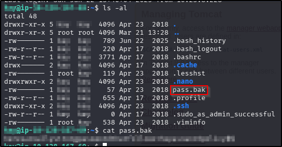  
??? success "What is the final password you obtain?"
	heresareallystrongpasswordthatfollowsthepasswordpolicy$$

**Tools Used**  
`nmap` `ffuf` `smbclient` `hydra` `scp` `linpeas` `ssh2john` `john`

**Date completed:** 21/03/26  
**Date published:** 21/03/26