---
tags:
  - tryhackme
  - challenge
  - easy
  - offensive
  - windows
  - metasploit
---

# Blueprint


**Platform:** TryHackMe  
**Type:** Challenge  
**Difficulty:** Easy  
**Link:** [Blueprint](https://tryhackme.com/room/blueprint)

## Description
"Hack into this Windows machine and escalate your privileges to Administrator."

## Enumeration
I generated a list of open ports for more comprehensive enumeration with the following:  
`ports=$(nmap -p- --min-rate=1000 TARGET_IP_ADDRESS | grep ^[0-9] | cut -d '/' -f 1 | tr '\n' ',' | sed s/,$//)`  
This revealed the following open ports:  

* 80  
* 135  
* 139  
* 443  
* 445  
* 3306  
* 8080  
* 49152  
* 49153  
* 49154  
* 49160  
* 49164  
* 49165  

I ran a full `nmap` scan to query the services for version information, as well as querying the target system for OS information with `nmap -p$ports -A -T4 TARGET_IP_ADDRESS`, which revealed the following:  
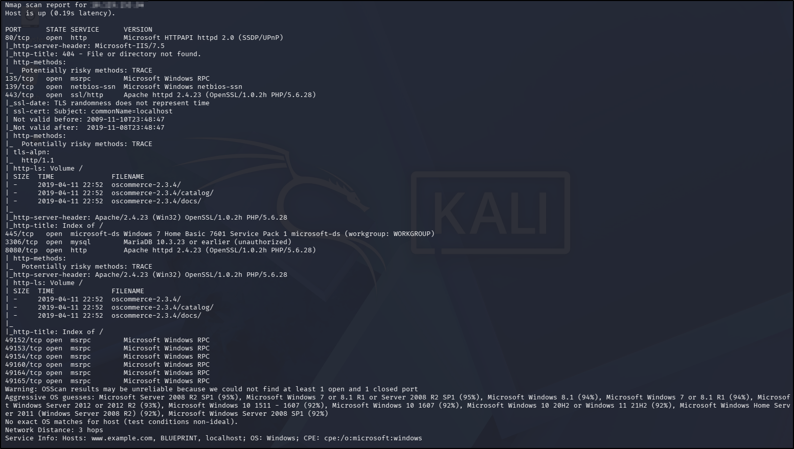  
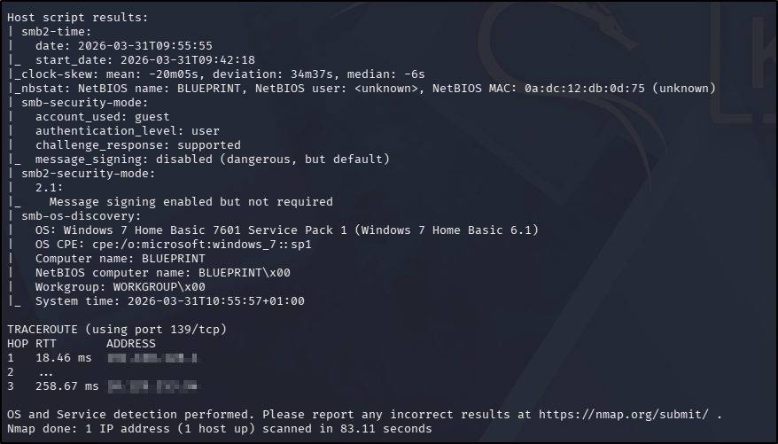

With so much to enumerate, I decided to start with the HTTP-related ports. I used my go-to `ffuf` command to enumerate each one of them:  
`ffuf -u http://TARGET_IP_ADDRESS/FUZZ -w /usr/share/wordlists/seclists/Discovery/Web-Content/DirBuster-2007_directory-list-2.3-medium.txt -ic -c`

### Port 80 (HTTP)
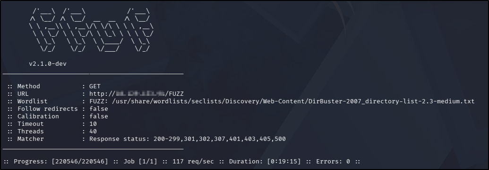  
Navigating to the page in a browser resulted in a generic `404` error. There were no `robots.txt` or `sitemap.xml` files.

Searching for service vulnerabilities with `searchsploit` yielded no interesting leads.

### Port 443 (HTTPS)/8080 (HTTP)
The web application on these two ports appear to be the same, so are addressed together.
#### Port 443 `ffuf` scan
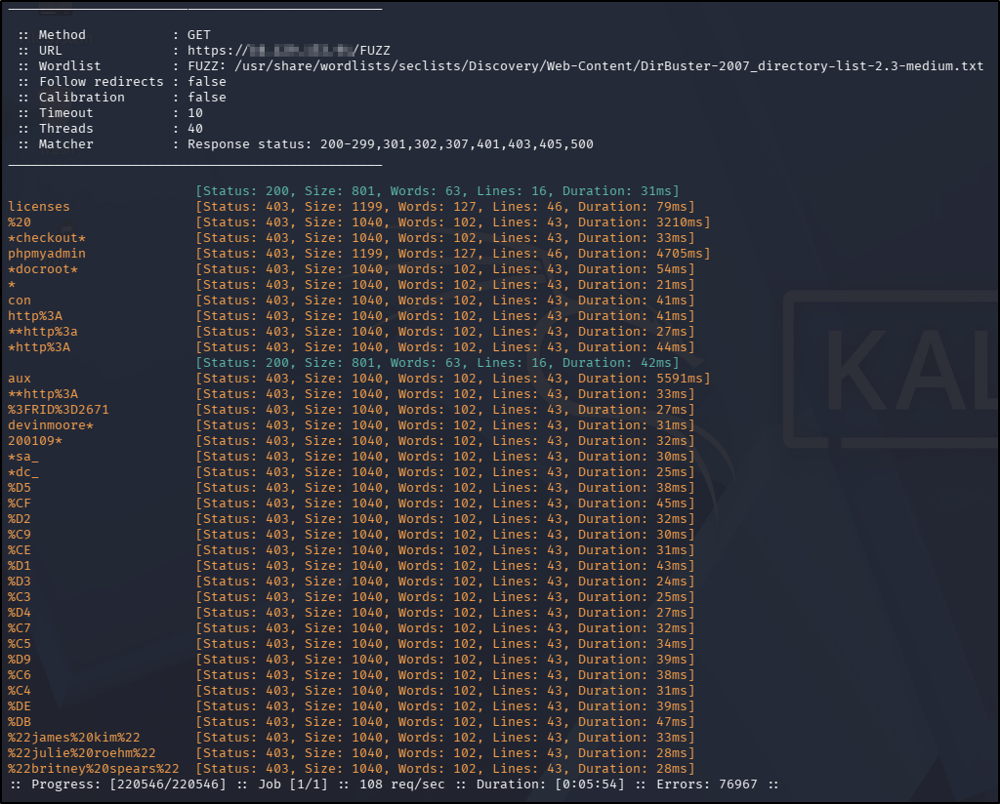  
#### Port 8080 `ffuf` scan
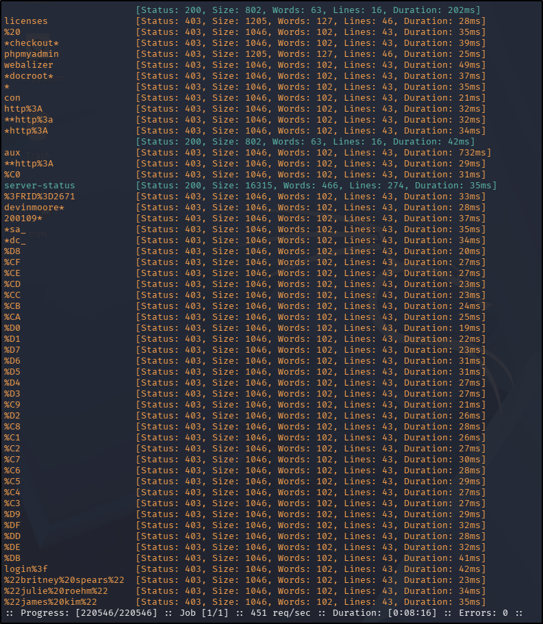  

Navigating to the page in a browser landed me in a directory with links to `/catalog` and `/docs`. The files here all appeared to be default docs provided in an installation. There were no `robots.txt` or `sitemap.xml` files.  
**Note:** the links on the 443 `catalog` page all redirected to the web page on the 8080 port, though none of them worked.

Searching for vulnerabilities with `searchsploit` yielded a potentially interesting result for the PHP version installed:  
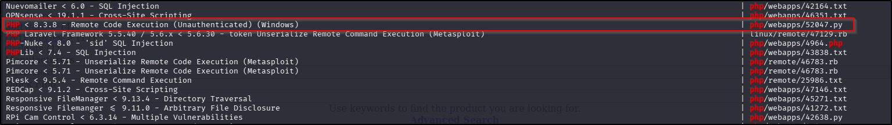  
**Note:**  the CVE associated with this vulnerability is from 2024, whereas the room appears to have been released as early as 2019. With this in mind, I disregarded this lead as being the intended solution for this box.  

Searching for vulnerabilities in the OpenSSL and httpd versions didn't yield any immediately interesting results, but searching for the version of oscommerce disclosed on the web page showed this version to have multiple vulnerabilities. Taking a quick look through the search results from `searchsploit`, there were a handful of persistent XSS (designed to steal user information) and SQLi exploits but given the web page doesn't actually appear to be fully functional at this point, I didn't deem these of significance. There was mention of an RCE, though it appeared to relate to arbitrary configurations that could be made. I considered these vulnerabilities to be of interest for the later foothold stage should further enumeration fail to reveal anything more obvious.

### Ports 139/445 (SMB)
I used `smbclient` to enumerate the SMB service:  
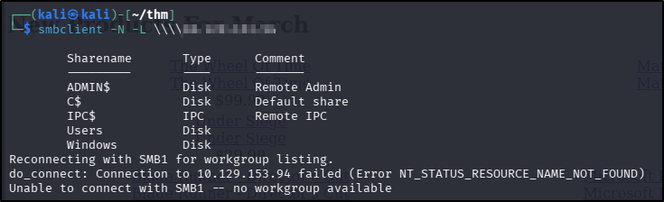  

After getting the list of shares from `smbclient`, I tried to connect to them each in turn with the following results:  

* `ADMIN$`: access denied  
* `C$`: access denied  
* `IPC$`: - directory listing empty (unsurprising)  
* `Users`: access permitted. Directories present for `Default` and `Public` user profiles but no files of interest present  
* `Windows` - access permitted but denied on directory listing

### Port 3306
With no username to connect to the database (yet), there was little enumeration to do here. I did search `searchsploit` for any vulnerabilities for the MariaDB version indicated in the `nmap` scan but that didn't yield any results.

## Foothold (and, as it turns out, Privilege Escalation)
With no usernames and no insertion points in the web application, I decided to go back and look at the RCE exploits returned by `searchsploit`. I worked my way back, starting with the highest numbered exploit first - I do this because older exploits have lower numbers, and a lot of older exploits in `searchsploit` use Python2 syntax, which requires some tweaking before they can be run with Python3. Newer exploits (and therefore, higher numbers) = more likely to be written in Python3 natively, and therefore less hassle for me. Reading through the code for the most recent exploit revealed something very useful indeed:  
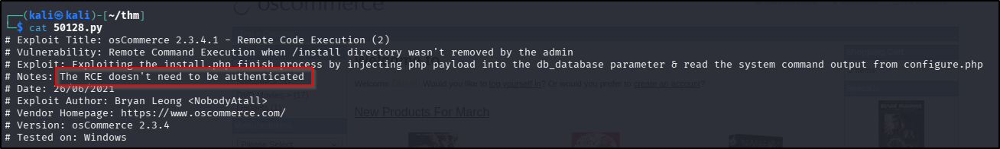

An unauthenticated RCE exploit? Well, that's gold dust in a CTF! Reading further through the code, it appears that this exploit has a prerequisite that the `/install` directory has not been removed by the administrator, and furthermore confirms that this should be as a sub-directory of the `/catalog` endpoint. Navigating to the URL in the browser confirmed that this was the case for this machine:  
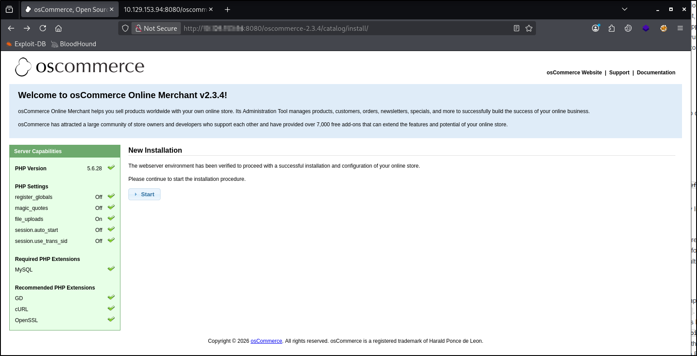  

I checked the syntax of the `searchsploit` script to confirm the expected format and then went ahead and executed it, which was successful, instantly giving me a `SYSTEM`-level shell:  
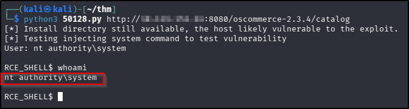  

So from this point, I could jump straight to the root flag, but there is a question to answer before that regarding the NTLM hash for the `Lab` user. Unfortunately there's not a whole lot of functionality with the shell generated but the Python script, but if I can turn that into a Meterpreter shell, I might be on to something. Before I opened Metasploit, I used my `SYSTEM` access to save the `SAM` and `SYSTEM` hives so they could be downloaded in my Meterpreter session (hopefully) with the following commands:  
```
reg save HKLM\SAM C:\xampp\htdocs\oscommerce-2.3.4\catalog\install\includes\SAM
reg save HKLM\SYSTEM C:\xampp\htdocs\oscommerce-2.3.4\catalog\install\includes\SYSTEM
```

Both files were saved successfully. From there I opened Metasploit to see if this exploit was part of the framework, which it was:  
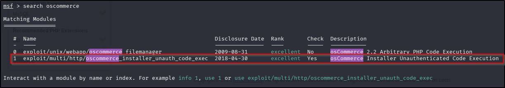  

I loaded the module in, set the relevant options (`RHOSTS`, `RPORT`, `URI`, `LHOST`) and ran the exploit, which was successful:  
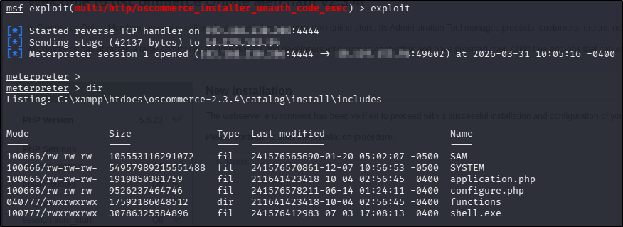  

Downloading the `SAM` file was easy enough (`download SAM`) but initially downloading the `SYSTEM` failed due to the session timeout settings in Metasploit. I updated the timeout value to 600 seconds (`background`; `sessions -i <id> --timeout 600`) and tried again. This time I was successful. Armed with a `SAM` and `SYSTEM` file, I fed them to Impacket's `secretsdump` to get the hashes with `impacket-secretsdump -sam SAM -system SYSTEM LOCAL` and got the hash I was looking for:  
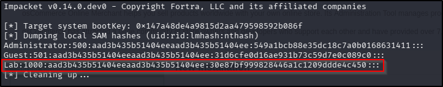  

From there, obtaining the decrypted hash from [CrackStation](https://crackstation.net/) was trivial:  
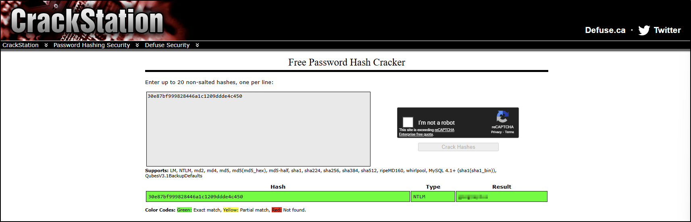  
??? success "`Lab` user NTLM hash decrypted"
	googleplus

Using my still-open Meterpreter session, I was able to find and obtain the root flag with ease (located in C:\Users\Administrator\Desktop\root.txt.txt):  
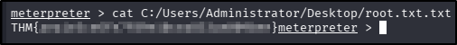  
??? success "root.txt"
	THM{aea1e3ce6fe7f89e10cea833ae009bee}

**Tools Used**  
`searchsploit` `Metasploit`

**Date completed:** 31/03/26  
**Date published:** 31/03/26