---
tags:
  - tryhackme
  - challenge type
  - easy
  - offensive
  - linux
  - steganography
  - decoding
---

# Break Out the Cage

**Platform:** TryHackMe  
**Type:** Challenge  
**Difficulty:** Easy  
**Link:** [Break Out the Cage](https://tryhackme.com/room/breakoutthecage1)  

## Description
"Help Cage bring back his acting career and investigate the nefarious goings on of his agent!  
Let's find out what his agent is up to...."

## Enumeration
I generated a list of open ports for more comprehensive enumeration with the following:  
`ports=$(nmap -p- --min-rate=1000 TARGET_IP_ADDRESS | grep ^[0-9] | cut -d '/' -f 1 | tr '\n' ',' | sed s/,$//)`  
This revealed the following open ports:  

* 21  
* 22  
* 80   

I ran a full `nmap` scan to query the services for version information, as well as querying the target system for OS information with `nmap -p$ports -A -T4 TARGET_IP_ADDRESS`, which revealed the following:  
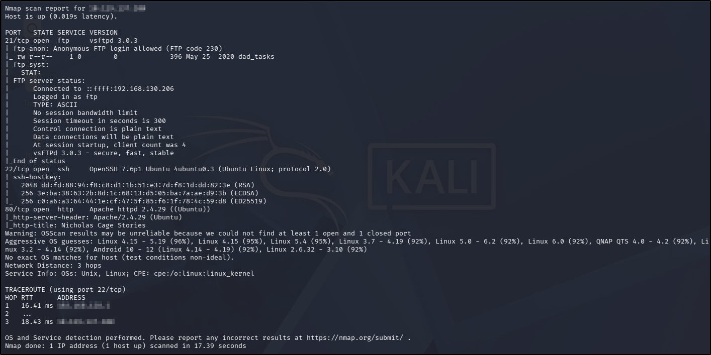  

I used my go-to `ffuf` command to enumerate the website (`ffuf -u http://TARGET_IP_ADDRESS/FUZZ -w /usr/share/wordlists/seclists/Discovery/Web-Content/DirBuster-2007_directory-list-2.3-medium.txt -ic -c`) as a quick directory discovery, whilst also running my standard `gobuster` command (`gobuster dir -u TARGET_IP_ADDRESS -w /usr/share/wordlists/seclists/Discovery/Web-Content/DirBuster-2007_directory-list-2.3-medium.txt -x php,html,txt`) to probe a bit more thoroughly, looking for files as well.  

Whilst I was waiting for the `ffuf` and `gobuster` scans to complete, I navigated to the home page in a web browser. The web page contents were static - apparently it's the home page of a blog written by Nicholas Cage. There was nothing interesting in the source code and no `robots.txt` or `sitemap.xml` files.

Once the `ffuf` scan was complete (there was nothing additional found in the `gobuster` scan), there were a few more directories to enumerate:  
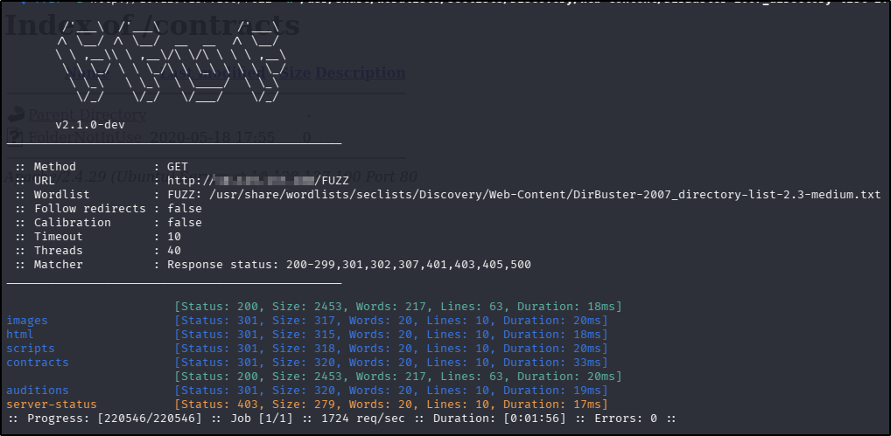  
The results of the manual enumeration of these directories were as follows:  

* `/images` - contained image files (unsurprising). There were quite a few here, certainly more than I had seen on the home page. I made a note of these at the time, with the plan to come back to it if there were no other leads to follow after the rest of the enumeration process was complete.
* `/html` - empty directory.
* `/scripts` - contained (acting) script files (again, unsurprising). There were five scripts in this directory, all of which looked to be largely the same with slight changes to some of the thematic words. As with the image files, I made a note to come back if there were no other leads to follow after enumeration of other services.
* `/contracts` - held one file called "FolderNotInUse". Odd as this was, with a file size of 0 bytes, I deemed this to be not of use at this stage.
* `/auditions` - held one file called "must_practice_corrupt_file.mp3". I downloaded this to my attacking machine for further analysis later.

WIth the initial enumeration of the web application completed, I moved onto the FTP service. The `nmap` scan had indicated that anonymous login was allowed and that there was a file to be had ("dad_tasks") so I had logged in and downloaded it, again for further analysis later.

As the final act of my initial enumeration, I ran a search for any vulnerabilities for the discovered service versions with `searchsploit`, but this failed to turn up anything useful.

## Foothold
I chose to look at the .mp3 file first, only really because it was the first one I obtained! I ran `exiftool`, `strings`, and `binwalk` on the file but found nothing. Actually listening to the file revealed a pretty poor audio recording with a burst of static close to the start. I have come across an instance of steganography in a previous CTF where a message was hidden in the spectogram for an audio file and, given that burst of static, I wondered if the same was true here. I opened the file with Audacity and turned on the Spectogram view, revealing a hidden message:  
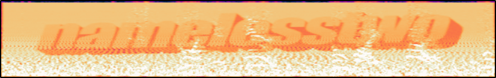  
OK, so "namelesstwo" is presumably either a password in its own right, or possibly the phrase "nicholsca" (or something along those lines) but I didn't know whether it was a password or a username, or where to use it. Another one for the list of things to come back to.
I moved on to the text file I downloaded:  
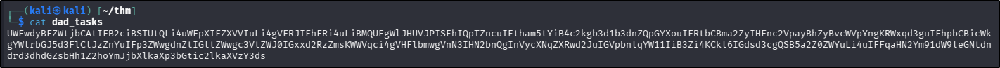  
Thinking it looked like base64 encoded, I decoded it to reveal the following:  
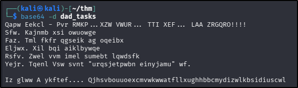  
My initial thoughts with this secondary encoding was that it was a ROT cipher but brute forcing it wit CyberChef wasn't successful. Whilst looking at the base64 decoded text, I realised that the formatting of the text looked like a list, and that the first word of each of the list lines looked like it would form the words "One", "Two", "Three", etc. If that last realisation was correct, it also proved that a straightforward ROT cipher was out of the question - the last two letters in the word that appeared to be "three" in the list were different, both of which were different from the final letter of the word that appeared to be "one". Thinking back to that word I found in the spectogram, I wondered if this encoding might instead be a Vigenere cipher, with that (or one of the variants it implied) as the keyword. Using the dCode decoder and using "nameslesstwo" proved successful:  
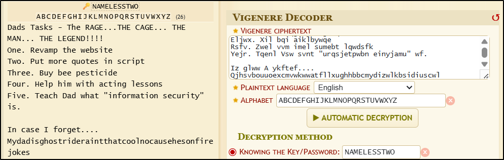  
I figured that the long string at the end of the message was probably a password, and given that the rest of the message refers to "Dad", I thought this was likely written by Nicholas Cage's son, whose name was provided to me on the home page ("Weston"). I used these two pieces of information to attempt an SSH login to the target machine and was successful.  
??? success "What is Weston's password?"
	Mydadisghostrideraintthatcoolnocausehesonfirejokes
After getting logged in (and checking my home directory for a flag - no luck), I did my usual quick checks for low-hanging fruit:  

* Checking `sudo` rights - this revealed a custom bash script I could run as `sudo`, which executed `wall` with a specific string to broadcast to system users.  
* Checking for SUID and SGID binaries - nothing here.  
* Reading `/etc/crontab` - nothing here either.  
* Checking groups that my logged-in user is part of - this revealed I was part of the "cage" group, which belonged to the system user of the same name. At this point, I stopped my checks and decided to follow the rabbit hole.  

Checking for files that belonged to the "cage" group, I found an interesting folder (and accompanying contents) in `/opt`:  
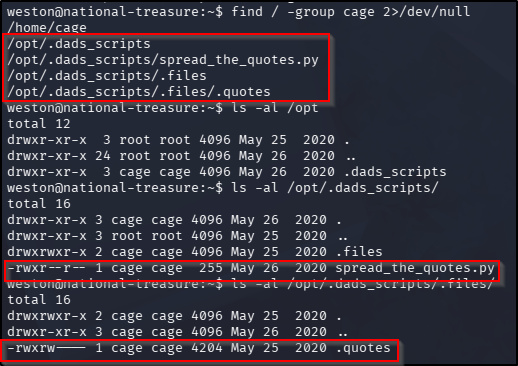  
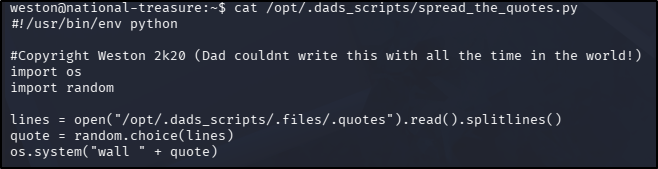  
The file contents, which I couldn't write to, showed that the `os.system` call was being called to read a file, line by line, meaning that if I could write to the file it takes as input (I could), whatever I add would be executed with `/bin/sh`. That's good because it means I can copy the system `bash` binary to a place I can access and turn it into a SUID binary for the user that executes the script, in this case the "cage" user. There was an issue with the theory - I didn't have the right to execute the script I had originally found. As I was pondering how best to proceed though, the answer appeared right on my screen - a broadcast message that was presumably a result of this script being executed from somewhere (a user-specific `crontab` or system timer perhaps), so my theory expanded into practice with one simple step: waiting. I executed the following command to add my line to the input file:  
`echo '; cp /bin/bash /tmp/cagebash; chmod +s /tmp/cagebash ;' > /opt/.dads_scripts/.files/.quotes`  
I had another broadcast message within a minute or so, at which point I was able to execute my `cagebash` binary:  
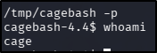  
Alright, so that gives me access to the "cage" user, so I started my search for the user flag anew, and now it was easy to find:  
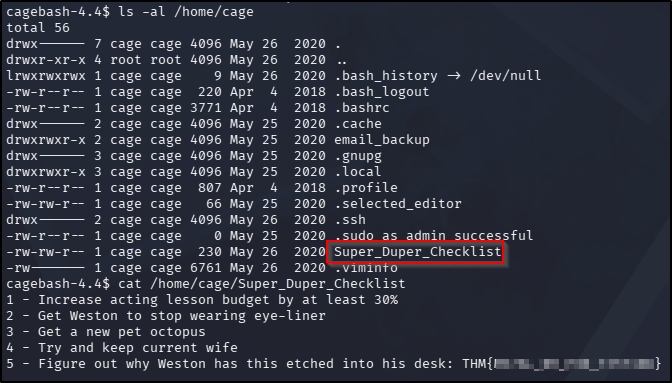  
??? success "What's the user flag?"
	THM{M37AL_0R_P3N_T35T1NG}

## Privilege Escalation
I went on to enumerate the rest of the home directory for the "cage" user:  
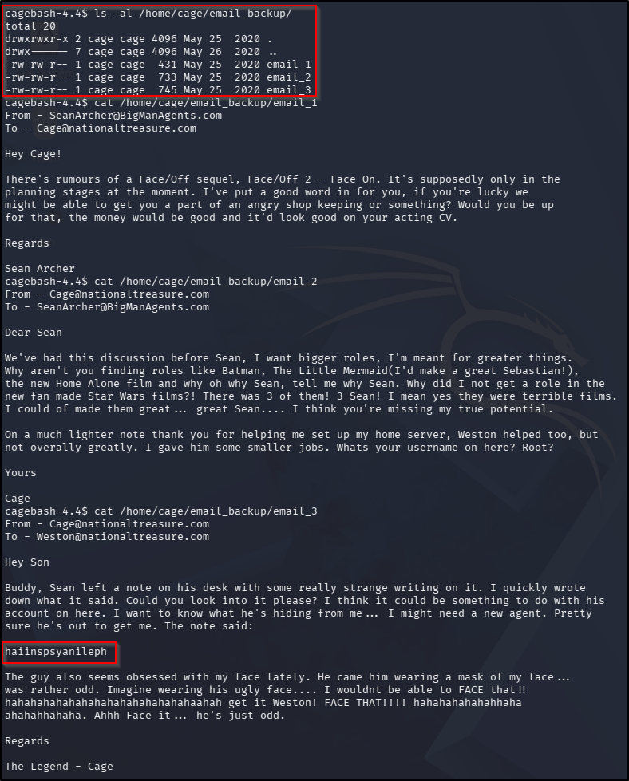  
As with the odd string I had found earlier, I tried a couple of cipher identifiers on this weird string but found nothing obvious. Given that the Vigenere cipher had been used in the previous decoding element, I considered that this might be the case again, and whilst the repeated use of the word "face" in the accompanying message is contextual, it stood out a little so I gave it a try with [dCode.fr](https://www.dcode.fr/vigenere-cipher) and got a hit:  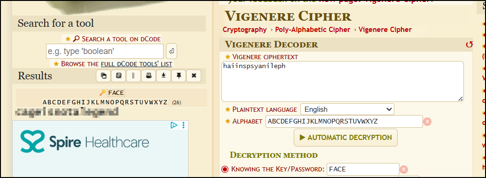  
Given that the username for the creep agent had basically been provided in one of the other email messages, I simply tried to switch user with the decoded string contents and was successful.  From there finding and reading the root flag was trivial:  
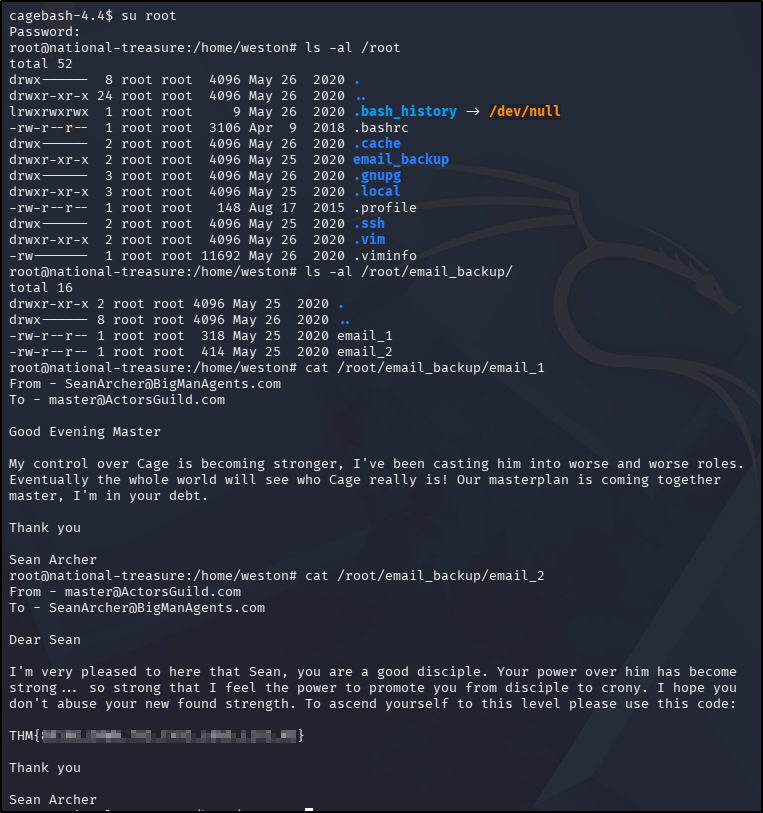  
??? success "What's the root flag?"
	THM{8R1NG_D0WN_7H3_C493_L0N9_L1V3_M3}

**Tools Used**  
`Audacity`

**Date completed:** 17/04/26  
**Date published:** 17/04/26