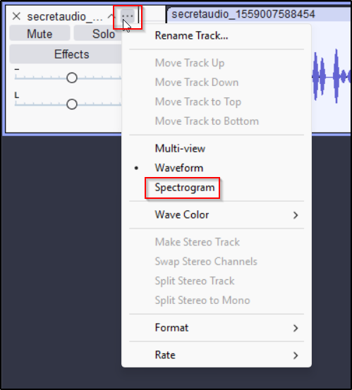
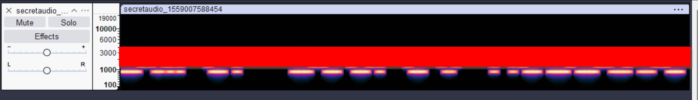
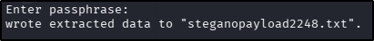
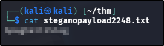
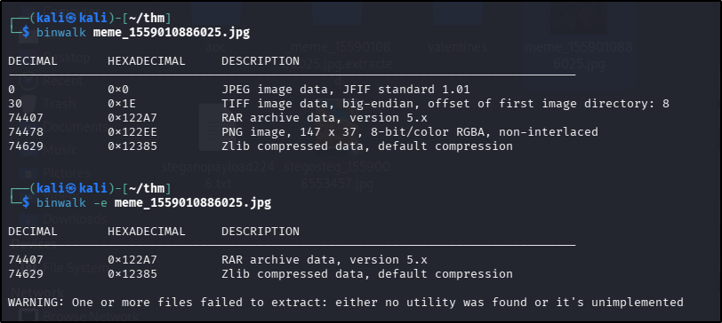
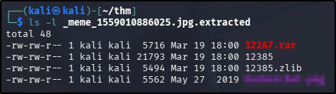
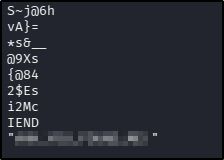

---
tags:
  - tryhackme
  - challenge
  - easy
  - encoding
  - steganography
---

# c4ptur3-th3-fl4g

**Platform:** TryHackMe  
**Type:** Challenge  
**Difficulty:** Easy  
**Link:** [c4ptur3-th3-fl4g](https://tryhackme.com/room/c4ptur3th3fl4g)

## Overview
"A beginner level CTF challenge"

## Task 1: Translation & Shifting
Translate, shift and decode the following.
### String #1
String: "c4n y0u c4p7u23 7h3 f149?"  
Encoding type: Leet - characterised by the use of numbers and symbols to replace particular alphabetical characters  
Tool used: None - readable as is  
Answer:
??? success "c4n y0u c4p7u23 7h3 f149?"
	Can you capture the flag?  
### String #2
String: "01101100 01100101 01110100 01110011 00100000 01110100 01110010 01111001 00100000 01110011 01101111 01101101 01100101 00100000 01100010 01101001 01101110 01100001 01110010 01111001 00100000 01101111 01110101 01110100 00100001 "" 
Encoding type: binary - characterised by the exclusive use of 1s and 0s. Formatted correctly, encoded strings will appear in blocks of 8 digits (octets)  
Tool used: CyberChef (Magic function)
Answer:
??? success "01101100 01100101 01110100 01110011 00100000 01110100 01110010 01111001 00100000 01110011 01101111 01101101 01100101 00100000 01100010 01101001 01101110 01100001 01110010 01111001 00100000 01101111 01110101 01110100 00100001"
	lets try some binary out!
### String #3
String: "MJQXGZJTGIQGS4ZAON2XAZLSEBRW63LNN5XCA2LOEBBVIRRHOM======"  
Encoding: Base32 - characterised by the use of 32 ASCII characters, encoded strings will always appear in lengths of multiples of 8, with padding provided by the use of the "=" symbol  
Tool used: CyberChef (Magic function)  
Answer:  
??? success "MJQXGZJTGIQGS4ZAON2XAZLSEBRW63LNN5XCA2LOEBBVIRRHOM======"
	base32 is super common in CTF's
### String #4
String: "RWFjaCBCYXNlNjQgZGlnaXQgcmVwcmVzZW50cyBleGFjdGx5IDYgYml0cyBvZiBkYXRhLg=="  
Encoding: Base64 - characterised by the use of 64 ASCII characters, encoded strings will always appear in lengths of multiples of 4, with padding provided by the use of the "=" symbol  
Tool used: CyberChef (Magic function)
Answer:  
??? success "RWFjaCBCYXNlNjQgZGlnaXQgcmVwcmVzZW50cyBleGFjdGx5IDYgYml0cyBvZiBkYXRhLg=="
	Each Base64 digit represents exactly 6 bits of data.
### String #5
String: "68 65 78 61 64 65 63 69 6d 61 6c 20 6f 72 20 62 61 73 65 31 36 3f"
Encoding: Hex - characterised by the use of digits and alphabetical characters from a-f, correctly formatted it can appear in sets of two characters  
Tool used: CyberChef (Magic function)  
Answer:
??? success "68 65 78 61 64 65 63 69 6d 61 6c 20 6f 72 20 62 61 73 65 31 36 3f"
	hexadecimal or base16?
### String #6
String: "Ebgngr zr 13 cynprf!"  
Encoding: ROT13 (Caesar cipher) - a substitution cipher where each character in the plaintext string is "rotated" 13 characters through the alphabet  
Tool used: CyberChef (ROT13 function)  
Answer:  
??? success "Ebgngr zr 13 cynprf!"
	Rotate me 13 places!
### String #7
String: "\*@F DA:? >6 C:89E C@F?5 323J C:89E C@F?5 Wcf E:>6DX"  
Encoding: ROT47 (Caesar cipher) - a substitution cipher where each character in the plaintext string is "rotated" 47 characters through the full alphanumeric set of characters (includes numbers and symbols) 
Tool used: Dcode -  [Cipher Identifier](https://www.dcode.fr/cipher-identifier) and [ROT-47 decoder](https://www.dcode.fr/rot-47-cipher)   
Answer:  
??? success "*@F DA:? >6 C:89E C@F?5 323J C:89E C@F?5 Wcf E:>6DX"
	You spin me right round baby right round (47 times)
### String #8
String: "- . .-.. . -.-. --- -- -- ..- -. .. -.-. .- - .. --- -.

. -. -.-. --- -.. .. -. --."  
Encoding:  Morse code - characterised with the use of dashes ("long" tap) and dots ("short" tap)  
Tool used: CyberChef (from Morse code function)  
Answer:  
??? success "- . .-.. . -.-. --- -- -- ..- -. .. -.-. .- - .. --- -. . -. -.-. --- -.. .. -. --."
	telecommunication encoding
### String #9
String: "85 110 112 97 99 107 32 116 104 105 115 32 66 67 68"
Encoding: Decimal - characterised by the use of numbers only, each character has a corresponding decimal value in the ASCII table  
Tool used: CyberChef (Magic function)  
Answer:  
??? success "85 110 112 97 99 107 32 116 104 105 115 32 66 67 68"
	Unpack this BCD
### String #10
String: "LS0tLS0gLi0t..." (redacted for brevity)  
Encoding: Multiple - Base64 > Morse Code > Binary > ROT47 > Decimal    
Tool used: CyberChef (Magic function)  
Answer:  
??? success  "LS0tLS0gLi0t... (redacted for brevity)""	 
	Let's make this a bit trickier...

## Task 2: Spectogram
Encoded message provided in a downloadable .wav file.
### Process
After downloading the file, I opened it in Audacity - the task desription and title indicated I needed a way to see the spectogram of the audio file, a function I knew was natively present in the Audacity GUI. Once open, I changed the view option using the options menu:  
  
The encoded message became immediately visible at this point:  
  
??? success "What is the encoded message in the provided .wav file?"
	Super Secret Message

## Task 3: Steganography
Encoded message provided in a downloadable .jpg file.
### Process
After downloading the file, I initially checked the metadata with `exiftool` but this didn't yield anything useful. Knowing this was a steganography challenge, I decided to try using `steghide` to extract any hidden information, hoping that there was no passphrase in place if this was the intended path. I used the following command:  
`steghide extract -sf stegosteg_1559008553457.jpg`  
I got lucky - the data appeared to be extracted successfully:  
  
Reading the contents of the extracted file got me the decoded message:  

??? success "What is the encoded message in the provided .jpg file?"
    SpaghettiSteg

## Task 4: Security through obscurity
Encoded message provided in a downloadable .jpg file.
### Process
After downloading the file, I initially checked the metadat with `exiftool` but this didn't yield anything useful. Using the first task wording of getting "inside" the file, I checked the downloaded file with `binwalk`, finding it contained a variety of other compressed files:  
  
Extracting the files with `binwalk -e` got me the answer to the first task in this challenge:  
  
??? success "Download and get 'inside' the file. What is the first filename & extension?"
	hackerchat.png
Again using the task wording to guide me, I moved to the .rar file extracted from the original .jpg file. I extracted the file contained inside it with the file explorer GUI in Kali Linux and ran `exiftool` on the resulting .png file but once again found nothing exciting. Given the task title of "security through obscurity", I checked the .png file with `strings` and got the final flag for this task:  

??? success "Get inside the archive and inspect the file carefully. Find the hidden text."
	AHH_YOU_FOUND_ME!
	
**Tools Used**  
`CyberChef` `Audacity` `steghide` `binwalk` `strings`

**Date completed:** 19/03/26  
**Date published:** 19/03/26