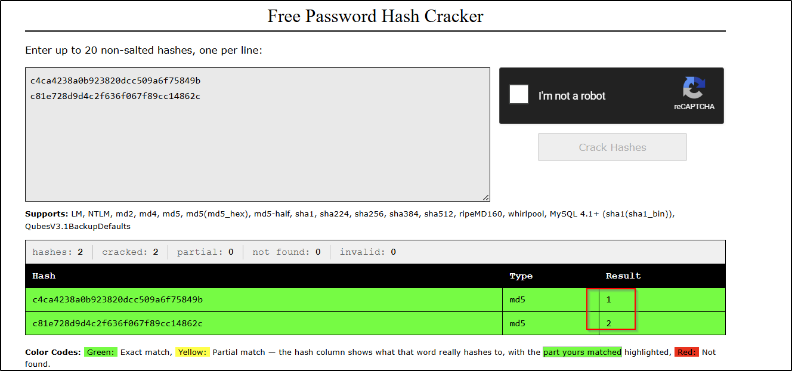
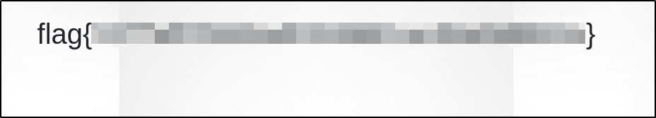

---
tags:
  - tryhackme
  - challenge
  - easy
  - offensive
  - linux
  - idor
---

# Corridor


**Platform:** TryHackMe  
**Type:** Challenge  
**Difficulty:** Easy  
**Link:** [Corridor](https://tryhackme.com/room/corridor)  

## Description
"Can you escape the Corridor?

You have found yourself in a strange corridor. Can you find your way back to where you came?

In this challenge, you will explore potential IDOR vulnerabilities. Examine the URL endpoints you access as you navigate the website and note the hexadecimal values you find (they look an awful lot like a hash, don't they?). This could help you uncover website locations you were not expected to access."

## Enumeration
### Port Scanning
```
ports=$(nmap -p- --min-rate=1000 TARGET_IP_ADDRESS | grep ^[0-9] | cut -d '/' -f 1 | tr '\n' ',' | sed s/,$//)
nmap -p$ports -A -T4 TARGET_IP_ADDRESS
```
```
Host is up (0.019s latency).

PORT   STATE SERVICE VERSION
80/tcp open  http    Werkzeug httpd 2.0.3 (Python 3.10.2)
|_http-title: Corridor
Warning: OSScan results may be unreliable because we could not find at least 1 open and 1 closed port
Device type: general purpose
Running: Linux 4.X|5.X
OS CPE: cpe:/o:linux:linux_kernel:4 cpe:/o:linux:linux_kernel:5
OS details: Linux 4.15 - 5.19
Network Distance: 3 hops
```

### HTTP enumeration
```bash
ffuf -u http://TARGET_IP_ADDRESS/FUZZ -w /usr/share/wordlists/seclists/Discovery/Web-Content/DirBuster-2007_directory-list-2.3-medium.txt -ic -c
gobuster dir -u http://TARGET_IP_ADDRESS -w /usr/share/wordlists/seclists/Discovery/Web-Content/DirBuster-2007_directory-list-2.3-medium.txt -x php,html,txt
```
**Notes**  
- No `robots.txt` file  
- No `sitemap`  
- Fuzzing returns no hidden pages  
- `curl` to obtain source code reveals each image is a hyperlink - URIs appear to be hashes:
```html
<!DOCTYPE html>
<html lang="en">
<head>
    <meta charset="utf-8">
    <meta name="viewport" content="width=device-width, initial-scale=1, shrink-to-fit=no">
    <link rel="stylesheet" href="https://stackpath.bootstrapcdn.com/bootstrap/4.5.0/css/bootstrap.min.css"
        integrity="sha384-9aIt2nRpC12Uk9gS9baDl411NQApFmC26EwAOH8WgZl5MYYxFfc+NcPb1dKGj7Sk" crossorigin="anonymous">
    <title>Corridor</title>

    <link rel="stylesheet" href="/static/css/main.css">
</head>

<body>
    


    <map name="image-map">
        <area target="" alt="c4ca4238a0b923820dcc509a6f75849b" title="c4ca4238a0b923820dcc509a6f75849b" href="c4ca4238a0b923820dcc509a6f75849b" coords="257,893,258,332,325,351,325,860" shape="poly">
        <area target="" alt="c81e728d9d4c2f636f067f89cc14862c" title="c81e728d9d4c2f636f067f89cc14862c" href="c81e728d9d4c2f636f067f89cc14862c" coords="469,766,503,747,501,405,474,394" shape="poly">
        <area target="" alt="eccbc87e4b5ce2fe28308fd9f2a7baf3" title="eccbc87e4b5ce2fe28308fd9f2a7baf3" href="eccbc87e4b5ce2fe28308fd9f2a7baf3" coords="585,698,598,691,593,429,584,421" shape="poly">
        <area target="" alt="a87ff679a2f3e71d9181a67b7542122c" title="a87ff679a2f3e71d9181a67b7542122c" href="a87ff679a2f3e71d9181a67b7542122c" coords="650,658,644,437,658,652,655,437" shape="poly">
        <area target="" alt="e4da3b7fbbce2345d7772b0674a318d5" title="e4da3b7fbbce2345d7772b0674a318d5" href="e4da3b7fbbce2345d7772b0674a318d5" coords="692,637,690,455,695,628,695,467" shape="poly">
        <area target="" alt="1679091c5a880faf6fb5e6087eb1b2dc" title="1679091c5a880faf6fb5e6087eb1b2dc" href="1679091c5a880faf6fb5e6087eb1b2dc" coords="719,620,719,458,728,471,728,609" shape="poly">
        <area target="" alt="8f14e45fceea167a5a36dedd4bea2543" title="8f14e45fceea167a5a36dedd4bea2543" href="8f14e45fceea167a5a36dedd4bea2543" coords="857,612,933,610,936,456,852,455" shape="poly">
        <area target="" alt="c9f0f895fb98ab9159f51fd0297e236d" title="c9f0f895fb98ab9159f51fd0297e236d" href="c9f0f895fb98ab9159f51fd0297e236d" coords="1475,857,1473,354,1537,335,1541,901" shape="poly">
        <area target="" alt="45c48cce2e2d7fbdea1afc51c7c6ad26" title="45c48cce2e2d7fbdea1afc51c7c6ad26" href="45c48cce2e2d7fbdea1afc51c7c6ad26" coords="1324,766,1300,752,1303,401,1325,397" shape="poly">
        <area target="" alt="d3d9446802a44259755d38e6d163e820" title="d3d9446802a44259755d38e6d163e820" href="d3d9446802a44259755d38e6d163e820" coords="1202,695,1217,704,1222,423,1203,423" shape="poly">
        <area target="" alt="6512bd43d9caa6e02c990b0a82652dca" title="6512bd43d9caa6e02c990b0a82652dca" href="6512bd43d9caa6e02c990b0a82652dca" coords="1154,668,1146,661,1144,442,1157,442" shape="poly">
        <area target="" alt="c20ad4d76fe97759aa27a0c99bff6710" title="c20ad4d76fe97759aa27a0c99bff6710" href="c20ad4d76fe97759aa27a0c99bff6710" coords="1105,628,1116,633,1113,447,1102,447" shape="poly">
        <area target="" alt="c51ce410c124a10e0db5e4b97fc2af39" title="c51ce410c124a10e0db5e4b97fc2af39" href="c51ce410c124a10e0db5e4b97fc2af39" coords="1073,609,1081,620,1082,459,1073,463" shape="poly">
    </map>


</body>
</html>  
```
- Navigating to each link reveals a "dead end":  


### Vulnerability enumeration
```bash
searchsploit httpd 2.0.3	# Only result: DoS exploit
```

## Flag
**Action**  
:white_check_mark: Use [Crackstation](https://crackstation.net/) to see if URLs are hashes that can be cracked  
**Notes**  
- Hashes revealed to be MD5  
- Hashes convert to numeric characters (1, 2, etc):  
  
- 13 doors present on the home page image map  

**Action**  
:white_check_mark: Attempt to retrieve pages with MD5 hashes that translate to "0" and "14" respectively  (use Google to obtain hash for "0")  
**Payloads**  
- "14": `http://<TARGET_IP_ADDRESS/aab3238922bcc25a6f606eb525ffdc56`  

- "0": `http://<TARGET_IP_ADDRESS/cfcd208495d565ef66e7dff9f98764da`  


??? success "What is the flag?"
	flag{2477ef02448ad9156661ac40a6b8862e}

**Date completed:** 29/09/26  
**Date published:** 29/09/26