---
tags:
  - tryhackme
  - challenge
  - easy
  - offensive
  - linux
  - decoding
  - metadata
  - steganography
  - qr-analysis
  - reverse-engineering
  - magic-bytes
  - osint
  - network-traffic-analysis
---

# CTF collection Vol.1

**Platform:** TryHackMe  
**Type:** Challenge  
**Difficulty:** Easy  
**Link:** [CTF collection Vol.1](https://tryhackme.com/room/ctfcollectionvol1)

## Description
"Sharpening up your CTF skill with the collection. The first volume is designed for beginner."

## Task 1:
No work required - simply click the "Check" button.

## Task 2: 
Decode encoded text
### Artifacts examined
Encoded string: "VEhNe2p1NTdfZDNjMGQzXzdoM19iNDUzfQ=="
### Analysis
The encoded type of the string was recognisable as base64 thanks to the `=` symbols being used as padding at the end. Decoding with the following:  
`echo 'VEhNe2p1NTdfZDNjMGQzXzdoM19iNDUzfQ==' | base64 -d`
### Answer
??? success "Feed me the flag!"
	THM{ju57_d3c0d3_7h3_b453}

## Task 3: 
Metadata recovery
### Artifacts examined
Find_me_1577975566801.jpg (provided)
### Analysis
The clue for this one was in the title of the task ("Meta meta"). I used `exiftool` to read the metadata of the image and found my flag:  
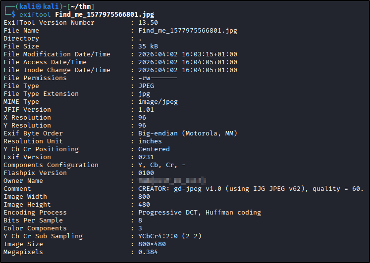  
### Answer
??? success "I'm hungry, I need the flag."
	THM{3x1f_0r_3x17}

## Task 4: 
Steganography
### Artifacts examined
Extinction_1577976250757.jpg (provided)
### Analysis
There was a clue in the description for this task ("Something is hiding") and in the image content (I think the subjects of the drawing are stegosauri). I used `steghide` on the image with the following command (blank passphrase):  
`steghide extract -sf Extinction_1577976250757.jpg`  
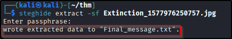  
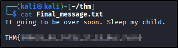  
### Answer
??? success "It is sad. Feed me the flag."
	THM{500n3r_0r_l473r_17_15_0ur_7urn}

## Task 5: 
Find the hidden text
### Artifacts examined
Challenge page content
### Analysis
With no provided artifacts for this one and nothing in the source code, I did the only thing I could: selected the text on the web page. The flag is right there, just in white font:  
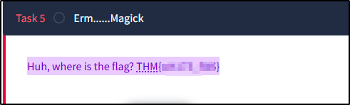  
### Answer
??? success "Did you find the flag?"
	THM{wh173_fl46}

## Task 6: 
QR code analysis
### Artifacts examined
QR_1577976698747.png (provided)
### Analysis
Not wanting to blindly scan a QR code not knowing anything about it, I used an [online tool](https://qrcoderaptor.com/) to scan it for me and got the flag in the output:  
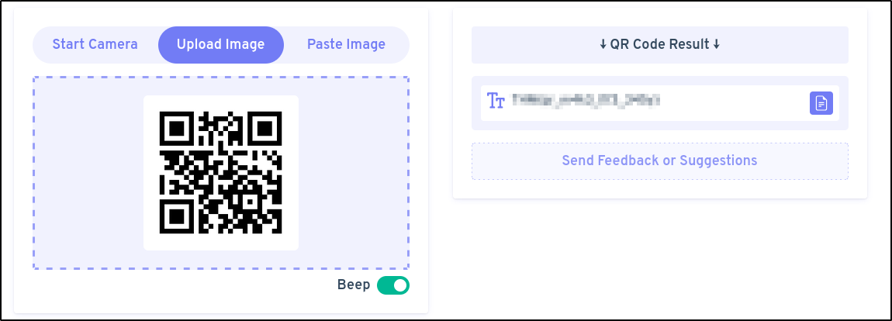  
### Answer
??? success "More flag please!"
	THM{qr_m4k3_l1f3_345y}

## Task 7: 
Reverse engineering
### Artifacts examined
hello_1577977122465.hello (provided)
### Analysis
This file had an unusual extension (`.hello`) that didn't tell me what kind of file I was dealing with, so firstly I ran `file` on it to see if I could shed some light on the matter:  
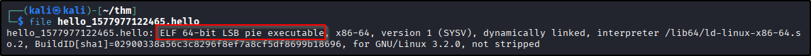  
Armed with the knowledge that I was dealing with a binary, I chose to run `strings` on it and got my flag:  
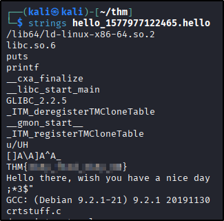  
### Answer
??? success "Found the flag?"
	THM{345y_f1nd_345y_60}

## Task 8: 
Decode encoded text
### Artifacts examined
Encoded string: "3agrSy1CewF9v8ukcSkPSYm3oKUoByUpKG4L"
### Analysis
As the string contains digits and letters but no special characters, the type of encoding was not instantly identifiable so I turned to dCode's [Cipher Identifier](https://www.dcode.fr/cipher-identifier) to help me out. This gave me a conservative guess of base58 encoding:  
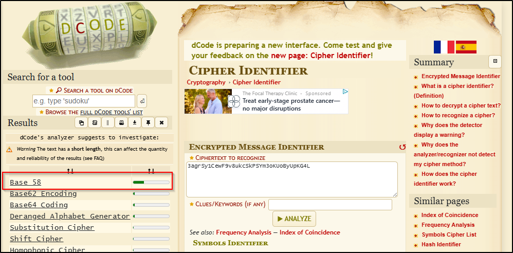  
I was able to decode it with the following:  
`echo '3agrSy1CewF9v8ukcSkPSYm3oKUoByUpKG4L' | base58 -d`
### Answer
??? success "Oh, Oh, Did you get it?"
	THM{17_h45_l3553r_l3773r5}

## Task 9: 
Decode encoded text
### Artifacts examined
Encoded string: "MAF{atbe_max_vtxltk}"
### Analysis
The clue for this task suggests that there is a ROT cipher substitution at play for this string, just not ROT-13. dCode has a great [brute forcer](https://www.dcode.fr/caesar-cipher) for these that gave me the flag immediately:  
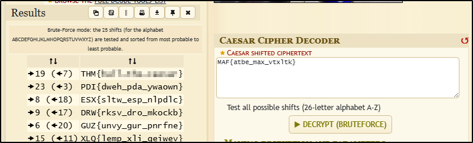  
### Answer
??? success "What did you get?"
	THM{hail_the_caesar}

## Task 10: 
Source code inspection
### Artifacts examined
Challenge page source code
### Analysis
 With no string to decode and no downloadable files, I turned to the source code of the web page. This was easiest done for this dynamic page using the "Inspect" option on the right-click menu - the relevant element opens in the panel right away, and nested elements can be expanded as required. I found my flag in a hidden HTML element:  
 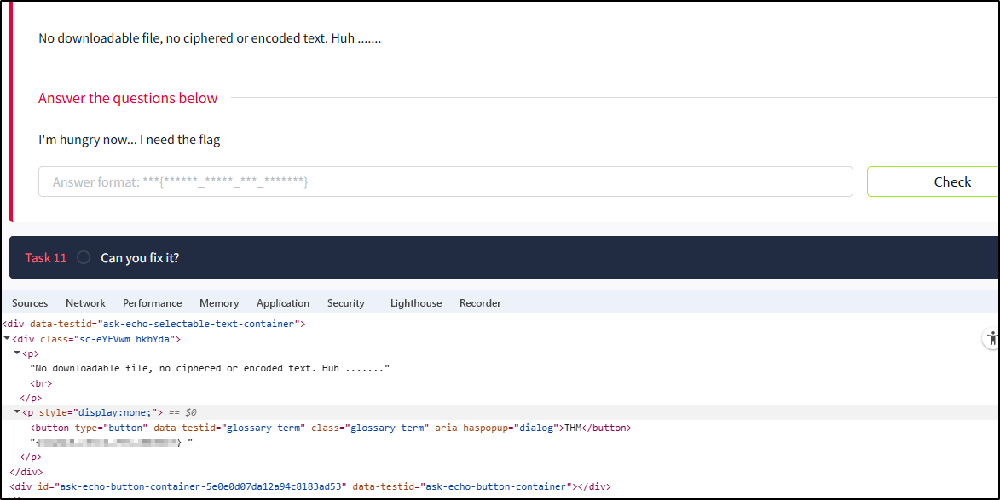  
### Answer
??? success "I'm hungry now... I need the flag"
	THM{4lw4y5_ch3ck_7h3_c0m3mn7}

## Task 11: 
File signature identification
### Artifacts examined
spoil_1577979329740.png (provided)
### Analysis
Using the clue in the challenge description, and the fact that the downloaded file was unable to be displayed, I used `file` to see if the operating system was able to identify what kind of file this was supposed to be (`.png`):  
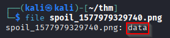  
With the OS only being able to identify the file as "data", this suggests that something may have gone wrong with the file on a hexadecimal level. I used `hexeditor` to open the file and, comparing with a [Wikipedia entry](https://en.wikipedia.org/wiki/List_of_file_signatures), could see that the bytes responsible for setting the file signature did not align with the expectations for a `.png` file:  
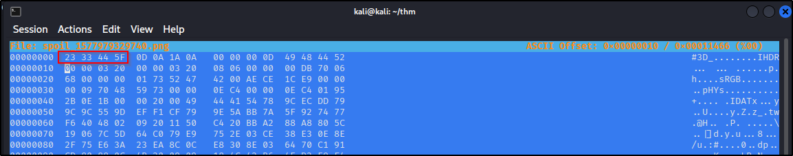  
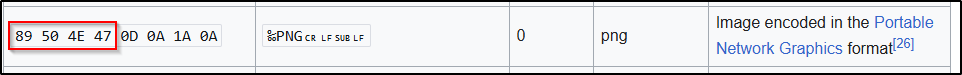  
Updating the first bytes of the file to contain the expected values and saving the file (Ctrl+X) meant that the image could be rendered, revealing the flag:  
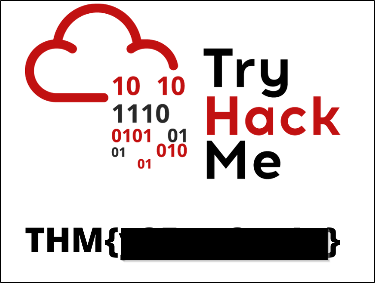  
### Answer
??? success "What is the content?"
	THM{y35_w3_c4n}

## Task 12: 
OSINT
### Artifacts examined
TryHackMe social media accounts
### Analysis
Not going to lie - I looked up the answer for this one, mostly because this room was released 6 years before I came to actually do it, and I'm not about to trawl through 6 years of various social media posts to find one flag in an "easy" CTF with more than 20 tasks in it. I did start by using the hint to at least point me to the right platform (reddit) because first and foremost I don't have an X (Twitter) account and I'm not about to get one. Honestly, I'm not sure this one is still achievable without a lot of digging/looking at a previous write-up, not least because it looks like the original post with the answer in it has been deleted.
### Answer
??? success "Did you found the hidden flag?"
	THM{50c14l_4cc0un7_15_p4r7_0f_051n7}

## Task 13: 
Decode encoded text
### Artifacts examined
Encoded string: "++++++++++[>+>+++>+++++++>++++++++++<<<<-]>>>++++++++++++++.------------.+++++.>+++++++++++++++++++++++.<<++++++++++++++++++.>>-------------------.---------.++++++++++++++.++++++++++++.<++++++++++++++++++.+++++++++.<+++.+.>----.>++++."
### Analysis
The encoding on this string is instantly recognisable as one of the f*ck variants due to it's excessive use of the `+` symbol. dCode has a great [decoder](https://www.dcode.fr/brainfuck-language) for this one:  
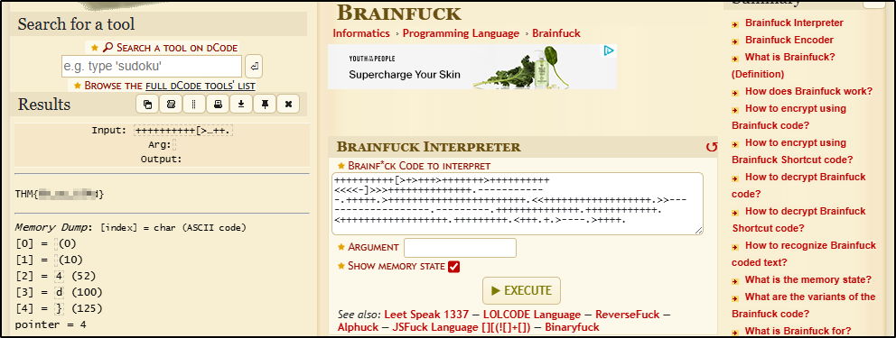  
### Answer
??? success "Can you decode it?"
	THM{0h_my_h34d}

## Task 14: 
Decode encoded text
### Artifacts examined
String 1: "44585d6b2368737c65252166234f20626d"  
String 2: "1010101010101010101010101010101010"
### Analysis
When provided with two strings that are the same length for an encoding challenge, it is reasonable to assume that XOR is at play. I used an [XOR Calculator](https://xor.pw/) to get the flag for this one:  
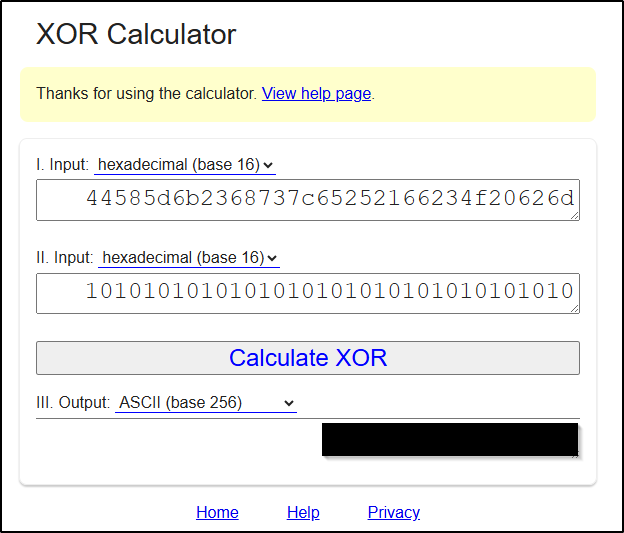  
### Answer
??? success "Did you crack it? Feed me now!"
	THM{3xclu51v3_0r}

## Task 15: 
Steganography
### Artifacts examined
hell_1578018688127.jpg (provided)
### Analysis
There was a clue in the name of this task ("Binary walk") as to the name of the tool to use. I used `binwalk` to first confirm the existence of hidden files, and then extract them:  
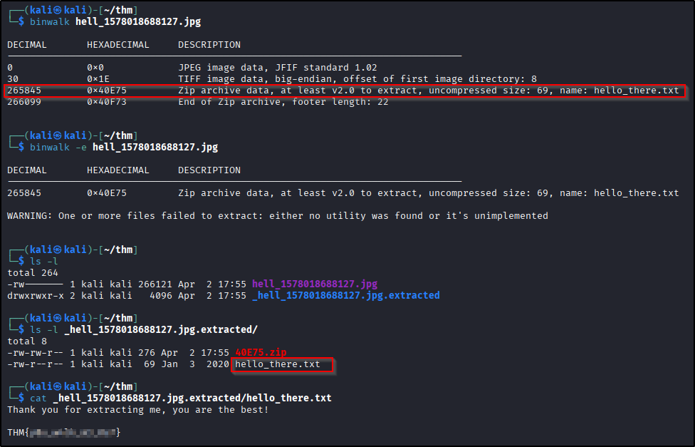  
### Answer
??? success "Flag! Flag! Flag!"
	THM{y0u_w4lk_m3_0u7}

## Task 16:
Steganography
### Artifacts examined
dark_1578020060816.png (provided)
### Analysis
There was a clue in the description for this task ("There is something lurking in the dark."), which I figured might mean that the flag was hidden in one of the planes. WIth this in mind, I used `stegsolve` to examine each plane in turn, and did indeed find a flag "lurking" in one of them.
### Answer
??? success "What does the flag said?"  
    THM{7h3r3_15_h0p3_1n_7h3_d4rkn355}

## Task 17: 
Steganography(?)
### Artifacts examined
QRCTF_1579095601577.png (provided)
### Analysis
As before, I wasn't keen on simply scanning an unknown QR code so I uploaded it to the same QR code analyser I had used previously. The result turned out to be a SoundCloud site so I went ahead and scanned the QR code with my phone. The track starts with a bot reading the flag out.
### Answer
??? success "What does the bot said?"
	THM{SOUNDINGQR}

## Task 18: 
OSINT
### Artifacts examined
https://www.embeddedhacker.com/
### Analysis
Once again, the description gave a pretty heavy clue for how to get this flag. I navigated to the [Internet Archive](https://web.archive.org/) (WaybackMachine), entered the URL provided and navigated to the only snapshot for the date given. The flag is there in a comment:  
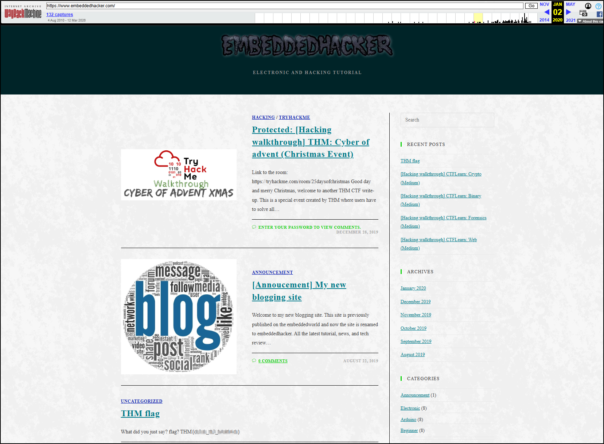  
### Answer
??? success "Did you found my past?"
	THM{ch3ck_th3_h4ckb4ck}

## Task 19: 
Decode encoded text
### Artifacts examined
Encoded string: "MYKAHODTQ{RVG_YVGGK_FAL_WXF}"
### Analysis
This encoded string mentions a key, which made me think it was likely a Vigenere cipher. Unfortunately the key has allegedly been lost. Fortunately, we have a known piece of the plaintext: "TRYHACKME". I turned to dCode again for this - it has a pretty good brute forcer, and found the flag immediately:  
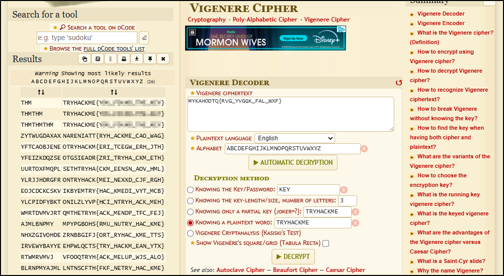  
### Answer
??? success "The deciphered text"
	TRYHACKME{YOU_FOUND_THE_KEY}

## Task 20: 
Decode encoded text
### Artifacts examined
Encoded string: "581695969015253365094191591547859387620042736036246486373595515576333693"
### Analysis
The absence of any alpha characters gives this string away as decimal encoding, but trying to decode directly from decimal to text (ASCII) did not result in a readable string. Given the ASCII table entries can be represented by hexadecimal and binary numbers, I tried firstly [converting the encoded string to hex](https://www.rapidtables.com/convert/number/decimal-to-hex.html)  and [then to ASCII](https://www.rapidtables.com/convert/number/hex-to-ascii.html), which was successful:  
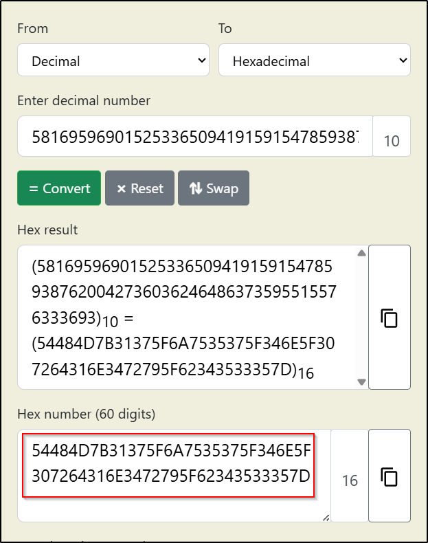  
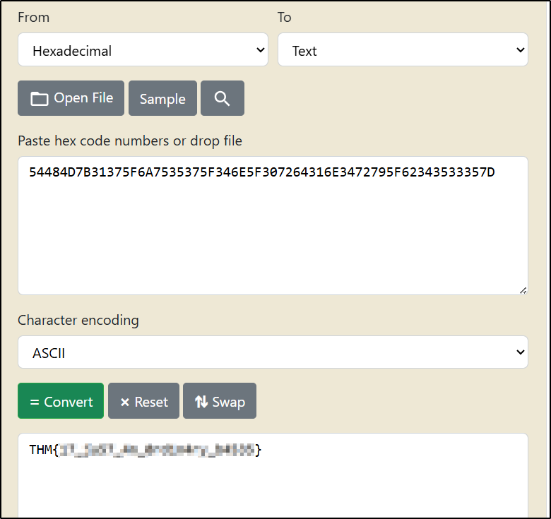  
### Answer
??? success "What's the flag?"
	THM{17_ju57_4n_0rd1n4ry_b4535}

## Task 21: 
Network traffic analysis
### Artifacts examined
flag_1578026731881.pcapng (provided)
### Analysis
Given the description for this task talks about what the neighbour is doing on their WiFi, rather than capturing a WiFi password or PIN, I figured this challenge might be to do with HTTP traffic in the `.pcapng` file. I opened the file in Wireshark, filtered the packets to HTTP and found a `GET` request to a "flag.txt" file:  
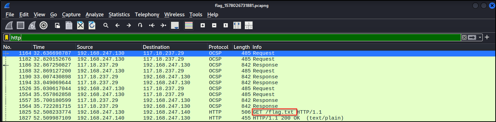  
I exported the file from the capture (File > Export Objects > HTTP) and got my final flag from the contents:  
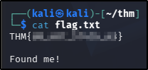  
### Answer
??? success "Did you captured my neighbor's flag?"
	THM{d0_n07_574lk_m3}

**Tools Used**  
`base64` `exiftool` `steghide` `file` `strings` `base58` `hexeditor` `binwalk` `stegsolve` `wireshark`

**Date completed:** 02/04/26  
**Date published:** 02/04/26