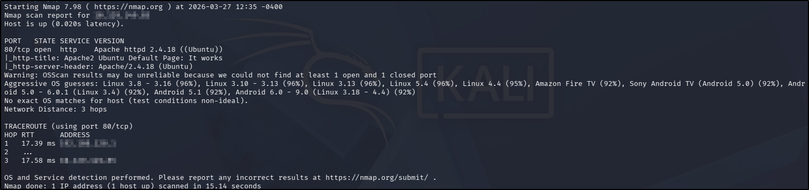
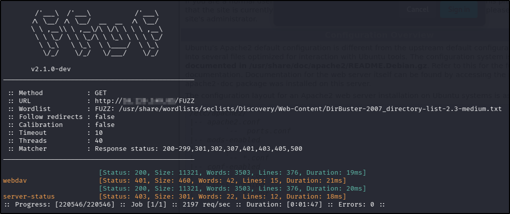
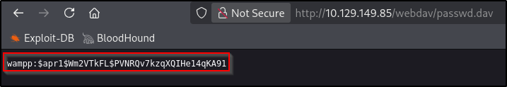
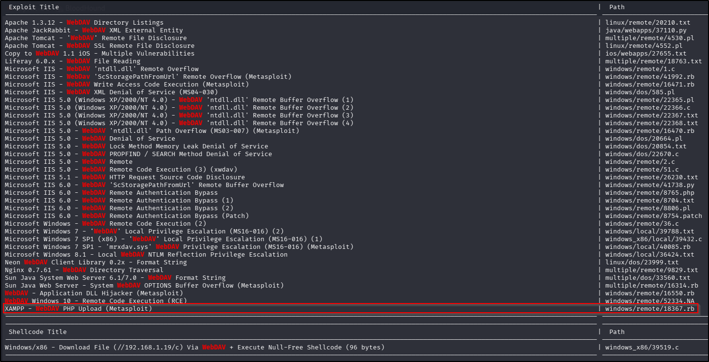
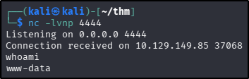
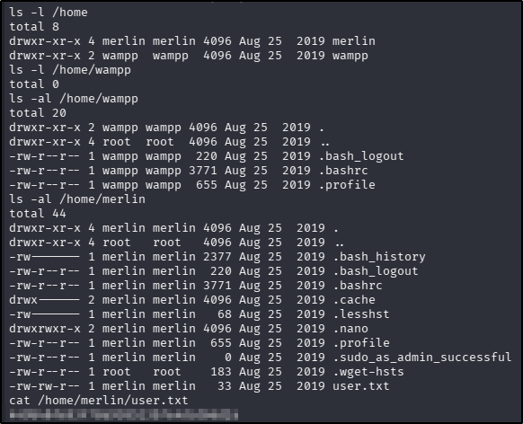
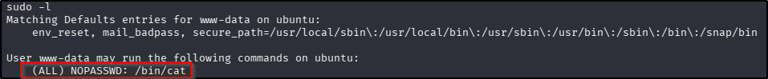

---
tags:
  - tryhackme
  - challenge
  - easy
  - offensive
  - linux
  - web
  - boot2root
  - metasploit
  - sudo-abuse
---

# Dav

**Platform:** TryHackMe  
**Type:** Challenge  
**Difficulty:** Easy  
**Link:** [Dav](https://tryhackme.com/room/bsidesgtdav)

## Description
"boot2root machine for FIT and bsides guatemala CTF"

## Initial Enumeration
I generated a list of open ports for more comprehensive enumeration with the following:  
`ports=$(nmap -p- --min-rate=1000 TARGET_IP_ADDRESS | grep ^[0-9] | cut -d '/' -f 1 | tr '\n' ',' | sed s/,$//)`  
This revealed the following open port:  

* 80  

I ran a full `nmap` scan to query the service for version information, as well as querying the target system for OS information with `nmap -p$ports -A -T4 TARGET_IP_ADDRESS`, which revealed the following:  
  

I used my go-to `ffuf` command to enumerate the website:  
`ffuf -u http://TARGET_IP_ADDRESS/FUZZ -w /usr/share/wordlists/seclists/Discovery/Web-Content/DirBuster-2007_directory-list-2.3-medium.txt -ic -c`  
  

Visiting the web page in a browser showed that the default web page was in place. There were no `robots.txt` or `sitemap.xml` files, or anything interesting in the source code (unsurprising). Visiting the `/webdav` endpoint found in the `ffuf` scan generated a box for basic authentication; cancelling the request failed to provide anything useful in the `401` message.

Searching for vulnerabilities with `searchsploit` returned only a DoS vulnerability, which I deemed unlikely to be the intended path in a CTF situation.

## Foothold
Well there isn't a lot to go on there, is there?! With no accessible endpoints and no usernames, I thought I'd do a bit of research into this "webdav" service. Part of that research included looking for default credentials: I found [this](https://gist.github.com/kaiquepy/fd02275785ef7c8b6e6cb308654960d9) site. Using the first of those suggestions got me access into the `/webdav` endpoint, exposing a file called "passwd.dav":  
  

Initially, this seemed really exciting. Until I realised that there wasn't anywhere for me to use a password even if I could crack the hash. And even then, I potentially already had the plaintext value ("xampp"). I figured it wouldn't hurt to try cracking it with `john` whilst I explored other avenues (spoiler alert: this was ultimately unsuccessful). I also thought to try to see if I could find a vulnerability for webdav, rather than the Apache version I had originally researched. `searchsploit` did give me something that looked promising:  
  

With that lead, I fired up Metasploit, found the exploit shown in the `searchsploit` results, adjusted the options as necessary and ran the exploit. It ran, but failed to create a session. I tried to manually initiate a session by reloading the `/webdav` directory, opening a `netcat` listener for the port used in the Metasploit exploit, and then opened the file uploaded by Metasploit. I received a connection back, but it terminated when I tried to send a command back to the target machine. With that, slightly clearer, picture of where the issue was, I thought about changing either the target or the payload options of the exploit.

There was no alternative target to use, but plenty of other payloads to try. From the list that was returned, I decided to start with the most generic: `payload/generic/shell_reverse_tcp`. I had the same issue - the exploit completed but without a session. I tried my manual method again, and this time was successful:  
  

From there, finding and reading `user.txt` was trivial:  
  
??? success "user.txt"
	449b40fe93f78a938523b7e4dcd66d2a

## Privilege Escalation
The first thing I do whenever I get a reverse shell is to check `sudo` rights:  
  

Well, that's almost disappointing! This should be the quickest boot2root ever: `sudo` with `cat` means I can read any file on the system as the `root` user. `sudo cat /root/root.txt` should do the trick, and it does:  
  
??? success "root.txt"
	101101ddc16b0cdf65ba0b8a7af7afa5

**Tools Used**  
`msfconsole`

**Date completed:** 27/03/26  
**Date published:** 27/03/26