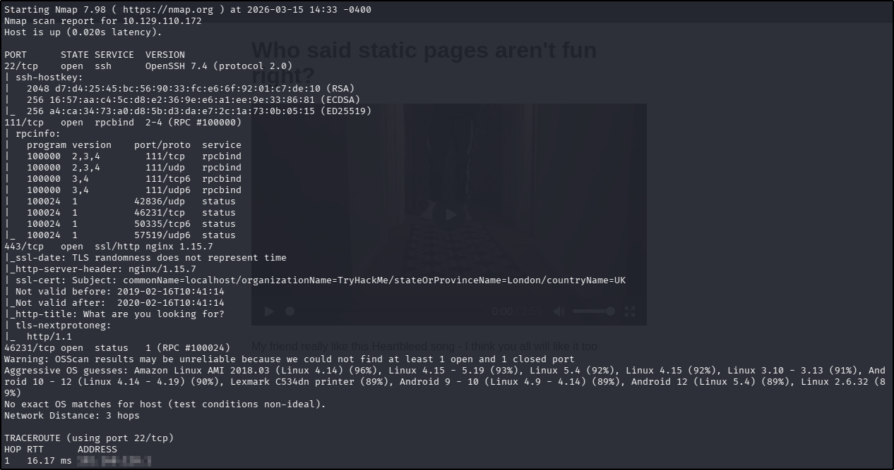
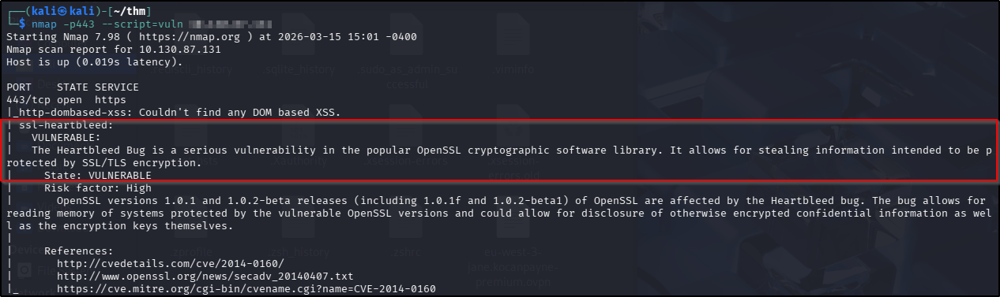
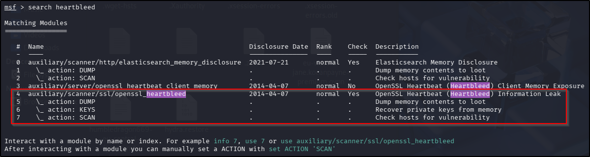
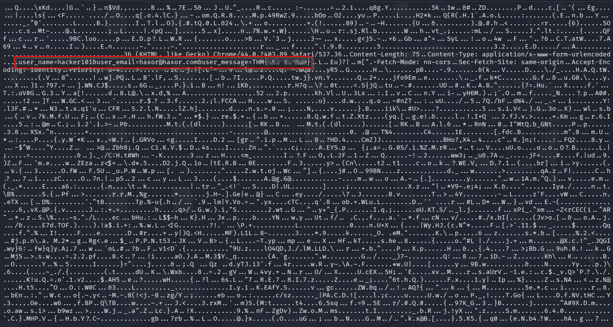

---
tags:
  - linux
  - web
  - metasploit
---

# HeartBleed

**Platform:** TryHackMe  
**Type:** Challenge  
**Difficulty:** Easy  
**Link:** [HeartBleed](https://tryhackme.com/room/heartbleed)

## Description
"SSL issues are still lurking in the wild! Can you exploit this web servers OpenSSL?"

## Initial Enumeration
I generated a list of open ports for more comprehensive enumeration with the following:  
`ports=$(nmap -p- --min-rate=1000 TARGET_IP_ADDRESS | grep ^[0-9] | cut -d '/' -f 1 | tr '\n' ',' | sed s/,$//)`  
This revealed the following open ports:  

* 22
* 111
* 443
* 46231  

I ran a full `nmap` scan to query the services for version information, as well as querying the target system for OS information with `nmap -p$ports -A -T4 TARGET_IP_ADDRESS`, which revealed the following:  
  

Given the name of the challenge and the educational content in it, I figured it was worth checking to see if the machine was vulnerable to HeartBleed with `nmap` using the `--script=vuln` option:  

That's our potential HeartBleed vulnerability confirmed!

## Exploitation
Given how notorious this vunerability is, I thought it was worth checking Metasploit for a ready-made exploit. Sure enough, there it was:  
  

I selected the module and set the RHOSTS option. With this particular exploit, you also need to set the VERBOSE option to `true` if you want to see the leakage that results. Reading through the output got me a flag:  
  
??? success "What is the flag?"
	THM{sSl-Is-BaD}

**Tools Used**  
`nmap` `msfconsole`

**Date completed:** 15/03/26  
**Date published:** 15/03/26