---
tags:
  - tryhackme
  - challenge
  - easy
  - forensics
  - windows
---

# Investigating Windows

**Platform:** TryHackMe  
**Type:** Challenge  
**Difficulty:** Easy  
**Link:** [Investigating Windows](https://tryhackme.com/room/investigatingwindows)

## Description
"A windows machine has been hacked, its your job to go investigate this windows machine and find clues to what the hacker might have done."

## Environment and Artefacts provided
Windows live host - has been previously compromised according to the challenge description.

## Task 1: 
Determine OS details.
### Analysis
Nice easy one to get started this one - no artefacts needed. Just open the Start Menu and search for "winver".  
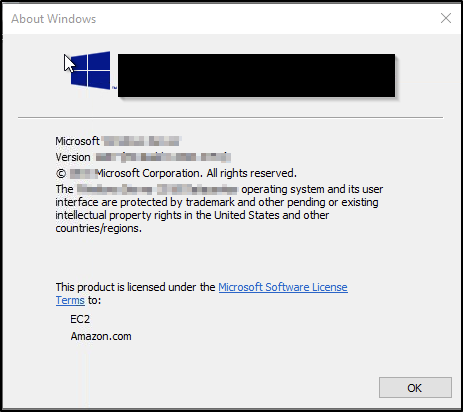  
### Answer
??? success "Whats the version and year of the windows machine?"
		Windows Server 2016

## Task 2:
Determine user activity (generic).
### Artefacts examined
File system.
### Analysis
Another easy one - navigate to `C:\Users` in Windows Explorer and check the modifed date on the folders. Most recent data gives you the user that logged in the most recently.  
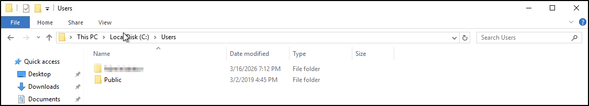  
### Answer
??? success "Which user logged in last?"
	Administrator

## Task 3
Determine user activity (John).
### Artefacts examined
Event logs; user objects
### Analysis
This is where it started to get tricky. As I'd already seen, there was no user folder for the "John" user in `C:\Users`. I went on to open up Event Viewer and filter the Security log by Event ID 4624 (successful logon) but the logs were empty of any events with that ID. They were in fact empty of any events prior to the day I actually did the challenge so it would appear that whatever "compromise" has taken place on this machine included an event log clearance. I did a quick Google to find another way to determine the last logon timestamp for local user and found the following line of PowerShell that returns the information for all local users:  
`Get-LocalUser | Sort-Object LastLogon | Select-Object Name, Enabled, SID, Lastlogon`  
Opening a PowerShell window and using that command gave me the answer I was looking for:  
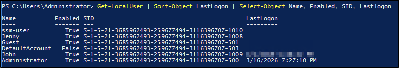  
### Answer
??? success "When did John log onto the system last?"
	03/02/2019 5:48:32 PM

## Task 4
Determine network connectivity.
### Artefacts examined
Scheduled tasks; file system; event logs; registry
### Analysis
My first instinct here was to check for any scheduled tasks that opened on system startup.  
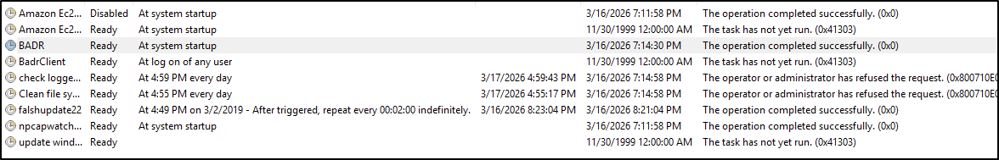  

Clearly there were a couple of tasks there that felt out of place, but investigating the scripts associated with them didn't reveal any connections to IP addresses. Next up I moved to checking the security and system Event Logs for event 5156 (allowed connection) but came up empty there too. I moved on to check the `Run` key in the Registry (specifies programs that run on system startup) and finally found my answer.  
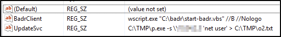  
### Answer
??? success "What IP does the system connect to when it first starts?"
	10.34.2.3

## Task 5
Privilege enumeration.
### Artefacts examined
Group object
### Analysis
This was another fairly simple task - open Computer Management > Local Users and Groups > Groups. Right-click on the Administrators group.  
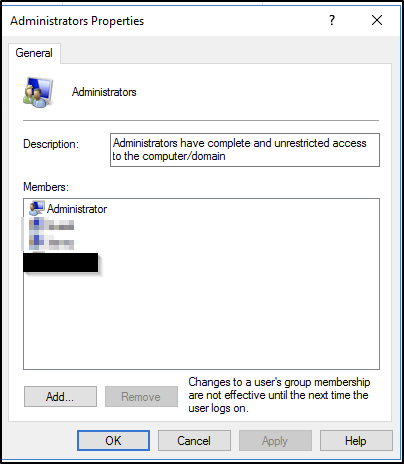  
### Answer
??? success "What two accounts had administrative privileges (other than the Administrator user)?"
	Guest, Jenny  
*Note: there were actually 3 user accounts in the group when I checked. The reasons for the 3rd user not being included in the answer at this stage will become clear as the challenge progresses.*

## Tasks 6, 7, and 8
Scheduled task enumeration
### Artefacts examined
Scheduled Tasks
### Analysis
Returning to the Task Scheduler (I had looked through it when checking for the startup IP address earlier), and having checked the "BADR" script files earlier (they appear related to the lab setup), there was only one Task that looked unusual. Checking the actions command for it provided the answers for tasks 6, 7, and 8 in one go.
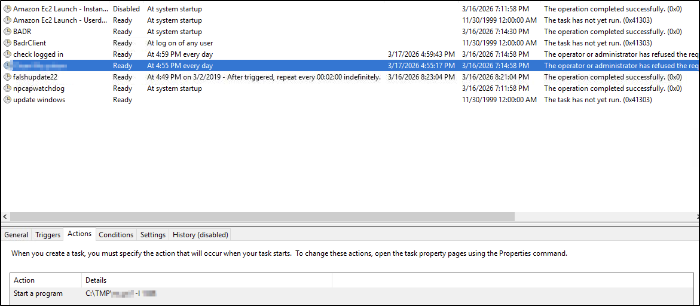  
### Answer (#6)
??? success "Whats the name of the scheduled task that is malicous."
	Clean file system
### Answer (#7)
??? success "What file was the task trying to run daily?"
	nc.ps1
### Answer (#8)
??? success "What port did this file listen locally for?"
	1348

## Task 9
Determine user activity (Jenny)
### Artefacts examined
User object
### Analysis
I had actually already unwittingly obtained the answer to this question earlier when determining the user activity for `John`. Returning to the output gave me the answer.
### Answer
??? success "When did Jenny last logon?"
	Never

### Task 10
Compromise timeline (foothold)
### Artefacts examined
Task Scheduler
### Analysis
Checking the date that the malicious Task was created gave me the answer for this.
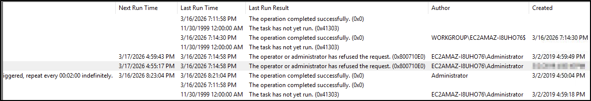  
### Answer
??? success "At what date did the compromise take place?"
	03/02/2019

## Task 11
Compromise timeline (privilege escalation)
### Artefacts examined
Event Logs
### Analysis
The plan for me here was to check the Security logs for event ID 4735 (special privileges assigned), specifically the earliest of these events that took place on 03/02/2019. Just one issue with that - the Security logs had either rolled or cleared on my particular instance. Cards on the table for transparency - I turned to [another walkthrough](https://medium.com/@haircutfish/tryhackme-investigating-windows-task-1-investigating-windows-da65f32cf67f) to see what was going on here - looks like I should have had access to those logs. The walkthrough gave me the answer for this one, but my technique was solid.
### Answer
??? success "During the compromise, at what time did Windows first assign special privileges to a new logon?"
	03/02/2019 4:04:47 PM  

*Note: this is also the reason for not including that 3rd user for the earlier question - it's added to the Administrators group during the compromise, not before.*

## Task 12
Compromise timeline (lateral movement)
### Artefacts examined
Registry; file system
## Analysis
Checking the startup key in the Registry pointed me towards the location on the file system where output would be saved (`C:\TMP`). In that folder were two relevant looking files: an executable (`mim`) and another output file (`mim-out`). Checking the contents of the latter gave me the answer to this one.  
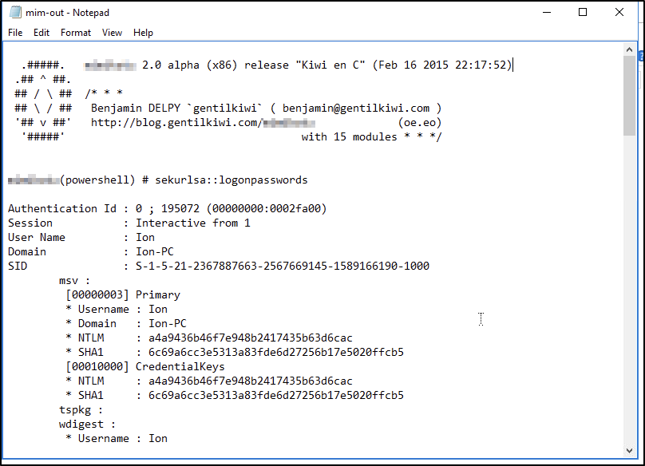  
### Answer
??? success "What tool was used to get Windows passwords?"
	Mimikatz

## Task 13
Compromise timeline (command and control)
### Artefacts examined
Hosts file
## Analysis
Looking at the `hosts` file (`C:\Windows\system32\drivers\etc\hosts`) two websites with the same IP address:  
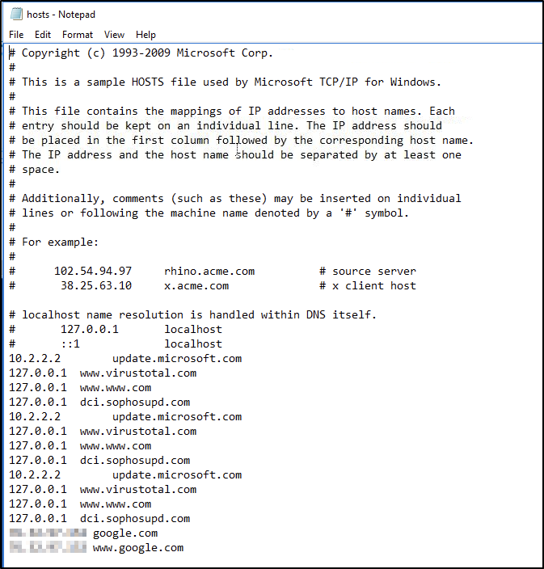  
### Answer
??? success "What was the attackers external control and command servers IP?"
	76.32.97.132

## Task 14
Compromise timeline (persistence)
### Artefacts examined
File system
### Analysis
Checking the directory associated with a Windows web server (`C:\inetpub\wwwroot`) gave me the answer here:  
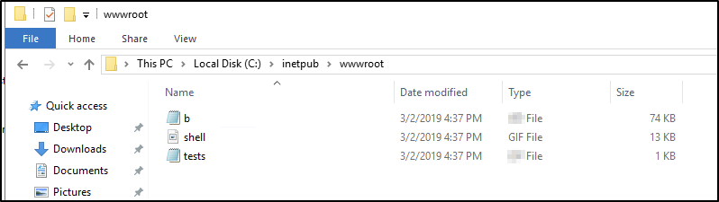  
### Answer
??? success "What was the extension name of the shell uploaded via the servers website?"
	.jsp

## Task 15
Compromise timeline (command and control)
### Artefacts examined
Firewall config
## Analysis
Looking at the inbound rules in the Windows Firewall with Advanced Security MMC snap-in (because the question asks about "opening" a local port) shows a strangely named rule with a commonly used hacker port:  
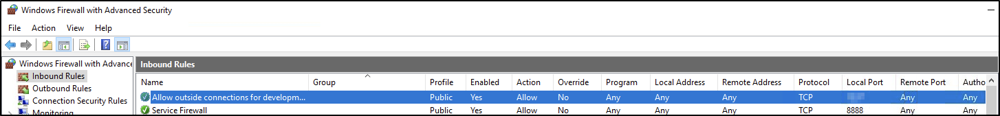  
### Answer
??? success "What was the last port the attacker opened?"
	1337

## Task 16
Compromise timeline (command and control)
### Artefacts examined
Hosts file
### Analysis
Whilst checking the `hosts` file earlier, I had unwittingly already discovered the answer for this one.
### Answer
??? success "Check for DNS poisoning, what site was targeted?"
	google.com

**Tools Used**  
`PowerShell` `Task Scheduler` `Event Viewer` `regedit`

**Date completed:** 16/03/26  
**Date published:** 16/03/26