---
tags:
  - tryhackme
  - challenge
  - easy
  - offensive
  - linux
  - boot2root
  - decoding
  - steganography
  - suid-abuse
---

# Jack-of-All-Trades

**Platform:** TryHackMe  
**Type:** Challenge  
**Difficulty:** Easy  
**Link:** [Jack-of-All-Trades](https://tryhackme.com/room/jackofalltrades)

## Description
"Boot-to-root originally designed for Securi-Tay 2020"

## Enumeration
I generated a list of open ports for more comprehensive enumeration with the following:  
`ports=$(nmap -p- --min-rate=1000 TARGET_IP_ADDRESS | grep ^[0-9] | cut -d '/' -f 1 | tr '\n' ',' | sed s/,$//)`  
This revealed the following open ports:  

* 22
* 80

I ran a full `nmap` scan to query the services for version information, as well as querying the target system for OS information with `nmap -p$ports -A -T4 TARGET_IP_ADDRESS`, which revealed the following:  
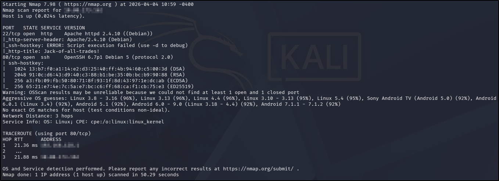  
I used my go-to `ffuf` command to enumerate the website:  
`ffuf -u http://TARGET_IP_ADDRESS/FUZZ -w /usr/share/wordlists/seclists/Discovery/Web-Content/DirBuster-2007_directory-list-2.3-medium.txt -ic -c`    
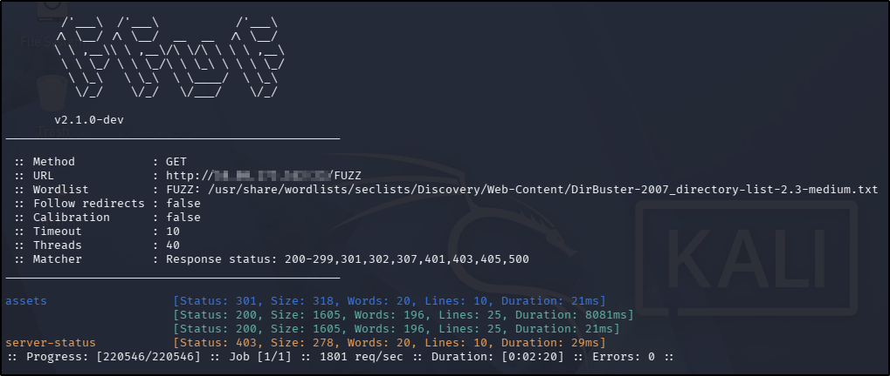  
There were no `robots.txt` or `sitemap.xml` file, but there was a hidden endpoint and something encoded disclosed in the source code:  
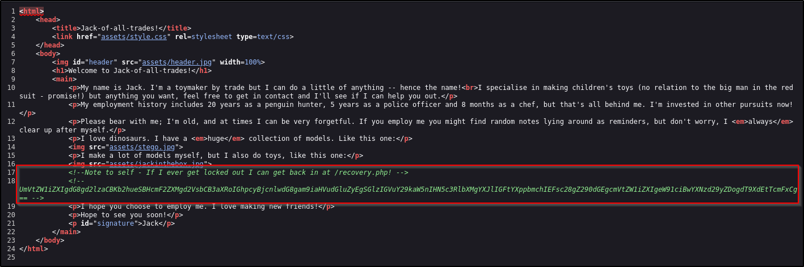  
The picture of the stegosaurus also drew my attention because of the linguistic association with "steganography" so I downloaded it for possible further analysis.  
I used `searchsploit` to look for published vulnerabilities for the services listed in the `nmap` results but this yielded no interesting results.

## Foothold
The `=` signs at the end of the encoded string strongly suggested it was base64 encoded, so I fed it to `base64` to find a password:  
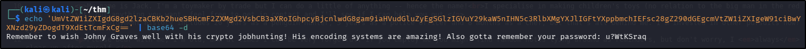  
Without a username (though I could potentially have reasonably assumed, given the web page contents, that the name "Jack" might have been involved), I used the discovered password with `steghide` to see if my suspicious about that random dinosaur image was correct. Turns out I was:  
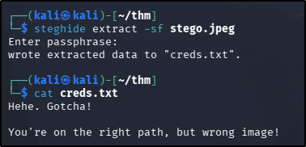  
There were two other images being hosted on the web page - `jackinthebox.jpg` and `header.jpg`. I tried downloading the former and using `steghide` to extract any hidden data (with and without the discovered password) but this was unsuccessful. I had better luck with `header.jpg`:  
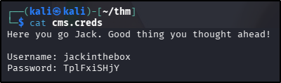  
I navigated to the discovered endpoint (`/recovery.php`) and used the credentials to login with.  
**Note**: there was another encoded string hidden in the source code for this page (base32 > hex > ROT13), but all this decoded to was a note to "Jack" about where to find the credentials to login with.
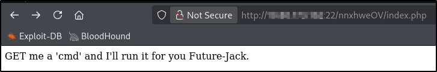  
The content of the page suggests that there is a `cmd` prompt incorporated into the PHP for this page, usually accessed via a parameter, so I appended `?cmd=whoami` to the end of the URL as a POC, which was successful:  
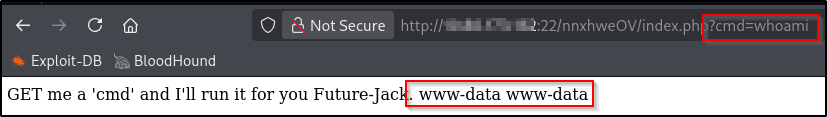  
Thinking this might be the way to get the user flag, I used this web shell to enumerate the `/home` directory and found something else interesting:  
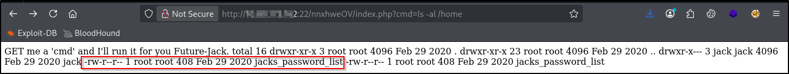  
I went on to read the contents of `jacks_password_list`:  
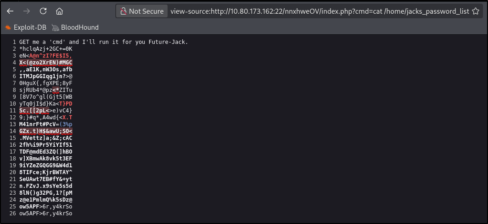  
**Note**: the output from the web shell displays in a more human-readable format if you view the page source rather than the rendered page!  
I copied all those passwords into word list and passed that to `hydra` knowing that the username on the target machine was `jack` (from the `/home` directory enumeration) and got a hit:  
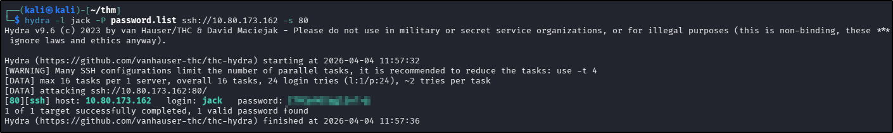  
Using the discovered credentials, I logged into SSH as `jack` (remembering to use the `-P` switch to set the port) and set about looking for a flag. There was no `user.txt` in the `/home` directory for `jack` as would usually be expected but there was a `user.jpg`, which I downloaded to my attacking machine using `scp`. Opening the downloaded file gave me the user flag I was looking for:  
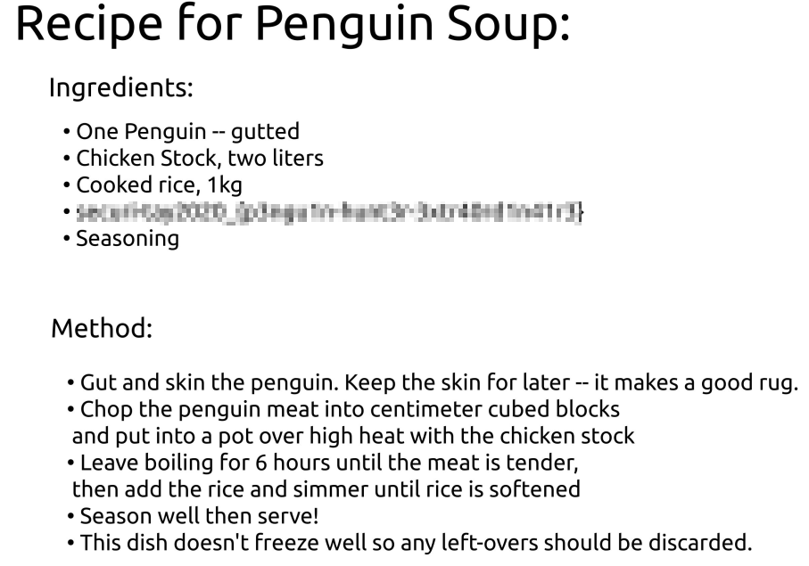  
??? success "User Flag"
	securi-tay2020_{p3ngu1n-hunt3r-3xtr40rd1n41r3}

## Privilege Escalation
The first thing I try after getting an interactive shell as a low-level user is to look at `sudo` rights, but that didn't yield anything. Next up I like to search for SUID binaries and got a hit:  
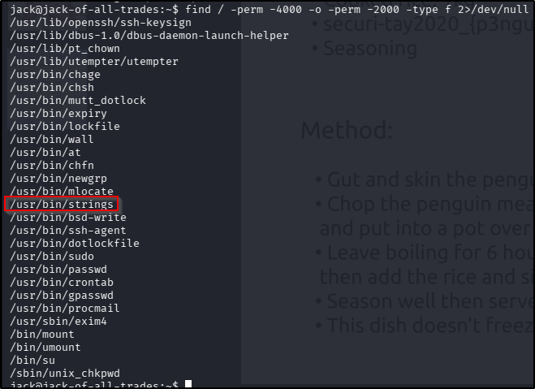  
Having the SUID bit set of the `strings` binary which, as a builtin binary, should be owned by `root`, meant that I should be able to use to read strings from any file on the operating system. In the case of pure text files, this amounts to reading the whole contents of the file. Taking a punt on the file name, I tried to read the file at `/root/root.txt` got me the root flag:  
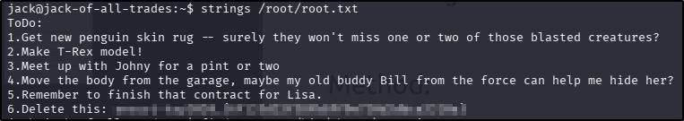  
??? success "Root Flag"
	securi-tay2020_{6f125d32f38fb8ff9e720d2dbce2210a}

**Tools Used**  
`base64` `steghide` `hydra` `scp`

**Date completed:** 04/04/26  
**Date published:** 04/04/26