---
tags:
  - tryhackme
  - challenge
  - easy
  - offensive
  - web
  - linux
  - enumeration
  - steganography
  - brute-force
  - sudo-abuse
---

# Lian_Yu
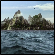

**Platform:** TryHackMe  
**Type:** Challenge  
**Difficulty:** Easy  
**Link:** [Lian_Yu](https://tryhackme.com/room/lianyu)  

## Description
"A beginner level security challenge

Welcome to Lian_YU, this Arrowverse themed beginner CTF box! Capture the flags and have fun."

## Enumeration
I generated a list of open ports for more comprehensive enumeration with the following:  
`ports=$(nmap -p- --min-rate=1000 TARGET_IP_ADDRESS | grep ^[0-9] | cut -d '/' -f 1 | tr '\n' ',' | sed s/,$//)`  
This revealed the following open ports:  

* 21  
* 22  
* 80  
* 111  
* 46233  

I ran a full `nmap` scan to query the services for version information, as well as querying the target system for OS information with `nmap -p$ports -A -T4 TARGET_IP_ADDRESS`, which revealed the following:  
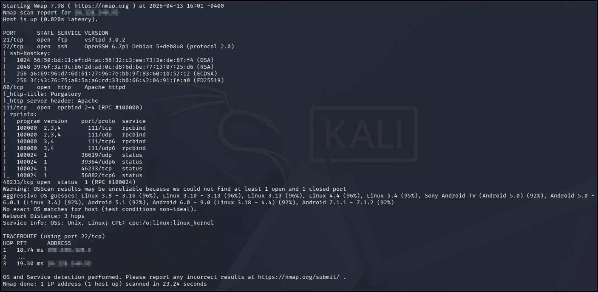  
I used my go-to `ffuf` command to enumerate the website (`ffuf -u http://TARGET_IP_ADDRESS/FUZZ -w /usr/share/wordlists/seclists/Discovery/Web-Content/DirBuster-2007_directory-list-2.3-medium.txt -ic -c`) as a quick directory discovery, whilst also running my standard `gobuster` command (`gobuster dir -u TARGET_IP_ADDRESS -w /usr/share/wordlists/seclists/Discovery/Web-Content/DirBuster-2007_directory-list-2.3-medium.txt -x php,html,txt`) to probe a bit more thoroughly, looking for files as well.  
Whilst waiting for the scans to complete, I navigated to the web page in a browser. The page itself was static, with a bit of background about the DC-verse that the CTF is themed around. There were no `robots.txt` or `sitemap.xml` files, and nothing interesting in the source code.  
With no credentials for the `ftp` service, and no promising leads from the `searchsploit` searches I ran for the versions discovered in the `nmap` scan, further web application enumeration was the most likely intended pathway. Checking the `ffuf` scan revealed a web directory:  
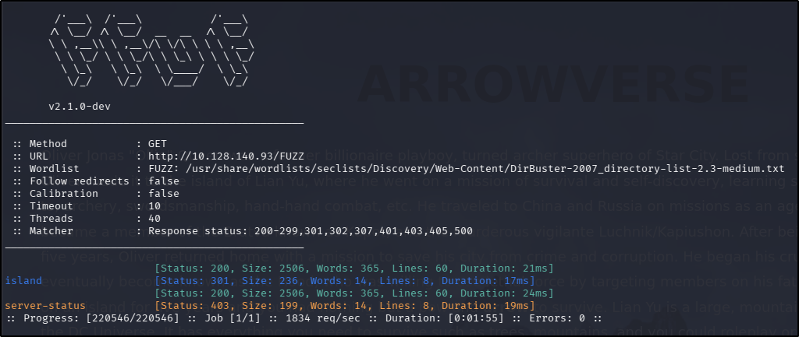  
Navigating to it in the web browser reveals an intriguing message; the source code had more information:  
  
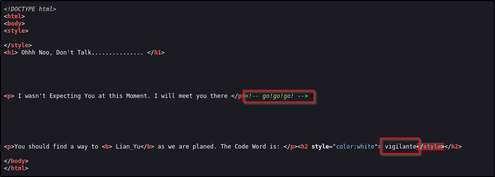  
With `gobuster` failing to reveal anything additional, I ran a further `ffuf` scan using the `/island` directory as the base and found another directory:  
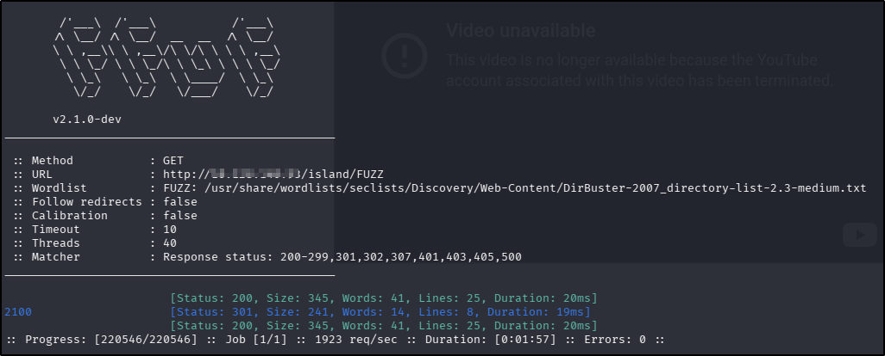  
??? success "What is the Web Directory you found?"
	2100
Looking at the source code for the newly discovered web directory provided another clue for further enumeration:  
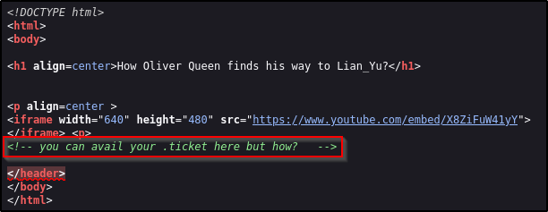  
Using the ".ticket" part of the comment as a possible file extension to look for, I expanded out my `ffuf` command:  
```
ffuf -u http://TARGET_IP_ADDRESS/island/2100/FUZZ.ticket -w /usr/share/wordlists/seclists/Discovery/Web-Content/DirBuster-2007_directory-list-2.3-medium.txt -ic -c
```
This scan found another hidden file:  
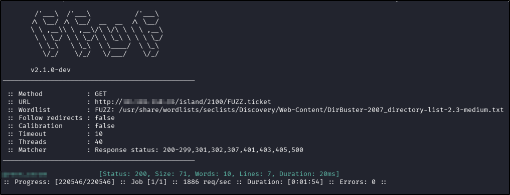  
??? success "what is the file name you found?"
	green_arrow.ticket
Navigating to the newly discovered file revealed a strange string without a lot of context:  
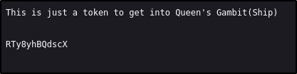  
With no encoding scheme being immediately obvious, I used the [dCode Cipher Identifier](https://www.dcode.fr/cipher-identifier), which suggested base58 as the most likely encoding, which proved to be correct:  
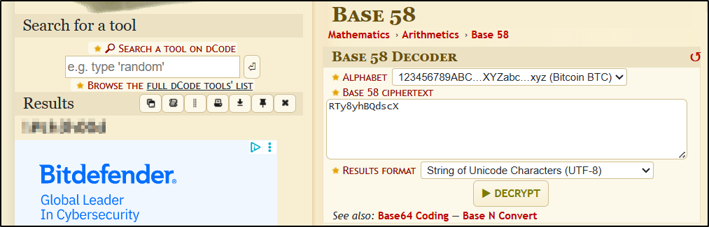  
??? success "what is the FTP Password?"
	!#th3h00d

## Foothold
Knowing I had the FTP password, I was left wondering what the username was to go with it but then I remembered the "code word" I had discovered in the `/island` source code earlier. Trying this as a credential pair was successful:  
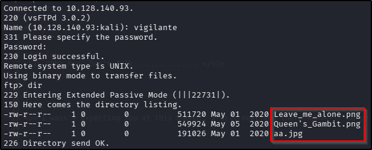  
After downloading all three of the files available, I used `exiftool` and `strings` on them to see if there was any hidden text but this was unsuccessful. I tried using `steghide` on the only one of the files in a supporting format ("aa.jpg") but this was also unsuccessful so I decided to try brute-forcing with `stegcracker`, which was successful:  
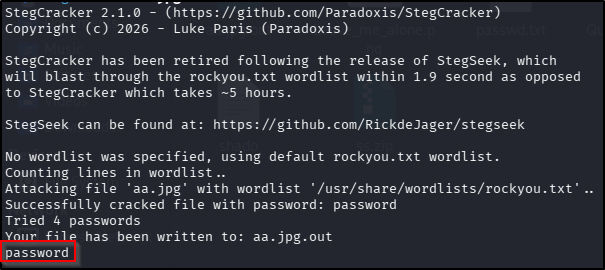  
From here, `steghide` was able to extract a file from `aa.jpg` called "ss.zip", which in turn could be decompressed without a password, and provided two files with useful information:  
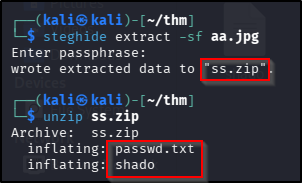  
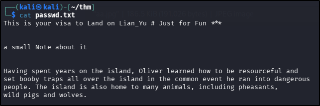  
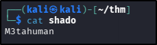  
??? success "what is the file name with SSH password?"
	shado
I tried using the newly discovered password to SSH with my existing user but this was not successful. With no other information provided in the two downloaded files, I returned to the FTP server to see if there were any hidden files in the share:  
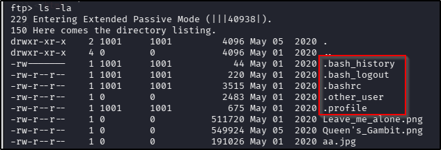  
I downloaded the two hidden files and took a look at their contents:  
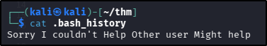  
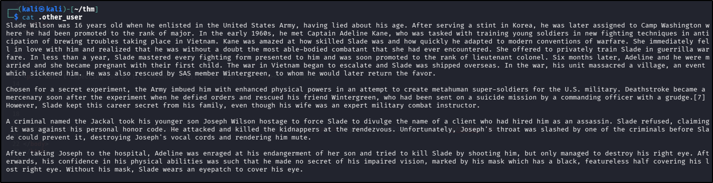  
So with nothing obvious in either of those files, I decided to make a list of possible usernames found in the `.other_user` file so I could pass it to `hydra`:  
```
slade
sladewilson
wilson
adeline
adelinekane
kane
wintergreen
deathstroke
jackal
joseph
josephwilson
```
I found the successful credential pair with the following `hydra` command:  
`hydra -L users.lst -p M3tahuman ssh://TARGET_IP_ADDRESS`
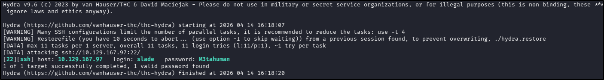  
With a valid set of credentials, I was able to SSH to the target and get the user flag:  
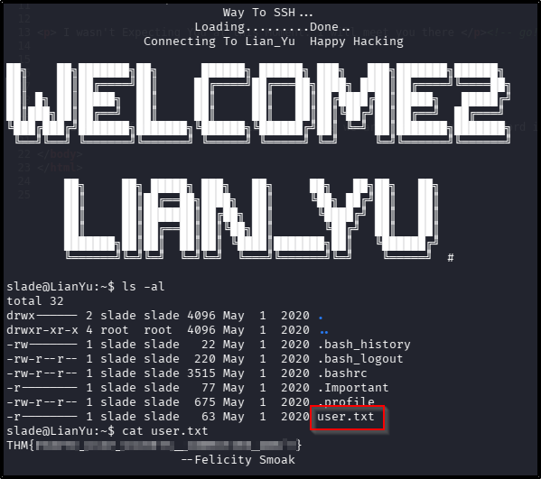  
??? success "user.txt"
	THM{P30P7E_K33P_53CRET5__C0MPUT3R5_D0N'T}

## Privilege Escalation
The first thing I always do whenever I get interactive access as a low-level user is to check `sudo` rights and got a result on this occasion:  
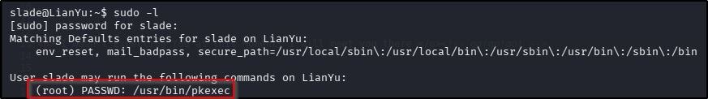  
Using the documentation from [GTFObins](https://gtfobins.org/gtfobins/pkexec/) I escalated my privileges to root with the `pkexec` binary, and finally got the root flag:  
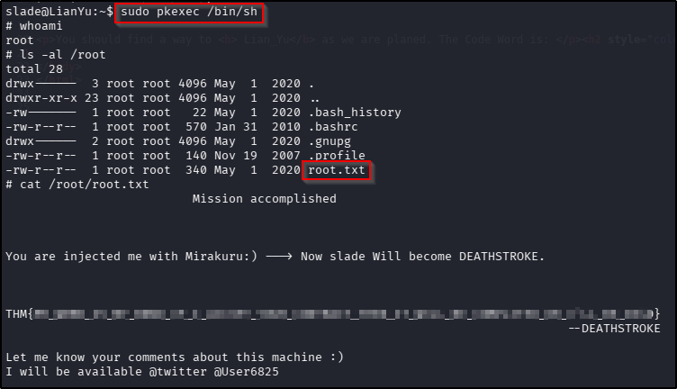  
??? success "root.txt"
	THM{MY_W0RD_I5_MY_B0ND_IF_I_ACC3PT_YOUR_CONTRACT_THEN_IT_WILL_BE_COMPL3TED_OR_I'LL_BE_D34D}

**Tools Used**  
`ffuf` `stegcracker` `steghide` `hydra`

**Date completed:** 14/04/26  
**Date published:** 14/04/26