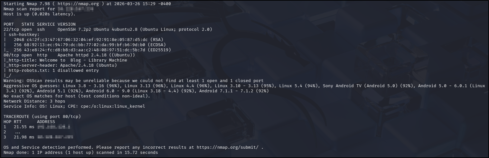
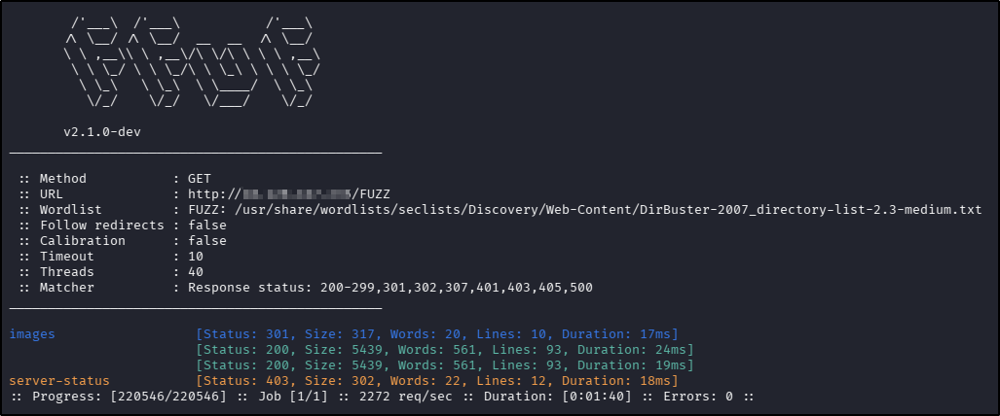
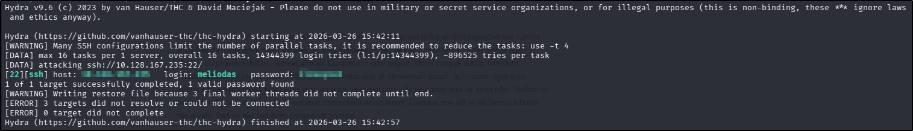
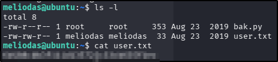
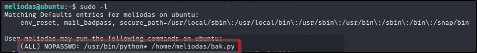
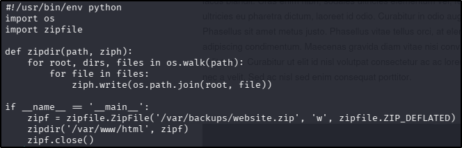
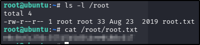

---
tags:
  - tryhackme
  - challenge
  - easy
  - offensive
  - linux
  - web
  - boot2root
  - brute-forcing
  - sudo-abuse
  - python-import-hijacking
---

# Library

**Platform:** TryHackMe  
**Type:** Challenge  
**Difficulty:** Easy  
**Link:** [Library](https://tryhackme.com/room/bsidesgtlibrary)

## Description
"boot2root machine for FIT and bsides guatemala CTF"

## Initial Enumeration
I generated a list of open ports for more comprehensive enumeration with the following:  
`ports=$(nmap -p- --min-rate=1000 TARGET_IP_ADDRESS | grep ^[0-9] | cut -d '/' -f 1 | tr '\n' ',' | sed s/,$//)`  
This revealed the following open ports:  

* 22
* 80

I ran a full `nmap` scan to query the services for version information, as well as querying the target system for OS information with `nmap -p$ports -A -T4 TARGET_IP_ADDRESS`, which revealed the following:  
  

I used my go-to `ffuf` command to enumerate the website:  
`ffuf -u http://TARGET_IP_ADDRESS/FUZZ -w /usr/share/wordlists/seclists/Discovery/Web-Content/DirBuster-2007_directory-list-2.3-medium.txt -ic -c`  
  

Nothing too interesting in the `ffuf` scan results.  There was a `robots.txt` file: the only entry in it was for the root directory but only for a fictional user-agent of "rockyou". There was no `sitemap.xml` and nothing interesting in the source code.

Looking at the home page for the web application, I noted a comment form at the bottom of the page, presenting the possibility for some XSS. It was also possible to navigate to the `/images` endpoint discovered in the `ffuf` scan, which made me think that a directory traversal attack might be possible. There were links provided for other areas of the web page, but none of them were functional. Finally, there were a number of usernames shown in blog entries and comments on the page that I could use for brute forcing on the SSH service.

Searching for vulnerabilities for the two service versions from the `nmap` scan with `searchsploit` failed to return any meaningful results.

## Foothold
Attempting to use a test XSS payload with the comments form was unsuccessful - in fact it did not appear that the comments form was functional (whilst the input was accepted without error, no input, even test text, was rendered on the page).  
Attempting a directory traversal attack from the `/images` endpoint was also unsuccessful as all the "`../`" entries from my URL were removed before rendering the page.  
That left me with the SSH brute forcing. Of the usernames included on the page, "meliodas" was the only non-standard user mentioned, so I attempted a brute force with that username and `hydra`:
`hydra -l meliodas -P /usr/share/wordlists/rockyou.txt ssh://<targetAddress>`  
It wasn't long before I got a hit:  
  

With that, I was able to SSH into the target, where finding and reading the `user.txt` flag was trivial:  
  
??? success "user.txt"
	6d488cbb3f111d135722c33cb635f4ec

## Privilege Escalation
Given as I have full SSH access with the `meliodas` user, it seemed shameful not to take advantage of getting `linpeas` onto the target machine with `scp`. The results highlighted a potential privilege escalation pathway with a `sudo` entry for my user:  
  

Alright, that's a good start. I can execute any version of `python` but only when combined with the `bak.py` script found in the `meliodas` user home directory. I had clocked it earlier when I was on the hunt for the user flag, and I know I can read the contents but not write them. I decided to look into the contents of the script file to investigate other ways to escalate privileges with this script:  
  

Well, this is good news - those import statements at the top of the script might be hijackable. Similar to the `PATH` in the Linux OS, `python` has an order of priority for locations when importing external libraries, the top of which is the current working directory, which means if we can write our own custom library and save it in the same directory where the script is executed from, the script will load it instead of the intended file. Given that the `os` library incorporates a wide variety of functions, and that it's referred to in the defined function in the script, I chose to create a custom version of the `zipfile` library to avoid a greater chance of script errors. As a test, I decided to try a really simple function to launch a shell (in theory providing `root` access because the command should execute with `sudo` rights). As a forward plan, I figured if the simple library I created didn't work, I could copy the "genuine" file and append a  line to the end of it, maintaining the functionality of the library file. I created the custom library with the following line of code:  
`echo 'import os; os.system("/bin/bash")' > zipfile.py`  
I ran the script as `sudo` and found that a more covert approach wouldn't be required - I got a `root` shell immediately. From there, finding and reading the `root.txt` flag was trivial:  
  
??? success "root.txt"
	e8c8c6c256c35515d1d344ee0488c617

**Tools Used**  
`hydra` `scp` `linpeas`

**Date completed:** 26/03/26  
**Date published:** 26/03/26