---
tags:
  - tryhackme
  - ctf
  - hard
  - web
  - sandbox-escape
  - lfi
---

# Chains of Love

**Platform:** TryHackMe  
**Type:** CTF  
**Difficulty:** Hard  
**Link:** [Love at First Breach 2026 - Advanced Track](https://tryhackme.com/room/lafbctf2026-advanced) (Task 5)

## Description
"NovaDev Solutions is a software development house known for building secure enterprise platforms for clients across multiple countries and industries. Recently, NovaDev Solutions rolled out a new customer interaction feature on their website to improve communication between clients and developers.

Shortly after deployment, NovaDev began experiencing unusual traffic patterns and minor service disruptions. Internal developers suspect that something in the latest udpate may have exposed more than intended."

## Enumeration
I generated a list of open ports for more comprehensive enumeration with the following:  
`ports=$(nmap -p- --min-rate=1000 TARGET_IP_ADDRESS | grep ^[0-9] | cut -d '/' -f 1 | tr '\n' ',' | sed s/,$//)`  
This revealed the following open ports:  

* 22
*  80

I ran a full `nmap` scan to query the services for version information, as well as querying the target system for OS information with `nmap -p$ports -A TARGET_IP_ADDRESS`, which revealed the following:  
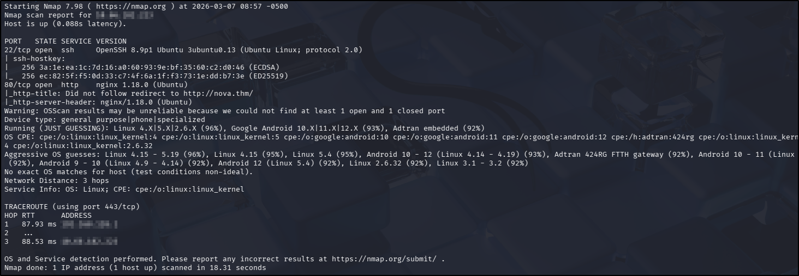  

Seeing a domain in the `nmap` results, I added `nova.thm` to my `/etc/hosts` file and used my go-to `ffuf` command to enumerate the website:  
`ffuf -u http://TARGET_ADDRESS/FUZZ -w /usr/share/wordlists/seclists/Discovery/Web-Content/DirBuster-2007_directory-list-2.3-medium.txt -ic -c`

Nothing much of interest here - there is an `admin` portal, but with no credentials at this point, that's not much use on its own:  
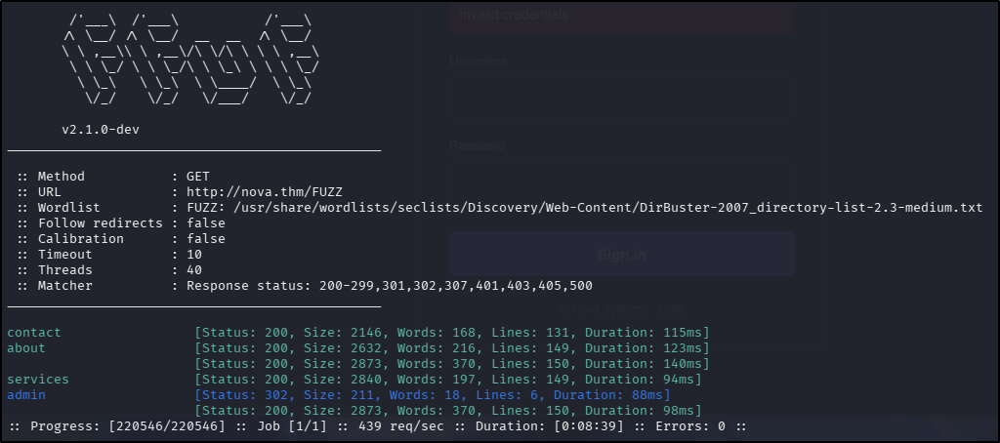  

Given I have a domain name, I tried a zone transfer with `dig axfr nova.thm` but that failed. I then tried a subdomain fuzz with `gobuster` but that started errors very early in the process, so I moved to vhost enumeration instead, but this didn't get me anything new either.

There was no useful source code on the home page and no `robots.txt` or `sitemap.xml` files. Navigating to the `contact` page generated a form, which when completed output the contents of the submitted message to the screen. As such I tried a standard XSS payload (``) but this was simply rendered as plaintext on the resulting page.

Navigating to the `admin` page discovered by `ffuf` revealed a login page and the error message received did not change when entering multiple different users, so this did not appear to be a viable way to enumerate usernames either. The source code for this page did yield something potentially interesting:  
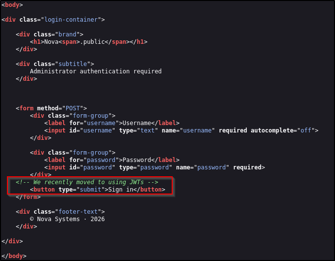  

Unfortunately, with no idea of the contents or format of the JWT, this is not helpful at this stage. What I did notice was that the login page that I had landed on was actually a redirect from `admin` to `admin/login`, with this I reran `ffuf` on the `admin` directory:  
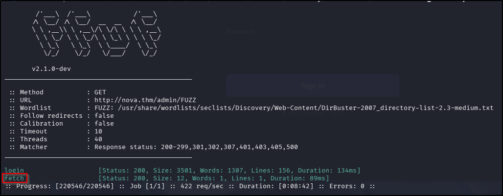  

Great, that's a new endpoint to look at: `fetch`. Unfortunately, navigating to it simply reveals a page with the plaintext word "Unauthorized".

Moving forward into researching vulnerabilities for service versions, initial leads into the `nginx` version seemed promising given its age. Publicly available exploits were thin on the ground though, forcing me to consider other options. Given the title of the `admin` page ("nova.public"), I considered that this might be a service of some sort - a quick Google revealed it might be a web framework (Laravel Nova) with little in the way of vulnerabilities. Without the version number, this didn't seem a high priority to pursue. Given my lack of anything concrete with vulnerability research, I ran an `nmap` vuln scan, which generated the following result:  
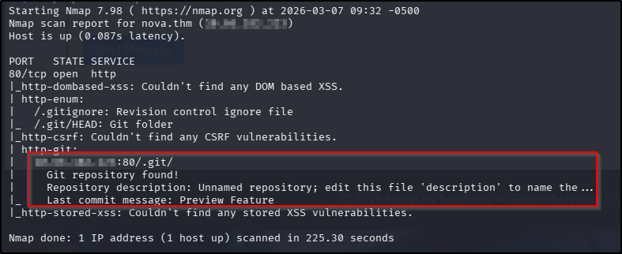  

Unfortunately, attempting to navigate to this page results in a redirect, using `curl` shows that this is a permanent redirect, and attempts to clone the directory with `git clone` failed, so that feels like another dead end. But wait! I have had something very similar in a previous CTF with a "hidden" `.git` directory, and I remember thinking at the time that it was strange my initial `ffuf` scanning hadn't uncovered it. The answer is simple - `.git` was not an entry in the dictionary file I used for my initial scanning. It is, however, in a very small file in the SecLists repo, called `common.txt`. With this, I decided to rerun the initial scan, using this dictionary file and got some new information:  
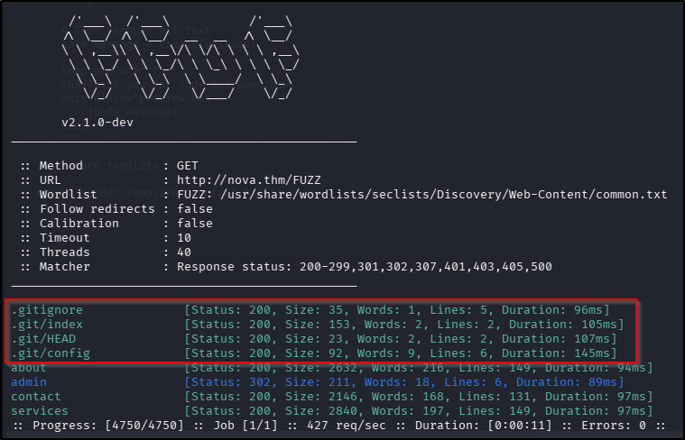  

Nice! Navigating to each of those files in a browser automatically downloaded them to my attack box. Inspecting the contents of each revealed the following information in the `.gitignore` file:  
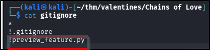  

Interesting indeed, considering the original brief for this challenge! Navigating to the page in the browser showed me the script contents:  
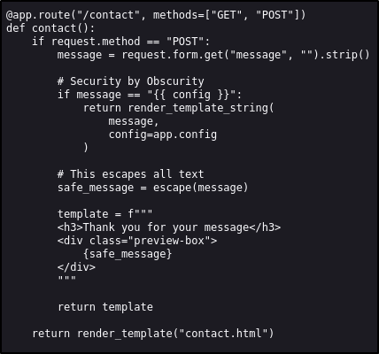  

Oh now this looks useful! It would appear that if I submit the message "{{ config }}" on the `contact` page, the web application will return the actual application configuration to me. Let's give it a go:  
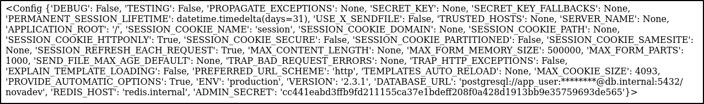  

Alright, nice! It doesn't however give me an awful lot of information I can work with immediately. What I can do from here though is run a new `ffuf` scan - the existence of the `preview_feature.py` file suggests there might be other `.py` files present on the server. Looks like my luck is in:  
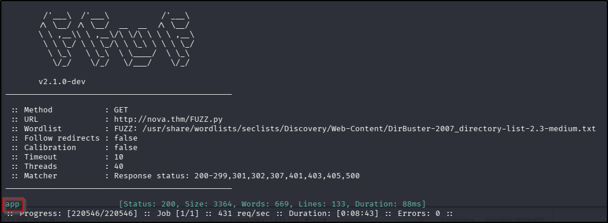

## Foothold
Navigating directly to the `app.py` file in a broswer reveals the working code for the web application, including some hard-coded credentials:  
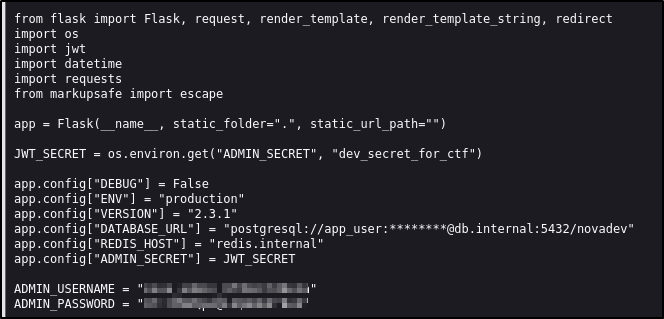  

Wow, all of that enumeration to find hard-coded credentials? Alright. Let's go use them. 

## Actions on Objectives
Logging in with those credentials at the `admin` page generates a page with an apparent API/endpoint checker (which directs to that `fetch` endpoint). As per the `app.py` file, attempting to include any numbers in this query (and that's ANY, as a host or as a port) results in a customised error:  
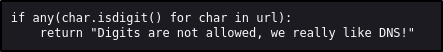  

The function does appear to work though, because using `nova.thm` as an alternative to `127.0.0.1` does generate the home page - the destination is URL encoded with the `page` query to the `fetch` endpoint. So from here it appears we're in the realm of guesswork - I found no evidence of any other endpoints in the `app.py` file, source code, or the config information that was returned. After a couple of attempts at fetching something like `/debug` or `/internal`, it occurred to me that the placeholder text clearly shows an `internal` *pre*fix, rather than a suffix so on a whim I tried `internal.nova.thm`. Whim or not, it was successful:  
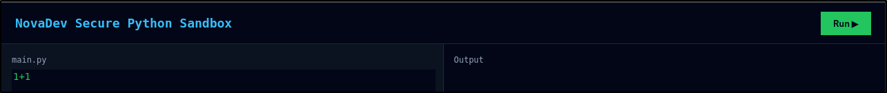  

I tried adding that new host to my `/etc/hosts` file but navigating directly to it resulted in a `403` error, so it appears the only way to reach it is from the host itself.

My first interaction with this new endpoint was to simply click the "Run" button to see what it did. I was glad I did because it actually revealed some unexpected behaviour:  
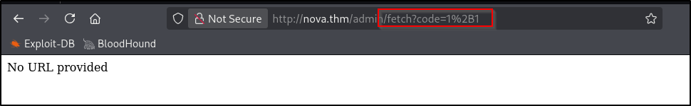  

So effectively, somewhere in the API control flow, the full URL has been stripped away, causing it to error because it doesn't think a URL has been provided. We can work around this by crafting the URL and trying to navigate to it directly, but this brings us right back around to that delightful app feature that won't accept digits.

The next step for me was to try executing some Python code other than basic arithmetic, which by its very nature will always require digits. I changed the URL to `http://nova.thm/admin/fetch?url=http%3A%2F%2Finternal.nova.thm/?code=print('HelloWorld')`. That was successful in that the page the app "fetched" was the Sandbox but the Python code itself did not execute - the output pane was blank.

Hmm, strange. I decided to try something other than a `print` statement, using `open` to try to open `/etc/passwd` instead. Given that web apps are often in `/var/www/html` (on Linux machines), I tweaked my URL to `http://nova.thm/admin/fetch?url=http%3A%2F%2Finternal.nova.thm/?code=read(open('../../../etc/passwd'))` but got an error in the Python console:  
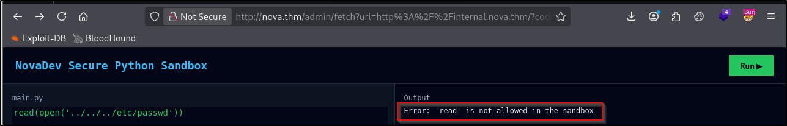  

As an alternative to `read`, we can use the builtin `next` function, which acts as an iterator of objects. Effectively, if used with a file object, the first time it is called it will retrieve the first line of the file. Changing my URL to `http://nova.thm/admin/fetch?url=http%3A%2F%2Finternal.nova.thm/?code=next(open('../../../etc/passwd'))` proved successful:  
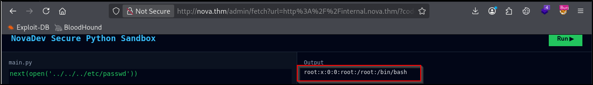  

OK, great, we can retrieve the first line of any file on the system, meaning from here we could simply retrieve the contents of the flag file - no need for a "proper" foothold in the system or any sort of privilege escalation or lateral movement. Two problems with that:  

* I didn't know what the flag file is called.
* I didn't know where the flag file was saved.

With no ability to enumerate the file system, this felt like sort of a dead end. But this is a CTF so I went back to the challenge to see what the question and brief actually said.  
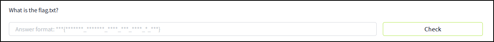  

Well that's great - the question gave me the answer to the first of those two problems! So that just left the problem of the file's location. Looking again at the challenge brief, the last line talks about exposing something more than had been intended which got me wondering: what if the flag is just in the root directory of the web app? It's another guess, but it's worth a shot. and if it didn't work, I could try working my way out to the root directory (especially now I know how deep I am in the file system thanks to `/etc/passwd`) and try a couple of known directories. If that didn't work, I could have another think. So, I changed the URL to `http://nova.thm/admin/fetch?url=http%3A%2F%2Finternal.nova.thm/?code=next(open('flag.txt'))` and bingo!
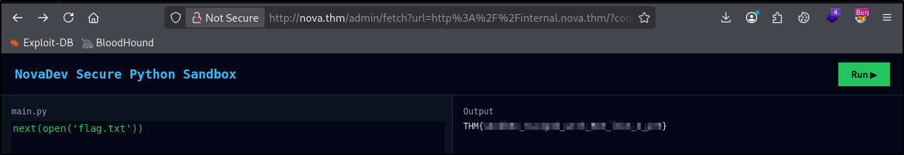  
??? success "What is the flag.txt?"
	THM{s4ndb0x_3sc4p3d_w1th_RCE_l1k3_4_pr0}

**Tools Used**  
`ffuf`

**Date completed:** 07/03/26  
**Date published:** 07/03/26