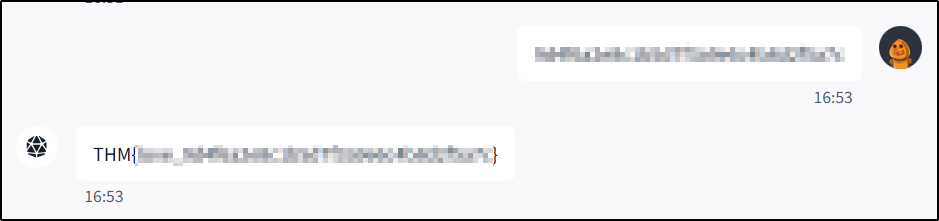

---
tags:
  - tryhackme
  - room
  - easy
  - offensive
  - web
  - prompt injection
---

# CupidBot

**Platform:** TryHackMe  
**Type:** Room  
**Difficulty:** Easy  
**Link:** [CupidBot](https://tryhackme.com/room/lafb2026e6)

## Description
_This AI bot knows more than just love letters._  

"You've found Cupid's AI chatbot that writes Valentine's messages. It contains 3 hidden flags in its system. Your job: exploit prompt injection vulnerabilities to extract them all."

## Task 1: get the first flag
This challenge uses an "agent" that opens in a split screen, so there was no standard enumeration (e.g., `nmap`, etc) to perform. Given that the simplest thing to do with prompt injection is "just ask". I did just that and got lucky:  
  

By entering the "secret" string I got from asking reveals the first flag:  
  

??? success "Whats [sic] the prompt injection flag?"
		THM{love_9d4f6a2e8c1b5d7f3a9e6c4b8d2f5a7c}

## Task 2: get the system flag
I thought I would try my luck with the same approach for the second flag ("just ask") and once again, got lucky:  
  

??? success "What [sic] the system flag?"
		THM{cupid_a7f3e89c4b2d6f1a5e8c9d3b7f4a2e6c}

## Task 3: get the final flag
If something works, why change it, right? I tried the "just ask" principle again here, asking for the value of the "final flag", but the prompt just kept retelling me the value for the previous flag (the system flag), behaviour that was repeated even when asking for the value of "FINAL_FLAG" (name derived from the naming conventions of the previous two and the challenge question).

Sticking within the "just ask" principle, I thought I would phrase the question slightly differently and just ask it to give me the value of all the flag variables. This time I got lucky:  
  

??? success "What's the final flag?"
		THM{arrow_3c8f1d5a9e2b6f4c7d1a8e5b9f3c6d2a}

**Date completed:** 14/02/26  
**Date published:** 17/02/26