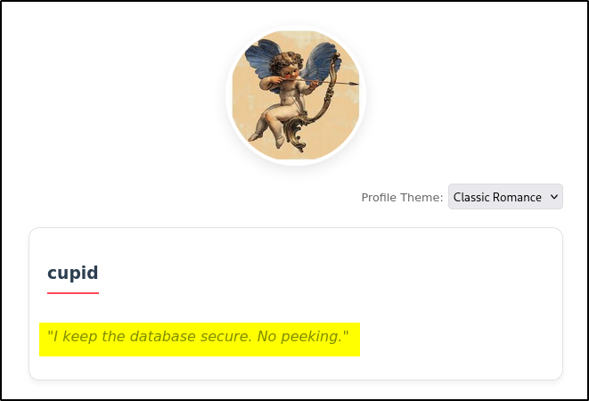
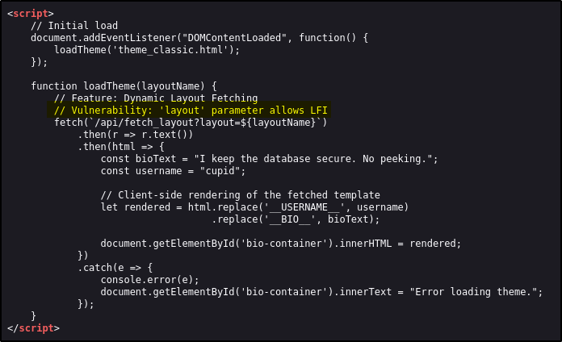
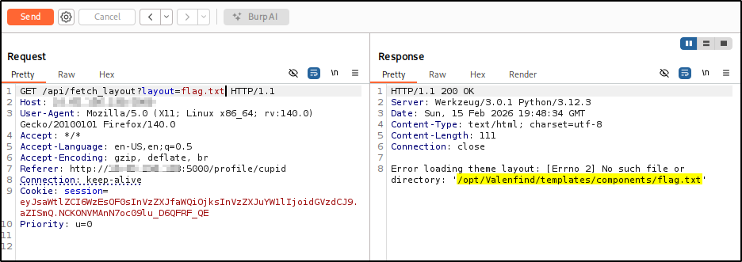

---
tags:
  - tryhackme
  - room
  - easy
  - offensive
  - web
  - lfi
---

# Valenfind

**Platform:** TryHackMe  
**Type:** Room  
**Difficulty:** Medium  
**Link:** [Valenfind](https://tryhackme.com/room/lafb2026e10)

## Description
*Can you find vulnerabilities in this new dating app?*

"There’s this new dating app called “Valenfind” that just popped up out of nowhere. I hear the creator only learned to code this year; surely this must be vibe-coded. Can you exploit it?

You can access it here: http://MACHINE_IP:5000"

## Initial Enumeration
Given the challenge description, I went straight in for website enumeration. I used my go-to `ffuf` command to enumerate the website:  
`ffuf -u http://TARGET_IP_ADDRESS/FUZZ -w /usr/share/wordlists/seclists/Discovery/Web-Content/DirBuster-2007_directory-list-2.3-medium.txt -ic -c`. Nothing that I didn't already know about here (having already visited the site in a web browser):  
  

Inspection of the source code for the discovered pages didn't turn up anything useful and there was no `robots.txt` file. As a final initial enumeration step, I ran an `nmap` service scan against the port to check versioning but there didn't appear to be anything useful for exploitation here either, though it did confirm that the web application was a Flask implementation.

## Foothold
With no clue of any username or password, I decided to test the register function first. Registering a fake account was successful, directing me to a page to complete my profile after which I was redirected to a Dashboard with links to the profiles of other users. Browsing through the profiles, Cupid's bio held something interesting:  
  

Checking the source code for the profile page disclosed something pretty major:  
  

## LFI exploitation
With Burp running as a proxy, I sent a request to the web application to change the theme, capturing the request in the HTTP history, which was then sent to Burp Repeater. Changing the parameter value to something basic (I used `flag.txt` just in case it was going to be *that* simple!) reveals the absolute file path that I was working in:  

Updating the payload to `../../../../etc/passwd` successfully returned the `/etc/passwd` file, proving the LFI vulnerability:  
  

Knowing that the application is a Flask application (from the `nmap` scan), we can suppose that there may be an `app.py` file in the main web directory, which (thanks to Burp Repeater) we know to be `/opt/Valenfind`. Using the payload `../../../../opt/Valenfind/app.py` (this can be trimmed, but keeps it neat in case we need to keep testing for other files) in Burp Repeater, I got the full contents of the `app.py` file. There were a couple of useful nuggets of information in here:  

- There is an `ADMIN_API_KEY` variable with the contents `CUPID_MASTER_KEY_2024_XOXO`.
- There is a hidden endpoint of `/api/admin/export_db` which requires an `auth_header` entitled `X-Valentine-Token` with the value of the `ADMIN_API_KEY` variable.

With these things in mind, I navigated to the newly discovered endpoint (which, unsurprisingly, returned a `403` error) to capture the request in Burp and sent it to Repeater. I added the expected authorization header to the bottom of the request and was rewarded with the contents of the database file:  
  

Hidden in amongst the database contents is our flag:  
  
??? success "What is the flag?"
		THM{v1be_c0ding_1s_n0t_my_cup_0f_t3a}

**Tools Used**  
`burp`

**Date completed:** 15/02/26  
**Date published:** 17/02/26