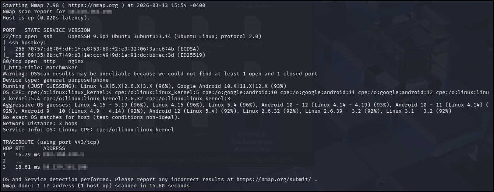
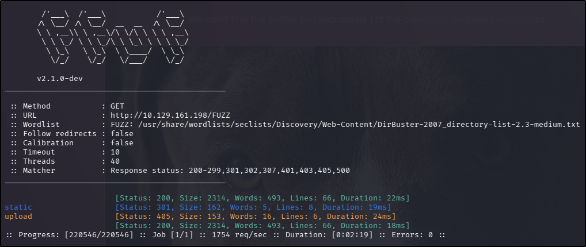

---
tags:
  - tryhackme
  - ctf
  - medium
  - web
  - hash-collision
---

# When Hearts Collide

**Platform:** TryHackMe  
**Type:** Room  
**Difficulty:** Medium  
**Link:** [When Hearts Collide](https://tryhackme.com/room/lafb2026e1)

## Description
"Matchmaker is a playful, hash-powered experience that pairs you with your ideal dog by comparing MD5 fingerprints. Upload a photo, let the hash chemistry do its thing, and watch the site reveal whether your vibe already matches one of our curated pups. The algorithm is completely transparent, making every match feel like a wink from fate instead of random swipes.

Come get your dog today!"

## Initial Enumeration
I generated a list of open ports for more comprehensive enumeration with the following:  
`ports=$(nmap -p- --min-rate=1000 TARGET_IP_ADDRESS | grep ^[0-9] | cut -d '/' -f 1 | tr '\n' ',' | sed s/,$//)`  
This revealed the following open ports:  

* 22
* 80

I ran a full `nmap` scan to query the services for version information, as well as querying the target system for OS information with `nmap -p$ports -A -T4 TARGET_IP_ADDRESS`, which revealed the following:  
  

I used my go-to `ffuf` command to enumerate the website:  
`ffuf -u http://TARGET_IP_ADDRESS/FUZZ -w /usr/share/wordlists/seclists/Discovery/Web-Content/DirBuster-2007_directory-list-2.3-medium.txt -ic -c`  
Nothing hugely interesting in the results (there's an `/uploads` page but it clearly doesn't accept `GET` requests):  
  

There were no `robots.txt` or `sitemap.xml` files, and nothing interesting in the source code. There was a custom `404` page with a picture of a dog on it. Looking at the source code for this page revealed a subdirectory at `/static/uploads` but directory traversal on it was disabled. The file itself appeared random - but it did confirm the existence of one picture on the endpoint. If the description is to be believed - that I need to submit a photo with a hash value that's the same as one of the dogs on the site - this might end up being useful. I saved the file to my attacker machine for the moment and continued my enumeration.

## Exploitation
I tried uploading the same photo I had found on the `404` page and got a message back on the web page that that photo was already present on the application.  

Appending a single character to the end of the existing file from the web page and reuploading it was successful but the application continued to report that there was no match.

Uploading an arbitrary photo using the function on the home page proved my theory about the file name being random. The web page reported that there was no match (unsurprisingly). Trying to upload this file a second time resulted in the same message as earlier - that the file is already present in the web application. This actually reveals something interesting: the files I upload were persisting on the server, so if I can find a way to produce a hash collision (where two different files have the same MD5 hash), I should be able to upload them one after the other and solve the challenge.

Having a mooch around on Google, I came across the tool [`fastcoll`](https://github.com/brimstone/fastcoll), designed to achieve this goal. Looking at the readme file on the repo, it appeared that the tool ran inside a Docker container so I pulled the container (`docker pull brimstone/fastcol`). The readme file also contained the command required to produce the files - I used the same arbitrary file I had been uploading as the input:  
`docker run --rm -it -v $PWD:/work -w /work -u $UID:$GID brimstone/fastcoll --prefixfile <inputFile> -o msg1.bin msg2.bin`

Uploading the first file immediately followed by the second (after the first "match" failed) revealed the flag:  
  
??? success "What is the flag obtained by finding your one true dog?"
	THM{hash_puppies_4_all}

**Tools Used**  
`fastcol`

**Date completed:** 13/03/26  
**Date published:** 13/03/26