---
tags:
  - tryhackme
  - challenge type
  - easy
  - offensive
  - linux
  - fuzzing
  - steganography
  - vulnerability-exploitation
---

# Madness

**Platform:** TryHackMe  
**Type:** Challenge  
**Difficulty:** Easy  
**Link:** [Madness](https://tryhackme.com/room/madness)

## Description
"Will you be consumed by Madness?"

## Enumeration
I generated a list of open ports for more comprehensive enumeration with the following:  
`ports=$(nmap -p- --min-rate=1000 TARGET_IP_ADDRESS | grep ^[0-9] | cut -d '/' -f 1 | tr '\n' ',' | sed s/,$//)`  
This revealed the following open ports:  

* 22
* 80

I ran a full `nmap` scan to query the services for version information, as well as querying the target system for OS information with `nmap -p$ports -A -T4 TARGET_IP_ADDRESS`, which revealed the following:  
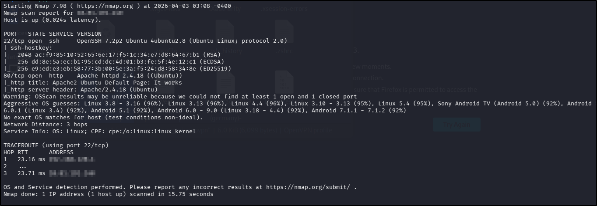  

I used my go-to `ffuf` command to enumerate the website:  
`ffuf -u http://TARGET_IP_ADDRESS/FUZZ -w /usr/share/wordlists/seclists/Discovery/Web-Content/DirBuster-2007_directory-list-2.3-medium.txt -ic -c`  
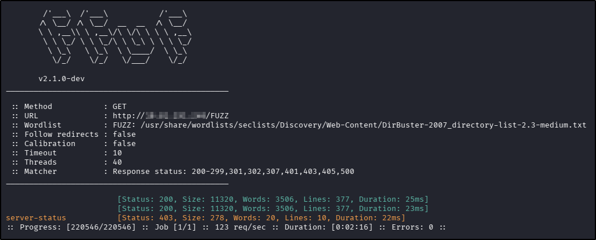  

There were no `robots.txt` or `sitemap.xml` files. Navigating to the application in a web browser revealed the default Apache page, but there was something interesting in the source code:  
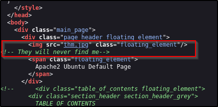  

Navigating directly to the image resulted in a rendering error from the browser but it could be downloaded using `wget`.

There were no interesting leads when searching for the relevant service versions with `searchsploit`.

## Foothold
Knowing that the downloaded image would not render correctly in its existing state, I used `file` to investigate what file type the OS was interpreting it as:  
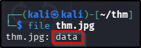  
With the OS reading this file as simple data, I decided to look at the file signature in the magic bytes with `hexeditor`:  
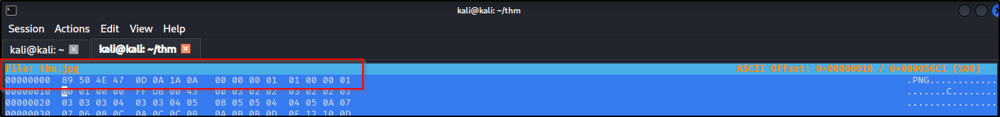  
Using the [Wikipedia page](https://en.wikipedia.org/wiki/List_of_file_signatures) as a reference, I could see that the file signature did not match the given file extension:  
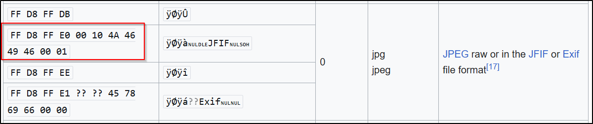
I used `hexeditor` to update the magic bytes with the appropriate hex values, saved the value, and was now able to open the picture, which revealed a secret directory on the web application:  
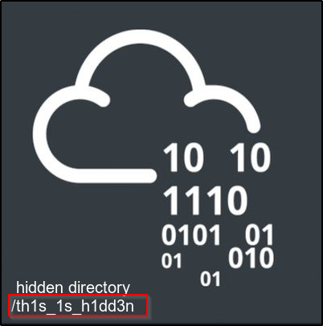  
Navigating to the newly discovered endpoint revealed a static web page:  
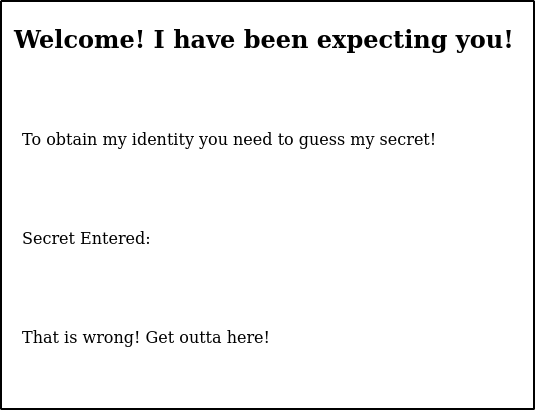  
There was something more interesting in the source code:  
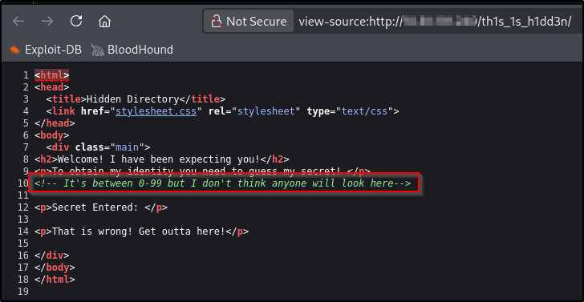  
Figuring this would be some sort of parameter or web page fuzzing, and knowing I had a fairly small pool of possibilities, I opened Burp, captured the request to the secret page and sent it to Intruder. Initially I appended `?=<value>` to the end of the URL but this didn't yield anything interesting so I changed it to `/?secret=<value>` and got one response with a different size to the rest:  
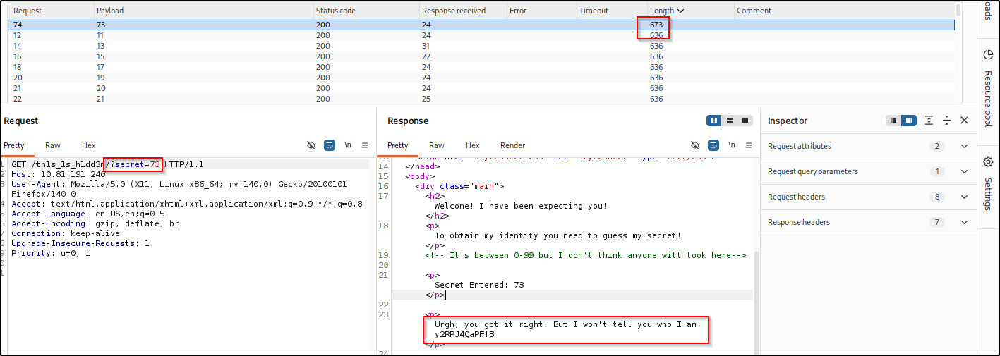  
Looking at the odd string, at first I thought it was encoded in some way but neither [CyberChef](https://gchq.github.io/) ("Magic" recipe) nor [dCode](https://www.dcode.fr/cipher-identifier) could identify it. With no entry points in the web application, there wasn't anywhere for me to input it, but I did still have the downloaded image file, and now that I had a fixed version that was in `.jpg` format, that meant it should be compatible with `steghide`, so I tried extracting data from the fixed file with the string found on the site and was successful:  
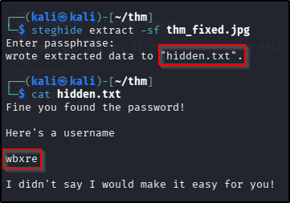  
With this string containing only letters and there not being any `=` padding (which would indicate a base* variant decoding), I used CyberChef to perform a ROT brute force on the string, which returned a valid (and relevant) result:  
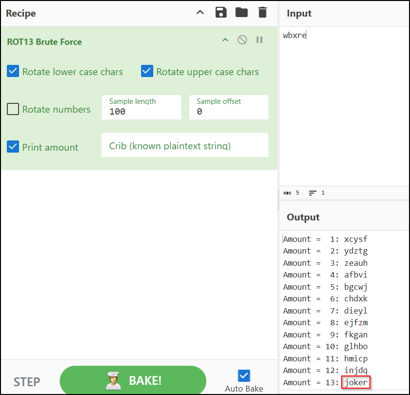  

The first thing I decided to try was to see if the password that worked with `steghide` had been used with the "joker" username and SSH but that didn't work, and given the challenge was pretty clear about not using brute force for SSH login, I felt a bit stuck here. Looking again at the instruction not to use brute force, which in and of itself felt a little unusual for TryHackMe CTF descriptions, I noted that it was also fairly odd to include a picture in the description. I downloaded the image and ran it through `steghide`, without a password initially, and found some more hidden data:  
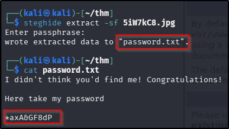  
Armed with a username and password, I was able to SSH to the target, find, and read the user flag:  
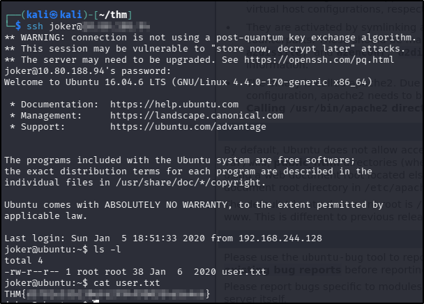
??? success "user.txt"
    THM{d5781e53b130efe2f94f9b0354a5e4ea}
	
## Privilege Escalation
The first thing I do whenever I get interactive access to a target machine is check for `sudo` rights, but in this instance that didn't turn up anything. After checking the contents of the `/home` directory (nothing interesting here either), I looked moved on to checking for SUID binaries (`find / -perm -4000 -o -perm -2000 -type f 2>/dev/null`) and this time I did find something of potential use:  
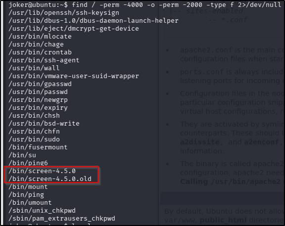  
There are a couple of reasons the two `screen` binaries drew my attraction: firstly there are two of them; secondly, it seems strange to have a version number appended to the file name; lastly, I know that `screen` has something of a reputation as a privilege escalation vector. I searched `searchsploit` for the tool and version and hit gold:  
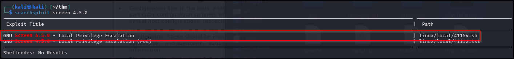  
Looking through the `bash` code for the search result, the exploit appeared to take advantage of preloaded library in the vulnerable version of `screen`, and execution should (in theory) be as simple as running the script on the target machine. I copied the script using `scp` and ran it, giving me a `root` shell instantly. From here, finding and reading the root flag was trivial:  
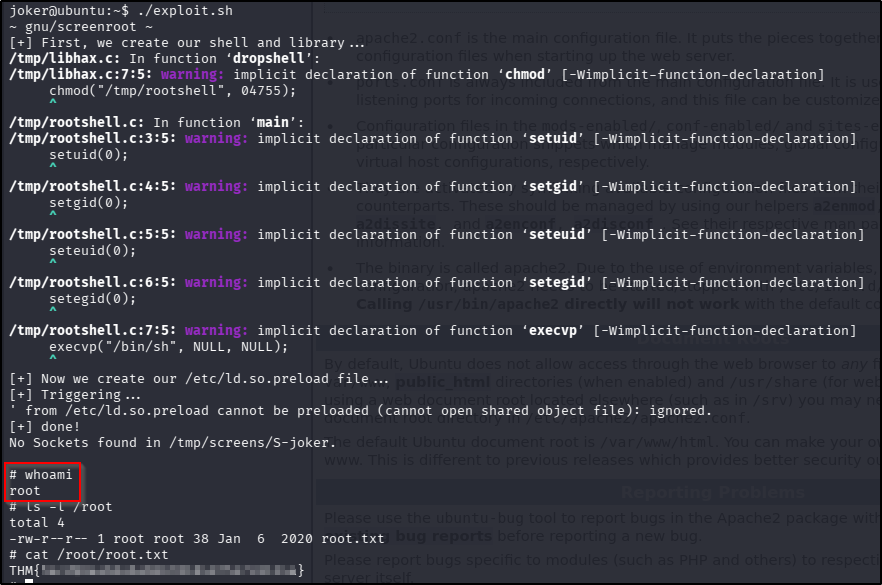  
??? success "root.txt"
    THM{5ecd98aa66a6abb670184d7547c8124a}

**Tools Used**  
`hexeditor` `Burp` `steghide` `searchsploit` `scp`

**Date completed:** 03/04/26  
**Date published:** 04/04/26