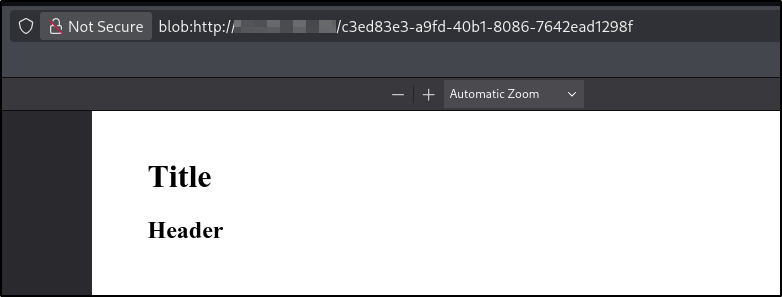
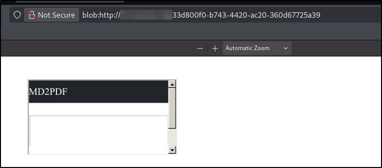

---
tags:
  - tryhackme
  - challenge
  - easy
  - offensive
  - web
  - code-injection
  - ssrf
---

# MD2PDF


**Platform:** TryHackMe  
**Type:** Challenge  
**Difficulty:** Easy  
**Link:** [MD2PDF](https://tryhackme.com/room/md2pdf)  

## Description
"TopTierConversions LTD is proud to present its latest product launch.

Hello Hacker!

TopTierConversions LTD is proud to announce its latest and greatest product launch: MD2PDF.

This easy-to-use utility converts markdown files to PDF and is totally secure! Right...?"

## Enumeration
### Port Scanning
```
ports=$(nmap -p- --min-rate=1000 TARGET_IP_ADDRESS | grep ^[0-9] | cut -d '/' -f 1 | tr '\n' ',' | sed s/,$//)
nmap -p$ports -A -T4 TARGET_IP_ADDRESS
```
```
Host is up (0.019s latency).

PORT     STATE SERVICE VERSION
22/tcp   open  ssh     OpenSSH 8.2p1 Ubuntu 4ubuntu0.13 (Ubuntu Linux; protocol 2.0)
| ssh-hostkey: 
|   3072 48:9b:db:80:8e:28:db:39:02:c7:73:04:74:d4:34:74 (RSA)
|   256 8d:c0:01:1e:a1:36:ec:d3:ee:f3:c3:27:5b:73:ca:01 (ECDSA)
|_  256 5f:22:70:8c:4d:d8:6a:55:cd:67:c3:a5:b0:dc:f8:79 (ED25519)
80/tcp   open  rtsp
|_rtsp-methods: ERROR: Script execution failed (use -d to debug)
|_http-title: MD2PDF
| fingerprint-strings: 
|   FourOhFourRequest: 
|     HTTP/1.0 404 NOT FOUND
|     Content-Type: text/html; charset=utf-8
|     Content-Length: 232
|     <!DOCTYPE HTML PUBLIC "-//W3C//DTD HTML 3.2 Final//EN">
|     <title>404 Not Found</title>
|     <h1>Not Found</h1>
|     <p>The requested URL was not found on the server. If you entered the URL manually please check your spelling and try again.</p>
|   GetRequest: 
|     HTTP/1.0 200 OK
|     Content-Type: text/html; charset=utf-8
|     Content-Length: 2660
|     <!DOCTYPE html>
|     <html lang="en">
|     <head>
|     <meta charset="utf-8" />
|     <meta
|     name="viewport"
|     content="width=device-width, initial-scale=1, shrink-to-fit=no"
|     <link
|     rel="stylesheet"
|     href="./static/codemirror.min.css"/>
|     <link
|     rel="stylesheet"
|     href="./static/bootstrap.min.css"/>
|     <title>MD2PDF</title>
|     </head>
|     <body>
|     <!-- Navigation -->
|     <nav class="navbar navbar-expand-md navbar-dark bg-dark">
|     <div class="container">
|     class="navbar-brand" href="/"><span class="">MD2PDF</span></a>
|     </div>
|     </nav>
|     <!-- Page Content -->
|     <div class="container">
|     <div class="">
|     <div class="card mt-4">
|     <textarea class="form-control" name="md" id="md"></textarea>
|     </div>
|     <div class="mt-3
|   HTTPOptions: 
|     HTTP/1.0 200 OK
|     Content-Type: text/html; charset=utf-8
|     Allow: HEAD, GET, OPTIONS
|     Content-Length: 0
|   RTSPRequest: 
|     RTSP/1.0 200 OK
|     Content-Type: text/html; charset=utf-8
|     Allow: HEAD, GET, OPTIONS
|_    Content-Length: 0
5000/tcp open  rtsp
|_rtsp-methods: ERROR: Script execution failed (use -d to debug)
| fingerprint-strings: 
|   FourOhFourRequest: 
|     HTTP/1.0 404 NOT FOUND
|     Content-Type: text/html; charset=utf-8
|     Content-Length: 232
|     <!DOCTYPE HTML PUBLIC "-//W3C//DTD HTML 3.2 Final//EN">
|     <title>404 Not Found</title>
|     <h1>Not Found</h1>
|     <p>The requested URL was not found on the server. If you entered the URL manually please check your spelling and try again.</p>
|   GetRequest: 
|     HTTP/1.0 200 OK
|     Content-Type: text/html; charset=utf-8
|     Content-Length: 2606
|     <!DOCTYPE html>
|     <html lang="en">
|     <head>
|     <meta charset="utf-8" />
|     <meta
|     name="viewport"
|     content="width=device-width, initial-scale=1, shrink-to-fit=no"
|     <link
|     rel="stylesheet"
|     href="codemirror.min.css"/>
|     <link
|     rel="stylesheet"
|     href="bootstrap.min.css"/>
|     <title>MD2PDF</title>
|     </head>
|     <body>
|     <!-- Navigation -->
|     <nav class="navbar navbar-expand-md navbar-dark bg-dark">
|     <div class="container">
|     class="navbar-brand" href="/"><span class="">MD2PDF</span></a>
|     </div>
|     </nav>
|     <!-- Page Content -->
|     <div class="container">
|     <div class="">
|     <div class="card mt-4">
|     <textarea class="form-control" name="md" id="md"></textarea>
|     </div>
|     <div class="mt-3 d-grid gap-2 d-md-
|   HTTPOptions: 
|     HTTP/1.0 200 OK
|     Content-Type: text/html; charset=utf-8
|     Allow: GET, HEAD, OPTIONS
|     Content-Length: 0
|   RTSPRequest: 
|     RTSP/1.0 200 OK
|     Content-Type: text/html; charset=utf-8
|     Allow: GET, HEAD, OPTIONS
|_    Content-Length: 0
2 services unrecognized despite returning data. If you know the service/version, please submit the following fingerprints at https://nmap.org/cgi-bin/submit.cgi?new-service :
==============NEXT SERVICE FINGERPRINT (SUBMIT INDIVIDUALLY)==============
SF-Port80-TCP:V=7.99%I=7%D=9/15%Time=6AA9AC8C%P=x86_64-pc-linux-gnu%r(GetR
SF:equest,AB5,"HTTP/1\.0\x20200\x20OK\r\nContent-Type:\x20text/html;\x20ch
SF:arset=utf-8\r\nContent-Length:\x202660\r\n\r\n<!DOCTYPE\x20html>\n<html
SF:\x20lang=\"en\">\n\x20\x20<head>\n\x20\x20\x20\x20<meta\x20charset=\"ut
SF:f-8\"\x20/>\n\x20\x20\x20\x20<meta\n\x20\x20\x20\x20\x20\x20name=\"view
SF:port\"\n\x20\x20\x20\x20\x20\x20content=\"width=device-width,\x20initia
SF:l-scale=1,\x20shrink-to-fit=no\"\n\x20\x20\x20\x20/>\n\n\x20\x20\x20\x2
SF:0<link\n\x20\x20\x20\x20\x20\x20rel=\"stylesheet\"\n\x20\x20\x20\x20\x2
SF:0\x20href=\"\./static/codemirror\.min\.css\"/>\n\n\x20\x20\x20\x20<link
SF:\n\x20\x20\x20\x20\x20\x20rel=\"stylesheet\"\n\x20\x20\x20\x20\x20\x20h
SF:ref=\"\./static/bootstrap\.min\.css\"/>\n\n\x20\x20\x20\x20\n\x20\x20\x
SF:20\x20<title>MD2PDF</title>\n\x20\x20</head>\n\n\x20\x20<body>\n\x20\x2
SF:0\x20\x20<!--\x20Navigation\x20-->\n\x20\x20\x20\x20<nav\x20class=\"nav
SF:bar\x20navbar-expand-md\x20navbar-dark\x20bg-dark\">\n\x20\x20\x20\x20\
SF:x20\x20<div\x20class=\"container\">\n\x20\x20\x20\x20\x20\x20\x20\x20<a
SF:\x20class=\"navbar-brand\"\x20href=\"/\"><span\x20class=\"\">MD2PDF</sp
SF:an></a>\n\x20\x20\x20\x20\x20\x20</div>\n\x20\x20\x20\x20</nav>\n\n\x20
SF:\x20\x20\x20<!--\x20Page\x20Content\x20-->\n\x20\x20\x20\x20<div\x20cla
SF:ss=\"container\">\n\x20\x20\x20\x20\x20\x20<div\x20class=\"\">\n\x20\x2
SF:0\x20\x20\x20\x20\x20\x20<div\x20class=\"card\x20mt-4\">\n\x20\x20\x20\
SF:x20\x20\x20\x20\x20\x20\x20<textarea\x20class=\"form-control\"\x20name=
SF:\"md\"\x20id=\"md\"></textarea>\n\x20\x20\x20\x20\x20\x20\x20\x20</div>
SF:\n\n\x20\x20\x20\x20\x20\x20\x20\x20<div\x20class=\"mt-3\x20")%r(HTTPOp
SF:tions,69,"HTTP/1\.0\x20200\x20OK\r\nContent-Type:\x20text/html;\x20char
SF:set=utf-8\r\nAllow:\x20HEAD,\x20GET,\x20OPTIONS\r\nContent-Length:\x200
SF:\r\n\r\n")%r(RTSPRequest,69,"RTSP/1\.0\x20200\x20OK\r\nContent-Type:\x2
SF:0text/html;\x20charset=utf-8\r\nAllow:\x20HEAD,\x20GET,\x20OPTIONS\r\nC
SF:ontent-Length:\x200\r\n\r\n")%r(FourOhFourRequest,13F,"HTTP/1\.0\x20404
SF:\x20NOT\x20FOUND\r\nContent-Type:\x20text/html;\x20charset=utf-8\r\nCon
SF:tent-Length:\x20232\r\n\r\n<!DOCTYPE\x20HTML\x20PUBLIC\x20\"-//W3C//DTD
SF:\x20HTML\x203\.2\x20Final//EN\">\n<title>404\x20Not\x20Found</title>\n<
SF:h1>Not\x20Found</h1>\n<p>The\x20requested\x20URL\x20was\x20not\x20found
SF:\x20on\x20the\x20server\.\x20If\x20you\x20entered\x20the\x20URL\x20manu
SF:ally\x20please\x20check\x20your\x20spelling\x20and\x20try\x20again\.</p
SF:>\n");
==============NEXT SERVICE FINGERPRINT (SUBMIT INDIVIDUALLY)==============
SF-Port5000-TCP:V=7.99%I=7%D=9/15%Time=6AA9AC8C%P=x86_64-pc-linux-gnu%r(Ge
SF:tRequest,A7F,"HTTP/1\.0\x20200\x20OK\r\nContent-Type:\x20text/html;\x20
SF:charset=utf-8\r\nContent-Length:\x202606\r\n\r\n<!DOCTYPE\x20html>\n<ht
SF:ml\x20lang=\"en\">\n\x20\x20<head>\n\x20\x20\x20\x20<meta\x20charset=\"
SF:utf-8\"\x20/>\n\x20\x20\x20\x20<meta\n\x20\x20\x20\x20\x20\x20name=\"vi
SF:ewport\"\n\x20\x20\x20\x20\x20\x20content=\"width=device-width,\x20init
SF:ial-scale=1,\x20shrink-to-fit=no\"\n\x20\x20\x20\x20/>\n\n\x20\x20\x20\
SF:x20<link\n\x20\x20\x20\x20\x20\x20rel=\"stylesheet\"\n\x20\x20\x20\x20\
SF:x20\x20href=\"codemirror\.min\.css\"/>\n\n\x20\x20\x20\x20<link\n\x20\x
SF:20\x20\x20\x20\x20rel=\"stylesheet\"\n\x20\x20\x20\x20\x20\x20href=\"bo
SF:otstrap\.min\.css\"/>\n\n\x20\x20\x20\x20\n\x20\x20\x20\x20<title>MD2PD
SF:F</title>\n\x20\x20</head>\n\n\x20\x20<body>\n\x20\x20\x20\x20<!--\x20N
SF:avigation\x20-->\n\x20\x20\x20\x20<nav\x20class=\"navbar\x20navbar-expa
SF:nd-md\x20navbar-dark\x20bg-dark\">\n\x20\x20\x20\x20\x20\x20<div\x20cla
SF:ss=\"container\">\n\x20\x20\x20\x20\x20\x20\x20\x20<a\x20class=\"navbar
SF:-brand\"\x20href=\"/\"><span\x20class=\"\">MD2PDF</span></a>\n\x20\x20\
SF:x20\x20\x20\x20</div>\n\x20\x20\x20\x20</nav>\n\n\x20\x20\x20\x20<!--\x
SF:20Page\x20Content\x20-->\n\x20\x20\x20\x20<div\x20class=\"container\">\
SF:n\x20\x20\x20\x20\x20\x20<div\x20class=\"\">\n\x20\x20\x20\x20\x20\x20\
SF:x20\x20<div\x20class=\"card\x20mt-4\">\n\x20\x20\x20\x20\x20\x20\x20\x2
SF:0\x20\x20<textarea\x20class=\"form-control\"\x20name=\"md\"\x20id=\"md\
SF:"></textarea>\n\x20\x20\x20\x20\x20\x20\x20\x20</div>\n\n\x20\x20\x20\x
SF:20\x20\x20\x20\x20<div\x20class=\"mt-3\x20d-grid\x20gap-2\x20d-md-")%r(
SF:RTSPRequest,69,"RTSP/1\.0\x20200\x20OK\r\nContent-Type:\x20text/html;\x
SF:20charset=utf-8\r\nAllow:\x20GET,\x20HEAD,\x20OPTIONS\r\nContent-Length
SF::\x200\r\n\r\n")%r(HTTPOptions,69,"HTTP/1\.0\x20200\x20OK\r\nContent-Ty
SF:pe:\x20text/html;\x20charset=utf-8\r\nAllow:\x20GET,\x20HEAD,\x20OPTION
SF:S\r\nContent-Length:\x200\r\n\r\n")%r(FourOhFourRequest,13F,"HTTP/1\.0\
SF:x20404\x20NOT\x20FOUND\r\nContent-Type:\x20text/html;\x20charset=utf-8\
SF:r\nContent-Length:\x20232\r\n\r\n<!DOCTYPE\x20HTML\x20PUBLIC\x20\"-//W3
SF:C//DTD\x20HTML\x203\.2\x20Final//EN\">\n<title>404\x20Not\x20Found</tit
SF:le>\n<h1>Not\x20Found</h1>\n<p>The\x20requested\x20URL\x20was\x20not\x2
SF:0found\x20on\x20the\x20server\.\x20If\x20you\x20entered\x20the\x20URL\x
SF:20manually\x20please\x20check\x20your\x20spelling\x20and\x20try\x20agai
SF:n\.</p>\n");
Warning: OSScan results may be unreliable because we could not find at least 1 open and 1 closed port
Aggressive OS guesses: Linux 5.14 - 6.8 (96%), Linux 4.15 - 5.19 (96%), Linux 4.15 (96%), Linux 5.4 - 5.15 (96%), Android 10 - 12 (Linux 4.14 - 4.19) (93%), Adtran 424RG FTTH gateway (92%), Android 12 (Linux 5.4) (92%), Android 9 - 11 (Linux 4.9 - 4.14) (92%), Linux 2.6.32 (92%), Linux 2.6.39 - 3.2 (92%)
No exact OS matches for host (test conditions non-ideal).
Network Distance: 3 hops
Service Info: OS: Linux; CPE: cpe:/o:linux:linux_kernel
```

### HTTP Enumeration (80)
```
ffuf -u http://TARGET_IP_ADDRESS/FUZZ -w /usr/share/wordlists/seclists/Discovery/Web-Content/DirBuster-2007_directory-list-2.3-medium.txt -ic -c
gobuster dir -u http://TARGET_IP_ADDRESS -w /usr/share/wordlists/seclists/Discovery/Web-Content/DirBuster-2007_directory-list-2.3-medium.txt -x php,html,txt
```

**Notes**  
- No `robots.txt` file  
- No `sitemap.xml` file  
- Source code contains code used by MD-to-PDF converter embedded in page  
- Fuzzing finds `admin`  page - returns "Forbidden" message
- Fuzzing finds `convert` - browsing returns "Method not allowed" message
- Entering some test MD text and converting shows that script does exactly as promised - MD is rendered correctly into a PDF document

### HTTP enumeration (5000)
```
ffuf -u http://TARGET_IP_ADDRESS:5000/FUZZ -w /usr/share/wordlists/seclists/Discovery/Web-Content/DirBuster-2007_directory-list-2.3-medium.txt -ic -c
gobuster dir -u http://TARGET_IP_ADDRESS -w /usr/share/wordlists/seclists/Discovery/Web-Content/DirBuster-2007_directory-list-2.3-medium.txt -x php,html,txt
```
**Notes**  
- Scanning results in error response - no pages enumerated  

- Attempting to browse to the site returns "Unable to connect" error

### Vulnerability enumeration
```
searchsploit OpenSSH 8.2p1	# No results
```

## Flag
**Notes**
- Markdown converters typically convert MD into HTML that can be rendered in the browser as a PDF.

**Action(s)**  
:white_check_mark: Test MD > HTML conversion with HTML attribute tags.

Payload:
```html
<h1>Title</h1>
<h2>Header</h2>
```
Result:  
  
**Notes**  
- HTML has been rendered successfully using attribute tags, which have been stripped from the result  
- As HTML is exectuted server-side, `<iframe>` attribute tags may be used to render server-side content not accessible by standard browsing (e.g., `/admin` endpoint). If successful, these would be rendered in an embedded frame in the generated PDF

**Actions**  
:white_check_mark: attempt to retrieve internal resources using the `<iframe>` attribute tag  
**Payloads**  
- `<iframe src="http://localhost/admin">`  
  
- `<iframe src="http://localhost:5000">`  
  

**Notes**  
- Returned content on 5000 port mirrors that on 80

**Actions**  
:white_check_mark: attempt to retrieve `/admin` endpoint on port 5000  
**Payload**  
- `<iframe src="http://localhost:5000/admin">`  


**Notes**  
- Plaintext flag value can be retrieved with right-click (on the `iframe`) > Inspect (Q) > right-click > Copy > Inner HTML

???	success "What is the flag?"
	flag{1f4a2b6ffeaf4707c43885d704eaee4b}

**Date completed:** 14/09/24  
**Date published:** 27/09/24