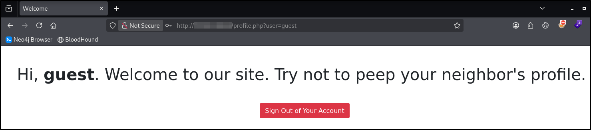
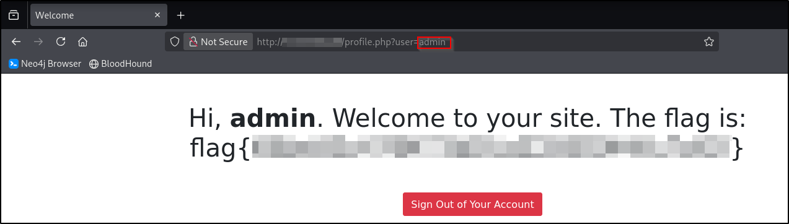

---
tags:
  - tryhackme
  - challenge
  - easy
  - offensive
  - linux
---

# Neighbour


**Platform:** TryHackMe  
**Type:** Challenge  
**Difficulty:** Easy  
**Link:** [Neighbour](https://tryhackme.com/room/neighbour)  

## Description
"Check out our new cloud service, Authentication Anywhere. Can you find other user's secrets?

Check out our new cloud service, Authentication Anywhere -- log in from anywhere you would like! Users can enter their username and password, for a totally secure login process! You definitely wouldn't be able to find any secrets that other people have in their profile, right?"

## Enumeration
### Port Scanning
```
ports=$(nmap -p- --min-rate=1000 TARGET_IP_ADDRESS | grep ^[0-9] | cut -d '/' -f 1 | tr '\n' ',' | sed s/,$//)
nmap -p$ports -A -T4 TARGET_IP_ADDRESS
```
```
PORT   STATE SERVICE VERSION
22/tcp open  ssh     OpenSSH 8.2p1 Ubuntu 4ubuntu0.5 (Ubuntu Linux; protocol 2.0)
| ssh-hostkey: 
|   3072 4a:4d:cb:94:ac:36:a0:1e:f7:52:a4:53:12:3f:0f:e6 (RSA)
|   256 97:da:79:0a:3f:d2:20:b5:1f:34:53:15:4c:99:69:16 (ECDSA)
|_  256 0a:fc:66:a2:4f:44:40:c6:95:63:0c:ea:7c:3d:aa:e7 (ED25519)
80/tcp open  http    Apache httpd 2.4.53 ((Debian))
|_http-title: Login
| http-cookie-flags: 
|   /: 
|     PHPSESSID: 
|_      httponly flag not set
|_http-server-header: Apache/2.4.53 (Debian)
Warning: OSScan results may be unreliable because we could not find at least 1 open and 1 closed port
Device type: general purpose|phone|specialized
Running (JUST GUESSING): Linux 5.X|6.X|4.X (96%), Google Android 10.X|11.X|12.X (93%), Adtran embedded (92%)
OS CPE: cpe:/o:linux:linux_kernel:5 cpe:/o:linux:linux_kernel:6 cpe:/o:linux:linux_kernel:4 cpe:/o:google:android:10 cpe:/o:google:android:11 cpe:/o:google:android:12 cpe:/h:adtran:424rg
Aggressive OS guesses: Linux 5.14 - 6.8 (96%), Linux 4.15 - 5.19 (96%), Linux 4.15 (96%), Linux 5.4 - 5.15 (96%), Android 10 - 12 (Linux 4.14 - 4.19) (93%), Adtran 424RG FTTH gateway (92%), Android 10 - 11 (Linux 4.9 - 4.14) (92%), Android 12 (Linux 5.4) (92%), Android 9 - 11 (Linux 4.9 - 4.14) (92%), Linux 2.6.32 (92%)
No exact OS matches for host (test conditions non-ideal).
Network Distance: 3 hops
Service Info: OS: Linux; CPE: cpe:/o:linux:linux_kernel
```

### HTTP Enumeration
```
ffuf -u http://TARGET_IP_ADDRESS/FUZZ -w /usr/share/wordlists/seclists/Discovery/Web-Content/DirBuster-2007_directory-list-2.3-medium.txt -ic -c
gobuster dir -u TARGET_IP_ADDRESS -w /usr/share/wordlists/seclists/Discovery/Web-Content/DirBuster-2007_directory-list-2.3-medium.txt -x php,html,txt
```

**Notes**  
- No `robots.txt` file  
- No `sitemap.xml` file  
- Source code contains guest credentials to use (guest:guest)  
- Source code contains user name for administrator account (admin)  
- Fuzzing finds `assets` and `db` pages - both return "Forbidden" message

### Vulnerability enumeration
```
searchsploit OpenSSH 8.2p1	# No results
searchsploit httpd 2.4.53	# Only finding: DoS
```

## Flag
**Action(s)**  
:white_check_mark: Log in to web portal using guest credentials  
Guest user account referenced in URL (IDOR):  


**Action(s)**  
:white_check_mark: Update URL to include "admin" user found in source code


??? success "Find the flag on your neighbor's logged in page!"
	flag{66be95c478473d91a5358f2440c7af1f}

**Tools Used**  
`Web browser`

**Date completed:** 09/09/26  
**Date published:** 09/09/26