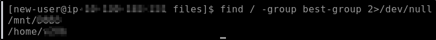
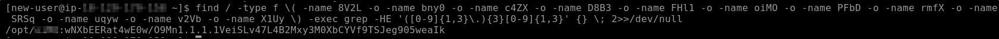
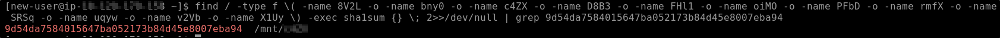
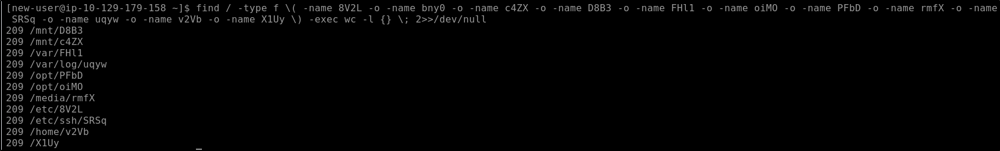
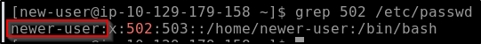
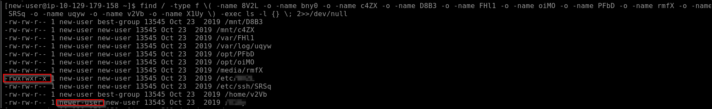

---
tags:
  - tryhackme
  - challenge
  - easy
  - defensive
  - linux
---

# Ninja Skills

**Platform:** TryHackMe  
**Type:** Challenge  
**Difficulty:** Easy  
**Link:** [Ninja Skills](https://tryhackme.com/room/ninjaskills)

## Description
"Practise your Linux skills and complete the challenges."

## Environment and Artefacts provided
Live Linux system
Questions all relate to the following files:  

* 8V2L  
* bny0  
* c4ZX  
* D8B3  
* FHl1  
* oiMO  
* PFbD  
* rmfX  
* SRSq  
* uqyw  
* v2Vb  
* X1Uy  

## Task 1: 
File group ownership
### Analysis
Searching for files owned by a group is easily achieved with the following `find` command:  
`find / -group best-group 2>/dev/null`
  
### Answer
??? success "Which of the above files are owned by the best-group group(enter the answer separated by spaces in alphabetical order)"
	D8B3 v2Vb

## Task 2:
File content search
### Analysis
Something that the output from the `find` command revealed is that the files were scattered throughout the file system. With that knowledge, I built a base `find` command to use with the following questions that I could insert a command to perform against the files in future questions:  
`find / -type f \( -name 8V2L -o -name bny0 -o -name c4ZX -o -name D8B3 -o -name FHl1 -o -name oiMO -o -name PFbD -o -name rmfX -o -name SRSq -o -name uqyw -o -name v2Vb -o -name X1Uy \) -exec <command> {} \; 2>>/dev/null`  
From here I can make use of `grep`'s built-in ability to accept regex expressions as search queries (because "an IP address" is far too vague to search with normal string searching - we're looking for a string pattern here):  
`grep -E '([0-9]{1,3}\.){3}[0-9]{1,3}'`
  
### Answer
??? success "Which of these files contain an IP address?"
	oiMO

## Task 3
SHA1 values
### Analysis
For this I updated the command in the base `find` command to `sha1sum` and piped the output to a `grep` statement looking for the value referenced in the question for a cleaner output:  

### Answer
??? success "Which file has the SHA1 hash of 9d54da7584015647ba052173b84d45e8007eba94"
	c4ZX

## Task 4
File line counts
### Analysis
The `wc` command can be used with the `-l` switch to count the number of lines in a file. Using this with the base `find` command actually didn't find me the answer to the question though:  

What's interesting about the output is that there's a file missing from the list that was provided in the challenge brief. Unlike the other commands used so far that only returned specifically targetted files and their metadata, this one should have returned a value for all of the files in the list provided to the `find` command. I don't know whether this is intentional, or whether it's a broken/poorly implemented challenge, but I inferred the answer to be the only file in the original list that isn't in the `find` command results (because it definitely can't be any of the others).
### Answer
??? success "Which file contains 230 lines?"
	bny0

## Task 5
File owner ID
### Analysis
The `ls` command, when used with the `-l` switch, can provide us with details about the file owner. First though, I needed to find out which user corresponded with ID 502. For this I used the `grep` command on `/etc/passwd`:  
  
From there I simply updated the base `find` command to perform `ls -l` on the files:  
  
### Answer
??? Success "Which file's owner has an ID of 502?"
	X1Uy

## Task 6
File permissions
### Analysis
I had unwittingly obtained the answer to the final challenge from the output from the command executed for the previous task.
### Answer
??? success "Which file is executable by everyone?"
	8V2L

**Tools Used**  
`find` `grep` `sha1sum` `wc` `ls`

**Date completed:** 30/03/26  
**Date published:** 30/03/26