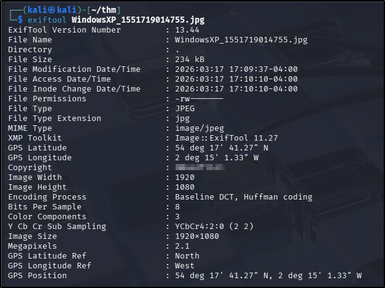
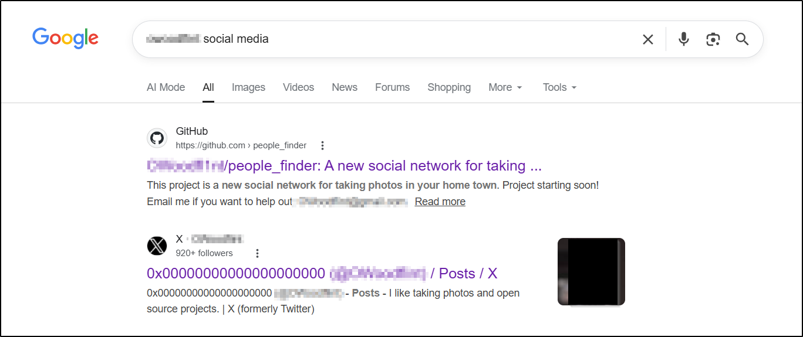
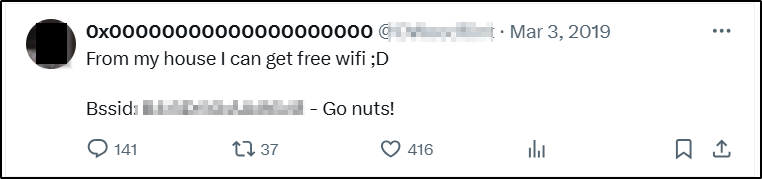
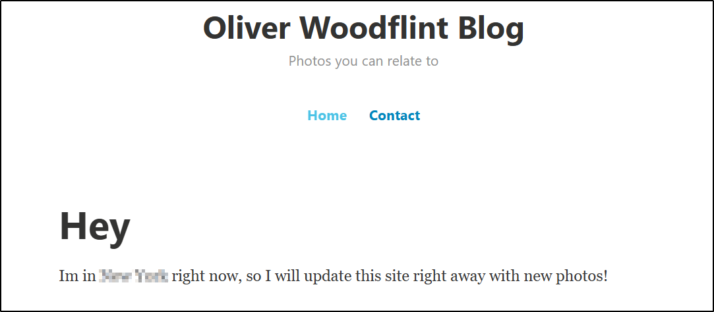
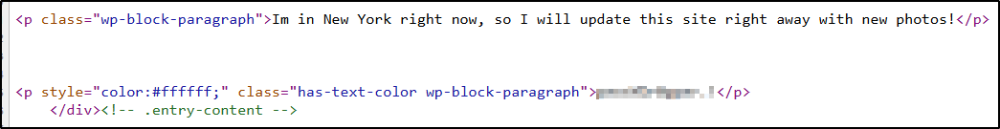

---
tags:
  - tryhackme
  - challenge
  - easy
  - offensive
  - windows
  - web
  - osint
---

# OhSint

**Platform:** TryHackMe  
**Type:** Challenge  
**Difficulty:** Easy  
**Link:** [OhSint](https://tryhackme.com/room/ohsint)

## Overview
"Are you able to use open source intelligence to solve this challenge?".

## Task 1: 
What is this user's avatar of?
### Known Information (Lead)
A single .jpg file was provided within the challenge page - it appears to display the famous Windows XP default desktop wallpaper.
### Sources/Tools Used
`exiftool`, search engine (Google)  
### Investigation Process
After downloading the image, the first thing I did was open the image to see if there was anything in plain sight. Not seeing anything immediately, I moved on to looking at the metadata with `exiftool`, which gave me my first lead:  
  

Turning to Google, and knowing the question I was working on includes reference to an "avatar", I searched for the name found in the `exiftool` output + "social media" and got the answer right there in the search results:  

### Findings
X (formerly Twitter) profile
GitHub repo
### Answer
??? success "What is this user's avatar of?"
	cat

## Task 2
What city is this person in?
### Known Information (Lead)
User handle (from image metadata)
### Sources/Tools Used
Github repo
### Investigation Process
Navigating to the first search result in the page (a GitHub repo) provided the answer to this in the readme file:  
  
### Findings
Confirmation that the X account and GitHub repo belong to the same user
Gmail address
Wordpress site
### Answer
??? success "What city is this person in?"
	London

## Task 3
What is the SSID of the WAP he connected to?
### Known Information (Lead)
User handle (from image metadata)
### Sources/Tools Used
X profile; Wigle (with a caveat)
### Investigation Process
The GitHub repo didn't appear to show any information that was relevant to this task so I decided to take a look at the X profile before getting too deep down a rabbit hole into the GitHub repo data. The user has only made two posts; luckily for me there's a lead for the answer to this question right there in the top one:  
  

So given the question asks for the SSID (and we only have the BSSID) of the network, I took to Google to ask how to obtain one from the other. [Wigle](https://wigle.net/) repeatedly came up in the results, so the plan was to use it to get the answer to the question. Unfortunately even the basic search is locked behind a user login/registration. Even more unfortuntely, I had some real issues with the registration process - the form wouldn't accept the first e-mail address I used (I did wonder whether I already had an account and forgotten! Sadly a password reset request failed to generate an email), and no matter what I did the "Register" button remained unavailable to click. Frustrated, I turned to another [walkthrough](https://medium.com/@aquilnox/ohsint-walkthrough-a-tryhackme-ctf-1af5851e056f) to discover that this functionality may not always have been locked away, but that I was on the right track - essentially I should have been able to used the discovered BSSID and the location of the target (discovered in an earlier task) to find the SSID. The write of the walkthrough was kind enough to leave the answer available for all to see, so I used the answer from there rather than waste any more time trying to force a registration with Wigle.
### Findings
More accurate information about where the target is located
### Answer
??? success "What is the SSID of the WAP he connected to?"
	UnileverWifi

## Task 4 (and 5)
What is his personal email address?
### Known Information (Lead)
N/A
### Sources/Tools Used
Github Repo
### Investigation Process
I had unwittingly already gathered this information in an earlier task! No further investigation was required.  
### Findings
No new findings for this task.
### Answer (#4)
??? success "What is his personal email address?"
	OWoodflint@gmail.com
### Answer (#5)
??? success "What site did you find his email address on?"
	GitHub

## Task 6
Where has he gone on holiday?
### Known Information (Lead)
GitHub repo details a personal WordPress web site
### Sources/Tools Used
GitHub repo; WordPress site  
### Investigation Process
Using the link from the target's GitHub repo to get to their personal WordPress site gave me the answer to this on the home page of the site:  
  
### Findings
No new findings for this task.
### Answer
??? success "Where has he gone on holiday?"
	New York

## Task 7
What is the person's password?
### Known Information (Lead)
Personal WordPress site
### Sources/Tools Used
Site source code  
### Investigation Process
After checking the commit history and comments in the GitHub repo (most of which are nonsense from other challenge participants) and clicking on all the available links on the WordPress site, I decided to check the source code. It's a Word Press site, so most of the code here will be related to the plug-ins and functionality implemented by the hosting site, but I figured it was worth checking the only content on the page that clearly had been customised. Right underneath that careless disclosure of the target's vacation location, there's a strange string literally hidden in plain text (it renders on the page as white text on a white background):  
  
### Findings
No new findings for this task.
### Answer
??? success "What is the person's password?"
	pennYDr0pper.!

**Tools Used**  
`exiftool` `Wigle`

**Date completed:** 18/03/26  
**Date published:** 18/03/26