---
tags:
  - tryhackme
  - challenge
  - easy
  - offensive
  - linux
  - web
  - broken-authentication
  - cookie-manipulation
  - brute-force
  - crontab-abuse
---

# Overpass

**Platform:** TryHackMe  
**Type:** Challenge  
**Difficulty:** Easy  
**Link:** [Overpass](https://tryhackme.com/room/overpass)  

## Description
"What happens when some broke CompSci students make a password manager? Obviously a perfect commercial success!"

## Enumeration
I generated a list of open ports for more comprehensive enumeration with the following:  
`ports=$(nmap -p- --min-rate=1000 TARGET_IP_ADDRESS | grep ^[0-9] | cut -d '/' -f 1 | tr '\n' ',' | sed s/,$//)`  
This revealed the following open ports:  

* 22  
* 80  

I ran a full `nmap` scan to query the services for version information, as well as querying the target system for OS information with `nmap -p$ports -A -T4 TARGET_IP_ADDRESS`, which revealed the following:  
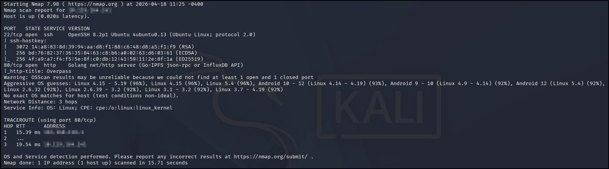  
I used my go-to `ffuf` command to enumerate the website (`ffuf -u http://TARGET_IP_ADDRESS/FUZZ -w /usr/share/wordlists/seclists/Discovery/Web-Content/DirBuster-2007_directory-list-2.3-medium.txt -ic -c`) as a quick directory discovery, whilst also running my standard `gobuster` command (`gobuster dir -u TARGET_IP_ADDRESS -w /usr/share/wordlists/seclists/Discovery/Web-Content/DirBuster-2007_directory-list-2.3-medium.txt -x php,html,txt`) to probe a bit more thoroughly, looking for files as well.  
Whilst I was waiting for the fuzz scans to complete, I navigated to the page in a web browser. There were no `robots.txt` or `sitemap.xml` files, but I did find something interesting in the source code:  
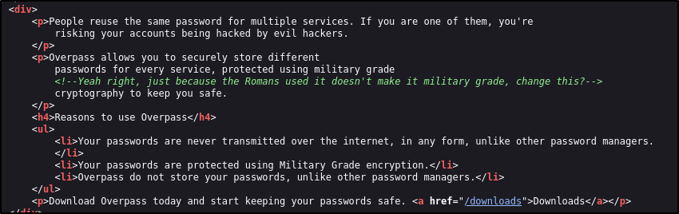  
Looks like a reference to the Caesar cipher to me. I kept a note of it and continued my enumeration. The `ffuf` scan had revealed a couple of interesting directories to enumerate further:  
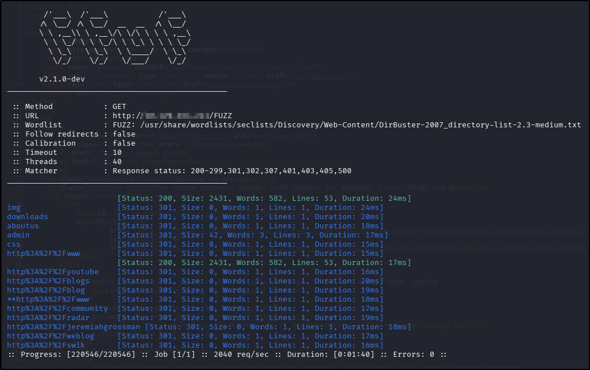  

* `/img` - contained images for the web page (unsurprising). Considered the possibility of one or more of the images being a steganography candidate if there were no other promising leads in the enumeration phase.  
* `/downloads` - hosted precompiled downloads for the alleged password manager that has been created by a group of students. Downloaded the executable for Linux and checked the `strings` output but there was nothing immediately obvious - kept as a reverse engineering possibility if there were no other leads to follow.  
* `/aboutus` - details of the group of students who have created the password manager. Saved the names on the page into a file for possible use with a brute force later on.  
* `/css` - nothing interesting in the two files saved here.  
* `/admin` - hosted an admin portal. Obviously of interest! Checked to see if the error message differed to reveal usernames but this was unsuccessful. Checking the source code provided potentially interesting lead:
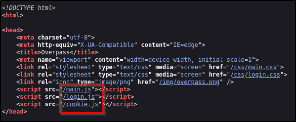  

Before following the rabbit hole of looking at the associated JS files, I ran a search with `searchsploit` to see if there were any known vulnerabilities for the services revealed in the `nmap` scan, but there were no promising results.

## Foothold
Returning to the source code for the `/admin` page, the `main.js` file simply printed a "Hello world" message to the console. The `login.js` file on the other hand revealed the possibility that access to the admin console might be achievable through a broken authentication misconfiguration in the code:  
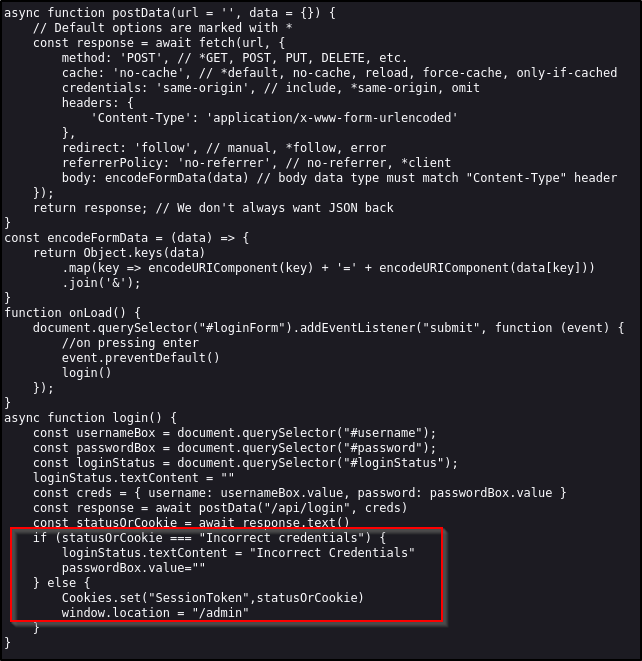  
Looking at the authentication function, it would appear that if the response contains the phrase "Incorrect credentials", the login will fail ELSE a cookie called "SessionCookie" is set with the value returned by the server and login will succeed. So the login function is relying on the presence of the "SessionCookie" cookie, but does not care about what its contents are. With that in mind, I used Developer Tools to create a new cookie called "SessionCookie", left the value as default and refreshed the page, resulting in a successful login:  
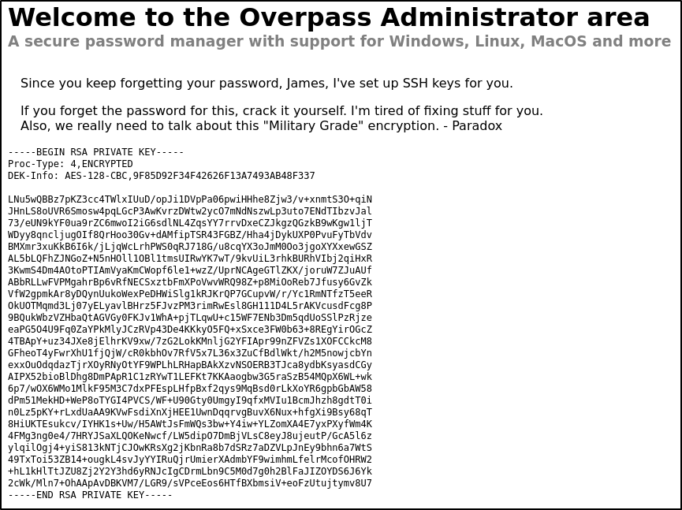
I copied the text on the screen to a local `id_rsa` file, passed it to `ssh2john` to extract the password has and then passed it to `john` for cracking, which was successful:  
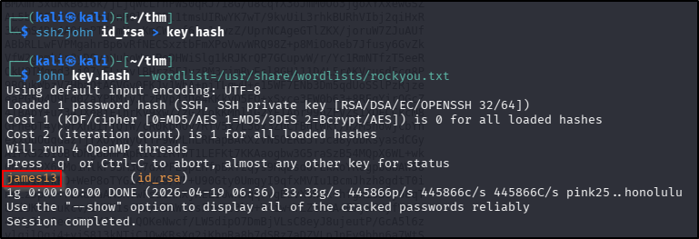  
After setting the appropriate permissions on the private key file (`600`), logging in to the SSH service and finding the user flag was trivial:  
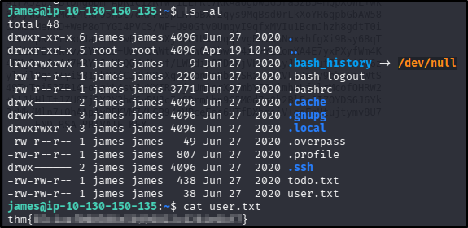  
??? success "Hack the machine and get the flag in user.txt"
    thm{65c1aaf000506e56996822c6281e6bf7}

## Privilege Escalation
The first thing I did was look at the contents of that other text file in the home directory:  
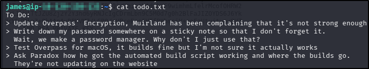  
There are a couple of things here, but the first thing I did was check the contents of the `.overpass` file in the home directory. It contained only one line that look that nonsense, but considering the two hints I'd seen about the "military grade encryption", I figured it could be a variation on the Caesar-shift cipher (I knew it couldn't be a straight ROT13 because of the symbols - ROT13 is letters only). I turned to the [dCode cipher identifier](https://www.dcode.fr/cipher-identifier), which did indeed suggest an ASCII shift cipher, successfully decoding the contents:  
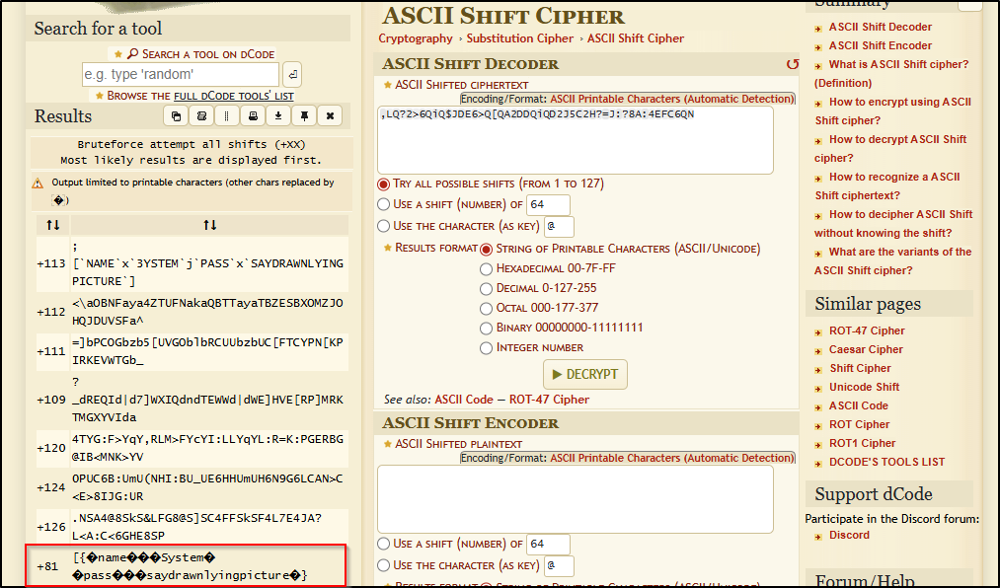  
To prove the point, I searched for the "overpass" binary on the target system, finding it on `PATH`, so I ran it to see what it returned:  
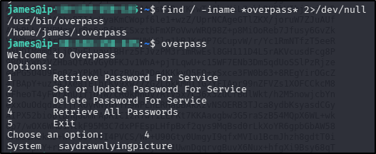  
Alright, so that proves the point - each user should have a `.overpass` file in their home directory containing their passwords and the system they're for, encoded with an ASCII shift cipher. Sounds useful, but as the screenshots show, there was only one `.overpass` file found on the system that the "james" user can see, and that's his own. It did at least give me his system password for me to run `sudo -l` with, but unfortunately my user had no `sudo` rights.  
I checked for SUID and SGID binaries but came up empty, and my user wasn't in any groups other than his own. `/etc/crontab` did come up with something useful though, especially given the contents of that `todo.txt` file:  
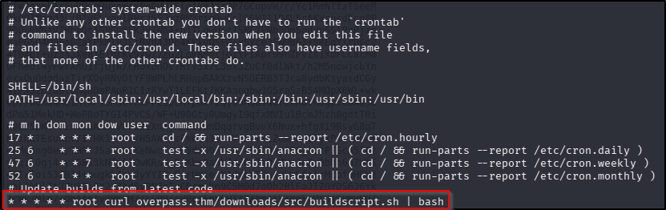  
This is useful indeed - a task that runs every minute, as the `root` user, that executes a script with `bash`, which means that if I can write to the script it uses `curl` to get, I can get a root shell (or just read the contents of the root flag file). First thing first - I need to know where that `overpass.thm` is pointing to - it's highly likely it's `localhost` but to be sure I checked the `/etc/hosts` file:  
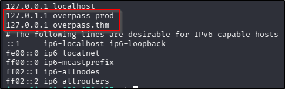  
As suspected, `overpass.thm` is pointing to `localhost`, so now to find the `buildscript.sh` file and check the permissions for it. This proved a bit more tricky than expected! As it turned out, the "james" user was not able to see the `buildscript.sh` file, nor any of its parent directories, let alone write to it. This left an alternative - see if I could control the destination of the `overpass.thm` domain. Usually the `/etc/hosts` file is only writable by the `root` user but I checked the permissions just to be sure:  
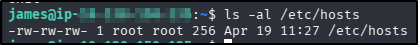  
Well that is good news! The `/etc/hosts` file is writable by everyone, so I can redirect the script to point to my own attacking machine, where I can host a malicious script. I recreated the expected directory structure on my own machine (`downloads/src`) and then created a `buildscript.sh` file with the following content:  
`cp /bin/bash /tmp/rootbash; chmod +s /tmp/rootbash`  
This line of script will copy the `bash` binary to a place that my "james" user can access (the `/tmp` directory, usually accessible by everyone) and set it so that when run, it runs with the owner's permissions, which in this case is the `root` user because that's the user the task runs as. After doing this, I changed the value in the `/etc/hosts` file for the `overpass.thm` domain to that of my attacking machine and setup a Python http server there (`python3 -m http.server 80`). After waiting a minute, I could see the GET request for the script file and my SUID `bash` binary appeared in `/tmp`. From there I could execute the `root` `bash` binary (`/tmp/rootbash -p`) and obtain the root flag:  
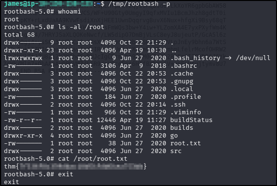  
??? success "Escalate your privileges and get the flag in root.txt"
    thm{7f336f8c359dbac18d54fdd64ea753bb}

**Tools Used**  
`Developer Tools` `ssh2john` `john`

**Date completed:** 19/04/26  
**Date published:** 19/04/26