---
tags:
  - tryhackme
  - challenge
  - easy
  - reverse-engineering
---

# Reversing ELF
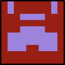

**Platform:** TryHackMe  
**Type:** Challenge  
**Difficulty:** Easy  
**Link:** [Reversing ELF](https://tryhackme.com/room/reverselfiles)

## Description
"Room for beginner Reverse Engineering CTF players"

## Task 1: 
"Let's start with a basic warmup, can you run the binary?"
### Artifacts examined
crackme1 file
### Analysis
After downloading the file, I checked the permissions on it to see if it was executable in its downloaded state. On discovering it was not, I implemented this with `chmod +x crackme1` and ran the file, obtaining the first flag:  
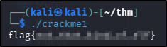  
### Answer
??? success "What is the flag?"
	flag{not_that_kind_of_elf}

## Task 2:
"Find the super-secret password! and use it to obtain the flag"
### Artifacts examined
crackme2 file
### Analysis
The task asked me to find a password: thinking that this might be a case of a hard-coded password, I used `strings` on the binary file, finding what looked like a hit:  
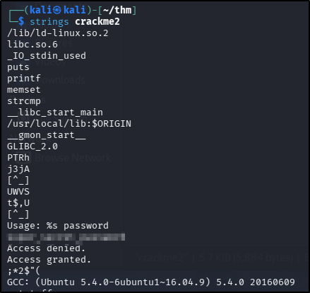  
With the password in hand, I added the executable right to the binary and ran it, expecting to be prompted for a password. Instead I was presented with the correct syntax for running the binary:  
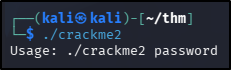  
Entering the syntax as directed got me the flag for this task:  
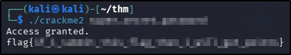  
### Answers
??? success "What is the super secret password?"
	super_secret_password
??? success "What is the flag?"
	flag{if_i_submit_this_flag_then_i_will_get_points}

## Task 3:
"Use basic reverse engineering skills to obtain the flag"
### Artifacts examined
crackme3 file
### Analysis
Following the same process as with the previous tasks, I made the file executable and ran it:  
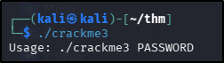  
I went on to use `strings` on the binary, but instead of finding a hard-coded plaintext password, I found what appear to be a base64 encoded string:  
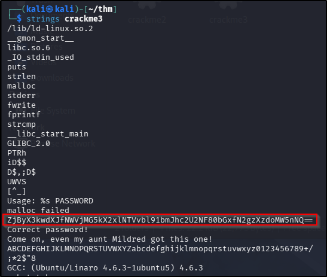  
I fed it to `base64` to decode and then used the decoded string with the binary:  
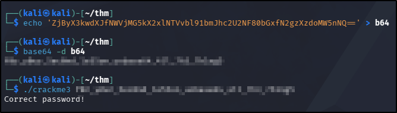  
### Answer
??? success "What is the flag?"
	f0r_y0ur_5ec0nd_le55on_unbase64_4ll_7h3_7h1ng5

## Task 4:
"Analyze and find the password for the binary?"
### Artifacts examined
crackme4 file
### Analysis
Following the same process as with the previous tasks, I made the file executable and ran it:  
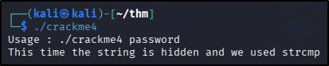  
Using the hint provided by the output, I did a quick Google search into what `strcmp` is. In a nutshell, it's a boolean evaluation of whether two strings are equal when they are compared. It returns an integer representation of the result - 0 for true (the strings are equal), 1 for false (the strings are not equal). There is a bit more to it than this, but that's all that's required for this particular challenge! With the output also telling me the password is hidden, I opened the binary in Ghidra to start inspecting the disassembled code.
Jumping to the `main` function, I could see that there was a call to another function - `compare_pwd`. Loading that function into the disassembler gave me a string value that is stored in a variable:  
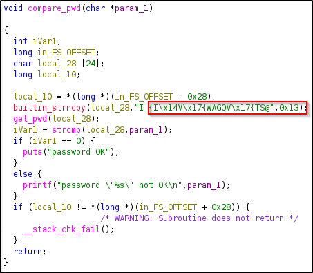  
The function goes on to call another function (`get_pwd`) to modify that variable, and then uses `strcmp` to perform the check to see if the output from `get_pwd` is equal to the parameter provided to the binary at runtime. Seeing as the string in `compare_pwd` appeared to be encoded in some way, I took a look at the `get_pwd` function to see if I could obtain the decode method:  
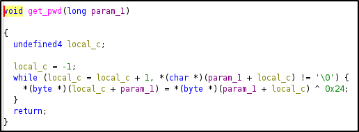  
The contents of the `get_pwd` function tells us what's happening to that weird string in `compare_pwd` - each character is encoding with an XOR of `0x24`. I was able to decode it with a small piece of Python:
```
enc = b"<encodedString>"
print(bytes([b ^ <key> for b in enc]))
```
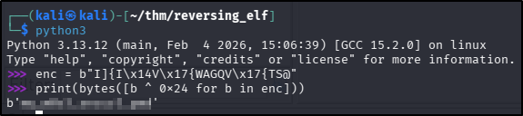  
### Answer
??? success "What is the password?"
	my_m0r3_secur3_pwd

## Task 5:
"What will be the input of the file to get output `Good game` ?"
### Artifacts examined
crackme5 file
### Analysis
Following the same process as with the previous tasks, I made the file executable and ran it:  
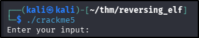  
Running `strings` on this binary didn't produce anything helpful, so I went ahead and opened it in Ghidra. Looking at the main function, I could see a sequence of hex-encoded bytes stored in local variables:  
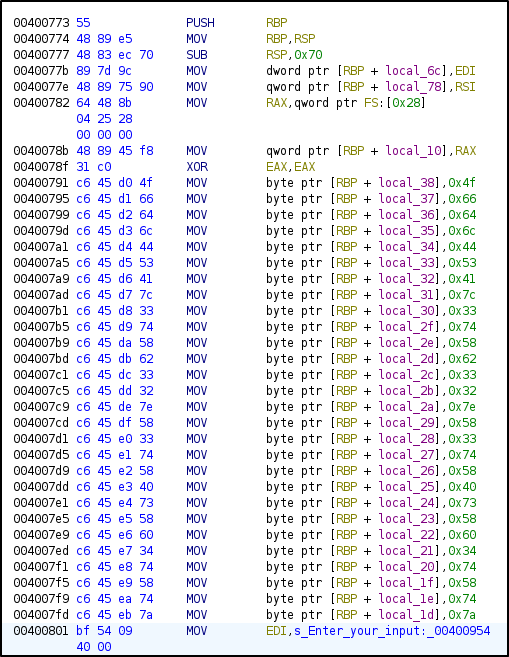  
Looking further at the disassembled code, the function appears to simply compare the user input, stored in another local variable, with the values stored in the buffer starting at `local_38`:  
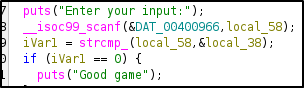  
Using that as my working theory, I used CyberChef to decode the hex characters stored in the `main` function, and then fed that to the binary, resulting in the desired output:  
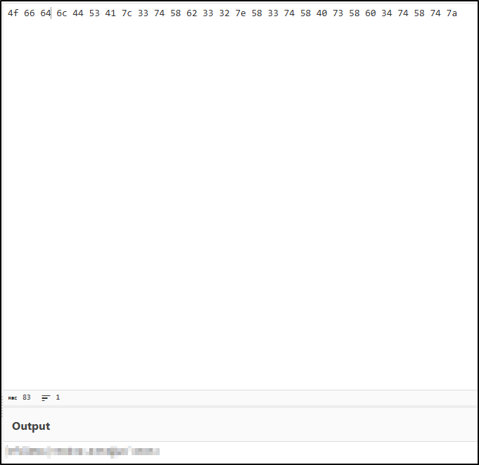  
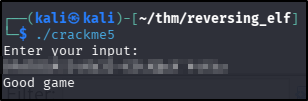  
### Answer
??? success "What is the input ?"
	OfdlDSA|3tXb32~X3tX@sX`4tXtz

## Task 6:
"Analyze the binary for the easy password"
### Artifacts examined
crackme6 file
### Analysis
Following the same process as with the previous tasks, I made the file executable and ran it:  
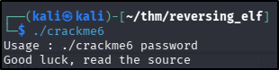  
Running `strings` on this binary didn't produce anything helpful, so I went ahead and opened it in Ghidra. Looking at the main function, I could see it was basically a validator for another function, making sure the correct number of arguments had been passed, before calling the `compare_pwd` function to compare the user input with something:  
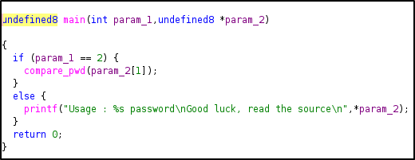  
The `compare_pwd` function is where the comparison takes place, but not where the comparison string is stored - it obtains that from the `my_secure_test` function:  
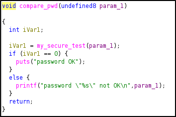  
Looking at the `my_secure_test` function revealed a hard-coded password:  
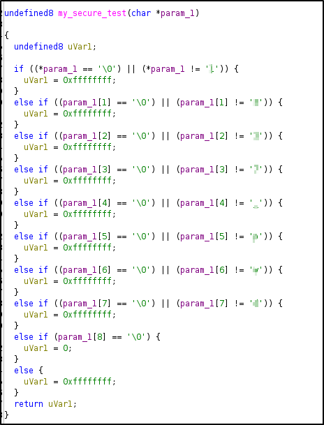  
### Answer
??? success "What is the password ?"
	1337_pwd

## Task 7:
"Analyze the binary to get the flag"
### Artifacts examined
crackme7 file
### Analysis
Following the same process as with the previous tasks, I made the file executable and ran it:  
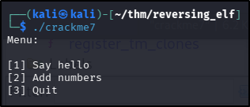  
Running `strings` on this binary didn't produce anything helpful, so I went ahead and opened it in Ghidra. Looking at the main function, I could see that there was a hidden fourth option in the programme:  
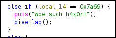  
Hovering over the variable value in Ghidra produced a decimal number for me to attempt against the binary. The code showed that, if successful, the programme might output a flag for me with the `giveFlag` function:  
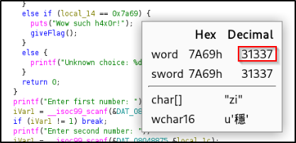  
I ran the binary with the discovered value and was rewarded with a flag:  
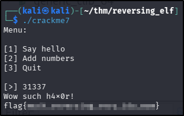  
### Answer
??? success "What is the flag ?"
	flag{much_reversing_very_ida_wow}

## Task 8:
"Analyze the binary and obtain the flag"
### Artifacts examined
crackme8 file
### Analysis
Following the same process as with the previous tasks, I made the file executable and ran it:  
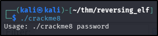  
Running `strings` on this binary didn't produce anything helpful, so I went ahead and opened it in Ghidra. Looking at the main function, I could see something very similar to the previous task - a variable being compared with a resulting call to `giveFlag` if successful. Once again, hovering over the value shows the value the programme is expecting:  
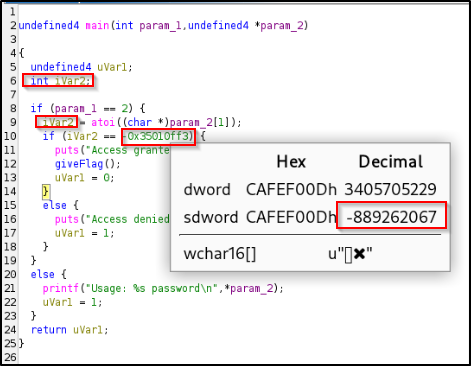  
I used the negative decimal value to input to the programme (because the programme is expecting an integer value, and it is being compared to a negative hex value) and was rewarded with a flag:  
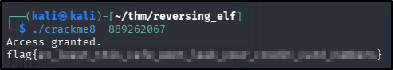  
### Answer
??? success "What is the flag ?"
	flag{at_least_this_cafe_wont_leak_your_credit_card_numbers}

**Tools Used**  
`strings` `ghidra`

**Date completed:** 30/03/26  
**Date published:** 30/03/26