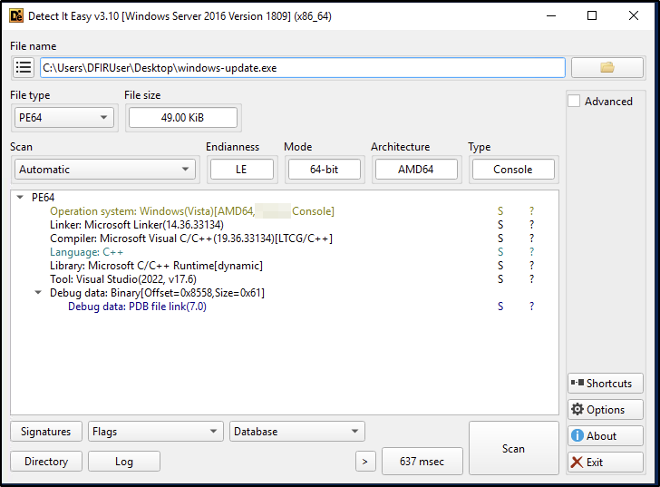
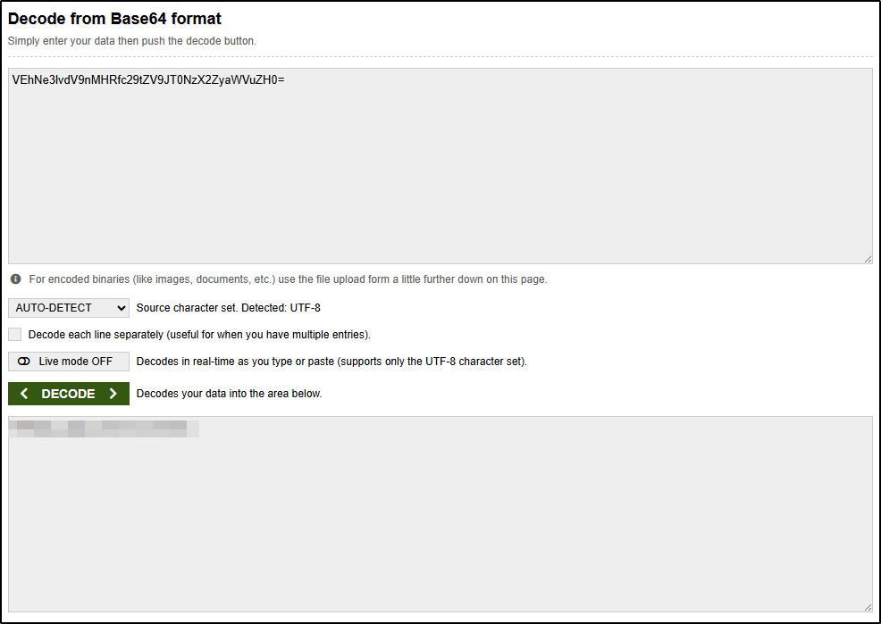
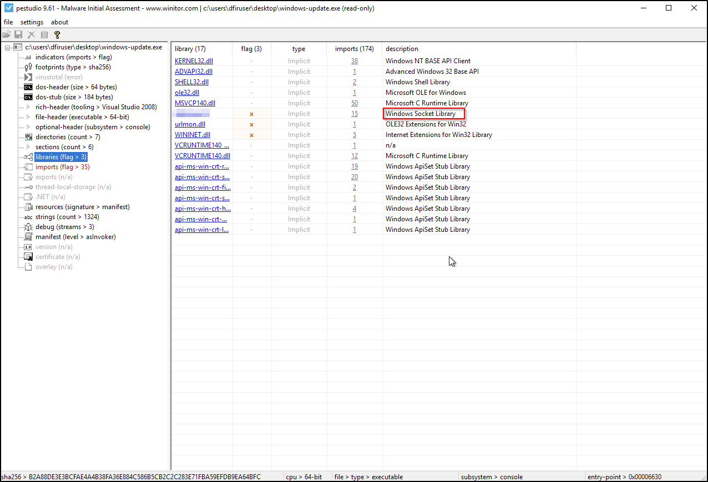
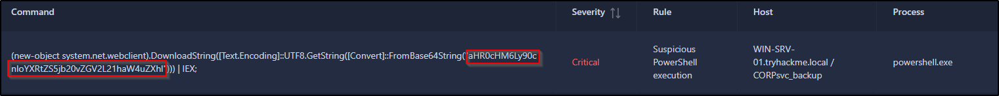
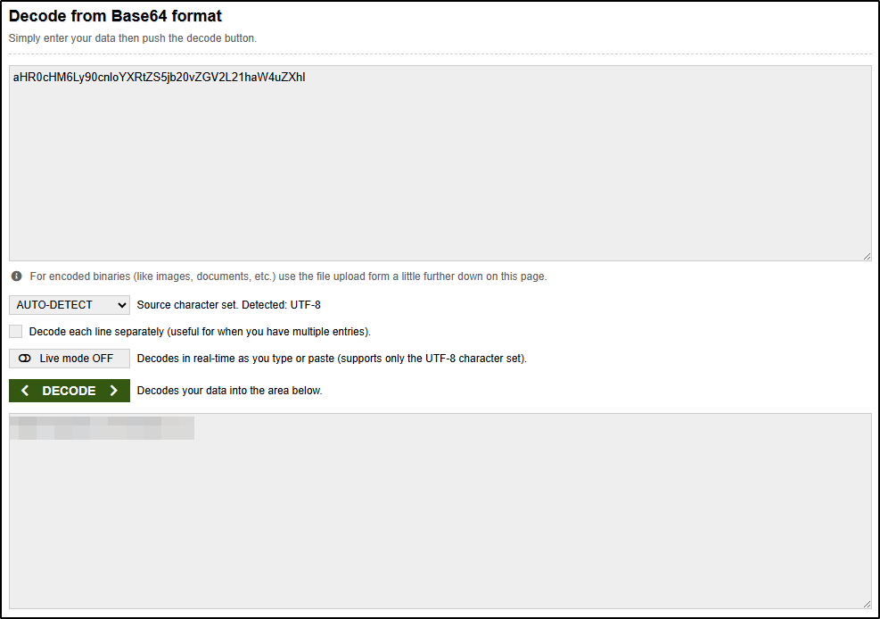
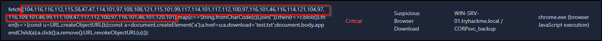
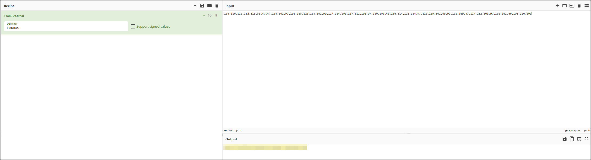
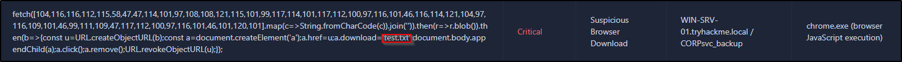

---
tags:
  - tryhackme
  - challenge
  - easy
  - defensive
  - windows
  - digital-forensics
  - malware-analysis
  - static-analysis
  - encoding
  - decoding
---

# Shadow Trace

**Platform:** TryHackMe  
**Type:** Challenge  
**Difficulty:** Easy  
**Link:** [Shadow Trace](https://tryhackme.com/room/shadowtrace)  

## Description
"Analyse a suspicious file, uncover hidden clues, and trace the source of the infection.

It’s the middle of the night shift. You’re the only analyst in the SOC when a manager calls in urgently: a suspicious file was found on a user's machine and needs immediate review.

You open the file and start digging. Something doesn’t look normal for a company updater, and at the same time, the EDR throws a couple of alerts.

Your task: analyse the file, collect anything to identify it, gather any potential IOCs, correlate and analyse the alerts for potential malicious behaviour. It’s up to you to piece together what’s happening before it spreads further."

## Environment and Artifacts provided
* Windows Server 2019 DFIR Analysis Machine with pre-installed analysis tools
* Suspicious binary: `windows-update.exe`  
* Alerts console

## Task 1: File Analysis 
"Analyse the binary [...] in the attached machine"
### Artifacts examined
`windows-update.exe` binary file
### Analysis
Use DIE.exe to examine binary:  

### Answer
??? success "What is the architecture of the binary file windows-update.exe?"
	64-bit
### Analysis
Use PowerShell to get the SHA256 hash:  
`Get-FileHash C:\Users\DFIRUser\Desktop\windows-update.exe`
### Answer
??? success "What is the hash (sha-256) of the file windows-update.exe?"
	B2A88DE3E3BCFAE4A4B38FA36E884C586B5CB2C2C283E71FBA59EFDB9EA64BFC
### Analysis
Use `strings` utility of Sysinternals suites to read strings in the binary file:  
`C:\Users\DFIRUser\DFIR Tools\SysinternalsSuite\strings.exe -accepteula C:\Users\DFIRUser\Desktop\windows-update.exe`  
  

### Answers
??? success "Identify the URL within the file to use it as an IOC"
	http://tryhatme.com/update/security-update.exe
??? success "With the URL identified, can you spot a domain that can be used as an IOC?"
	responses.tryhatme.com
### Analysis
Decode base64 encoded string found in binary file `strings` output (I used [this](https://www.base64decode.org/) website):  
  

### Answer
??? success "Input the decoded flag from the suspicious domain"
	THM{you_g0t_some_IOCs_friend}
### Analysis
Use `pestudio` to inspect binary for imported libraries:  
  
### Answer
??? success "What library related to socket communication is loaded by the binary?"
	WS2_32.dll

## Task 2: Alerts Analysis 
### Artifacts examined
Alerts console
### Analysis
Identify and decode the base64 encoded string in the provided alerts:  
  

### Answer
??? success "Can you identify the malicious URL from the trigger by the process powershell.exe?"
	https://tryhatme.com/dev/main.exe
### Analysis
Identify and decode the decimal encoded string in the provided alerts (I used [CyberChef](https://gchq.github.io/)):  
  

### Answer
??? success "Can you identify the malicious URL from the alert triggered by chrome.exe?"
	https://reallysecureupdate.tryhatme.com/update.exe
### Analysis
Identify the file name in the provided alerts:  
  
### Answer
??? success "What's the name of the file saved in the alert triggered by chrome.exe?"
	test.exe

**Tools Used**  
`die` `strings` `pestudio` `cyberchef`

**Date completed:** 13/07/26  
**Date published:** 13/07/26