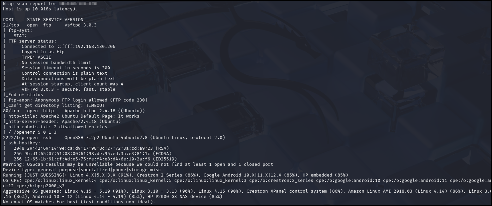
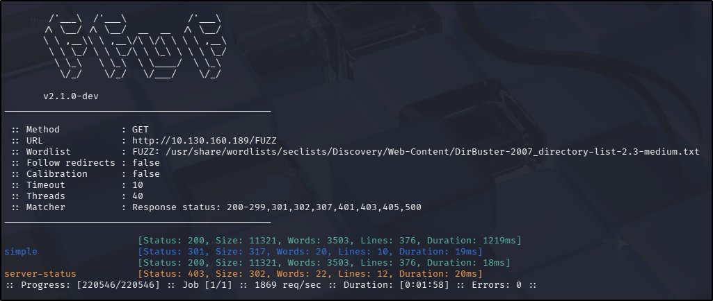
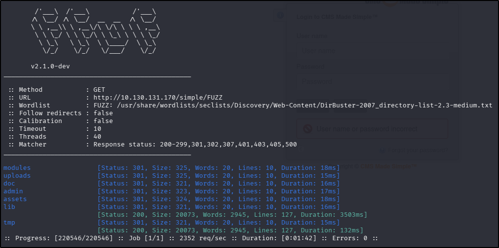
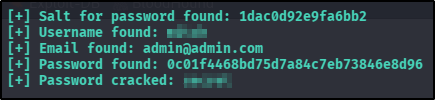
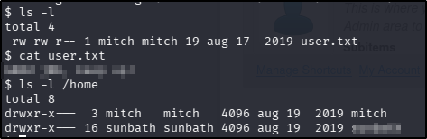
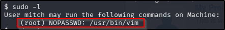
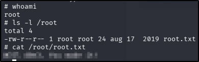

---
tags:
  - tryhackme
  - challenge type
  - easy
  - offensive
  - linux
  - web
  - vulnerability-exploitation
  - sqli
  - privilege-escalation
  - sudo
---

# Simple CTF

**Platform:** TryHackme  
**Type:** Challenge  
**Difficulty:** Easy  
**Link:** [Simple CTF](https://tryhackme.com/room/easyctf)

## Description
"Beginner level ctf"

## Initial Enumeration
I generated a list of open ports for more comprehensive enumeration with the following:  
`ports=$(nmap -p- --min-rate=1000 TARGET_IP_ADDRESS | grep ^[0-9] | cut -d '/' -f 1 | tr '\n' ',' | sed s/,$//)`  
This revealed the following open ports:  

* 21
* 80
* 2222

??? success "How many services are running under port 1000?"
	2

I ran a full `nmap` scan to query the services for version information, as well as querying the target system for OS information with `nmap -p$ports -A -T4 TARGET_IP_ADDRESS`, which revealed the following:  
  

??? success "What is running on the higher port?"
	ssh

### Port 21 (FTP)
The `nmap` scan suggested that anonymous login is permitted, so this service was first up for further enumeration. My `anonymous` user login was accepted but directory listing commands timed out (just as the `nmap` scan suggested).
Using `searchsploit` for vulnerabilities associated with the FTP version returned one result but this was related to a DoS attack, so likely not the intended path in a CTF exercise.

### Port 80 (HTTP)
I used my go-to `ffuf` command to enumerate the website:  
`ffuf -u http://TARGET_IP_ADDRESS/FUZZ -w /usr/share/wordlists/seclists/Discovery/Web-Content/DirBuster-2007_directory-list-2.3-medium.txt -ic -c`  
  

Navigating to the IP address in a web browser revealed a default Apache holding page with no interesting source code (unsurprising). The `robots.txt` file contained an entry but navigating directly to it resulted in a `404` error - given the text content of the `robots.txt` file, it would appear that a template was used and has not been customised. There was no `sitemap.xml` file.
Navigating to the `simple` directory discovered during the `ffuf` scan reveals a CMS Made Simple Instance that does not appear to have been customised. The version was confirmed as 2.2.8. Having found this page, I decided to do a follow-up `ffuf` scan on the `/simple` endpoint:
  

Of the discovered endpoints, the `/admin` page held particular interest, redirecting to a `login.php` endpoint.
Using `searchsploit` for vulnerabilities associated with the Apache version returned no results. There was a SQLi vulnerability available for the applicable version of CMS Made Simple, which may be of use against the `/admin` endpoint found in extended fuzzing.

### Port 2222 (SSH)
With no known usernames or passwords to test, there's not much to be done as light-touch enumeration here. I did a quick check for vulnerabilities in the version with `searchsploit` and came up with a possible vulnerability that might allow for username enumeration. Maybe useful, maybe not - I put that one on the backburner for the moment.

## Foothold
Looking over the findings from the enumeration phase, the SQLi vulnerability against the CMS Made Simple instance looked the most promising. Details of the exploit can be viewed with the `-p` switch with `searchsploit`, which gave me a CVE number.  
??? success "What's the CVE you're using against the application?"
	CVE-2019-9053
??? success "To what kind of vulnerability is the application vulnerable?"
	sqli

Attempting to use the exploit as provided in the `searchsploit` database failed initially due to some incompatible formatting (the exploit had been written in a deprecated Python version), but still failed to run after those had been corrected. Searching Google for the CVE number turned up an [updated version of the script](https://github.com/Dh4nuJ4/SimpleCTF-UpdatedExploit) for use with Python3. Looking through the downloaded script, I was able to work out the appropriate line of code for this exploit would be as follows:  
`python3 <exploitFile> -u http://<ipAddress>/simple -c -w /usr/share/wordlists/rockyou.txt`  
  
??? success "What's the password?"
	secret

Logging in to the `/admin` portal was successful, but this answer wasn't accepted in the task details. Thinking this might be a case of password reuse, I attempted to log in to SSH (remembering to set the custom port with the `-p` switch) and was successful.
??? success "Where can you login with the details obtained?"
	ssh

From there finding the user flag and answer to the follow up task was trivial:  
  
??? success "What's the user flag?"
	G00d j0b, keep up!
??? success "Is there any other user in the home directory? What's its name?"
	sunbath

## Privilege Escalation
The first thing I do whenever I gain access to an account and am looking for a quick privilege escalation route is to check `sudo` privileges for the user I have. It paid off in this instance:  
  

Knowing that `vim` can be used to run commands with the use of the `:!`  command, and that this in turn meant that a `root` shell might be attainable in this way, I ran `vim` as `sudo` and entered `:!/bin/sh`, which instantly gave me a `root` shell. From there finding the root flag was trivial:  
  
??? success "What's the root flag?"
	W3ll d0n3. You made it!

**Tools Used**  
`nmap` `ffuf` `searchsploit`

**Date completed:** 23/03/26  
**Date published:** 24/03/26