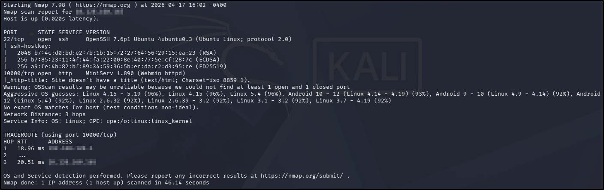
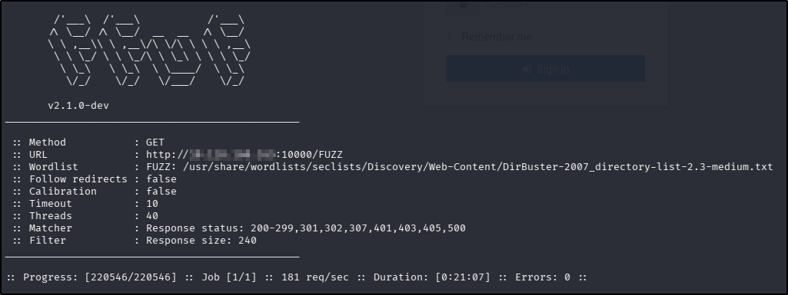
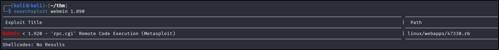
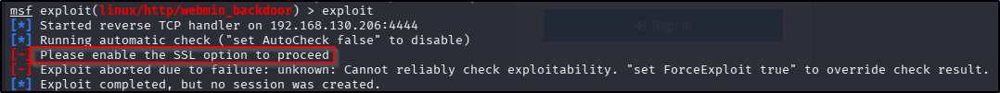
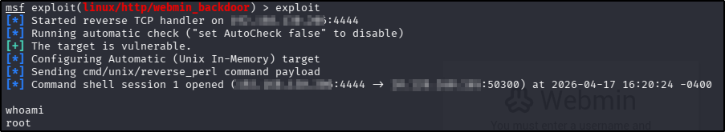
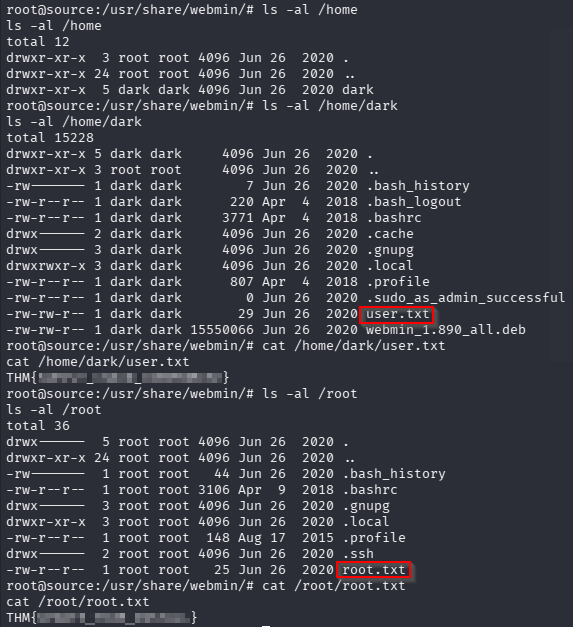

---
tags:
  - tryhackme
  - challenge
  - easy
  - offensive/defensive
  - metasploit
---

# Source

**Platform:** TryHackMe  
**Type:** Challenge  
**Difficulty:** Easy  
**Link:** [Source](https://tryhackme.com/room/source)  

## Description
"Exploit a recent vulnerability and hack Webmin, a web-based system configuration tool.  
Enumerate and root the box attached to this task. Can you discover the source of the disruption and leverage it to take control?"

## Enumeration
I generated a list of open ports for more comprehensive enumeration with the following:  
`ports=$(nmap -p- --min-rate=1000 TARGET_IP_ADDRESS | grep ^[0-9] | cut -d '/' -f 1 | tr '\n' ',' | sed s/,$//)`  
This revealed the following open ports:  

* 22  
* 10000  

I ran a full `nmap` scan to query the services for version information, as well as querying the target system for OS information with `nmap -p$ports -A -T4 TARGET_IP_ADDRESS`, which revealed the following:
  

I used my go-to `ffuf` command to enumerate the website (`ffuf -u http://TARGET_IP_ADDRESS/FUZZ -w /usr/share/wordlists/seclists/Discovery/Web-Content/DirBuster-2007_directory-list-2.3-medium.txt -ic -c`) as a quick directory discovery, whilst also running my standard `gobuster` command (`gobuster dir -u TARGET_IP_ADDRESS -w /usr/share/wordlists/seclists/Discovery/Web-Content/DirBuster-2007_directory-list-2.3-medium.txt -x php,html,txt`) to probe a bit more thoroughly, looking for files as well.

Whilst waiting for my `ffuf` and `gobuster` scans to complete, I navigated to the site in a web browser, where an admin login portal was revealed. There was a `robots.txt` file but it simply served to exclude the entire site (no hidden information here). There was no `sitemap.xml` file.  There wasn't anything useful in the `ffuf` scan results either (and nothing additional in the `gobuster` output):  
  

I turned my attention to searching for vulnerabilities in the versions discovered (not least because that's what the challenge description says is the solution!) and found a very promising lead for the `webmin` installation:    

## Foothold (and privilege escalation...)
I opened up Metasploit, located the relevant module, and changed the `RHOSTS` and `LHOSTS` option but the exploit failed with the following message:  
  
I set the `SSL` option to true and tried again, this time instantly getting a `root` shell:  
  
I stabilised my shell (`shell` command) and from there finding both the user and root flag was trivial:  
  
??? success "user.txt"
	THM{SUPPLY_CHAIN_COMPROMISE}
??? success "root.txt"
	THM{UPDATE_YOUR_INSTALL}

**Tools Used**  
`msfconsole`

**Date completed:** 17/04/26  
**Date published:** 17/04/26