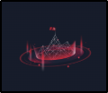
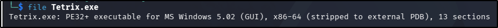
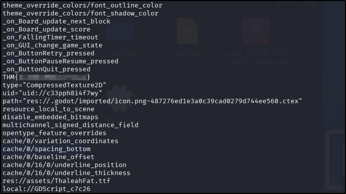

---
tags:
  - tryhackme
  - challenge
  - easy
  - offensive
  - binary-analysis
---

# The Game


**Platform:** TryHackMe  
**Type:** Challenge  
**Difficulty:** Easy  
**Link:** [The Game](https://tryhackme.com/room/hfb1thegame)  

## Description
"Practice your Game Hacking skills.

Cipher has gone dark, but intel reveals he’s hiding critical secrets inside Tetris, a popular video game. Hack it and uncover the encrypted data buried in its code.

*This challenge was originally a part of the Hackfinity Battle 2025 CTF Event.*"

## Artifact provided
Zip file containing `Tetrix.exe` file

## Task: 
Examine the file provided to find the flag.
### Artifacts examined
`Tetrix.exe`
### Analysis
Identify file type:
```
file Tetrix.exe
```


Check for plaintext strings:
```
strings Tetrix.exe	# Output extensive, limit to strings with characters at least as long as flag length
strings Tetrix.exe -n 22
```


### Answer
??? success "What is the flag?"
	THM{I_CAN_READ_IT_ALL}

**Tools Used**  
`strings`

**Date completed:** 10/09/26  
**Date published:** 10/09/26