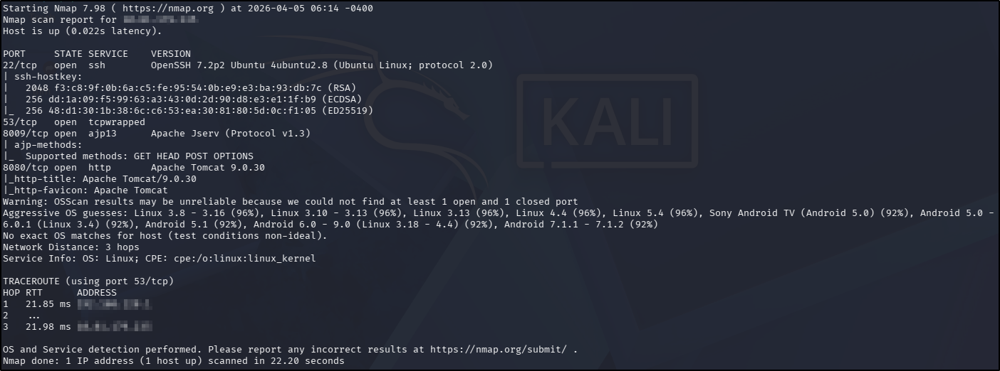
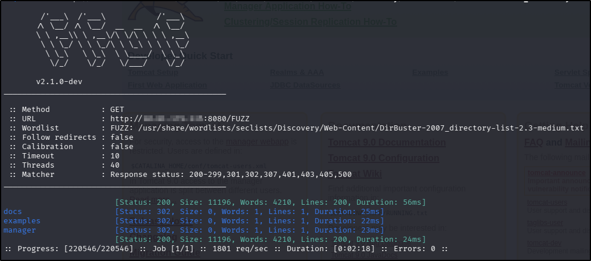
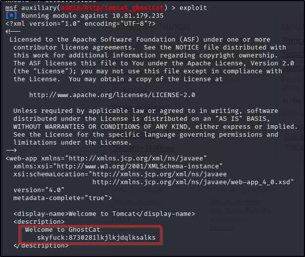
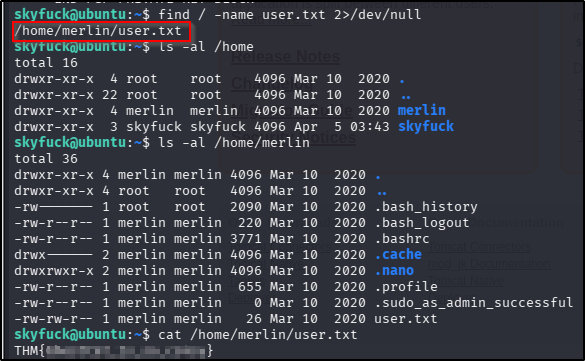
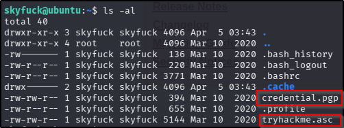
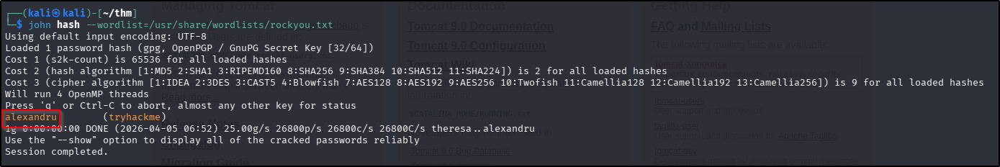
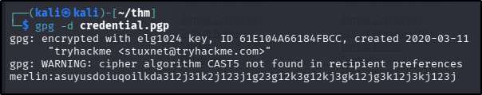
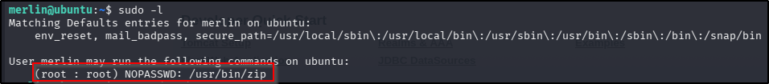
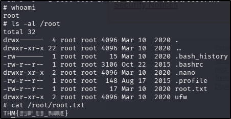

---
tags:
  - tryhackme
  - challenge
  - easy
  - offensive
  - metasploit
  - password-cracking
  - sudo-abuse
---

# tomghost


**Platform:** TryHackMe  
**Type:** Challenge  
**Difficulty:** Easy  
**Link:** [tomghost](https://tryhackme.com/room/tomghost)

## Description
"Identify recent vulnerabilities to try exploit the system or read files that you should not have access to."

## Enumeration
I generated a list of open ports for more comprehensive enumeration with the following:  
`ports=$(nmap -p- --min-rate=1000 TARGET_IP_ADDRESS | grep ^[0-9] | cut -d '/' -f 1 | tr '\n' ',' | sed s/,$//)`  
This revealed the following open ports:  

* 22
* 53
* 8009
* 8080

I ran a full `nmap` scan to query the services for version information, as well as querying the target system for OS information with `nmap -p$ports -A -T4 TARGET_IP_ADDRESS`, which revealed the following:  
  
I used my go-to `ffuf` command to enumerate the website:  
`ffuf -u http://TARGET_IP_ADDRESS/FUZZ -w /usr/share/wordlists/seclists/Discovery/Web-Content/DirBuster-2007_directory-list-2.3-medium.txt -ic -c`  
  
There were no `robots.txt` or `sitemap.xml` files and nothing interesting in the source code of the web site - unsurprising as it was the default page for Apache Tomcat. Navigating to the `/manager` page discovered in the `nmap` scan was unsuccessful (the site had been configured so that this page could only be accessed from the web application's localhost).  
Searching for vulnerabilities in the software versions found in the `nmap` scan in `searchsploit` was unsuccessful, however the challenge description included a logo for the Ghostcat vulnerability, suggesting this might be the intended pathway.

## Foothold
I opened Metasploit and searched for the Ghostcat vulnerability, finding a ready-made module to use. After updating the options with the relevant IP address for the target machine, I ran the exploit, which was successful in reading the `/WEB-INF/web.xml` file (default setting for the exploit), in turn disclosing a set of credentials:  
  
I used those credentials to log in to the target machine successfully, and from there finding and reading the user flag was trivial:  
  
??? success "Compromise this machine and obtain user.txt"
	THM{GhostCat_1s_so_cr4sy}

## Privilege Escalation
Whilst looking for the flag, I had noticed two files of interest in the home directory I had landed in:  
  
After checking the contents of both and finding `credential.pgp` to be (understandbly) encrypted and `tryhackme.asc` to be a private PGP key, I used `scp` to download them both to my attacker machine. I then passed the private key to `gpg2john` to extract the hash for cracking:  
```
gpg2john tryhackme.asc > hash
john hash --wordlist=/usr/share/wordlists/rockyou.txt
```
  
I then imported the private key (`gpg --import tryhackme.asc`) and used it to decrypt the contents of the `credential.pgp` file, giving me another set of credentials:  
  
I used the new credentials to spawn another SSH session as the `merlin` user successfully and did the first thing I always do when looking for privilege escalation opportunities in an interative shell: check for `sudo` rights:  
  
Finding that my new user had the rights to execute `zip` as `sudo` with no password, I turned to [GTFObins](https://gtfobins.org/gtfobins/zip/) to check out the possibilities this offered me, which turned out to be the ability to spawn a root shell. I executed the exploit with the following two commands:  
```
touch /tmp/tmpfile
sudo zip /tmp/tmpfile /etc/hosts -T -TT '/bin/sh #'
```
This did indeed generate a root shell, allowing me to to find and read the root flag with ease:  
  
??? success "Escalate privileges and obtain root.txt"
	THM{Z1P_1S_FAKE}

**Tools Used**  
`Metasploit` `scp` `gpg2john` `john` `gpg`

**Date completed:** 05/04/26  
**Date published:** 05/04/26