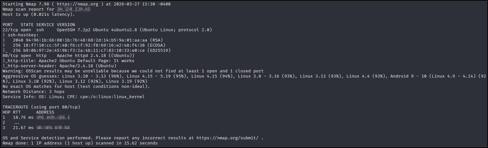
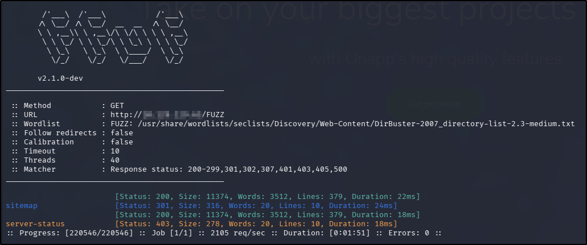
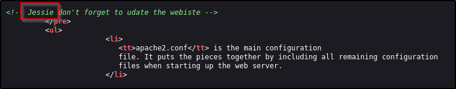
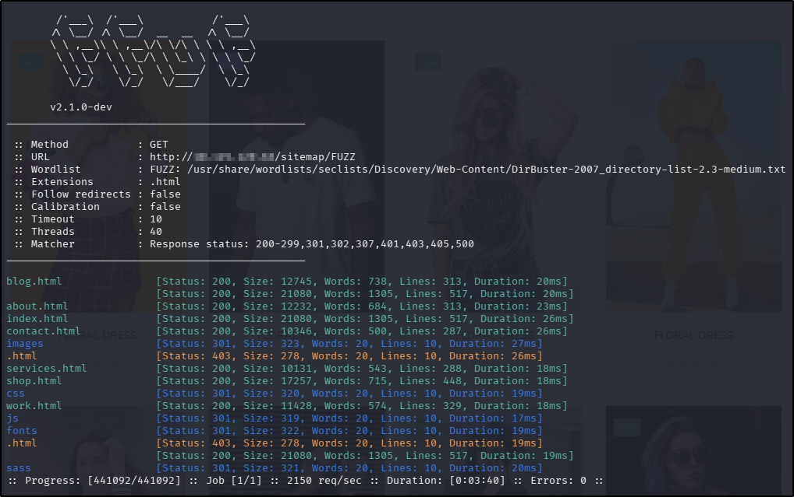
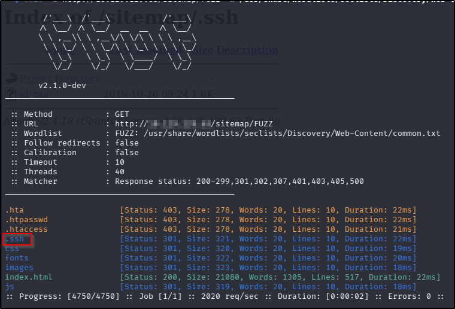
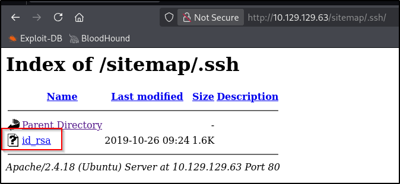
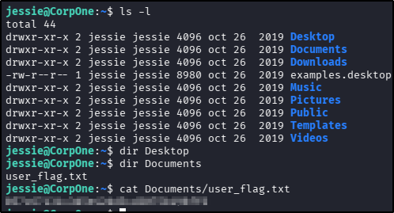
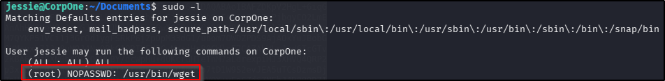
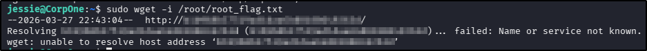

---
tags:
  - tryhackme
  - challenge type
  - easy
  - offensive
  - sudo-abuse
---

# Wgel CTF

**Platform:** TryHackMe  
**Type:** Challenge  
**Difficulty:** Easy  
**Link:** [Wgel CTF](https://tryhackme.com/room/wgelctf)

## Description
"Can you exfiltrate the root flag?"

## Initial Enumeration
I generated a list of open ports for more comprehensive enumeration with the following:  
`ports=$(nmap -p- --min-rate=1000 TARGET_IP_ADDRESS | grep ^[0-9] | cut -d '/' -f 1 | tr '\n' ',' | sed s/,$//)`  
This revealed the following open ports:  

* 22
* 80

I ran a full `nmap` scan to query the services for version information, as well as querying the target system for OS information with `nmap -p$ports -A -T4 TARGET_IP_ADDRESS`, which revealed the following:  
  

I used my go-to `ffuf` command to enumerate the website:  
`ffuf -u http://TARGET_IP_ADDRESS/FUZZ -w /usr/share/wordlists/seclists/Discovery/Web-Content/DirBuster-2007_directory-list-2.3-medium.txt -ic -c`  
  

There were no `robots.txt` or `sitemap.xml` files. The web page displayed in a web browser was the default Apache web page, so I didn't expect there to be anything interesting in the source code, but I did find a name:  
  

Navigating to the discovered `sitemap` endpoint from the `ffuf` scan revealed the actual web application. I reran my earlier `ffuf` scan, this time starting from the `/sitemap` directory, adding the `-e .html` file extension having seen it appended to the URL when navigating the site within a web browser:  
  

Manual enumeration of the web pages on the site failed to turn up anything of interest - no login pages or input forms (at least the kind that rendered content to the page), and despite being able to browse directories, traversing directories proved unsuccessful. There were no cookies or local storage objects. Searching for vulnerabilities for the two service versions from the `nmap` scan with `searchsploit` failed to return any meaningful results, the same was true when searching for vulnerabilities in "unapp" (the name of the web page templating engine according to the web page content).

Having enumerated the site as well as I could and not finding an awful lot, I was about to try brute forcing the password for the potential "jessie" user I'd found in the source code, when I considered trying another directory fuzz with a shorter word list I'd found to be successful in previous CTFs. This time I did find something that looked useful:  
  
  

## Foothold
I copied the contents of the discovered private SSH key into a file on my attacking machine, changed the permissions as per SSH requirements, and used it to log in to the target machine with the "jessie" user, which was successful. From there, finding and reading the contents of the user flag was trivial:  
  
??? success "user.txt"
	057c67131c3d5e42dd5cd3075b198ff6

## Privilege Escalation
The first thing I do whenever I get a foothold is to check sudo rights:  
  

According to [GTFOBins](https://gtfobins.org/gtfobins/wget/), having `sudo` rights to `wget` could give me a shell, so that's good news. However, the exploit failed when I tried it as detailed on the page (because one of the switches wasn't recognised). That `sudo` misconfiguration should still give me read access to any file on the system though (because it executes as the `root` user), so I tried the file write exploit instead, guessing at the file name based on the user flag file name earlier in the challenge, and that was successful:  

??? success "root.txt"
	b1b968b37519ad1daa6408188649263d

**Tools Used**  
`ffuf`

**Date completed:** 27/03/26  
**Date published:** 27/03/26